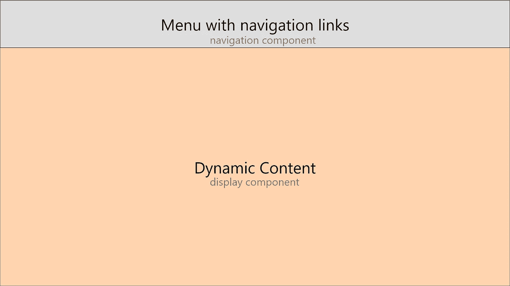

# React Router v4 上最简单的教程—在几秒钟内构建一个单页应用程序。

> 原文：<https://itnext.io/the-easiest-tutorial-on-react-router-v4-youll-ever-find-build-a-single-page-application-in-44c453f4123b?source=collection_archive---------2----------------------->

[Daria Nepriakhina](https://unsplash.com/@epicantus?utm_source=medium&utm_medium=referral) 在 [Unsplash](https://unsplash.com?utm_source=medium&utm_medium=referral) 上发表的《独自站着低头看手机的女人》

我坚信 ReactJS 非常适合单页面应用程序(SPA)。

在清楚地了解 React 路由器将如何帮助我建立我的第一个 SPA 之前，我找了几乎一整天，现在我在这里。

本文将为您提供一个简短的单文件运行代码片段，以便在几秒钟内启动一个单页面应用程序。

# 代码

**演示:**

其实只有~5 行可以理解

**温泉浴场的结构:**

**菜单**只是一个链接列表。

**动态内容**是根据用户如何导航而改变的内容。

例如，如果我点击“主页”链接，它会把我带回**主页面板**。然后，如果我点击“营销”链接，就会转到**营销面板。**

注意，我没有用“页面”这个词！

感谢 React 路由器，**实际页面从不改变，**但是**动态内容会改变**。(参考我的 Codepen 演示)。

**工作原理:**

*   **首先:**你需要安装`react-router-dom`。它是用于在 web 应用程序中实现路由过程的包。

`yarn add react-router-dom`

*   第二步:你将从这个包中导入有意义的部分。

`import { BrowserRouter } from 'react-router-dom'`在`index.js`

`import { NavLink } from 'react-router-dom'`在你的导航组件里

`import { Route } from 'react-router-dom'`在您的显示组件中

*   **第三:**把你的`App`组件(在`index.js`里面)包在一个`BrowserRouter`里面

`<BrowserRouter>
<App />
</BrowserRouter>`

奇迹就是这样发生的。React Router 使用这个组件让您的应用程序知道导航(历史、当前路径等)。

*   **第四:**使用`NavLink`项填充你的导航组件。

`<NavLink exact to="/url">Menu item</NavLink>`

`NavLink`与`Link`不同，因为它处理`active`的类命名。它允许你根据当前 URL 自动定制活动链接的外观。

只有当路径与`to`属性中给出的路径相同时，`exact`属性才会告诉 React 路由器将`active`添加到链路中。

`to`属性是当用户点击这个链接时将被重定向到的地方。

*   **最后:**用`Route`物品填充你的显示组件。

`<Route exact path="/url" component={Component} />`

`Route`只是一个条件渲染组件。

仅当当前路径与`path`属性相同(`exact`)时，它才会呈现`component`属性中给出的`Component`。

将`exact`放在每个`Route`上可以让你一次只渲染一个组件。(本质上是因为你为每个`Route`设置了不同的`exact path`)

# 好了

希望就是这么简单！

如您所见，这是一个简单的三步流程:

*   将主要部件包在一个`BrowserRouter`内
*   用`NavLink`项填充导航
*   用`Route`物品填满显示屏

然而，还有更多关于这个可怕的包知道。[自己看](https://reacttraining.com/react-router/web/guides/philosophy)。

# 感谢阅读

我希望这对你有用！

查看我的最新故事:

 [## 21 世纪手工制作的电子邮件签名

### 自由职业是另一个我希望每个人都可以生活的冒险，品牌是其中至关重要的一部分。你想要人们…

dmware.fr](https://dmware.fr/handcrafted-email-signatures-for-the-21st-century/) 

欢迎致电 **david.mellul@outlook.fr ☕️😃**

[吴仪](https://unsplash.com/@takeshi2?utm_source=medium&utm_medium=referral)在 [Unsplash](https://unsplash.com?utm_source=medium&utm_medium=referral) 上的“白色马克杯里的卡布奇诺，白色泡沫艺术在木桌上”