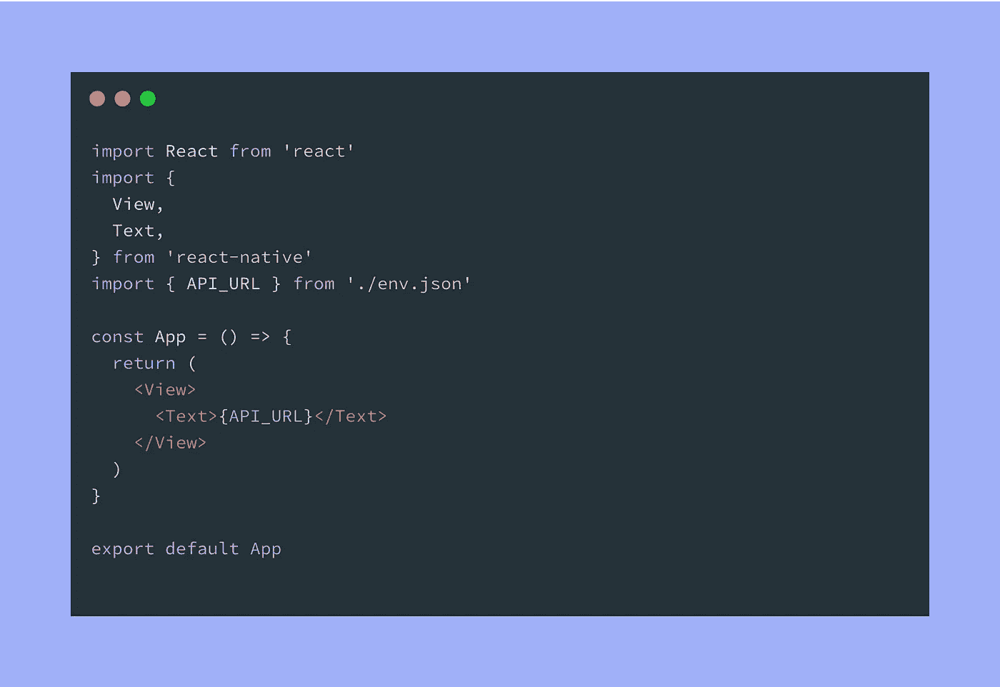
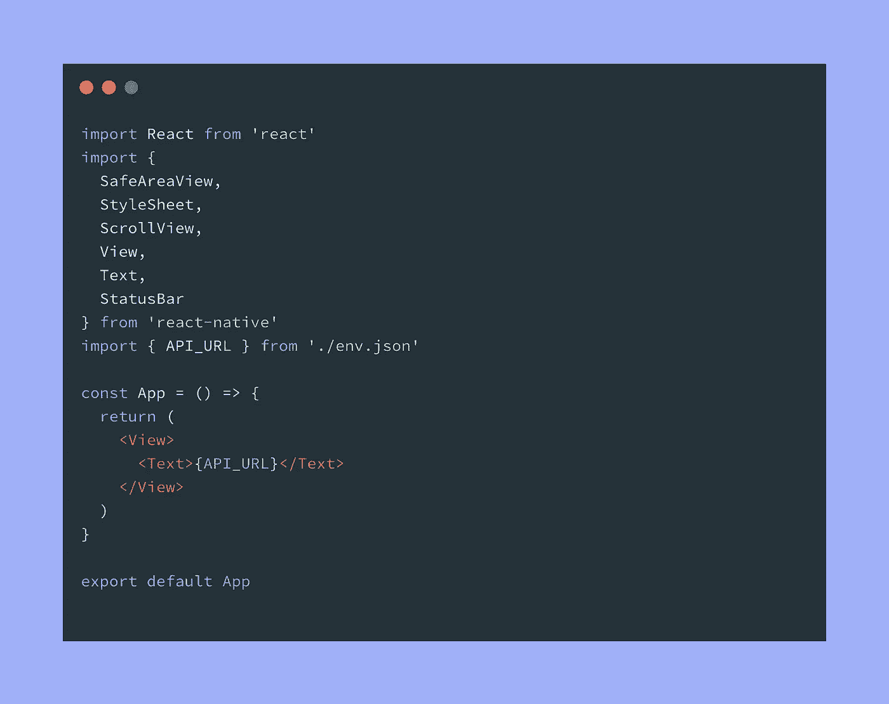

# 在 React Native 上设置多个环境的最简单方法

> 原文：<https://itnext.io/the-easiest-way-to-setup-multiple-environments-on-react-native-67b33d073390?source=collection_archive---------0----------------------->



我发现有些事情在 React Native 上很简单，但在 web 应用程序中却很容易做到；其中之一就是处理不同的环境变量。

当您仍在开发应用程序时，通常只有一个环境，但当其他一些用户开始测试它或当您打算发布它时，您可能希望为 API 使用不同的 URL，如开发版本的 API 也可以访问新的端点或更全面的日志记录程序，以及生产就绪版本，经过良好测试并带有发布版本的生产数据库。

有时您需要两个以上的环境，例如:

*   **开发**:这是你要开发应用所有新特性的地方；环境已经准备好帮助你更好的日志和假数据库，如果你搞砸了，你可以随时删除和重新创建；
*   **试运行:**试运行中的应用程序版本由客户、朋友或质量保证部门的一些同事进行测试，环境几乎是生产版本的复制品；
*   **制作:**这是你要发布到商店(App Store，Google Play)的版本

# 那么，如何为不同的环境存储(和使用)不同的变量呢？

很明显，我试图用谷歌搜索答案，但是我找到的解决方案对我来说似乎太难或者不够灵活。

## 使用 react-native-dotenv

React Native 上管理不同环境最常用的方法是使用[**React-Native-dotenv**](https://github.com/zetachang/react-native-dotenv):起初我认为这是我通常在 web 应用程序中使用的 [node dotenv](https://github.com/motdotla/dotenv) 库的一个端口。

不幸的是，[似乎最多处理 2 个环境](https://github.com/motdotla/dotenv)(一个开发和一个发布/生产)，并且还有一些糟糕的变量缓存。有一次，我花了两个小时和一个同事聊天，以了解为什么他机器上的应用程序使用另一个 API 端点(解决方案:在你改变。env，您必须在导入该变量的文件中更改/添加一行，否则 react-native-dotenv 将继续为旧变量服务🤦‍♂️)

2021 年 2 月 10 日更新:react-native-dotenv 的最新升级现在允许使用多个。多个环境的 env 文件，并通过简单地运行“纱线开始-重置-缓存”来重置缓存。看起来我去年遇到的所有问题都被这个库解决了！

继续阅读，寻找不同的解决方案，也许你可以适应其他需求🚀

# 更容易的(天真的)解决方案

这是我目前使用的方法。准备好你的手指，因为你将需要创建一些新的文件。

首先，我们将所有的环境存储在一个 **envs** 文件夹中的 JSON 文件中。

我将为本文创建 3 个环境(开发、试运行和生产)，每个环境都有不同的 API_URL。显然你可以添加任意多的变量！

**envs/development.json**

```
{
"API_URL": "https://development.api.com",
}
```

**envs/staging.json**

```
{
"API_URL": "https://staging.api.com",
}
```

**envs/production.json**

```
{
"API_URL": "https://production.api.com",
}
```

还和我在一起吗？现在，我们将创建一个节点脚本，它将在每次我们想要切换环境时更改环境文件。

我把它放在一个 ***脚本*** 文件夹中(在那里我还有其他脚本来自动化我的构建过程的其他部分)

脚本/set-environment.js

```
*#!/bin/node*const fs = require("fs");//Obtain the environment string passed to the node script
const environment = process.argv[2]//read the content of the json file
const envFileContent = require(`../envs/${environment}.json`);//copy the json inside the env.json file
fs.writeFileSync("env.json", JSON.stringify(envFileContent, undefined, 2));
```

这个***set-environment . js***只有 4 行:首先它在一个变量中存储你调用脚本时的第一个参数，然后**会**要求 ***envs*** 里面的文件具有相同的名称，最后会在根文件夹中创建一个 env.json 文件，内容为 *envFileContent。*

现在我们可以试着打电话

```
node scripts/set-environment.js development
```

而✨MAGIC ✨…一个新的 ***env.json*** 文件已经放在了合适的地方，随时可以为你的一切变数服务。

此外，您可以在 package.json 文件中设置一些脚本，以便能够切换环境，而无需在终端中键入所有单词:只需键入 ***yarn env:dev*** 即可。

```
{
  "name": "your-app-name",
  "scripts": {
    "start": "react-native start", "env:staging": "node scripts/set-environment.js staging",
    "env:dev": "node scripts/set-environment.js development",
    "env:prod": "node scripts/set-environment.js production", ...
  },
  "dependencies": {...},
  ...
}
```

## 如何使用新的？代码中的 env 文件

现在你只需要从 src/env.json 文件中**导入**你的变量，你就可以开始了！🚀



# 如何自动切换环境

现在我们需要一种自动切换环境的方法。

如果我们在***package . JSON:***中创建一些新的脚本，这几乎是免费的

```
{
  "name": "your-app-name",
  "scripts": {
    "start": "react-native start", "env:staging": "node scripts/set-environment.js staging",
    "env:dev": "node scripts/set-environment.js development",
    "env:prod": "node scripts/set-environment.js production", "_ios": "react-native run-ios", "ios": "yarn env:dev && yarn _ios",
    "ios:staging": "yarn env:staging && yarn _ios",
    "ios:prod": "yarn env:prod && yarn _ios",

    "_build:ios": "react-native bundle --platform ios ...",
    "build:ios": "yarn env:dev && yarn _build:ios",
    "build:ios:staging": "yarn env:staging && yarn _build:ios",
    "build:ios:prod": "yarn env:prod && yarn _build:ios",
  }, "dependencies": {...}, ...
}
```

我删除了一些脚本和所有的依赖关系，以保持代码部分的轻量级。Android 脚本与 iOS 脚本相同。

所以现在，每当我想在模拟器上启动我的 iOS 应用程序和生产环境时，我只需要启动

```
yarn ios:prod
```

环境变量将加载到您的应用程序中。
如果我想构建 iOS 发布版本提交到 App Store 怎么办？

```
yarn build:ios:prod
```

这是你需要✨的唯一命令