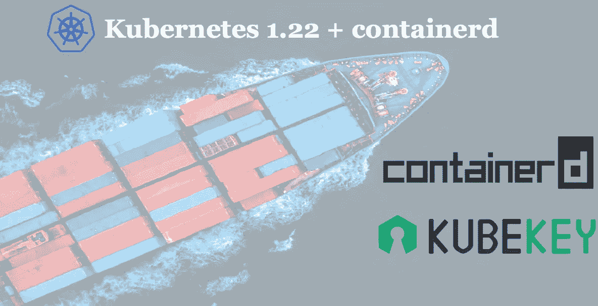
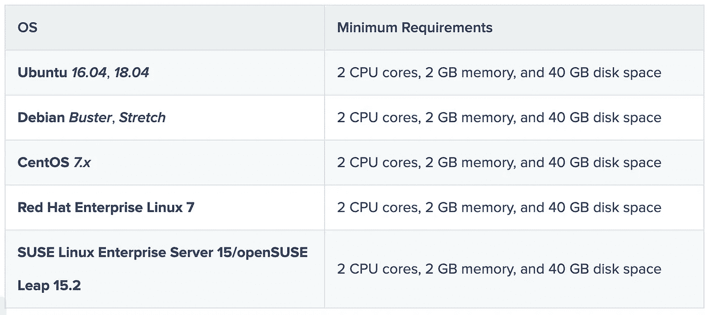
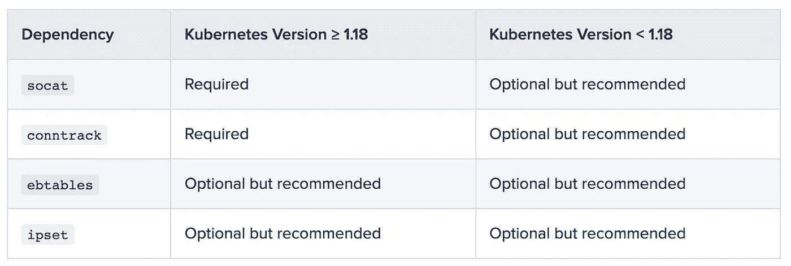

# 安装 Kubernetes 1.22 和 containerd 的简单方法

> 原文：<https://itnext.io/the-easy-way-to-install-kubernetes-1-22-and-containerd-fec2d07912bd?source=collection_archive---------1----------------------->



KubeKey 是一个轻量级的交钥匙安装程序，支持 Kubernetes、KubeSphere 和相关附加组件的安装。KubeKey 用 Go 编写，使您能够在几分钟内建立一个 Kubernetes 集群。在这篇博客中，我们将用 KubeKey 的一个命令[安装 Kubernetes 1.22 和 containerd](https://kubesphere.io/blogs/install-kubernetes-containerd/) 。

# 步骤 1:准备一台 Linux 机器

要开始一体化安装，您只需根据以下硬件和操作系统要求准备一台主机。

# 硬件建议



# 节点要求

*   可以通过`SSH`访问该节点。
*   应该使用`sudo` / `curl` / `openssl`。

# 依赖性要求

KubeKey 可以一起安装 Kubernetes 和 KubeSphere。根据要安装的 Kubernetes 版本，需要安装的依赖项可能会有所不同。您可以参考下面的列表，看看是否需要提前在您的节点上安装相关的依赖项。



# 网络和 DNS 要求

*   确保`/etc/resolv.conf`的 DNS 地址可用。否则，可能会导致群集中的 DNS 出现一些问题。
*   如果您的网络配置使用防火墙规则或安全组，您必须确保基础架构组件可以通过特定端口相互通信。建议您关闭防火墙。更多信息，参见[端口要求](https://kubesphere.io/installing-on-linux/introduction/port-firewall/)。
*   支持 CNI 插件:印花布和法兰绒。其他(如纤毛和库贝-OVN)也可能工作，但请注意，他们还没有完全测试。

# 第二步:下载 KubeKey

执行以下步骤下载 KubeKey。

*   [与 GitHub/Google API 的良好网络连接](https://kubesphere.io/blogs/install-kubernetes-containerd/#)

从其 [GitHub 发布页面](https://github.com/kubesphere/kubekey/releases)下载 KubeKey 或运行以下命令:

```
curl -L [https://github.com/kubesphere/kubekey/releases/download/v1.2.0-alpha.4/kubekey-v1.2.0-alpha.4-linux-amd64.tar.gz](https://github.com/kubesphere/kubekey/releases/download/v1.2.0-alpha.4/kubekey-v1.2.0-alpha.4-linux-amd64.tar.gz) > installer.tar.gz && tar -zxf installer.tar.gz
```

*   [与 GitHub/Google API 的网络连接不良](https://kubesphere.io/blogs/install-kubernetes-containerd/#)

首先运行以下命令，确保从正确的区域下载 KubeKey。

```
export KKZONE=cn
```

运行以下命令下载 KubeKey:

```
curl -L [https://github.com/kubesphere/kubekey/releases/download/v1.2.0-alpha.4/kubekey-v1.2.0-alpha.4-linux-amd64.tar.gz](https://github.com/kubesphere/kubekey/releases/download/v1.2.0-alpha.4/kubekey-v1.2.0-alpha.4-linux-amd64.tar.gz) > installer.tar.gz && tar -zxf installer.tar.gz
```

*注:*

*下载 KubeKey 后，如果您将它转移到一台与 Googleapis 的网络连接不良的新机器上，您必须再次运行* `*export KKZONE=cn*` *才能继续以下步骤。*

使`kk`可执行:

```
chmod +x kk
```

# 步骤 3:开始安装

对于一体化安装，您只需运行一个命令。

```
./kk create cluster --with-kubernetes v1.22.1 --container-manager containerd
```

*注:*

*   *支持的 Kubernetes 版本:v1.19.8、v1.20.4、v1.21.4、v1.22.1。如果未指定 Kubernetes 版本，KubeKey 默认安装 Kubernetes v1.21.5。有关受支持的 Kubernetes 版本的更多信息，请参见* [*支持矩阵*](https://github.com/kubesphere/kubekey/blob/master/docs/kubernetes-versions.md) *。*
*   *对于一体化安装，您不需要更改任何配置。*
*   *KubeKey 支持 AMD64 和 ARM64。*

运行该命令后，您将看到一个环境检查表。详见[节点要求](https://kubesphere.io/blogs/install-kubernetes-containerd/#node-requirements)和[依赖要求](https://kubesphere.io/blogs/install-kubernetes-containerd/#dependency-requirements)。键入`yes`继续。

# 步骤 4:验证安装

如果显示以下信息，则 Kubernetes 安装成功。

```
INFO[00:40:00 CST] Congratulations! Installation is successful.
```

运行以下命令来检查容器运行时和 Kubernetes 版本。

```
kubectl get node -o wideNAME         STATUS   ROLES                         AGE   VERSION   
i-mxtuejcj   Ready    control-plane,master,worker   45s   v1.22.1 INTERNAL-IP   EXTERNAL-IP   OS-IMAGE                
192.168.6.2   <none>        CentOS Linux 7 (Core) KERNEL-VERSION           CONTAINER-RUNTIME
3.10.0-1160.el7.x86_64   containerd://1.4.9
```

运行以下命令检查 Pod 状态。

```
kubectl get pod --all-namespacesNAMESPACE     NAME             READY   STATUS    RESTARTS    AGE
kube-system   calico-kube
             -controllers
             -75ddb95444
             -6vgcm             1/1     Running   0          39s
kube-system   calico
             -node-knhhs        1/1     Running   0          39s
kube-system   coredns
             -5495dd7c88
             -6w5gt             1/1     Running   0          48s
kube-system   coredns
             -5495dd7c88
             -982kj             1/1     Running   0          48s
kube-system   kube
             -apiserver
             -i-mxtuejcj        1/1     Running   0          56s
kube-system   kube
             -controller
             -manager
             -i-mxtuejcj        1/1     Running   0          56s
kube-system   kube
             -proxy-6vlsj       1/1     Running   0          48s
kube-system   kube
             -scheduler
             -i-mxtuejcj        1/1     Running   0          64s
kube-system   nodelocaldns
             -7zqp2             1/1     Running   0          48s
```

恭喜你！您已经安装了一个带有 containerd 的单节点 Kubernetes 集群。有关 KubeKey 的高级用法，请参见[在 Linux 上安装—概述](https://kubesphere.io/docs/installing-on-linux/introduction/intro/)了解更多信息。

# 关于 KubeSphere

KubeSphere 是一个基于 Kubernetes 的开源容器平台，其核心是应用程序。它提供全栈 It 自动化操作和简化的开发运维工作流。

[KubeSphere](https://kubesphere.io/) 已被全球数千家企业采用，如 **Aqara、新浪、奔来、中国太平、华夏银行、国药控股、微众银行、Geko Cloud、VNG 公司、Radore** 。KubeSphere 为运维提供向导界面和各种企业级功能，包括 Kubernetes 资源管理、[、DevOps (CI/CD)](https://kubesphere.io/devops/) 、应用生命周期管理、服务网格、多租户管理、[监控](https://kubesphere.io/observability/)、日志记录、警报、通知、存储和网络管理以及 GPU 支持。有了 KubeSphere，企业能够快速建立一个强大且功能丰富的容器平台。

欲了解更多信息，请访问 [https://kubesphere.io](https://kubesphere.io/)