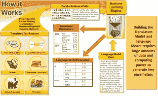

# 新兴的基于神经网络的机器翻译

> 原文：<https://itnext.io/the-emerging-world-of-neural-net-based-mt-4735ae38fe9?source=collection_archive---------9----------------------->

最近有很多新闻报道了由一种名为深度学习和神经网络(DNN)的技术驱动的下一波机器翻译(机器翻译，即计算机而不是人类进行翻译)技术。我将尝试提供一个关于这是什么的简单的外行概述，即使我(在学术上)勉强有资格做这件事*(但如果特朗普是总统，那么我尝试做这件事肯定不是一件难事)*。如果我在这里无意中犯了错误，请随时纠正我。

为了理解深度学习和神经网络，首先理解什么是“机器学习”是有用的。非常简洁地说，机器学习是 T2 的“研究领域，让计算机具有学习的能力，而不需要显式编程”根据亚瑟塞缪尔。

机器学习是计算机科学的一个子领域，它是从人工智能中的模式识别和计算学习理论的研究中发展而来的。机器学习算法通过将它们的经验(对数据的“分析”)归纳到预测模型中，迭代地从(训练)数据中学习。这些模型允许计算机找到人类可能很难甚至不可能找到的洞察力。在机器翻译(MT)的情况下，目标是建立预测模型，根据从翻译记忆和其他显示(训练)的自然语言数据中收集的“知识”翻译新的源数据。可以简单地将其视为统计学和应用计算的一个分支，专为大数据世界而设计，并由大数据世界提供支持。例如，在某种程度上，SMT(统计机器翻译)是较老的 TM(翻译记忆，即先前翻译的句子的数据库)技术的更灵活和更一般化的实现，其可以基于从其训练经验中获得的学习来猜测新的子段。

机器学习是研究如何让计算机自主学习(无监督)的领域，涵盖了文本和机器翻译应用之外的许多计算领域，最近在图像数据方面取得了惊人的成功。机器学习算法是一种计算机程序，它教会计算机如何对自己进行编程，以便我们不必明确描述如何执行我们想要实现的任务。为了编写自己的程序来解决特定任务，机器学习算法需要的信息是一组(大量)已知示例，例如翻译记忆或放射学图像以及结果诊断。

机器学习是一件大事，甚至可能是真正的大事。**谷歌首席执行官桑德尔·皮帅、** [**最近展示了谷歌公司**](https://backchannel.com/how-google-is-remaking-itself-as-a-machine-learning-first-company-ada63defcb70#.kjifb57s4) **的思维模式:“机器学习是一种核心的、变革性的方式，通过这种方式，我们正在重新思考我们如何做每一件事。我们正在深思熟虑地将它应用于我们所有的产品，无论是搜索、广告、YouTube 还是 Play。我们还处于早期，但你会看到我们——以系统的方式——在所有这些领域应用机器学习。”谷歌孤注一掷。谷歌相信有一天它将被所有的软件工程师使用，不管是什么领域，它将“改变人类”**

这个[链接到一系列帖子](https://medium.com/@ageitgey/machine-learning-is-fun-80ea3ec3c471#.5n868wfqw)，这些帖子提供了我所见过的关于什么是机器学习的最好的非技术性概述。

但是在实践中它是如何被使用的呢？非常粗略地说，有三个宽泛的概念可以捕捉到机器学习算法的大部分内容:*特征提取*，它决定在模型中使用什么数据；*规则化*，确定数据在模型中如何加权；以及*交叉验证*，测试模型的准确性。这些因素中的每一个都有助于我们识别和区分“信号”(我们想要学习的有价值的、一致的关系)和“噪声”(我们想要避免的、未来不会再次发生的随机相关性)。每个数据集都混合了信号和噪声，掌握这些概念将有助于你对这些数据进行分类，从而做出更好的预测。这是一个严重的过度简化，需要比这篇文章更多的阐述。

这段视频中，谷歌的彼得·诺维格(Peter Norvig)谈到了人工智能(ML)，而这段视频中，百度的吴恩达解释了什么是深度学习，值得浏览一下*(至少对那些有更深兴趣的人来说)*，以感受机器学习方法可能带来的更大可能性。

传统的人工智能语言理解方法依赖于将语言规则嵌入系统，但在谷歌智能回复项目中，[与所有现代机器学习](http://9to5google.com/2016/06/23/google-machine-learning-future/) **一样，系统被输入了足够的数据，可以像孩子一样自行学习。“我不是从语言学家那里学会说话的，我是通过听别人说话学会说话的，”**谷歌智能回复的开发者格雷格·科拉多说。科拉多说，这种方法需要**改变编码人员的思维模式，从直接控制一切到分析数据，甚至新的硬件。该公司甚至创建了自己的芯片，张量处理单元，为其机器学习库 [TensorFlow](https://cloudplatform.googleblog.com/2016/05/Google-supercharges-machine-learning-tasks-with-custom-chip.html) 进行了优化。**

回到 MT(机器翻译)，首先看看机器学习是如何在 SMT(统计机器翻译)中使用的，以便更好地理解由神经网络实现的进化，这是有用的。SMT 模型通常由两个(*有时更多*)从“训练数据”中学习的预测模型组成，该“训练数据”包括目标语言中的代表性双语数据和单语数据。

1.  SMT 翻译模型—从双语数据(翻译记忆)中学习
2.  通过无监督的期望模型(EM)训练以及单词和短语对齐过程，源单词和短语与目标语言单词和短语的等价性的概率映射。
3.  **翻译模型生成大量*可能的*翻译**
4.  目标语言模型—从单语目标语言数据中学习
5.  目标语言相对流畅性和一般使用模式的概率模型
6.  **目标语言模型从可能的候选列表中选择"*最佳"*翻译**

尽管这本质上是一个概率最大化的练习(不是真正的翻译)，但它可以做得非常好，并且相当准确地翻译相同领域中的新源数据。[这个链接](http://people.csail.mit.edu/koehn/publications/tutorial2003.pdf)以幻灯片的形式提供了一个相对简单的学习过程概述，这里又是 Norvig，给[一个非常清晰的 12 分钟 SMT 如何工作的概述](https://youtu.be/T1O3ikmTEdA?t=15m07s)。我们今天看到的许多东西，如[基于短语的 SMT](https://en.wikipedia.org/wiki/Statistical_machine_translation#Phrase-based_translation) ，包括 Moses(一个构建你自己的 SMT 引擎的开源工具包)，都是用这种学习方法构建的。即使有许多限制，这也是对旧的基于规则的机器翻译系统的重大改进，在旧的机器翻译系统中，人类试图对语言对进行编码和编程。

一些最明显的问题包括:

*   因为这是基于单词的方法，所以对于基于字符的语言(CJK-中文、日文、韩文)来说，由于不完善的分割和标记化问题，这种方法并不有效。
*   它对上下文的理解非常有限，通常是盲目的字面意思。对于具有不同词法、非连续短语和句法转换的语言组合，这不是特别有效。
*   它在缺乏数据的情况下取得了有限的成功，并且更多的数据并不总是推动改进。

**深度学习与神经网络相救**

神经网络是仿照生物大脑的学习方式。当你尝试一项新任务时，一组特定的神经元会被激活。你观察结果，在随后的试验中，你的大脑使用反馈来调整哪些神经元被激活。随着时间的推移，一些神经元对之间的连接变得更强，其他连接变弱，从而奠定了记忆的基础。神经网络(DNN)本质上用代码复制了这个过程。

神经网络是机器学习算法的具体实现。在某种程度上，神经网络允许人们从训练数据集中提取“更多知识”，并从参考数据中获得更深层次的“理解”。神经网络很复杂，计算量很大，很难调整，因为机器可能会看到多层模式，这些模式对人类来说并不总是有意义，但在建立精确度惊人的预测模型方面却令人惊讶地有效。

**再次，吴恩达解释了** [**为什么这个围绕**](https://www.youtube.com/watch?v=O0VN0pGgBZM) **二十年的技术，到了完美风暴的时刻。基本上是因为真正大数据的可用性+高性能计算+图像处理中成功预测的证据表明，它可以，并且可以在解决标准编程方法不切实际的许多其他领域的复杂问题方面发挥作用。**

深度神经网络可以有大量的隐藏层，能够从数据中提取更深层次的相关特征。最近深度神经网络对于[图像识别问题](https://gigaom.com/2013/08/16/were-on-the-cusp-of-deep-learning-for-the-masses-you-can-thank-google-later/)表现特别好。深度神经网络因其在图像和语音识别问题上无与伦比的成功而变得非常受欢迎。神经网络在序列识别问题(手势、语音、ATM 手写支票文本识别)、医疗诊断、金融交易系统、可视化和垃圾电子邮件过滤方面取得了成功。

就像脏数据 SMT 一样，神经网络可能不起作用的最大原因之一是因为人们没有正确地预处理输入神经网络的数据。应该执行数据标准化、冗余信息移除和异常值移除，以提高良好神经网络性能的可能性。有各种各样的 DNN 技术可以解决不同类型的深度学习问题。当我们说话的时候，研究团体正在理解这些不同的方法在不同的限制和不同的评估标准下如何表现得更好。

**特别是，神经网络在学习策略事先未知而必须发现的情况下表现出色。**在这种情况不成立并且所有必须学习的都是该策略的参数的情况下，有一些算法可以用更少的资源更快地找到好的解决方案。

因此，在机器翻译的背景下，使用基于神经网络的训练背后的基本原理是发现训练集中文本翻译背后隐藏的“原因”；本质上，机器可能正在自动“编写语言关系的规则”，并通过从现有的训练数据中提取更多有用的“知识”来产生更灵活的引擎。请注意，这些特征不一定是人类语言学家会使用的相同特征(词性、形态学、句法、及物性等)，但这些隐藏层已经解决了图像识别中的巨大困难，有理由相信它们也可以通过 NLP(自然语言处理)做到这一点。当然，这说起来容易做起来难，但这是基本的推理，而且在谷歌、脸书、微软和百度(四大巨头)的带领下，许多研究正在进行中。

一个 DNN 突破性的例子是 WORD2VEC。它的创造者展示了它如何识别单词之间的相似性(例如，欧洲的国家)，以及它们如何与其他单词相关联(例如，国家和首都)。它能够破译类比关系(例如，从矮到矮，从大到大)，词类(例如，食肉动物和鸬鹚都与动物有关)，以及“语言规律”(例如，“向量('国王')—向量('男人')+向量('女人')接近向量('女王')。Kaggle 的霍华德称[谷歌的 word2vec](https://gigaom.com/2013/08/16/were-on-the-cusp-of-deep-learning-for-the-masses-you-can-thank-google-later/) 为自然语言处理(NLP)的“皇冠上的宝石”。他说:“英语被压缩成一串数字[。随着越来越多的研究人员尝试使用它来解决新的 NLP 问题，这项技术的真正好处将需要数年时间才能显现出来。](https://code.google.com/archive/p/word2vec/)

从[数据科学家的角度](http://www.nlpr.ia.ac.cn/cip/ZongPublications/2015/IEEE-Zhang-8-5.pdf)，机器翻译的目标是为呈现给它的源语言句子找到最有可能共享最相似含义的目标语言句子。从本质上讲，从数据科学家的角度来看，机器翻译是一项序列到序列的预测任务。

间接 DNN 应用程序在标准 SMT 系统的框架内使用 DNNs 设计新功能，该系统由多个子模型组成(例如最佳翻译候选选择和更流畅和自然的语言模型)。例如，DNNs 可以用来表示源语言上下文的语义，并更好地预测候选翻译。*(上图右侧显示的两列反映了间接实施。)*

DNNs 在 SMT 中的间接应用旨在用更精确的上下文建模和句法/语义表示来解决 SMT 系统中的困难问题，例如 SMT 中的单词对齐，其具有两个缺点:1)当前过程不能捕捉单词之间的相似性，以及 2)没有充分探索单词周围的上下文信息。传统上，翻译规则选择通常根据双语训练数据中的共现统计来执行，而不是通过探索更大的上下文及其语义来执行。DNNs 有助于改进更有效地考虑上下文和语义的过程。

***语言模型*** —最流行的语言模型是由 Norvig 和上面的图表描述的基于计数的 n-gram 模型。这里的一个大问题是，随着 n 的增长，数据稀疏性变得更加严重。使用 RecurrentNN(一种 DNN)可以得到比标准的基于计数的 n 元模型更好的解决方案。应用所有可用的历史单词来预测下一个单词，而不仅仅是 n-1 个。这允许 SMT 模型具有更好的上下文感觉。下表显示了不同类型的 dnn 如何帮助解决常见的 SMT 问题。

**统计机器翻译(SMT)难点及其对应的深度神经网络解决方案。**

词对齐:FNN，RecurrentNN 翻译规则选择 FNN，RAE，CNN 重新排序和结构预测 RAE，RecurrentNN，RecursiveNN 语言模型 FNN，RecurrentNN

联合翻译预测:` FNN，递归神经网络，有线电视新闻网

然而，DNNs 的间接应用使得 SMT 系统更加复杂和难以部署。

直接应用(NMT)将机器翻译视为序列到序列的预测任务，在不使用任何来自标准机器翻译系统的信息的情况下，设计了两个深度神经网络——一个编码器，学习源语言句子的连续表示，一个解码器，使用源句子表示生成目标语言句子。*(是的，我真的想不出一种更容易理解的方式来表达这件事。)*

相比之下，直接应用就模型架构而言比较简单:一个网络对源句进行编码，另一个网络对目标句进行解码。翻译质量正在提高，但这种新的机器翻译体系还远非完美。如何有效地覆盖更多的词汇，如何利用目标大规模单语数据来提高流利度，以及除了从源句子中可能学到的知识之外，如何利用更多的句法/语义知识，仍然是一个悬而未决的问题。

**DNNs 如何提高翻译质量？**

例如，可以应用几种算法来计算短语或句子之间的相似度。但是它们也比标准的 SMT 系统捕获更多的上下文信息，并且数据稀疏不是大问题。例如，递归神经网络可以利用当前预测的目标单词之前的文本中的所有历史信息；这对于标准的 SMT 系统是不可能的。

**DNNs 能否带来大突破？**

*   最近有所突破，但 NMT 在计算上要复杂得多。因为网络结构复杂，并且通常需要对整个词汇表进行标准化，所以 DNN 训练是一项耗时的任务。在数百万个句子对上训练一个标准的 SMT 系统只需要一两天，而训练一个类似的 NMT 系统可能需要几个星期，即使使用强大的 GPU。
*   目前很难理解和确定为什么它比 SMT 更好或更差——即错误分析是有问题的，但上面列出的四大公司正在进行实验。
*   推理和记忆能力有限，使用生僻字和长句困难。
*   迫切需要一个像摩西一样的简单工具包来促进更多的实验，但至少需要一两年的时间才能广泛使用。
*   NMT 的翻译听起来比脸书、谷歌和微软的 SMT 要自然得多。
*   更好的处理习语和隐喻的能力，正如脸书团队所宣称的。

纯神经机器翻译(NMT)是新的机器翻译范式。标准 SMT 系统由几个单独优化的子组件组成，通常在生产流水线中实施。相比之下，NMT 只使用了一个神经网络，这个网络被训练来最大化双语训练数据的条件似然性。基本架构包括两个网络:一个将变长源句子编码成实值向量，另一个将向量解码成变长目标句子。

实验报告了与标准的基于短语的 SMT 系统相比，在英语到法语的翻译中类似或更好的性能。MT 网络结构简单，但有许多缺点。例如，它限制了两种语言的数万个词汇，以使其在实际应用中可行，这意味着许多未知单词会出现。此外，这种体系结构不能利用目标大规模单语数据。解决词汇问题的尝试是启发式的，例如，他们在后处理器中使用字典来翻译未知单词。

然而，尽管存在这些问题，正如微软的 Chris Wendt 所说:**“神经网络提高了句子结构差异很大的语言的质量，比如英语< >日语，达到了具有相似句子结构的语言的质量水平，比如英语< >西班牙语。我看了很多日语到英语的输出:最后居然可以理解。”**

谷歌的杰夫·迪恩对他自己的[团队努力推进与 NMT 的关系感到兴奋。](https://backchannel.com/google-search-will-be-your-next-brain-5207c26e4523#.y0vqt6sy5)“这是一个仅使用神经网络进行端到端语言翻译的模型，”他说。“你用一种或另一种语言的成对句子进行训练，这些句子的意思是一样的。法语对英语说。你一次输入一个单词的英语句子，嘣，嘣，嘣…然后你输入一个特殊的“英语结束”标记。突然，模特开始吐出法语。”**迪安展示了神经模型和谷歌当前系统之间的直接比较——他的深度学习新人 one 在捕捉表达意义的关键措辞的细微差别方面更胜一筹。“我认为这表明，如果我们扩大规模，它将做非常强大的事情，”**迪安说。

FaceBook 的 Alan Packer 说，他们认为**神经网络可以学习“语言的潜在语义”，因此产生的翻译“听起来更像是来自一个人。”他说，基于神经网络的机器翻译还可以学习习惯表达和隐喻，“而不是做直译，找到另一种语言中的文化对等物。”机器学习[深深嵌入了 FaceBook 系统基础设施](https://code.facebook.com/posts/1072626246134461/introducing-fblearner-flow-facebook-s-ai-backbone/)，我们应该期待许多新的突破。**

到目前为止，Tayou 是唯一一家对 NMT 进行过实验的语言行业机器翻译厂商，他们在这里展示了[不同的结果。](http://www.slideshare.net/TAUS/beyond-the-hype-of-neural-machine-translation-diego-bartolome-tauyou-and-gema-ramirez-prompsit-language-engineering/4)这些早期结果有助于理解早期 NMT 面临的挑战，但这些实验无助于最终断定 NMT 是否有超越 SMT 的潜力。开发工具会变得更好，随着工具的改进，这里描述的相同实验将来会产生不同的结果。

因此，尽管让 NMT 以一种广泛而普遍的方式启动确实存在挑战，但有许多理由向前迈进。我们看到，包括微软、谷歌、FaceBook 和百度在内的最大的互联网公司都在与 DNNs 合作，并且都在推进 NMT 计划。微软已经在 Android 和 iOS 的移动翻译应用上部署了纯神经网络。当然，我的词汇量很小，也很有限，但这只会增长和发展。

我非常怀疑基于短语的 SMT 会在短期内(5 年内)悄然消亡。但是，随着超级计算的普及，随着 NMT 用更全面的支持工具充实自己，就像 SMT 那样(需要几年时间)，我们可以看到这种新型机器翻译的逐渐过渡和演变。

有足够的实际证据表明 NMT 的成功令人兴奋，我预计我们将在未来 12 个月内看到一个超级摩西式的工具来构建 NMT 系统。这将促进更多的实验，并可能发现更好的自动化翻译的新途径。所有这些都指向改进机器翻译，尽管是逐步的，尽管机器翻译是一个真正困难的工程问题，但世界上最优秀的头脑还远远没有完成使用机器智能技术改进机器翻译的可能性。NMT 的出现也表明，对于那些喜欢把所有东西都放在本地或桌面上的人来说，过时的可能性很高。**最好的机器翻译解决方案可能会出现在云中，在桌面上根本不可能实现。**

反对机器翻译的人应该知道，大多数机器翻译研究者的心态可以用下面这句话来概括，这句话最初是由托马斯·爱迪生提出的:**“我没有失败。我刚刚发现了一万种行不通的方法。”**确实会变好。

*原载于 2017 年 7 月 26 日*[*kv-emptypages.blogspot.com*](https://kv-emptypages.blogspot.com/2016/06/the-emerging-world-of-neural-net-driven.html)*。*