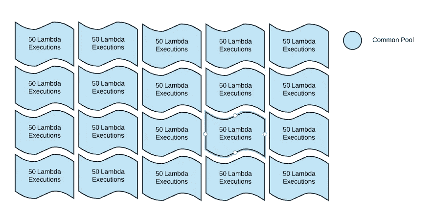
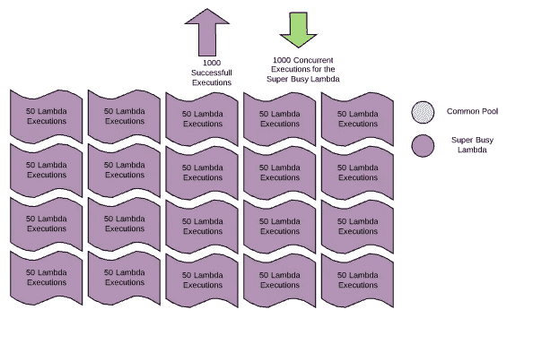
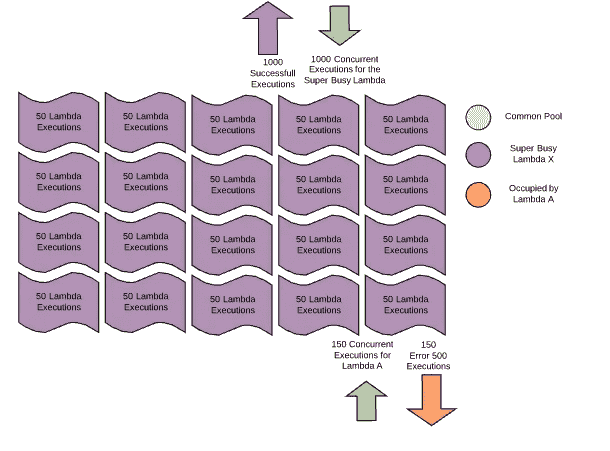
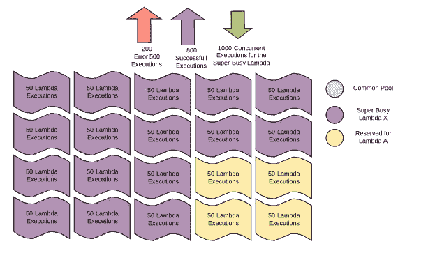
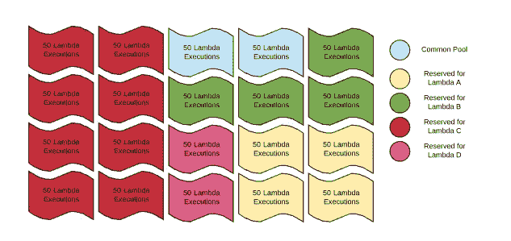
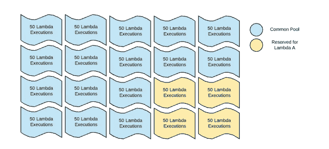
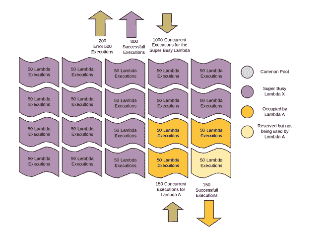
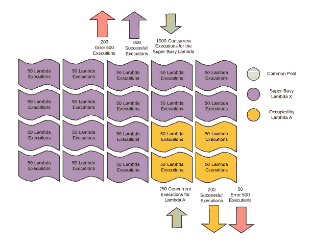
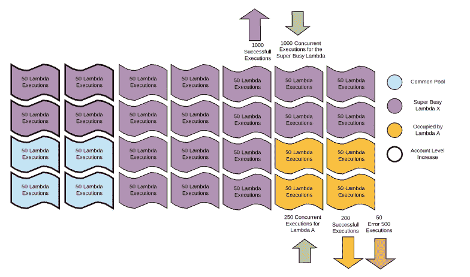
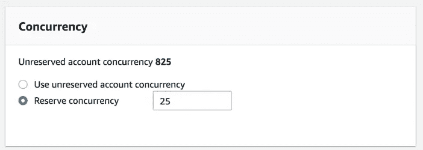

# Lambda 节流、保留并发和执行限制的全面指南

> 原文：<https://itnext.io/the-everything-guide-to-lambda-throttling-reserved-concurrency-and-execution-limits-d64f144129e5?source=collection_archive---------1----------------------->

*你需要知道什么，知道什么，你知道一点点什么……*


# 定义:

*并发执行* —同时被 AWS Lambda 函数**执行的进程**。

*请求* — **触发**AWS Lambda 启动并开始处理的事件。

# **有哪些限制？**

对于每个 AWS 帐户，您从 1000 个并发执行的池开始。该帐户的所有 lambdas 将共享该池中的执行。



如果一个 lambda 收到大量请求(比如 1000 个)，AWS 将从公共池中运行这 1000 个请求。



如果第二个 lambda 在同一时刻也接收请求(例如 150 个),那么它就有被完全或部分拒绝的风险，因为并发执行的总数超过了 1000 的限制。



对于某些应用，这种拒绝风险是不可接受的。在这些情况下，工程师可以使用 *Reserved Concurrency* 参数为任何给定的 lambda 保留一定数量的执行，保证它们总是可用的。



可以在任意组合的任意或所有 lambdas 上设置保留并发。然而， **AWS 总是向公共池**保留 100 个执行。因此，如果帐户的限制是 1000，那么组合的*保留并发*的最大数量将是 900。



当*并发*参数返回到“*使用未保留的帐户并发*”时，执行被返回到公共池。



通过这种设置，保留的执行将**始终保持不受其他 lambda**的影响，即使它们被保留的 lambda 没有使用它们。



反方向也是如此。一旦为 lambda 函数设置了*保留并发*参数，该函数的并发执行总数**就不能超过该数目**。充当该功能的并发限制。



对于某些系统，即使在优化之后，并发执行的总数也一直超过 1000 的限制。在这种情况下，账户所有者可以通过**联系 AWS 支持中心**请求增加系统限额。



# 我们为什么要限制死刑？

有很多理由抑制或限制你的 lambda 函数。

1.  成本或安全性，您可能不希望有人意外或恶意地向您的系统发出大量请求。
2.  性能，以强制合理的批量大小。
3.  可扩展性，使吞吐量与下游资源相匹配。
4.  关闭开关，将*保留并发*减少到零实际上意味着没有流量会流过您的进程。

# 这在实践中是什么样子的？

要修改任何 lambda 的保留并发性，有几个选项。

## 控制台

在 AWS 控制台中导航到您的 lambda，在配置页面中向下滚动到*并发*框，并选择*保留并发。*



## 命令行

要通过命令行修改*保留并发*，请使用下面的[命令](https://docs.aws.amazon.com/lambda/latest/dg/concurrent-executions.html):

```
aws lambda put-function-concurrency --function-name YOUR_FUNCTION_NAME_HERE --reserved-concurrent-executions 50
```

## 无服务器框架文件

如果你用无服务器框架部署你的函数，你可以为文件的`function`部分中的任何 lambda 修改*保留并发性*。

```
service: MediumConcurrency provider:
  name: aws
  runtime: python3.7
  stage: ${opt:stage, 'dev'}
  region: ${opt:region, 'us-east-1'}
  profile: ${opt:profile, 'default'}
  environment:
    region: ${self:provider.region}
    stage: ${self:provider.stage}
  stackTags:
    Owner : krapes
    Project : concurrencyLimits
    Service : concurrencyLimits
    Team : brokenLeg
  stackPolicy: # This policy allows updates to all resources
    - Effect: Allow
      Principal: "*"
      Action: "Update:*"
      Resource: "*" iamRoleStatements:functions:
  dummy:
    handler: dummy.main
    timeout: 10
    ## This parameter sets the reserved concurrency for the lambda 'dummy'
    reservedConcurrency: 25
#    events:
#      - http:
#          method: GET
#          path: /dummy
#          resp: json#plugins:
#  - serverless-python-requirements custom:
  pythonRequirements:
     dockerizePip: non-linux
```

现在，当[测试](https://aws.amazon.com/blogs/compute/managing-aws-lambda-function-concurrency/)您的 lambda 时，您将看到*与**保留并发*设置的超额请求被返回一个错误 500 代码，从而限制了系统。

下面的输出是使用 [Lambda 负载测试](https://github.com/krapes/lambdaLoadTesting)工具生成的，没有 *reservedConcurrency* ，并且设置为 25。

无*预留并发*限制:

```
bash run.sh -n 5000 -c 50-----------------------------------------------------------Details (average, fastest, slowest):
  DNS+dialup:   0.0009 secs, 2.0200 secs, 6.0415 secs
  DNS-lookup:   0.0002 secs, 0.0000 secs, 0.0185 secs
  req write:    0.0000 secs, 0.0000 secs, 0.0030 secs
  resp wait:    3.5561 secs, 2.0199 secs, 6.0414 secs
  resp read:    0.0001 secs, 0.0000 secs, 0.0032 secsStatus code distribution:
  [200] 5000 responses
```

同*预留并发*限制:

```
bash run.sh -n 5000 -c 50-------------------------------------------------------------Details (average, fastest, slowest):
  DNS+dialup:   0.0007 secs, 0.0094 secs, 5.6580 secs
  DNS-lookup:   0.0000 secs, 0.0000 secs, 0.0119 secs
  req write:    0.0000 secs, 0.0000 secs, 0.0033 secs
  resp wait:    1.1845 secs, 0.0093 secs, 5.5826 secs
  resp read:    0.0000 secs, 0.0000 secs, 0.0032 secsStatus code distribution:
  [200] 1638 responses
  [500] 3362 responses
```

# 结论

总之，lambda 函数的并发供应和节流都可以通过*保留并发*参数来管理。如果帐户仅仅需要超过标准的 1000 个并发执行，Amazon 很乐意在讨论其他优化技术后提高限制。

虽然并发限制是服务吞吐量的一个很好的指标，但它仍然不能说明全部情况。平均运行时间长度对一个服务在给定时间段内可以处理的请求数量有很大的影响。与速度较慢的函数相比，能够以两倍的速度完成一个进程的 lambda 或服务需要较少的并发执行来处理相同数量的请求。

为了更好地了解您的服务将如何响应，最好自己进行压力测试。λ负载测试库是一个很好的起点。