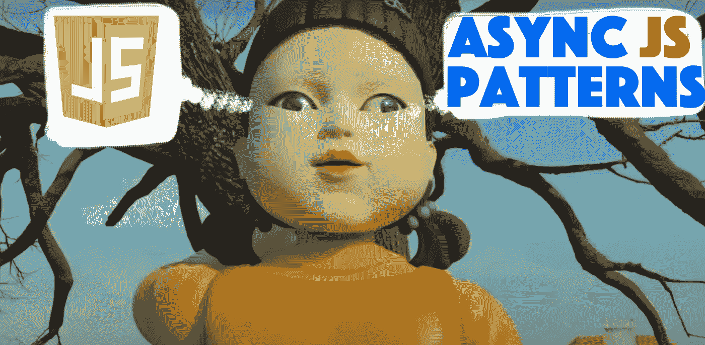
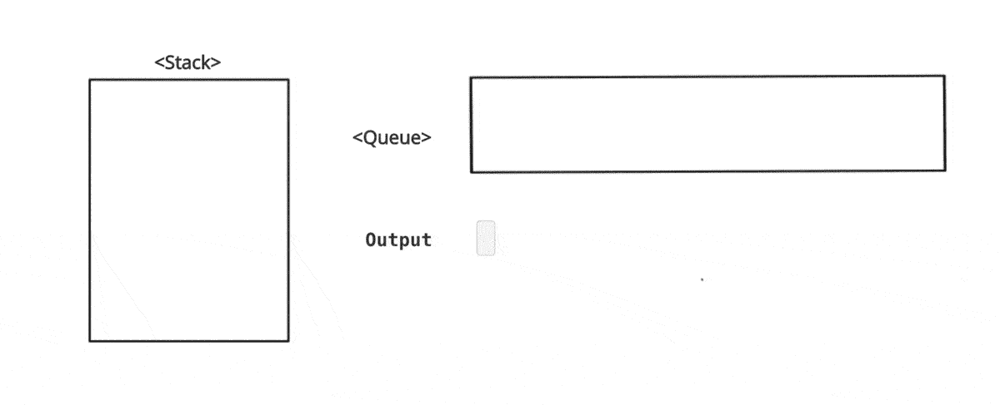

# 🔥JavaScript 中异步模式的演变

> 原文：<https://itnext.io/the-evolution-of-asynchronous-patterns-in-javascript-64efc8938b16?source=collection_archive---------0----------------------->

## 让我们谈谈 JavaScript 中使用的异步模式

[](https://medium.com/subscribe/@easy-web) [## 每当维塔利·舍甫琴科发表文章时，就收到一封电子邮件。

### 每当维塔利·舍甫琴科发表文章时，就收到一封电子邮件。通过注册，您将创建一个中型帐户，如果您还没有…

medium.com](https://medium.com/subscribe/@easy-web) 

# 内容

*   [**简介**](#1ef5)
*   [**关于异步 JavaScript 的神话**](#dff6)
*   [**影响 JavaScript**](#fe21) 的异步模式
*   [**不要挂断或者我们可以给你回电话**](#650c) 🤙
*   [**我们答应叫你**](#c1e3) 📞
*   [**我会观察，有什么变化就给你打电话**](#bf6d) 👀
*   [**结论**](#3c5d)
*   [**了解更多**](#faeb)

# 介绍

异步调用就像一根快速不停漂浮的水管。这些管道也相互连接，可以合并成一个大管道。相互缠绕的管道越多，就越难避免漏水。让我们找出如何指导和连接管道的方法，管道系统足够灵活，这样我们就永远不必叫水管工了。

# 关于异步 JavaScript 的神话

很多前端面试中最常见的刁钻问题之一:*JavaScript 是异步语言吗？对于一些人来说，这可能会令人困惑，因为你必须处理不阻塞 UI 的 API 调用，所以逻辑上 JS 必须是异步的。从最终用户的角度来看，这种看法是正确的。但 Js 实际上是一个单线程，JS 引擎滥用了 2 个内存数据结构:*函数* *栈*和*任务* *队列*。与*堆栈*和*队列*的交互也被称为*事件循环*。*

概念很简单。想象你的代码正在执行一组*嵌套函数*，一个函数在另一个函数内部被调用。每个函数调用都将被推入*内存堆栈*，以保持调用*顺序*。例如:

```
function fooB(){
    console.log('fooB: called');
}function fooA(){
    fooB();
    console.log('fooA: called');
}fooA();
// -> fooB: called
// -> fooA: called
```

JS 引擎说:

```
1\. push *fooA* to stack
**<stack>**
**|fooA|** <- push2\. push *fooB* to stack
**<stack>**
**|fooB|** <- push
|fooA|3\. pop *fooB* from stack and execute
**<stack>**
**|fooB|** <- pop
|fooA|// -> **fooB: called
<stack>**
|fooA|4\. pop *fooA* from stack and execute
**<stack>**
**|fooA|** <- pop// -> **fooA: called**<stack>
|   | **<- stack is empty**
```

我们发现所有的函数调用都被推入*函数栈*。但是什么会进入任务队列呢？做这件事有不同的方法:

*   **设置超时**
*   **设置间隔**
*   **承诺**
*   ajax
*   **DOM 事件**

让我们看看这个例子:

```
function fooB(){
    **setTimeout(()=>console.log('API call B'));**
    console.log('fooB: called');
}function fooA(){
    **setTimeout(()=>console.log('API call A'));**
    fooB();
    console.log('fooA: called');
}fooA();
// -> fooB: called
// -> fooA: called
// -> **API call A**
// -> **API call B**
```

现在，让我们看看幕后发生了什么:

```
1\. push *fooA* to stack**<stack>**
**|fooA|** <- push2\. push **'API call A'** to queue**<queue>**|**'API call A'**| <- push3\. push *fooB* to stack
<stack>
**|fooB|** <- push
|fooA|4\. push **'API call B'** to queue**<queue>**|**'API call A'**|**'API call B'|** <- push5\. pop *fooB* from stack and execute
**<stack>**
**|fooB|** <- pop
|fooA|// -> **fooB: called****<stack>**
|fooA|6\. pop *fooA* from stack and execute
**<stack>**
**|fooA|** <- pop// -> **fooA: called****<stack> <- stack is empty
|   |**7\. pop **'API call A'** fromqueue and execute**<queue>**|**'API call A'**| <- pop |'API call B'|
// -> **API call A****<queue>**|'API call B'|8\. pop **'API call B'** fromqueue and execute**<queue>**|**'API call B'**| <- pop
// -> **API call B****<queue>**|   | <- queue is empty
```

如果我们把它形象化，就会清楚得多:



在简要概述了异步 JavaScript 之后，让我们深入了解不同的模式和数据结构如何利用 JS 异步模型。

# 影响 JavaScript 的异步模式

在我们知道 JavaScript 中事件内存是如何工作的之后，我们需要弄清楚如何编写异步代码——简洁而高效。我们将发现处理异步数据的更多缺点，并概述最有效的模式和数据结构。我们将主要关注 API 调用场景来说明主要的挑战，但是用例并不仅限于这些例子。

JavaScript 中目前使用以下模式和数据结构:

*   ***回调***
*   ***许诺***
*   ***观察者***

每一个都是前一个的延伸。让我们更详细地回顾一下。

# 不要挂断，否则我们会再打给你🤙

当我们向呼叫中心寻求帮助解决问题并需要遵循机器人的指令时，我们都有这种心理创伤。大多数通常会给你两个选择。选项 1——你是不是*呆在队伍里*听着单调的旋律，这能让你发疯🤯。即使等待，什么也不做只是浪费时间，大多数人倾向于选择这个选项，因为他们觉得他们已经花了足够的时间来连接，并且不信任这个服务。更有效的选择是要求*回电，*在这种情况下，你可以畅通无阻地做任何你想做的事情，同时等待一个代表给你打电话。

JavaScript *回调*中使用了相同的模式。例如，您有一个 *callApiFoo* 函数，并传递两个*函数*作为参数，*成功、*和*失败、*，根据 API 调用是否成功执行，它将调用相应的*回调*。

```
function **success**(res){
    console.log("API call successful");
}function **fail**(err){
    console.log("API call failed");
}function **callApiFoo**(success, fail){
    fetch(url)
      .then(res => **success**(res))
      .catch(err => **fail**(err));
};**callApiFoo(success, fail)**;
```

当一个 API 调用依赖于另一个 API 调用时，这种方法有一个缺点。这将迫使我们嵌套这些调用。如果只有几个这样的电话可能还可以，但是当我们有很多这样的电话时会发生什么呢？通过嵌套每个回调函数，我们将得到一个意大利面条式的代码:

```
**callApiFooA((resA)=>{
    callApiFooB((resB)=>{
        callApiFooC((resC)=>{
            console.log(resC);
        }), fail)**;
    **}), fail)**;
**}), fail)**;
```

这看起来像一场灾难，但有一个解决办法。

# 我答应给你打电话📞

如何摆脱这个筑巢的地狱😈，因为在 web 开发中，我们必须非常频繁地组合 API 调用。这个概念是，我们可以*链接*调用，而不是*嵌套*调用。这就是*承诺*发挥作用的地方。它们是可以将结果作为另一个*承诺*返回的数据结构。让我们看看这个例子:

```
**function callApiFooA(){
    return** **fetch(url); //** JS **fetch** method returns a Promise**}****function callApiFooB(****resA****){
    return** **fetch(****url+'/'+****resA.id);** **}****function callApiFooC(****resB****){
    return** **fetch(url****+'/'+****resB.id);** **}****callApiFooA()
    .then(callApiFooB)
    .then(callApiFooC)
    .catch(fail)**
```

这要好得多，并且提供了更具可伸缩性的解决方案。我们可以根据自己的需要，将*承诺*链接多次。*如果一个调用依赖于两个或多个其他 API 调用会怎么样？*然后我们想在一个调用中合并多个*承诺*，并在另一个调用中对它们进行后处理。

让我们看看使用 **Promise.all** 的例子:

```
**function callApiFooA(){
    return** **fetch(urlA);** **}****function callApiFooB(){
    return** **fetch(****urlB****);** **}****function callApiFooC(****[resA, resB]****){
    return** **fetch(url****+'/'+****resA.id****+'/'+****resB.id);** **}****function callApiFooD(****resC****){
    return** **fetch(url****+'/'+****resC.id);** **}****Promise.all([callApiFooA(), callApiFooB()])**
    **.then(callApiFooC)
    .then(callApiFooD)
    .catch(fail)**
```

它看起来很整洁，但我们还没说完。我们甚至可以更进一步，可能想要改变我们从一个承诺调用传递到另一个承诺调用的数据流。例如，我们*过滤*一个承诺响应，只获取特定类型的数据，然后*映射*过滤后的数据，只获取 id。

# 我会观察并在有变化时通知你👀

处理多个异步变化的数据流可能具有挑战性。尤其是当它们相互依赖时，我们必须以更复杂的方式将它们结合起来。为了解决这个问题，我们使用另一种数据结构，如 *Observer* 。*观察者*创建一个数据变更流，其他消费者可以*订阅*该流，以便*监听*和*检索*最新的*变更*。**顺便说一句，如果你还没有在 medium 中跟随我，如果今天学到了一些新东西，明天还想学更多，就跟随我吧**😉**。**让我们更仔细地看一下，为了演示起见，我们将使用 [**RxJs 库**](https://rxjs.dev/) **:**

```
**function callApiFooA(){
    return** **fetch(urlA);** **}****function callApiFooB(){
    return** **fetch(****urlB****);** **}****function callApiFooC(****[resAId, resBId]****){
    return** **fetch(url****+'/'+****resAId****+'/'+****resBId);** **}****function callApiFooD(****resC****){
    return** **fetch(url****+'/'+****resC.id);** **}**Observable.from(Promise.all([**callApiFooA()**, **callApiFooB()**])).**pipe**(
    **map**(([**resA**, **resB**]) => ([**resA.id**, **resB.id**])), // <- extract ids
    **switchMap**((**resIds**) => Observable.from(**callApiFooC(****resIds****)**)),
    **switchMap**((**resC**) => Observable.from(**callApiFooD(****resC****)**)),
    **tap**((**resD**) => console.log(**resD**))
).**subscribe**();
```

*   *Observable.from* 将把一个*承诺的数组*转换成*可观察的*，即一个来自*callApiFooA* 和 *callApiFooB 的结果数组。*
*   *map —* 从 API 函数 A 和 B 的响应中提取*id*
*   switchMap —使用先前结果的 id 调用 *callApiFooC* ，并返回一个新的*可观察值*和函数 *callApiFooC* 的结果
*   switchMap —使用函数 *callApiFooC* 的结果调用 *callApiFooD*
*   *点击* —获取之前执行的结果，并在控制台中打印出来
*   *订阅* —开始收听观察

这种模式在处理异步数据流时更加强大和灵活。它也很受欢迎，在 Angular 这样的前端框架中使用。**如果你有兴趣阅读更多关于可观测量的高级用法，请发表评论**👍**。**

# 结论

我们浏览了 JavaScript 中异步模式的历史。使用可观测量的现代方法足以涵盖最复杂的情况。如果你今天学到了一些新的东西，请不要害羞地跟随我，将来我会用更多关于 web 开发的精彩话题来回报你。😎

[](https://medium.com/subscribe/@easy-web) [## 每当维塔利·舍甫琴科发表文章时，就收到一封电子邮件。

### 每当维塔利·舍甫琴科发表文章时，就收到一封电子邮件。通过注册，您将创建一个中型帐户，如果您还没有…

medium.com](https://medium.com/subscribe/@easy-web) 

# 了解更多信息

[](/how-micro-frontend-changes-the-future-of-angular-bb4deb2cfdad) [## 🔥微前端如何改变 Angular 的未来？

### 让我们看看为什么 Angular 最适合微前端

itnext.io](/how-micro-frontend-changes-the-future-of-angular-bb4deb2cfdad) [](/how-to-scale-angular-without-limits-e6a6ca15111) [## 🔥如何无限制地缩放角度

### 极限总是在你的头脑中，清空你的头脑和秤

itnext.io](/how-to-scale-angular-without-limits-e6a6ca15111) 

*更多内容请看*[***plain English . io***](http://plainenglish.io/)