# 进化建筑配方

> 原文：<https://itnext.io/the-evolutionary-architecture-recipe-c5420d772c6c?source=collection_archive---------2----------------------->

很长一段时间以来，软件行业都遵循着这样的观念，即在编写第一行代码之前，应该开发并完成架构。预先计划的架构方法是建立在需求也应该在编码开始之前确定的概念上的。

然而，敏捷世界挑战了固定需求的概念，观察到需求的定期变化是现代世界的业务需求。从这个角度来看，架构以敏捷的方式拥抱变化。我们称之为进化架构，以强调虽然变化是不可预测的，但架构仍然可以朝着好的方向发展。

> 一个可以随着时间的推移轻松发展的架构

有很多关于人类如何思考和决策的研究。众所周知，人类通常根据假设做出决定，软件业也不例外。

敏捷思维促进了流程、产品和业务的迭代，这促进了学习周期，有助于公司在该领域知识的驱动下做出更好的决策，并减少由假设驱动的决策。这种思维模式也适用于软件架构，但是我们需要一组高层次的问题和实践来帮助我们从这些学习周期中获得最大收益，并做出更好的架构决策。

> 好的决策来自于在正确的时间提出正确的问题。

# 食谱

这是一个烹饪进化架构的基本食谱，在大多数情况下味道都不错，但像任何食谱一样，你可以添加更多的成分或改变它们来改进它。

下一个流程由在项目周期的不同阶段执行的一组问题来指导。

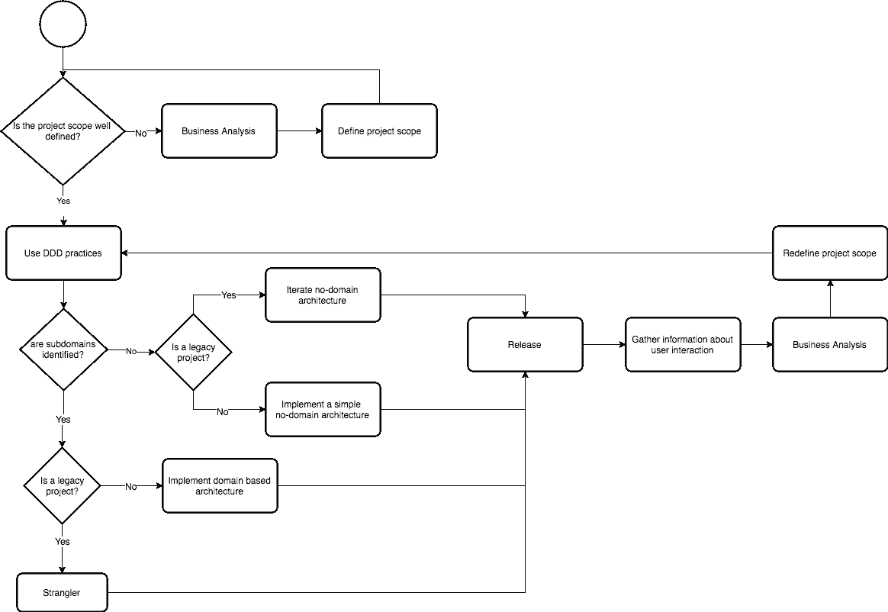

## 项目范围是否定义良好？

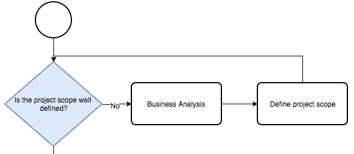

项目范围帮助软件架构师定义架构范围，并做出更好的架构决策。项目需求在开发周期中可能会改变，但是它们应该保持在范围的边界内，以避免影响架构方向。

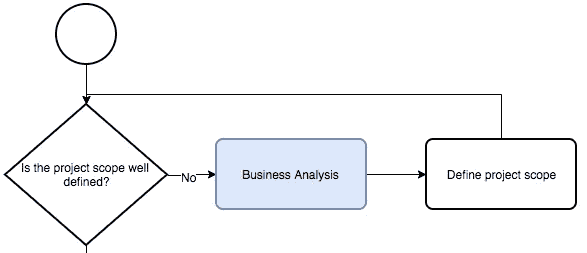

**业务分析**对于确定业务需求并对其进行优先排序是必要的，以便定义包含项目范围的 MVP 文档或迭代产品。

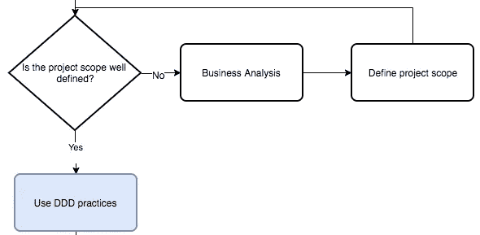

一旦项目范围被很好地定义，领域驱动的设计实践，如**事件风暴**和**无处不在的语言**帮助团队识别子域并定义跨领域的公共语言。

## 子域名被识别了吗？不

DDD 实践要求领域和技术专家一起工作，以便识别子域，但是当缺乏业务规则方面的知识时，有时会很困难。

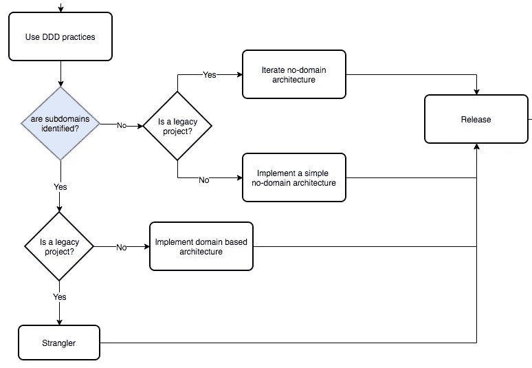

领域驱动的架构需要对实现它们的子域有深入的了解，否则，架构上的错误抽象会使其更难发展。

> 复制比错误的抽象要便宜得多

那么，当领域知识严重缺乏时，非领域架构是最佳选择。

## 是一个遗留项目。

架构决策也依赖于项目状态。

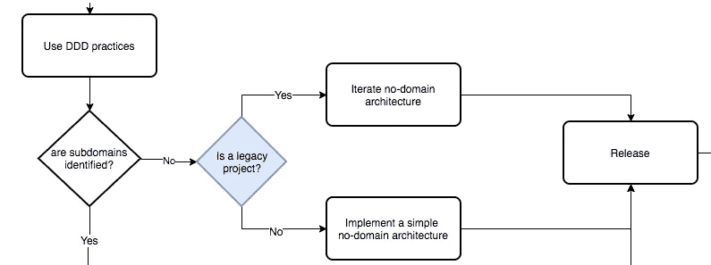

对于**绿地**项目，我们应该实施一个简单的架构，专注于项目范围，避免基于假设或过早优化而使其变得更加复杂。

> 过早优化是编程中所有罪恶(或者至少是大部分罪恶)的根源——Donald Knuth

对于**棕色地带**(遗留)项目，在开发周期中，架构被迭代以解决技术债务并加速交付。在项目周期中，架构是基于需求变化而迭代的，因为此时是项目范围变化的时候，因此架构应该随着项目一起发展。

> 架构应该随着项目一起发展。

## 发布和项目迭代

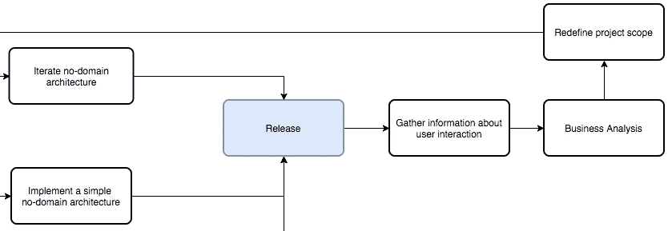

项目发布后，我们可以使用分析工具，根据从用户行为中收集的信息，对迭代项目进行业务分析。正如你所注意到的，棕地项目的商业分析不同于绿地项目，它是由市场需求和用户需求驱动的。

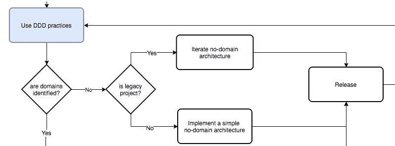

当下一个项目迭代开始时，我们有更多的信息来帮助领域和技术专家使用 DDD 实践来识别或迭代子域。

## 子域名被识别了吗？是

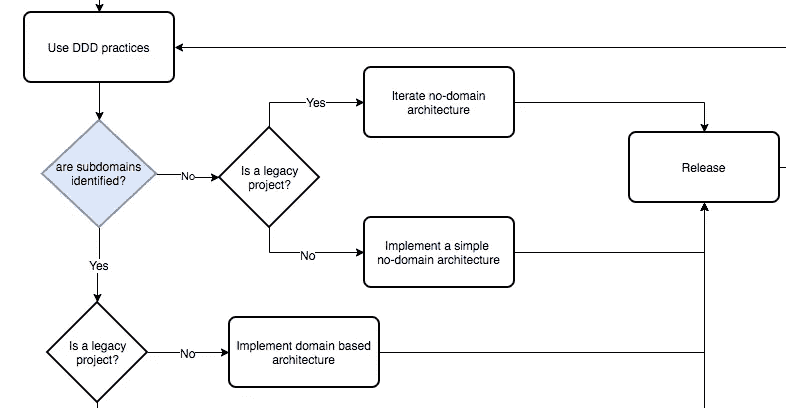

一旦确定了所有或至少一个子域，我们就可以采用域驱动的架构。

为绿地项目确定子领域并不常见，但是当参与项目的人有大量解决特定业务领域问题的经验时，这是可能的。

一些领域驱动的架构，比如微服务，实现起来比其他的更复杂，因此它们需要更多的技术专长来实现。

> 一些领域驱动的架构需要技术专家来实现它们。

## 扼杀者模式

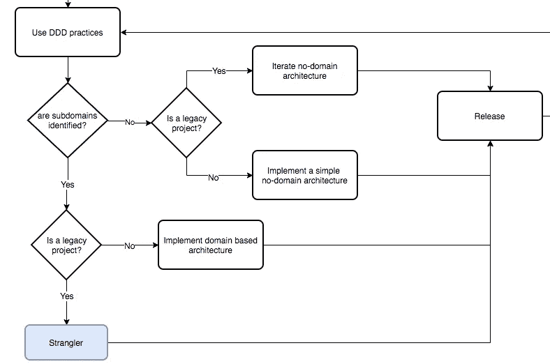

一个[扼杀者模式](https://docs.microsoft.com/en-us/azure/architecture/patterns/strangler)是一种稳定迁移遗留项目的方法，不像大爆炸方法，遗留系统被丢弃，新的系统从零开始开发。

这种方法包括从遗留系统中移除已识别的域，并在基础设施或代码级别上分离它们。

注意:当应用程序很小或者项目范围发生巨大变化时，有时采用大爆炸方法会更好。

## 释放并继续迭代

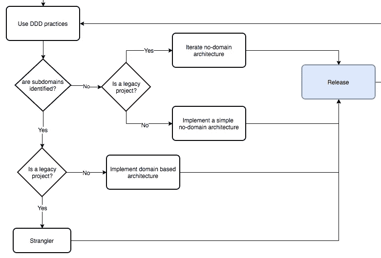

最后，我们需要再次发布架构变更，所以是时候再次迭代项目和架构了。

## **结论**

作为软件架构师，我们应该避免做出由假设驱动的决策，相反，我们应该利用每个项目迭代的学习周期来做出由项目范围和收集的知识驱动的决策。

## **资源**

[建造进化建筑](https://www.thoughtworks.com/books/building-evolutionary-architectures)

[DDD 101——五分钟之旅](https://medium.com/the-coding-matrix/ddd-101-the-5-minute-tour-7a3037cf53b8)

我想…我想…我在想什么？—推动决策的假设