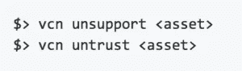

# 证书吊销列表(CRL)失败

> 原文：<https://itnext.io/the-failure-of-the-certificate-revocation-list-crl-a06e1f600148?source=collection_archive---------4----------------------->

当网络犯罪分子利用窃取的合法凭证将自己隐藏在信任的外衣下，以便感染实体、程序和代码时，世界往往会利用证书撤销列表(CRL)。CRL 交叉引用已知的合法可信数字证书和受损的数字证书。什么是 CRL？正如您可能猜到的，它们只是已经失效的证书的列表。

数字证书被广泛用于促进整个技术世界的安全和不受干扰的通信，以及签署代码和数字资产，以便人们可以验证其完整性和真实性。然而，当这种有效的通行证被坏人破坏时，悲剧就发生了。

此外，当原本用于保护更大利益的证明文件被证明有效而不被撤销时，公众会感到奇怪，为什么我们首先要相信这样一个无效和粗心大意的制度。证书授权机构(CA)不采取任何干预措施的泄密证书只会鼓励恶意势力做更多同样的事情。那些依赖于保存良好的 CRL 的人应该如何保护自己，并知道哪些证书是合法的，哪些证书已被吊销？当事情出错，墨菲抬起他丑陋的头，他们如何保持安全？

对大多数人来说，这是一个真正的问题。直到现在。有更好的方法。但首先，介绍一下背景。

# 撤销流程是怎样的？

我们已经确定，证明程序或代码可以安全下载的受损凭证是当前的一个问题，解决方案存在漏洞且不完善。

撤销过程实际上有 3 个步骤:

1.  及时发现泄露的证书
2.  以有效和及时的方式撤销泄露的证书
3.  快速传播撤销信息

当发生危害时，认证机构(CA)被联系，请求使数字证书无效。然而，CA 至少足够精明，知道他们需要验证撤销请求是否来自证书的实际所有者。一旦发生这种情况，证书将被吊销。这种一对一的交流是等式中最简单的部分。

下一步就有点棘手了，需要将消息发送给整个相关的数字世界，让他们知道证书不再有效。当然，典型的用户群可以有各种规模，但是，彻底的沟通工作显然更具挑战性，因为当苍蝇看不到蜘蛛网时，坏事就会发生。从长远来看，CRL 已被用于促进这一消息传递过程，并使其知道任何用户都不应该接受泄露的凭证，理想地阻止了攻击者滥用的流行。

# 吊销延迟会发生什么情况，吊销证书需要多长时间？

如果信息或通信被延迟，损失就会越积越多，无论是冻结一个民族国家的关键基础设施，还是耗尽客户的银行账户。我们都希望及时可见。它不仅仅是知道一个代码或程序是否可信。这也是关于在失去信任时被告知。

根据第 27 届 USENIX 安全研讨会的一篇论文，“破碎的盾牌:测量 Windows 代码签名 PK 中的撤销有效性”，“在证书被用于签署已知的恶意二进制文件后，ca 平均需要 5.6 个月(如下所示)来撤销被破坏的证书。”与此同时，由于 CAs 对 CRL 的管理不善，用户可能会受到签名恶意软件攻击的进一步伤害。

上表显示了滥用证书的生命周期。(红色实心圆、空心圆、绿色条和橙色菱形分别表示恶意软件、良性样本、到期日期和撤销日期。)*来源:* [***认证恶意软件:测量 Windows 代码签名 PKI***](http://users.umiacs.umd.edu/~tdumitra/papers/CCS-2017.pdf) 中的信任漏洞

# 为什么撤销软件签名很重要

报告和撤销受损证书中的延迟是当前撤销机制的主要影响的一个例子，并且不仅给最终用户，而且给可疑软件与其可执行文件接触的任何实体留下了很高的滥用的潜在后果。上个月我们报道的华硕 ShadowHammer 供应链攻击就是这种情况。

不幸的是，对用户不利的是，证书撤销过程几乎从未实施过。有时这是因为 CA 的主要任务是正确管理和执行证书策略，包括撤销。但是，过早地或错误地撤销证书会导致严重的复杂情况，CA 将对此承担经济责任。

另一方面，不作为会造成自身的损害。无论是出于真正的担心还是害怕出错，CAs 提供的任何不及时、不准确的结果都将是不合格的，因为用户可能会在中间的时间里变得萎靡不振，其财务和声誉可能会遭受损失和损害。

# 为什么撤销有这么多问题而且基本上从来不做(正确)

根据上文引用的同一篇 USENIX 安全研讨会论文，

> 在很多情况下，由于以下原因，客户端无法检查证书吊销状态:

1.  *缺失 CRLs 点*
2.  无法到达的 CRLs 点
3.  不再更新的 CRL
4.  从 CRL 中错误删除的已吊销证书
5.  来自 CRL 的不一致响应

> 这些发现突出了代码签名 PKI 及其撤销过程的各种属性，由于它们产生的安全影响，应该更积极地监视这些属性

此外， **CA 受到所谓的粗粒度**的限制。这意味着他们在深入研究客户关系管理(CRM)程序和关闭验证证书(下至单个客户或逐项产品级别)的能力方面受到了极大的限制。通常情况下，CRL 列表(例如 CRLsets)只关注高价值的中级 CA 证书或更高级别的证书。

我个人知道一家价值 34 亿美元的技术公司，该公司在其组织生产的所有产品的三个数字证书的脚手架上走钢丝。只是有点可笑。想象一下，如果他们的一个证书失效了。他们巨大的集中故障点会在利益相关者的脑海中回响，如果不是更多的话，也会有数亿美元的损失。

# [公证人](https://www.codenotary.io/)如何简化撤销程序

许多业内人士说，事实是没有可靠的方法来解决这个问题，撤销是坏的，没有可靠的检查机制来促进这一进程。

如前所述，粗粒度只会加剧 CAs 的问题。有趣的是，现在有了更好的方法。CA 继续以他们一贯的方式做生意实际上只是一个更大的自满问题的症状。对我们其他人来说，事实是今天我们有一个选择。code 公证人利用**分布式账本技术**赋予数字认证代码的所有者**在白天或晚上的任何时间撤销单个证书**的能力。

面向开发人员、产品经理、安全专业人员等。微调数字证书库状态的能力非常有用和强大。更不用说撤回和撤销它们的二进制文件可以在一个简单的步骤中完成。

下面的代码片段是 code 公证人如何允许代码撤销和更新您的证书和签名库的两个例子。

# 结论

具有讽刺意味的是，开发人员不再需要依赖第三方来高效和有效地管理他们的证书，即使这是他们的工作。今天，**在几秒钟内，而不是几周内，代码可以在需要时移除其信任**。单个软件，甚至是构建组件，都可以被无效，而您帐户上列出的所有受管理的代码仍然是经过身份验证的。

code 公证人是一种现成的交钥匙技术，是一种 100%有效和可靠的拒绝恶意代码连接的解决方案。它通过其请求-响应机制来做到这一点，这种机制可以近乎实时地**撤销证书**。

我们总是建议在想要依赖证书时遵循安全最佳实践，但如果墨菲定律被证明是正确的，code 公证人所基于的分布式分类帐技术的彻底性和即时性可以帮助您免受未雨绸缪的影响。

[**今天开始**免费公证**这里**。](https://dashboard.codenotary.io)

# 参考

*   [https://www . Symantec . com/content/dam/Symantec/docs/research-papers/the-broken-shield-measuring-revocation-effectivity-in-the-windows-codes-signing-PKI-en . pdf](https://www.symantec.com/content/dam/symantec/docs/research-papers/the-broken-shield-measuring-revocation-effectiveness-in-the-windows-codes-signing-pki-en.pdf)
*   [http://users.umiacs.umd.edu/~tdumitra/papers/CCS-2017.pdf](http://users.umiacs.umd.edu/~tdumitra/papers/CCS-2017.pdf)
*   [https://en.wikipedia.org/wiki/Certificate_revocation_list](https://en.wikipedia.org/wiki/Certificate_revocation_list)
*   [https://medium . com/@ alexeysamoshkin/how-SSL-certificate-revocation-is-broken-in-practice-af 3b 63 B9 CB 3](https://medium.com/@alexeysamoshkin/how-ssl-certificate-revocation-is-broken-in-practice-af3b63b9cb3)
*   [https://Scott helme . co . uk/Alexa-top-100 万-分析-2019 年 2 月/](https://scotthelme.co.uk/alexa-top-1-million-analysis-february-2019/)
*   [https://www . maikel . pro/blog/current-state-certificate-revocation-crls-ocsp/](https://www.maikel.pro/blog/current-state-certificate-revocation-crls-ocsp/)

*原载于 2019 年 4 月 24 日*[*https://www . vchain . us*](https://www.vchain.us/the-failure-of-the-certificate-revocation-list-crl/)*。*