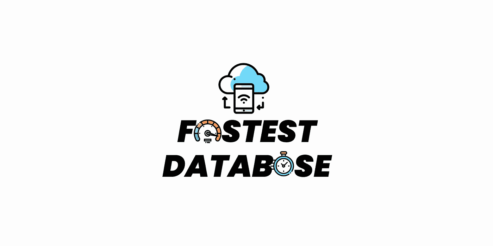
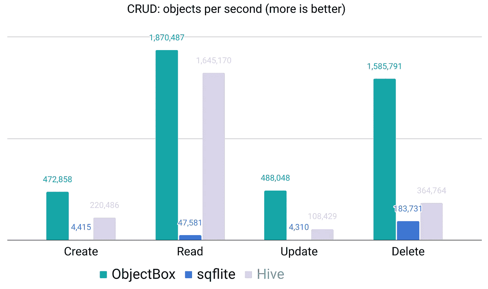
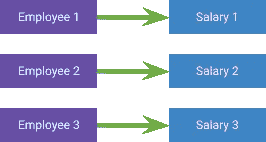
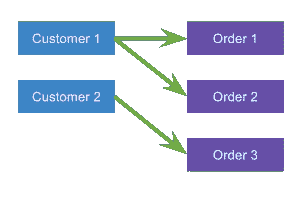
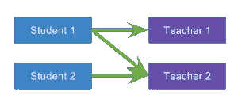
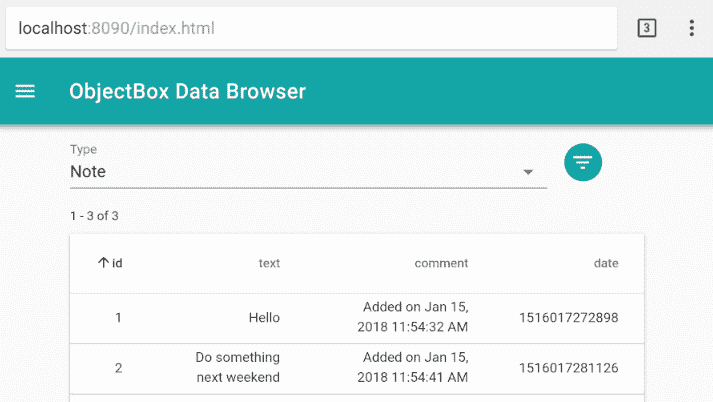
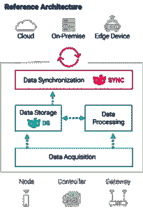
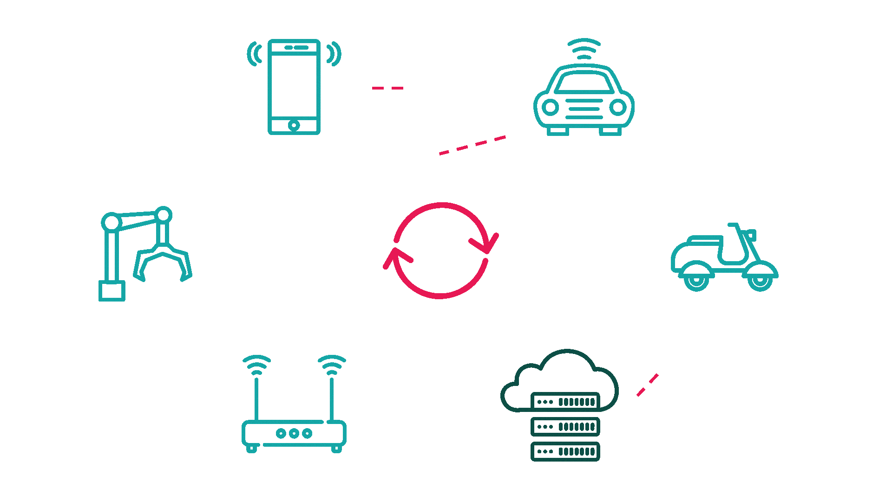

# ObjectBox 的简约指南

> 原文：<https://itnext.io/the-fastest-local-database-in-dart-flutter-a65ff5b29fee?source=collection_archive---------1----------------------->



## ObjectBox 凭借其性能和自动同步选项改变了游戏规则

`[Hive](https://pub.dev/packages/hive)`对于键值操作来说是很棒的，但是当涉及到用高级查询存储对象时，你就需要**更好的包**。

## 他们是；

1.  [**对象框**](https://pub.dev/packages/objectbox)
2.  [**Isar**](https://pub.dev/packages/isar) (是 [**Hive**](https://pub.dev/packages/hive) 的改进版)(同一作者)

现在我会给你一个关于`ObjectBox`的简单介绍，但是我稍后也会介绍`Isar`，所以请订阅并保持关注！

> 正如我所承诺的，我写了一篇关于 Isar 的文章，所以你也可以看看！

[](/a-minimalist-guide-to-isar-ee43c1e51a85) [## 会计准则专家组简明指南

### Hive 的改进版本，在 Flutter/Dart 中是 ObjectBox 的最佳竞争者

itnext.io](/a-minimalist-guide-to-isar-ee43c1e51a85) 

# 动机



Hive vs Sqflite vs ObjectBox

## 用于存储和同步 Dart 对象的超快速颤振数据库

*   🏁高性能—提高响应速度并支持实时应用。
*   符合🪂酸标准—原子、一致、隔离、耐用。
*   💻多平台— Android、iOS、macOS、Linux、Windows。
*   🌱可扩展—随着您的应用而增长，轻松处理数百万个对象。

## 使用方便

*   🔗关系—对象链接/关系是内置的。
*   💐查询-根据需要过滤数据，甚至跨关系过滤。
*   🦮静态类型—编译时检查和优化。
*   📃模式迁移—满怀信心地改变您的模型。

## 哦，还有一件事…

*   😎 [**数据同步**](https://objectbox.io/sync/) —保持设备和服务器之间的数据离线或在线同步。

> 我还为此写了一篇文章！

[](/auto-sync-across-devices-using-objectbox-566af10b0047) [## 使用 ObjectBox 跨设备自动同步

### 自动同步是一个很酷但很难实现的功能，尤其是它对于物联网来说是必要的。那我们来看看…

itnext.io](/auto-sync-across-devices-using-objectbox-566af10b0047) 

## 让我们来看一些代码示例！

## 正在初始化

在我们进行操作之前，我们需要首先初始化我们的存储

```
void main() async {
  WidgetsFlutterBinding.ensureInitialized();
  **final store = await openStore();**
  runApp(const MyApp());
}
```

## CRUD 操作

```
**final userBox = store.box<User>();**userBox.**get**(userId);
userBox.**getMany**([userId1, userId2]);
userBox.**getAll**();// If id exists updates the object else creates new object
userBox.**put**(user);
// enum PutMode { put, insert, update }
userBox.**putQueued**(user, **mode: PutMode.update**);
userBox.**putMany**([user1, user2]);userBox.**remove**(userId);
userBox.**removeMany**([userId1, userId2]);
userBox.**removeAll**();
```

## 其他方法

```
await store.**runIsolated**(
  TxMode.write,
  removeSelectedUsers, // top-level or static function
  [userId1, userId2],
);userBox.**contains**(userId);
userBox.**containsMany**([userId1, userId2]);// Gets the length of object list
userBox.**count**();
```

## 问题

`Queries`是`ObjectBox`最强大的一方。

因为我们可以方便快捷地查询复杂的东西。

```
Query<User> query = userBox.**query**(
  User_.firstName.**equals**('Joe').**or**(User_.lastName.**contains**('e')) **&**
  User_.yearOfBirth.**greaterThan**(1970) **&**
  User_.lastName.**startsWith**('h') **|**
  User_.lastName.**endsWith**('u').**and**(User_.age.**between**(20,50))
).build();List<User> youngJoes = query.find();
```

(我知道查询没有意义，但我只是想向您展示查询有多复杂)

## 排序

您可以使用`order()`方法轻松地对您的列表进行排序

```
..**order**(User_.lastName,
  **flags**: Order.**descending** | Order.**caseSensitive** );
```

## 限制、偏移和分页

```
// offset by 10, limit to at most 5 results
**query**
  **..offset** = 10
  **..limit** = 5;
List<User> joes = query.find();
```

## 关系

不像`Hive`我们需要定义对象之间的关系。

但是不要担心，它们很容易实现！

让我们用例子来看看这种关系

## **一对一(1:1)**



一对一(1:1)

```
@Entity()
class Employee {
  int id;
  **final salary = ToOne<Salary>();** }@Entity()
class Salary {
  int id;
  **final employee = ToOne<Employee>();**
}
```

## **一对多(1:N)**



一对多(1:N)

```
@Entity()
class Customer {
  int id;
  **final orders = ToMany<Order>();**
}@Entity()
class Order {
  int id;
  **final customer = ToOne<Customer>();**
}
```

## **多对多(N:M)**



多对多(多对多)

```
@Entity()
class Teacher{
  int id;
}@Entity()
class Student{
  int id;
  **final teachers = ToMany<Teacher>();**
}
```

## 管理面板

您还可以直观地浏览您的数据

*   只需将您的商店传入`Admin`类并运行项目
*   并在浏览器上打开`[http://127.0.0.1:8090](http://127.0.0.1:8090)`

```
final admin = Admin(store);// on dispose
admin.close();
```



> 此外，您可以将所有数据下载为 JSON 文件

关于详细的设置和使用，请阅读[此处的文档](https://docs.objectbox.io/data-browser)

# 数据同步



ObjectBox Sync 是**开箱即用的数据同步解决方案**，用于管理数据流并协调设备间的数据，无论是离线还是在线。

ObjectBox 中有 3 种类型的数据同步，它们是:

## **边缘到云到边缘**

你可以毫不费力地通过服务器同步你的数据。


**缘来云往缘**

## **边对边**

它使用类似`torrent`的点对点系统


**边对边**

## **分散边缘— *【计划内】***

ObjectBox 也在开发一个大功能。在这种情况下，将没有中央服务器或任何东西。数据将在设备间自动通信，无需依赖任何中央源。您的数据将会前所未有地安全可靠。



**分散边缘*【计划内】***

## 还有一点

如果不需要高级查询，只想存储原语类型。

您可以查看`[hive](https://pub.dev/packages/hive)`或`[get_storage](https://pub.dev/packages/get_storage)`套餐。

`[hive](https://pub.dev/packages/hive)`存储原始类型和对象，但不支持查询

[](/flutter-save-data-to-local-storage-with-hive-nosql-database-package-8a0de834f313) [## 颤振保存数据到本地存储与蜂房 NoSQL 数据库包

### Hive 是一个用纯 Dart 编写的轻量级、速度极快的键值数据库。

itnext.io](/flutter-save-data-to-local-storage-with-hive-nosql-database-package-8a0de834f313) 

`[get_storage](https://pub.dev/packages/get_storage)`只是`[shared_preferences](https://pub.dev/packages/shared_preferences)`的一个很好的替代(只存储原语类型不支持对象。)

[](https://iisprey.medium.com/how-to-save-your-data-locally-20e75561674f) [## 如何在本地保存您的数据

### 在本文中，我将教您如何使用 get_storage 包将数据持久化到本地存储中

iisprey.medium.com](https://iisprey.medium.com/how-to-save-your-data-locally-20e75561674f) 

## 感谢您的阅读！

我试图尽可能简单地解释。希望你喜欢。

如果你喜欢这篇文章，请点击👏按钮(你知道你可以升到 50 吗？)