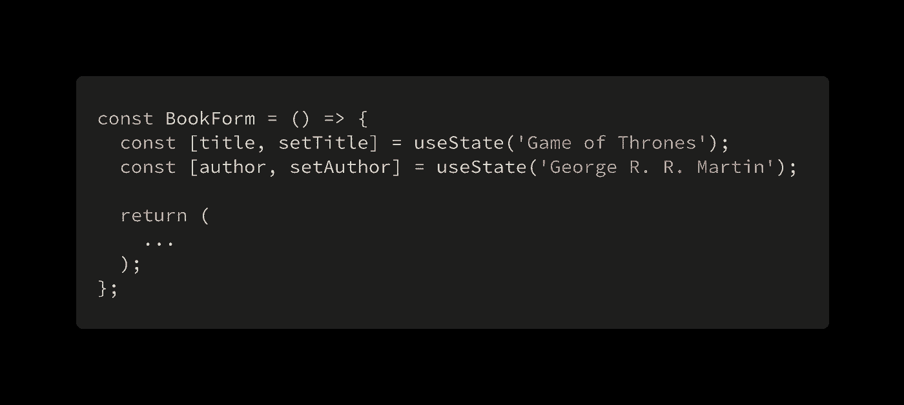
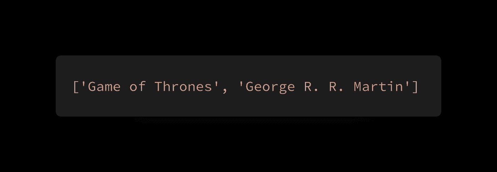
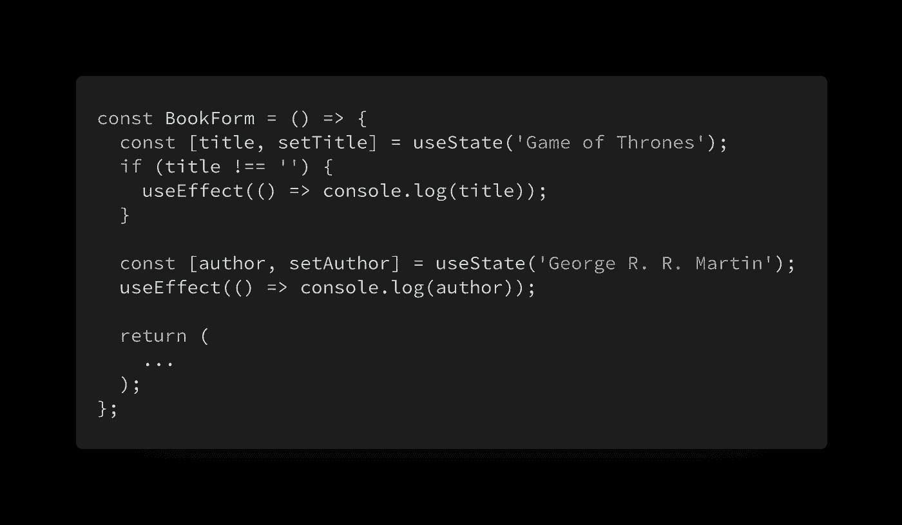
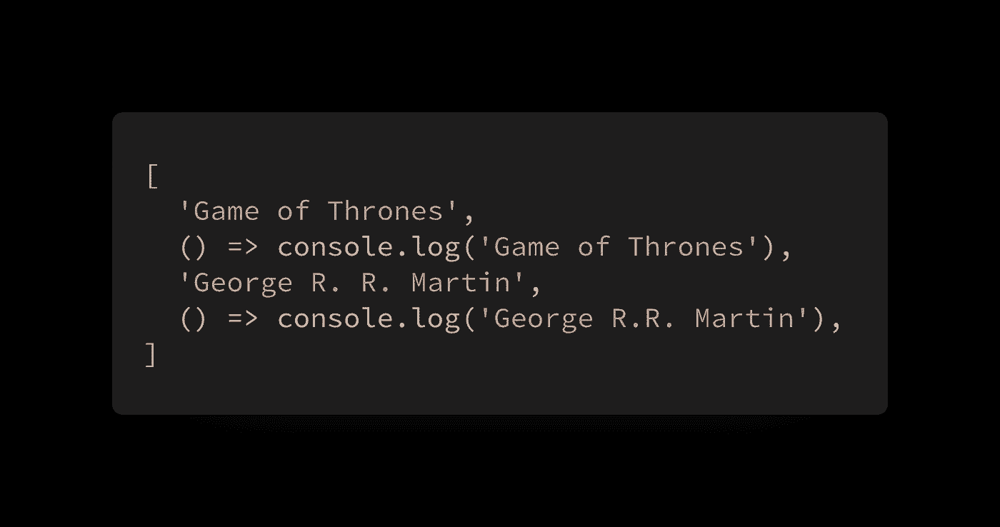
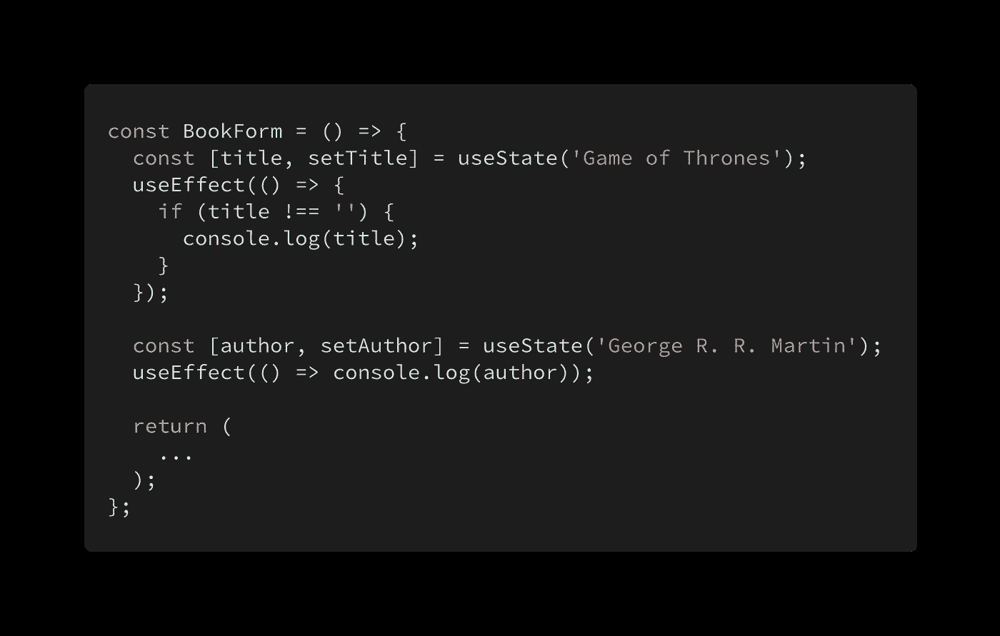

# React Hooks 的第一条规则，说白了

> 原文：<https://itnext.io/the-first-rule-of-react-hooks-in-plain-english-1e0d5ae32009?source=collection_archive---------1----------------------->

## 为什么钩子必须总是在组件的顶层被调用

## 前言

所以你刚刚学会了如何使用 React 钩子。希望你已经阅读了关于钩子的[规则的官方文档，所以你知道如何避免一些可能破坏你的代码的常见陷阱。你也希望](https://reactjs.org/docs/hooks-rules.html)[配置 ESLint](https://www.npmjs.com/package/eslint-plugin-react-hooks) 在你的代码中执行这些规则。

React 钩子的第一条规则是“只调用顶层的钩子”。这意味着在一个给定的组件中，它的钩子*不应该*以这样一种方式被调用，即那些钩子被调用的*顺序*可能*永远*在不同的呈现之间是不同的。慢慢读，读两遍。钩子不应该放在循环、条件或嵌套函数中。通过将所有的钩子放在顶层，React 可以确保给定组件的钩子总是以相同的顺序被调用。

乍一看，这条规则似乎不直观。为什么每次渲染都需要以相同的顺序调用它们？理解这个规则需要你站在 React 的立场上。

## 说明

看一个有两个钩子调用的简单例子。

假设我们渲染这个组件。React 为我们跟踪两种状态，并且需要一种方法来知道当这个组件被重新呈现时，每个`useState`调用返回什么。React 在这里做的唯一明智的事情是将这两个状态存储在一个数组中，这样当组件被重新呈现时，它可以知道“对`useState`的第一次调用与数组索引 0 处的数据相关联，对`useState`的第二次调用与数组索引 1 处的数据相关联”。

React 如何为我们的两个钩子存储数据的简化表示。

更明确地说，React 看到初始渲染中的第一个`useState`调用，查看该组件的钩子数组的第一个元素，什么也没看到，然后将您给它的初始值(“权力的游戏”)粘贴到数组的第一个元素中。然后对第二次调用`useState`做同样的事情，但是是对数组的第二个元素，以此类推，对组件中的任何其他钩子调用也是如此。

这就是为什么每次组件渲染时钩子都以相同的顺序调用是至关重要的。 *React 将钩子调用的顺序映射到数组元素，以了解在给定的渲染中哪个数据与哪个钩子调用相关联。这里有一个我们打破这个规则的例子。*

注意现在使用了四个钩子。初始渲染后，React 的内部数组如下所示:

假设现在标题被设置为空字符串，触发了组件的重新呈现。请记住，React 在内存中仍然有 4 元素数组。由于我们的`if`条件将评估为`false`，React 将正确地将第一个`useState`调用关联到数组的第一个元素，但是随后将第二个`useState`调用关联到数组的第二个元素(因为这是在这个特定呈现中进行的第二个钩子调用)，在这种情况下，这是一个应该关联到`useEffect`钩子调用的函数。正如您所看到的，这种影响会通过阵列向下传播，并导致各种各样的错误。

要解决这个具体问题，只需将条件移入传递给`useEffect`调用的函数体中。

**在**之前👎

**在**之后👍

## 结论

这就是为什么钩子必须总是在组件的顶层被调用。这是 React 可以确保每次组件被渲染时每个钩子都以完全相同的顺序被调用的唯一方法。执行这个规则的最好方法是安装我在本文开头提到的 ESLint 插件！

想法？请在评论中告诉我！

编码快乐！🤙

# 跟我来。

如果你喜欢这篇文章，请关注我！或者至少给我一两下掌声。你能省下一点掌声，对吧？

**网址**:[https://sreisner . github . io](https://sreisner.github.io/) **中**:[@ Shawn . web dev](https://medium.com/@shawn.webdev)
**推特** : [@ReisnerShawn](https://twitter.com/ReisnerShawn)

# 查看我的更多作品！

 [## GraphQL 最被低估的优势

### 我完全相信 GraphQL 是 API 架构中的下一件大事。看到一项技术是如此令人兴奋…

itnext.io](/the-most-understated-benefit-of-graphql-95bac3651403)  [## 糟糕的开发人员入职体验会扼杀你的创业

### 有效培养新开发人员的技巧

itnext.io](/a-poor-developer-onboarding-experience-can-kill-your-startup-bd5491131381)  [## 这就是为什么映射一个构造的数组在 JavaScript 中不起作用

### 以及如何正确地去做

itnext.io](/heres-why-mapping-a-constructed-array-doesn-t-work-in-javascript-f1195138615a)