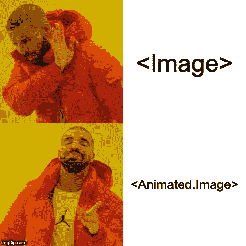
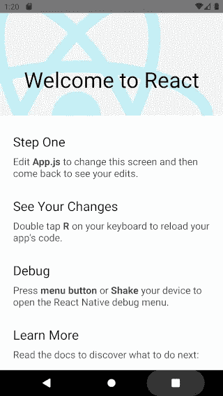
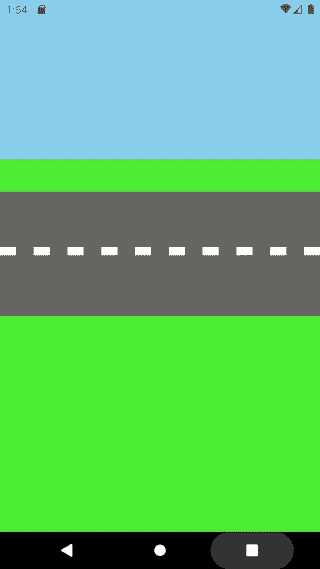
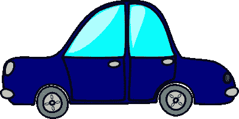
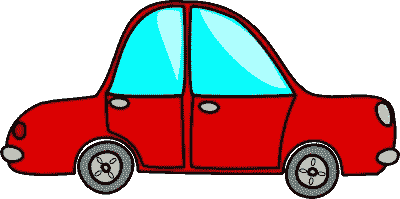
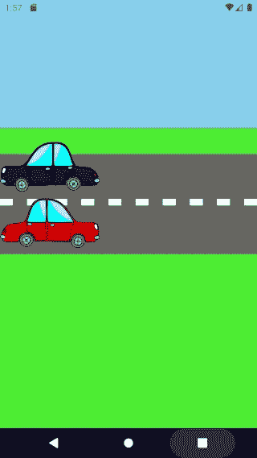

# 反应原生动画的第一步

> 原文：<https://itnext.io/the-first-step-into-react-native-animations-abb8b289ab50?source=collection_archive---------2----------------------->

## React 原生动画可以比你想象的简单！这第一个例子可能是你需要开始的

这篇文章是写给那些不熟悉 React 本地动画，但是对 JavaScript 和 React 有一定了解的人的。

当我第一次开始使用 React Native(RN)时，我甚至没有花时间去学习动画。如此多的事情可能看起来更重要，以至于有时你会忘记软件中更好的部分。其实动画挺重要的。一个好看的 app 甚至可能会有一些被忽略的瑕疵。

在你习惯了动画是如何工作的之后，在你的项目中添加一些动画会变得更加容易。在本文中，我们的目标是制作这个动画:

最终动画

这很简单，它将为您提供基础知识，让您的应用更上一层楼。让我们看看这个动画，看看它在 RN 中有多简单。

# 设置项目和初始绘图

让我们从头开始我们的项目。我们将在 react-native-cli 中运行`$ react-native-init animations`来启动我们的项目。这将为我们设置这个屏幕。

初始项目截图

第一步是创建一个简单的场景。去掉所有的模板代码，让你的屏幕只是一个空白页。

是时候添加天空、草地和道路了:

我们所知道的是:

有天空、道路和草地的截图

多好的场景啊！让我们将两张汽车图像添加到我们的项目中:

蓝色汽车

红色汽车

我已经将这些图片添加到一个名为“资源”的文件夹中，这个文件夹是我在根目录下创建的。现在我们应该将它们添加到代码中。默认情况下，RN 可以制作六个组件的动画:`<View>`、`<Text>`、`<Image>`、`<ScrollView>`、`<FlatList>`和`<SectionList>`、*。*对于本文，我们将使用`<Image>` 组件。但我们将使用动画版本`<Animated.Image>`，而不是简单版本，这样我们可以稍后使用魔法。我们的道路代码现在应该是这样的:

对于这些风格:

这是我们的基本图纸:

有风景和汽车的截图

# 添加运动

现在让我们弄清楚如何制作汽车动画。为此，我们将使用[反应钩子](https://reactjs.org/docs/hooks-intro.html)。这里你能做的最简单的动画是向右移动一辆车。我们首先将`useEffect`和`useState`添加到我们的 *React* 导入中，以跟踪动画(通过使用状态):

`import React, { Fragment, useEffect, useState } from 'react';`

现在我们必须添加一个变量来跟踪动画状态。这个变量将接收增量更新，从动画的 0%到 100%,根据我们将设置的持续时间。在我们的例子中，让我们在底部设置汽车的动画，这样它可以向右移动。我们将从`left: 0`出发前往`left: 100%`。下面是变量的声明:

`const [lowerCarLeft] = useState(new Animated.Value(0));`

正如您可能已经猜到的，函数`Animated.Value`用于声明将在动画中使用的值。存储在变量中的并不完全是值本身，而是一个解析为值的类似承诺的函数。这确保了事情将根据动画时间工作。

现在我们需要`useEffect`钩子。它确保动画仅在组件安装后开始。在这种情况下，这与使用`componentDidMount`(如果你有一个类组件)是一样的。在其中，我们将调用`Animated.timing`函数，它提供从一个值到另一个值的渐变。`Animated.timing()`将接收两个参数:

1.  要制作动画的值。在我们这里是`lowerCarLeft`*；*
2.  动画的配置。它是一个接受如下值的对象:duration(动画的长度)，easing(一个定义动画如何加速和停止的函数，更多关于 [Google Developers](https://developers.google.com/web/fundamentals/design-and-ux/animations/the-basics-of-easing) )和 delay(在动画被触发后真正开始之前需要经过多长时间)。

您现在不需要担心这种放松，因为`timing()`函数已经有了一个默认值。配置我们的动画后，我们可以发射它。只需将`start()`函数调用追加到`timing()`中。我们的代码将如下所示:

上面的代码在 2 秒钟(2000 毫秒)内逐渐增加变量`lowerCarLeft`，直到它达到值 100。

现在我们需要在我们的汽车风格中使用这个值。我们将动画下部汽车的左侧位置。随着左侧位置值的增加，汽车将向右移动。将`left: lowerCarLeft`添加到我们的样式属性中会得到这样的结果:

你会注意到汽车在移动，但它停在了错误的位置。由于被传递的值是一个没有单位的数字，RN 将其理解为 **px** ，这给了我们错误的结果。我们需要它的百分比。我们不是试图将汽车向右移动 100 个像素，而是百分之百的屏幕大小。请始终记住，使用 **px** 可能会破坏不同屏幕尺寸上的动画。

如果你试图在样式声明的末尾添加一个“%”，就像`left: lowerCarLeft+'%'`(或者其他变体)，你会发现它根本不起作用。这是因为，如前所述，这个变量本身并不存储值，而是一个类似 promise 的函数，它解析为正确的值。一个字符串不能像这样连接到一个函数上。

如果你试图直接将值动画化为字符串(改变变量声明和`timing()`中的`toValue`)，从“0%”到“100%”，也不会起作用。React Animated 不能为字符串制作动画，因为当你不处理数字时，你不可能知道从 0 点(开始)到点 100(结束)的路径是什么。

# 制作字符串动画

这个问题还是有办法解决的。我们称之为“[线性插补](https://www.freecodecamp.org/news/understanding-linear-interpolation-in-ui-animations-74701eb9957c/)”。此功能允许您将输入映射到不同的输出。在我们的例子中，我们将能够说:点 0 表示字符串“0%”，点 100 表示字符串“100%”。但可以是任何东西，比如点 0 代表字符串“0deg”，点 100 代表字符串“360deg”。您还可以映射到其他数值等等。

让我们来看看如何在 React 中进行[插值。您需要获取动画值并对其调用`interpolate()`函数，传递一个输入值数组和一个输出值数组:](https://facebook.github.io/react-native/docs/animations#interpolation)

这确切地意味着当`lowerCarLeft`在点 0 上时，函数`interpolate()`返回‘0%’。这也适用于任何其他点。

那么，我们需要替换图像中的`style`。我们会有这样的代码:

此时，下面的汽车应该已经设置了动画:

红色汽车动画

# 上层车厢

现在我们应该为上层汽车复制它，只是方向相反。汽车需要从左侧 100%起步，然后前进到 0%。你能胜任这项任务吗？

您可能会注意到的事情:

如果你试图改变插值`inputRange: [0, 100]`到`[100, 0]`，只是因为你也切换了从 100%开始到 0%结束的左边，它不会工作。请记住，在插值中，您不是指动画值。您指的是动画中的时间点。`[100, 0]`表示动画将向后播放；因此，插值方法不接受它。如果你坚持使用`[0, 100]`，它会知道在 0 点，应该返回值‘100% ’,在 100 点，应该返回值‘0%’。

此外，您会注意到上面的汽车结束动画时仍然出现在屏幕上，而下面的汽车消失了。只是造型的问题。为了防止这种情况，并可能获得更好的通量，让我们将上层车厢的终点和下层车厢的起点改为-50，而不是 0；

这是我们得到的结果:

两辆车都是动画

我们的动画看起来已经很酷了。它唯一缺少的是一个无限循环，所以汽车永远不会停下来。让我们一起努力。

# 无限循环

让我们来组织一下吧！我们需要从让动画一起运行开始，而不是分开运行。我们调用`start()`两次，每个动画调用一次，所以它们自己运行。我们需要让它们一起运行，只需要一次方法调用。 [React-Native Animated](https://facebook.github.io/react-native/docs/animated) 为此给我们提供了函数`parallel()`(这里还有其他函数)。你可以给它传递一个参数，这个参数是你想要制作动画的所有值的数组，然后在链上调用`start()`，这样它们就可以一起了。像这样:

这应该行得通。现在我们需要让它在结束后再次发生。这里的技巧是方法`start()`可以接收动画结束时执行的回调。此时，我们可以重复动画的代码，让它再次运行。与其复制粘贴同样的代码，不如创建一个分离这个逻辑的方法，这样就可以简单地调用它了。我是这样做的:

现在，在`start()`内部，我们只称之为`runAnimation()`:

没有错误，但它不工作。为什么？因为我们需要重置动画的值！

就是这样！现在它应该可以完美地工作了

动画完全工作

我们做到了！我们的动画完成了。

# 结论

这里有很大的改进空间。初始值和终值可以有一个常数，这样当你想改变时就不必搜索这些值了。此外，你可以使用`stagger()`(而不是`parallel()`)或者让它随机工作，让它不那么机器人化。也许能让车轮滚动起来？但是，这是下一次的素材。

快速回顾一下我们所看到的:

*   动画通常看起来比实际更复杂。你应该至少尝试一次，了解基本知识；
*   `Interpolate`将输入映射到不同的输出(用于制作字符串动画)；
*   `parallel()`是多个动画一起运行的方式；
*   `start()`方法接收所有动画完成时调用的回调(可用于创建无限动画)。

有了这些，你就已经有知识开始在你自己的应用程序上做一些小动画了。欢迎对本文的任何反馈！希望你喜欢。

图片取自[http://clipart-library.com/cartoon-car-images-free.html](http://clipart-library.com/cartoon-car-images-free.html)