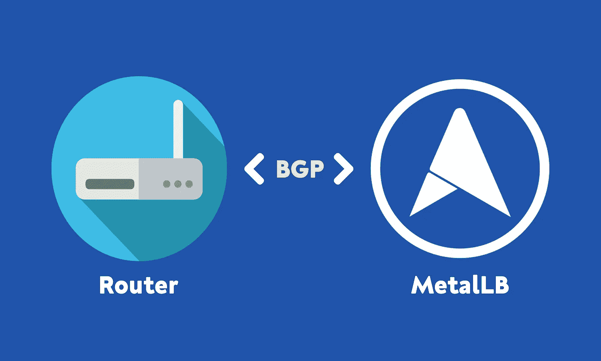
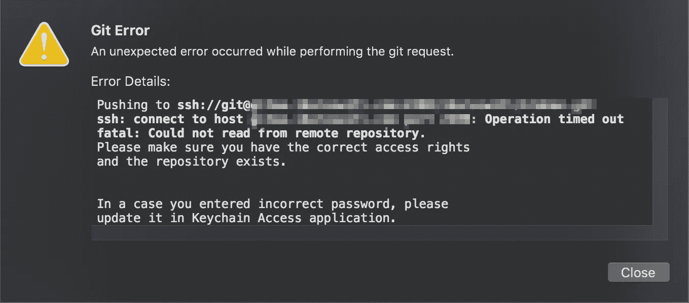
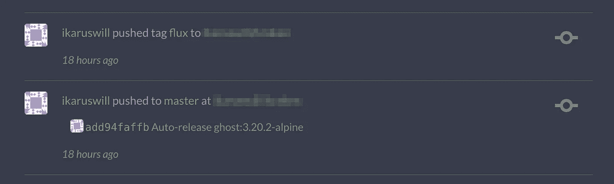
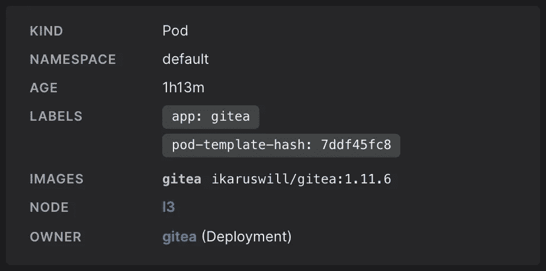
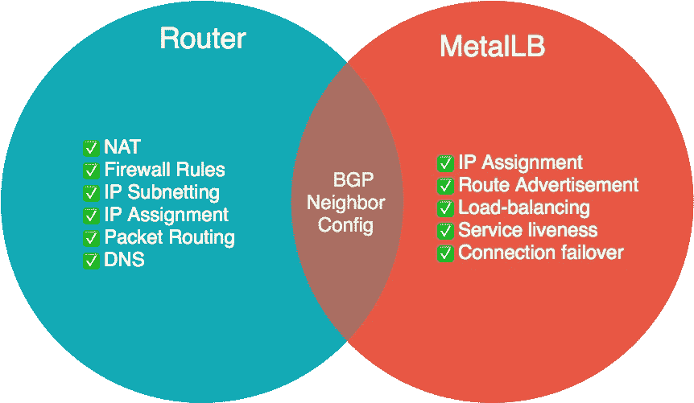

# MetalLB 中 BGP 负载均衡的缺陷

> 原文：<https://itnext.io/the-flaw-in-bgp-load-balancing-in-metallb-e4192fe839ba?source=collection_archive---------2----------------------->



*原载于*[*ikarus . SG*](https://ikarus.sg/bgp-load-balancing-metallb/)*2020 年 6 月 29 日*

我只是在我自己托管的 *Gitea* 服务器上提交，就像我每天晚上做的那样，但是这一次，有些事情发生了变化。我无法通过 Gitea 的公共 SSH 端点连接到 Gitea。



不，我没有更改我的存储库凭据

> 我想，服务一定又停止了，这只是我独自一人生活中的又一天。

但事实证明，web UI 是活跃的，事实上，它是如此活跃，以至于它的响应速度比平时更快。



等等什么？怎么会？为什么？

更有趣的是，我的 Kubernetes 连续部署服务最近在 18 小时前推送了容器映像更新，但好像我的 MacBook 的 Git 客户端的自动拉取在 26 小时前就停止了。那里显然有些不对劲。从互联网而不是集群内部进行 SSH 连接。

# 本地测试连接

命令行诊断证实了我的假设，即外部连接存在问题。

```
$ ssh -t git@myhiddengiteahost.com
ssh: connect to host myhiddengiteahost.com port 22: Operation timed out

$ ping leviathan3
PING leviathan3 (192.168.3.33): 56 data bytes
64 bytes from 192.168.3.33: icmp_seq=0 ttl=64 time=6.107 ms
64 bytes from 192.168.3.33: icmp_seq=1 ttl=64 time=4.827 ms
--- leviathan3 ping statistics ---
2 packets transmitted, 2 packets received, 0.0% packet loss
round-trip min/avg/max/stddev = 4.827/5.467/6.107/0.640 ms
```

通过域名到 Gitea 实例的 SSH 连接失败，尽管本地 pings 节点成功。

```
$ kubectl port-forward service/gitea 2200:22
Forwarding from 127.0.0.1:2200 -> 22
Forwarding from [::1]:2200 -> 22

$ ssh -t git@localhost -p 2200
The authenticity of host '[localhost]:2200 ([127.0.0.1]:2200)' can't be established.
ECDSA key fingerprint is SHA256:nThbg6kXUpJWGl7E1IGOCspRomTxdCARLviKw6E5SY8.
Are you sure you want to continue connecting (yes/no/[fingerprint])? yes
Warning: Permanently added '[localhost]:2200' (ECDSA) to the list of known hosts.
PTY allocation request failed on channel 0
```

SSH 通过 kubectl port-forward 直接连接到 Gitea pod 时工作良好

接下来的逻辑步骤是检查路由器和集群之间的连接。

# 下一个嫌疑犯


我对裸机 Kubernetes 集群使用了 [MetalLB](https://metallb.universe.tf/) ，这是一个使用标准路由协议的负载平衡器实现。具体来说，我在 BGP *(边界网关协议)*模式中使用 MetalLB，这是减少网络跳数和服务单元之间对称流量分配的推荐模式。

> ***边界网关协议****(****BGP****)是一种标准化的* [*外部网关协议*](https://en.wikipedia.org/wiki/Exterior_gateway_protocol) *旨在交换* [*路由*](https://en.wikipedia.org/wiki/Routing) *和* [*自治系统*](https://en.wikipedia.org/wiki/Autonomous_system_(Internet)) *(如* [上)(](https://en.wikipedia.org/wiki/Internet)[](https://en.wikipedia.org/wiki/Border_Gateway_Protocol)**)**

*在 BGP 模式下，MetalLB 与您的网络路由器建立 *BGP* 对等会话，以通告集群服务的 IP，以便路由器在它们之间实现负载平衡。*

*放大路由器通过 BGP 执行的负载平衡*

```
*$ configure
$ show ip bgp route
IP Route Table for VRF "default"
B    *> 192.168.30.1/32 [200/0] via 192.168.3.32, switch0, 00:02:28
     *>                 [200/0] via 192.168.3.31, switch0, 00:02:28
B    *> 192.168.30.20/32 [200/0] via 192.168.3.31, switch0, 00:03:05
B    *> 192.168.30.21/32 [200/0] via 192.168.3.31, switch0, 00:03:05
B    *> 192.168.30.53/32 [200/0] via 192.168.3.16, switch0, 00:02:38
     *>                  [200/0] via 192.168.3.13, switch0, 00:02:38
B    *> 192.168.30.254/32 [200/0] via 192.168.3.32, switch0, 00:02:10
     *>                   [200/0] via 192.168.3.15, switch0, 00:02:10*
```

*列出从路由器到集群的 BGP 路由，这里有两个明显的问题:*

1.  *在我的集群中， [Traefik](https://containo.us/traefik/) ，我的反向代理，有一个 LoadBalancerIP 为`192.168.30.1`，有 3 个副本，在 Leviathan 集群的每个节点上有一个。在上面的输出中，对应于*利维坦 1* 和*利维坦 2* 的下一跳 *(via)* 地址只有 2 个。但是*利维坦 3* @ `192.168.3.33`在哪里？*
2.  *我指定`192.168.3.22`作为我的 Gitea SSH 服务的负载平衡器 IP，但是它也在 BGP 路由列表中找不到。*

**

*奇怪的是，吉提亚被分配到利维坦 3*

*查看 Infra.app 发现了惊人的巧合。Gitea 也位于利维坦 3 上，这个节点似乎从 Traefik 的 BGP 路由列表中消失了。*

> *说到基础设施，没有所谓的巧合，尤其是遇到问题的时候。*

# *BGP 负载平衡的错误*

*在 EdgeRouter CLI 上的快速检查证实了我的怀疑。*

```
*$ show protocols bgp
 bgp 64512 {
     maximum-paths {
         ibgp 32
     }
     neighbor 192.168.3.11 {
         remote-as 64512
     }
     neighbor 192.168.3.12 {
         remote-as 64512
     }
     neighbor 192.168.3.13 {
         remote-as 64512
     }
     neighbor 192.168.3.14 {
         remote-as 64512
     }
     neighbor 192.168.3.15 {
         remote-as 64512
     }
     neighbor 192.168.3.16 {
         remote-as 64512
     }
     neighbor 192.168.3.17 {
         remote-as 64512
     }
     neighbor 192.168.3.31 {
         remote-as 64512
     }
     neighbor 192.168.3.32 {
         remote-as 64512
     }
     parameters {
         router-id 192.168.3.1
     }
 }*
```

*利维坦 3 @ 192.168.3.33 很方便地从 BGP 邻居列表中消失了！*

*回头参考我在 *EdgeRouter X* 上设置 BGP 负载平衡时遵循的[指南](https://medium.com/@ipuustin/using-metallb-as-kubernetes-load-balancer-with-ubiquiti-edgerouter-7ff680e9dca3)，我搜索了我可以遵循的可能的调试步骤。就在那时，我意识到我犯了一个巨大的错误。*

*两个月前，我**错过了**一个关键的配置步骤**，当时我将利维坦 3 添加到集群中。***

> **我没有在路由器上添加 leviathan3 作为 BGP 邻居。**

```
*$ set protocols bgp 64512 neighbor 192.168.3.33 remote-as 64512*
```

*缺失的命令*

```
*$ kubectl get nodes l3
NAME   STATUS   ROLES    AGE   VERSION
l3     Ready    worker   59d   v1.17.6+k3s1*
```

*这个错误发生在 59 天前*

*所有这些意味着利维坦 3 运行了**整整 59 天**但是**没有外部流量可以到达它。**它基本上不接受任何 web 流量，当然也不会卸载其他 2 个 Traefik 实例。如果 leviathan3 不知何故成为了 leviathan 集群中的最后一个节点，我的 Traefik 实例就分布在这个集群中，这将意味着我所有的 web 服务都将中断，**包括这个博客**。*

> *一想到它是如何从裂缝中溜走，而我整整 59 天都没有发现，我就害怕。*

# *这是怎么发生的？*

*我不会找借口，也不会否认这是由于我自己的疏忽造成的，但这在很大程度上是由于在裸机 Kubernetes 集群中使用 MetalLB 的 BGP 模式时的一个**配置存储设计问题**。*

*管理 Kubernetes 集群连接配置的路由器是违反关注点分离的一个例子。*

> **在计算机科学中，* ***关注点分离****(****SoC****)是一种将计算机程序分成不同部分的设计原则，使得每个部分处理一个单独的* [*关注点*](https://en.wikipedia.org/wiki/Concern_(computer_science)) *。关注点是影响计算机程序代码的一组信息。(* [*【维基百科】*](https://en.wikipedia.org/wiki/Separation_of_concerns) *)**

*路由器应该只关心它管理的子网中的**设备** ( [第 4 层](https://en.wikipedia.org/wiki/Transport_layer))的可达性，这是 BGP 的设计目的。然而，在 MetalLB 的 BGP 模式中，它**使用 BGP 作为应用感知协议**，要求路由器**了解 Kubernetes 运行在** ( [第 7 层](https://en.wikipedia.org/wiki/Application_layer))上的所有节点。*

**

*路由器必须知道哪些节点运行 Kubernetes*

*因此，在为 Kubernetes 提供新机器时，不仅要在路由器上为机器配置静态 IP 和静态 DNS，还要在安装 Kubernetes 之前在路由器上将新机器设置为 BGP 邻居。*

# *现在怎么办？*

*不幸的是，对于裸机系统上 Kubernetes 负载平衡器的当前状态，我们几乎无能为力。*

> *权力越大，责任越大。*

*这就是处于应用程序部署前沿的力量和兴奋所带来的代价；一切都在不断发展。*

*有些人可能会强调 MetalLB 中第 2 层模式的存在作为一种替代，但我个人不敢苟同，因为我甚至不会称之为负载平衡，而更多的是故障转移。这是因为在第 2 层模式中，流量不是均匀分布在所有应用实例上，而是只分布到*领导者选举的节点*，直到它由于中断或其他原因不再是领导者。*

> **…在第 2 层模式中，单个领导者选举的节点接收服务 IP 的所有流量。这意味着您的服务的入口带宽仅限于单个节点的带宽。(* [*金属 LB*](https://metallb.universe.tf/concepts/layer2/) *)**

*在 MetalLB 的辩护中，他们在使 Kubernetes 负载平衡器民主化方面做得很好，实现了无需云负载平衡器的本地设置，而 Kubernetes 拥有强大的本地支持。不幸的是，对于本地 Kubernetes 服务负载平衡，既没有本地支持，目前也没有清晰的解决方案。*

*我们现在能做的也许只是提高社区对这一缺失部分的认识，并报告问题，为 MetalLB 的发展做出贡献。希望通过社区的集体智慧，我们可以很快找到解决办法。*

**原载于 2020 年 6 月 29 日*[*ikarus . SG*](https://ikarus.sg/bgp-load-balancing-metallb/)*。**