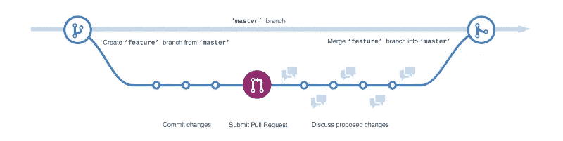

# GitHub 开发工作流程

> 原文：<https://itnext.io/the-github-development-workflow-fb48d9bb63f9?source=collection_archive---------0----------------------->

GitHub 是一个用于版本控制和协作的代码托管平台。它是围绕 Git 设计的，Git 是一个跟踪软件代码变化的系统。它让你和其他人在任何地方一起工作。在本文中，我们将看看 GitHub 开发工作流程的关键概念。包括使用存储库、分支、分叉、提交、拉请求和合并。我们开始吧！

🤓*想与 web dev 保持同步吗？*
🚀想要将最新消息直接发送到您的收件箱吗？
🎉加入一个不断壮大的设计师&开发者社区！

**在这里订阅我的简讯→**[**https://ease out . EO . page**](https://easeout.eo.page/)

## 什么是版本控制？

版本控制是一个帮助开发人员跟踪和管理软件项目代码变更的系统。随着项目的增长，对版本控制的需求变得至关重要——尤其是在协作项目中。我们可以通过使用所谓的**分支**和**合并**来安全地工作。

**分支**允许我们复制我们的源代码(又名“存储库”)，所以我们可以安全地进行更改，而不会影响整个项目。一旦变更被审查并被同意，我们**将我们的分支合并到主代码中以更新我们的官方代码。如果发现任何错误，我们可以选择恢复到原始代码，因为我们的更改已经被跟踪。**

## Git 是什么？

Git 和 Github 不是同义词！Git 是一个特定的开源版本控制系统，由 Linus Torvalds 于 2005 年创建。这个程序实际上跟踪你的变更，并确保整个代码库在每个开发者的计算机上都是可用的。然而，GitHub 只是托管您的存储库(以及提供一些额外的功能)。

# 基本面

我们开始吧！如果你还没有注册 GitHub 账户，请点击[这里注册](https://github.com/join)。

## 创建存储库

GitHub **存储库**(或“repo”)可以被认为是项目的根文件夹。它包含您的所有项目文件，并使您能够访问每个文件的修订历史。如果您在团队中工作，您可以让其他人访问您的存储库以进行项目协作。

让我们创建我们的第一个存储库！确保您已登录 GitHub，然后:

1.  在右上角，点击设置`+`图标&然后新建存储库
2.  为您的存储库命名
3.  如果愿意，可以添加描述
4.  在创建公共或私有存储库之间进行选择(任何一个都可以)
5.  选择用自述文件初始化此存储库(例如，“我的第一个存储库！”)
6.  单击创建存储库！
7.  将文件添加到您的存储库中—我们只是在测试，所以您添加什么并不重要。例如，找到一个 HTML 文件，并通过 Upload files 按钮将其添加到您的存储库中。

## 制造问题

**问题**是我们如何跟踪项目中的任务、增强和缺陷。它们应该在您的团队中共享，以便于讨论和管理任务委派。如果您在其他人管理的项目中打开了一个问题，它将保持打开状态，直到您关闭它(例如，如果您发现了问题)或回购负责人关闭它。当你提出一个问题时，一定要清楚地解释手头的任务。让我们在存储库中创建一个问题:

1.  在存储库中，选择“问题”选项卡
2.  点击“新问题”按钮
3.  将您的问题命名为“设置 GitHub 页面”
4.  给出清晰的描述，例如“需要在此存储库中设置 GitHub 页面”
5.  单击提交新问题

**分配问题**

我们需要**分配**个问题，这样我们的团队成员就知道处理这个任务是谁的工作了！

*   在屏幕右侧的“被分配人”部分，单击设置图标并选择您自己

让我们解决我们的第一个问题！我们想要*设置 GitHub 页面*。你可以在这里阅读 GitHub 页面。但现在，我们的重点是完成任务:

1.  单击存储库中的设置选项卡
2.  向下滚动到“GitHub 页面”部分
3.  从“源”下拉列表中，选择主分支
4.  单击保存

**关闭问题**

现在您已经完成了任务—您可以继续并关闭它了！你可以在 GitHub 上删除一个问题，但是关闭它会告诉你的团队成员任务已经完成。要关闭:

*   打开已完成的问题，然后单击“关闭问题”

## **GitHub 流程**

现在我们知道了如何处理问题，是时候看看 **GitHub 流程**了。简单地说，这是一个工作流程，我们可以安全地尝试新的想法，而没有危及我们项目的风险。这主要通过使用**分支**来实现。

[GitHub 流程](https://guides.github.com/introduction/flow/)

默认情况下，我们的项目存在于主分支中——对主分支的任何更改都将直接更新到我们的项目中(如果您没有正确地检查您的更改，这可能会很危险！).

当我们想要试验一个新的特性，或者甚至修复一个问题时，我们在项目上创建一个新的**分支**。分支最初将是主分支的副本，现在当您进行更改时，它们将仅反映在分支上。

在进行变更的时候，你将**提交**变更到你的分支。当您对更改完成感到满意时，就该打开一个 **pull 请求了。从这里开始，你的团队将讨论并进一步完善项目变更。一旦变更被批准，分支将被**合并**到**主分支**上。现在让我们来看一个这个过程的例子！**

**创建分支**

1.  打开您的存储库并单击 Code 选项卡
2.  点击下拉菜单中的`Branch: master`
3.  在字段中，输入分支机构的名称(例如“开发”)
4.  单击创建分支

现在您已经创建了一个分支，您可以修改您的项目，而不需要改变部署的`master`分支。

*关于 forks 的说明—* 一个 **fork** 与一个分支不同，它允许你**克隆**自己账户中的另一个回购。它本质上允许你在以前项目的基础上开始一个新项目。

**提交文件**

现在我们可以安全地在我们的分支中工作了，让我们创建一个文件并进行第一次提交。

1.  做个编辑(什么都行！只需在代码中添加一个简单的注释)添加到您之前添加到存储库中的一个文件中
2.  给提交一个名称和描述
3.  确保您新创建的(开发)分支被选中
4.  单击提交更改

你已经犯了你的第一个错误！下一步是通过拉取请求与您的团队分享变更。

**打开拉取请求**

拉式请求是我们与我们的团队分享我们提议的项目变更——目的是在将变更应用到`master`分支之前讨论和修改它们。

1.  打开“拉式请求”选项卡，然后单击“新建拉式请求”
2.  在 *base:* 下拉菜单中，确保选择了 *master* branch
3.  在*比较:*下拉菜单中，选择您之前创建的*开发*分支
4.  单击创建拉式请求
5.  现在为您的拉取请求输入一个标题，例如“添加我的更改”
6.  添加对所做更改的准确描述
7.  单击创建拉式请求！

您的团队成员现在能够讨论和审阅您提议的变更。一旦每个人都满意了，变更被批准了——是时候合并到`master.`了

注意:如果您派生了一个 repo 并进行更改，您也可以创建一个 pull 请求来合并您的更改。

**合并拉取请求**

1.  在您的提取请求中，单击合并提取请求
2.  单击确认合并
3.  一旦你的分公司被合并，你就不再需要它了。您可以单击删除分支

***你准备好让你的 CSS 技能更上一层楼了吗？*** *现在就开始用我的新电子书:*[*《CSS 指南:现代 CSS 完全指南*](https://gum.co/the-css-guide) *。获取从 Flexbox & Grid 等核心概念到动画、架构等更高级主题的最新信息！！*

*现已上市！👉*[gum.co/the-css-guide](https://gum.co/the-css-guide)

# 结论

就是这样！您已经学习了如何使用 GitHub 在项目中进行协作。GitHub 是一个很好的工具！现在，您可以创建存储库和问题，创建分支，派生项目并提交，提交 pull 请求以供审查，并合并到主分支。还不错！

我希望这篇文章对你有用！你可以在 Medium 上[关注我](https://medium.com/@timothyrobards)。我也在[推特](https://twitter.com/easeoutco)上。欢迎在下面的评论中留下任何问题。我很乐意帮忙！

# 关于我的一点点..

嘿，我是提姆！👋我是一名开发人员、技术作家和作家。如果你想看我所有的教程，可以在我的个人博客上找到。

我目前正在撰写我的[自由职业完整指南](http://www.easeout.co/freelance)。坏消息是它还不可用！但是如果这是你可能感兴趣的东西，你可以[注册，当它可用的时候会通知你👍](https://easeout.eo.page/news)

感谢阅读🎉