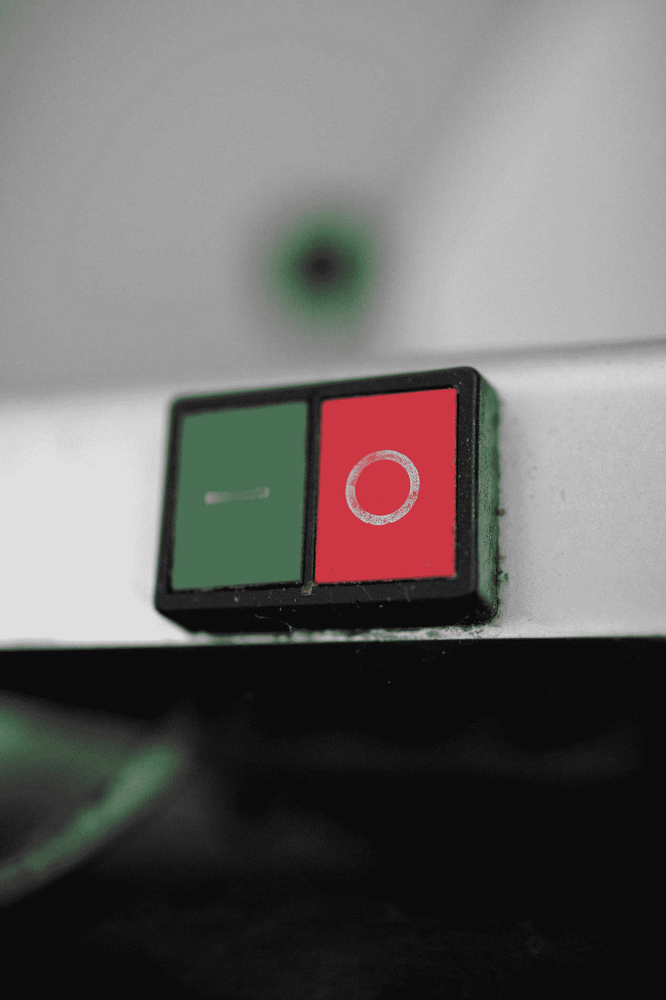

# Web 组件自定义状态的隐藏功能

> 原文：<https://itnext.io/the-hidden-power-of-custom-states-for-web-components-dcae5b048e20?source=collection_archive---------1----------------------->

定制元素发展的关键一步



照片由 [Justus Menke](https://unsplash.com/@justusmenke?utm_source=medium&utm_medium=referral) 在 [Unsplash](https://unsplash.com?utm_source=medium&utm_medium=referral) 上拍摄

在我以前的文章“ [Web 组件现在可以是原生表单元素](https://javascript.plainenglish.io/web-components-can-now-be-native-form-elements-107c7a93386)和“[Web 组件的原生表单验证](/native-form-validation-of-web-components-a599e85176c7)”中，我提到了使定制元素与表单相关联的`ElementInternals`属性。

该接口还使开发人员能够将自定义状态与自定义元素相关联，并基于这些状态来设计它们的样式。

`ElementInternals`的`states`属性返回一个`CustomStateSet`，它存储了一个定制元素的可能状态列表，并允许在该列表中添加和删除状态。

集合中的每个状态都由一个与 CSS 自定义属性形式相同的字符串表示，即`--mystate`。

然后，可以使用自定义状态伪类从 CSS 中访问这些状态，就像访问内置状态一样。

例如，可以使用内置的`:checked`伪类从 CSS 访问选中的复选框:

```
input[type=”checkbox”]:checked {
 outline: solid green;
} 
```

另一个例子是禁用的`button`，可以使用`:disabled`伪类从 CSS 中访问它:

```
button:disabled {
 cursor: not-allowed;
}
```

同样，包含自定义状态`--mystate`的元素可以从 CSS 中访问，如下所示:

```
my-element:--mystate {
 color: red;
}
```

# 自定义状态的用例

自定义状态解锁了一个强大的功能。

它们使 Web 组件能够基于内部状态进行样式化，而不必向组件添加属性或类来反映这些状态，因此它们完全是内部的。

例如，假设您有一个显示播放视频的播放按钮的`<video-player>`组件。

当单击播放按钮并且视频开始播放时，您希望隐藏播放按钮并显示暂停按钮。

然后，当点击暂停按钮时，它将被隐藏，播放按钮将再次显示。

一个简单的方法是引入一个`playing`属性，并将其反射到一个`playing`属性，并使用`:host`伪类来显示和隐藏按钮:

```
class VideoPlayer extends HTMLElement {

  constructor() {
    super();

    const shadowRoot = this.attachShadow({mode: 'open'});

    shadowRoot.innerHTML = `
      <style>
        :host {
          display: block;
          width: 300px;
          height: 300px;
          border: 2px solid red;
          display: flex;
          justify-content: center;
          align-items: center;
          background-color: transparent;
        }

        #pause {
          display: none;
        }

        :host([playing]) #play {
          display: none;
        }

        :host([playing]) #pause {
          display: block;
        }
      </style>

      <button id="play" type="button">Play</button>
      <button id="pause" type="button">Pause</button
    `;
  }

  connectedCallback() {
    const playButton = this.shadowRoot.querySelector('#play');
    const pauseButton = this.shadowRoot.querySelector('#pause');

    playButton.addEventListener('click', () => {
      this.playing = true;
    });

    pauseButton.addEventListener('click', () => {
      this.playing = false;
    });
  }

  get playing() {
    return this.hasAttribute('playing');
  }

  set playing(isPlaying) {
    if(isPlaying) {
      this.setAttribute('playing', '');
    }
    else {
      this.removeAttribute('playing');
    }
  }
}
```

默认情况下，将显示播放按钮。已经为`playing`属性定义了一个 setter，它或者设置或者删除`playing`属性，CSS 规则使用`:host`伪类来显示和隐藏按钮。

下面是一个工作示例:

使用属性设置样式

虽然这样做很好，但是这种实现有一个潜在的问题。

像这样将内部属性公开为属性可能并不总是可取的，并且会破坏封装。

在这种情况下，暴露一个`playing`属性可能不是一个坏主意，但它确实给用户通过添加属性来手动设置组件处于`playing`状态的能力，但它实际上不会开始播放视频。

公开这个属性甚至会提高人们的期望，即只需添加`playing`属性就可以播放视频。

事实上，添加一个属性来将 Web 组件置于某种状态并不能真正将其置于该状态，因为它并没有设置相应的*属性:*仅仅添加`playing`属性并不会将`playing`属性设置为`true`。

虽然在这种情况下，它可能不会造成真正的伤害，但总会有公开内部属性不是一个好主意的情况。

这是自定义状态的一个完美用例:没有属性会被暴露，但是组件仍然可以基于这些状态使用 CSS 进行样式化。

# 添加和移除自定义状态

如上所述，所有定制状态都存储在一个`CustomStateSet`对象中，该对象存储在`ElementInternals`接口的`states`属性中。

它有方法`add`和`delete`来添加和删除状态，还有方法`has`来检查元素是否有特定的状态。

其他值得注意的方法有`clear`清除所有状态和`forEach`迭代元素的所有状态:

```
// attach the internals
this.internals = this.attachInternals();

// add states
this.internals.states.add('--foo');
this.internals.states.add('--bar');

// iterate over states
this.internals.states.forEach(state => {
 console.log(state); // foo bar
});

// remove states
this.internals.states.delete('--bar');

// check for existence of states
this.internals.states.has('--foo'); // true
this.internals.states.has('--bar'); // false
```

当您试图添加一个不以`--`开头的状态时，将会抛出一个错误:

```
this.internals = this.attachInternals();
this.internals.states.add('foo'); // error, does not start with '--'
```

为了使前面的示例能够处理自定义状态，将“playing”属性的 getter 和 setter 更改为处理这些状态:

```
get playing() {
  return this.internals.states.has('--playing');
}

set playing(isPlaying) {
  if(isPlaying) {
    this.internals.states.add('--playing');
  }
  else {
    this.internals.states.delete('--playing');
  }
}
```

并且`:host()`伪类现在使用`--playing`选择器而不是`[playing]`:

```
host(:--playing) #play {
  display: none;
}

:host(:--playing) #pause {
  display: block;
}
```

虽然这确保了没有内部属性被公开为属性，但是消费者仍然可以通过`internals`属性访问`states`，并通过调用`add`和`delete`方法来添加或移除状态:

```
const player = document.querySelector('video-player');
player.internals.states.add('--playing');
```

更糟糕的是，消费者可以直接调用`playing`的 setter 来改变内部状态。

您可以通过在 getter 和 setter 以及`internals`属性前面加上前缀`#`使它们私有来解决这个问题:

```
// internals is now private
this.#internals = this.attachInternals();

get #playing() {
  return this.#internals.states.has('--playing');
}

set #playing(isPlaying) {
  if(isPlaying) {
    this.#internals.states.add('--playing');
  }
  else {
    this.#internals.states.delete('--playing');
  }
}
```

为私有属性编写一个 getter 和 setter 对可能感觉违背直觉，但这实际上是可行的。

即使`playing`定义了 getter 和 setter，它仍然是私有的，只能从类内部访问。

给它赋值将调用 setter，读取它的值将调用 getter。

以下是完整的代码:

```
class VideoPlayer extends HTMLElement {
  #internals;  // class field needed for private property

  constructor() {
    super();

    const shadowRoot = this.attachShadow({mode: 'open'});

    this.#internals = this.attachInternals();

    shadowRoot.innerHTML = `
      <style>
        :host {
          width: 300px;
          height: 300px;
          border: 2px solid red;
          display: flex;
          justify-content: center;
          align-items: center;
          background-color: transparent;
        }

        #pause {
          display: none;
        }

        :host(:--playing) #play {
          display: none;
        }

        :host(:--playing) #pause {
          display: block;
        }
      </style>

      <button id="play" type="button">Play</button>
      <button id="pause" type="button">Pause</button
    `;
  }

  connectedCallback() {
    const playButton = this.shadowRoot.querySelector('#play');
    const pauseButton = this.shadowRoot.querySelector('#pause');

    playButton.addEventListener('click', () => {
      this.#playing = true;
    });

    pauseButton.addEventListener('click', () => {
      this.#playing = false;
    });
  }

  get #playing() {
    return this.#internals.states.has('--playing');
  }

  set #playing(isPlaying) {
    if(isPlaying) {
      this.#internals.states.add('--playing')
    }
    else {
      this.#internals.states.delete('--playing');
    }
  }
}
```

这里有一个工作示例，在编写本文时，它只能在 Chrome 90+上运行:

使用自定义状态设置样式

这些例子展示了如何使用`:host`伪类，基于来自组件内*的定制状态来设计定制元素的样式。*

自定义元素也可以基于自定义状态从外部的*进行样式化。*

该样式与基于内置状态的样式组件具有相同的形式，如`:checked`和`:hover`:

```
video-player:--playing {
  border: 1px solid red;
}
```

当从内部和外部为同一 CSS 属性定义基于自定义状态的样式时，在外部定义的样式优先。

在下面的例子中，当组件处于`--playing`自定义状态时，它将获得一个绿色边框。

组件内为`--playing`状态定义的蓝色边框将被覆盖:

```
// styling defined outside the component
// this will have precedence so the component will get a green border
video-player:--playing {
  border: 2px solid green;
}

// styling defined inside the component
// this will be overwritten by the styling defined outside of it
:host(:--playing) {
  border: 2px solid blue;
}
```

# 结论

自定义状态是 Web 组件发展过程中的关键一步。

它们支持组件的样式化，而不必添加类或属性，这允许组件的状态保持只读，因此它永远不会被外部操纵。

对`ElementInternals`的支持尚未登陆 Safari，但已经在 Safari 技术预览版中部分实现。

在 Twitter 上关注我，在那里我写了现代网络能做什么，PWAs，和网络组件。