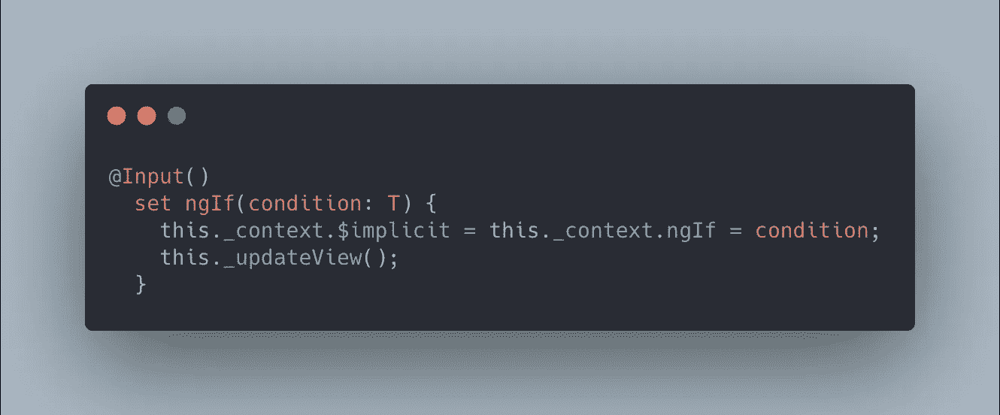
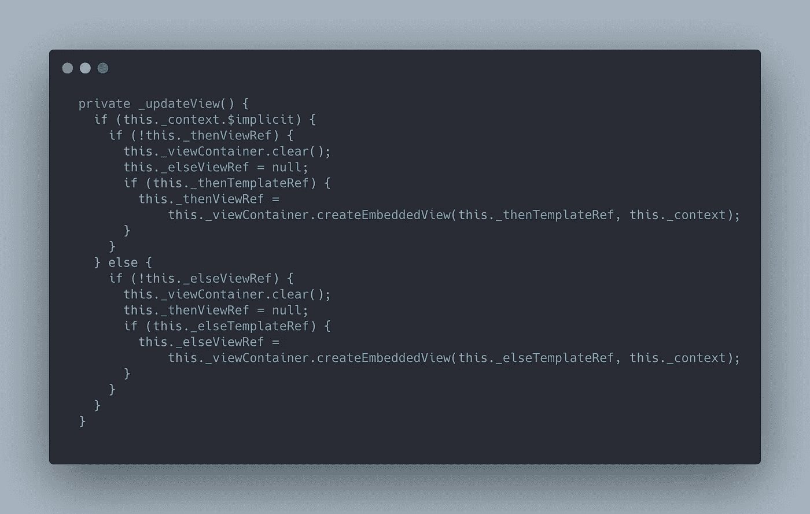
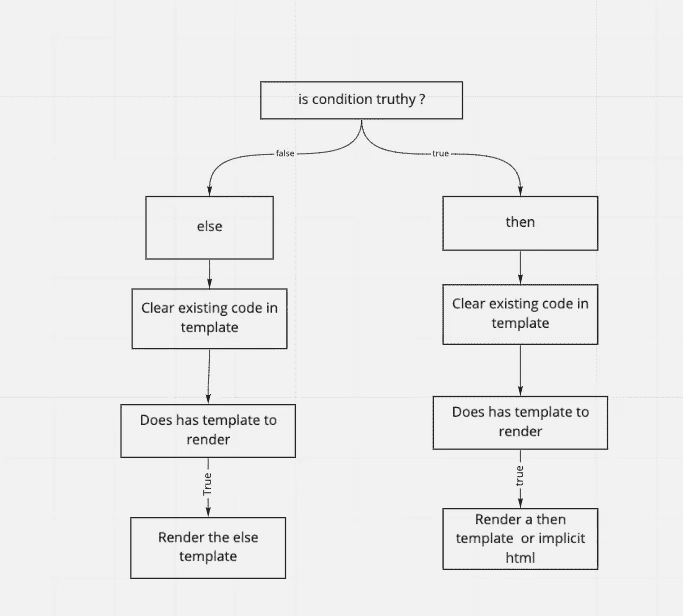
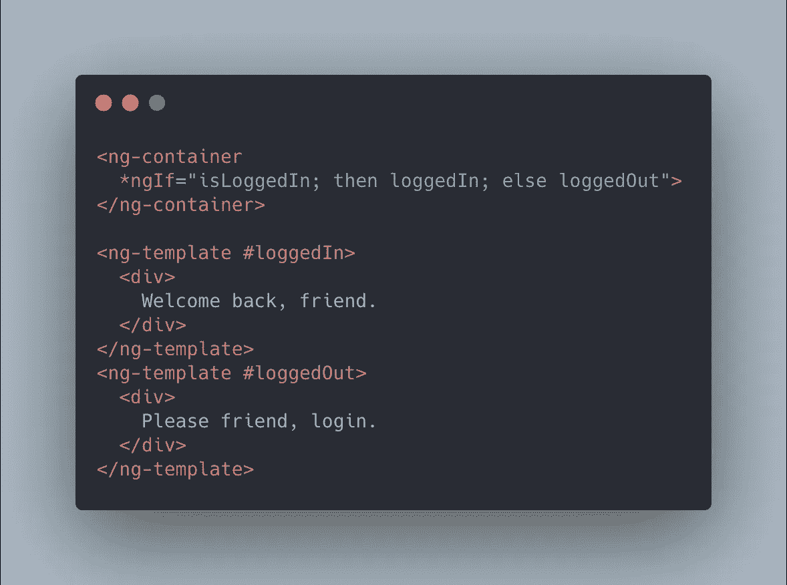

# Angular-*ngIf 的来龙去脉

> 原文：<https://itnext.io/the-in-and-outs-of-angular-ngif-2bc3ca7bc0fe?source=collection_archive---------6----------------------->

这是我在“Angular 的来龙去脉”系列中的第一篇文章。今天我们将讨论结构指令*ngIf

尽管我们都知道如何使用*ngIf/[ngIf]让我们花点时间来回顾一下 Angular 对它的定义，
" *一个结构化的指令，它有条件地包含一个基于强制为布尔值的表达式的值的模板。* "
所以从根本上来说，ngIf 是一个简单的指令，它将**通过条件值在运行时呈现**。那么这在实际运行时是如何工作的呢？


ngIf 的基本实现

ngIf 实际上是一个 setter ( [link](https://www.typescripttutorial.net/typescript-tutorial/typescript-getters-setters/) )。一旦一个新的值被发送到 setter 中，它将开始检查是否需要呈现 html 元素，通过使用 setter 而不是 ngOnChanges angular 可以获得更精确和更不容易出错的代码。仅在 ngIf 条件的值改变时运行功能。



一旦一个新值被发送到 ngIf，它将运行 _updateView 函数

在 ngIf 指令中，最重要的函数是 _updateView()
每个@Input()都会发出这个函数。那么 ngIf 如何决定呈现 html 呢？



如果条件是真值(！！value ),它将首先清除视图中的任何现有代码，如果有要呈现的模板，它将呈现它，请参见下面的图表，以获得上面代码的更直观的解释



当 ngIf 决定呈现我们的 html 时，它使用 **ViewContainerRef** ，它表示一个可以附加多个组件的容器，并且知道它在 DOM 树中的位置(这就是为什么它在正确的位置而不是随机地在页面上呈现它)。
ViewContainerRef 的 createEmbeddedView 函数将相关模板和 ngIf 的上下文作为参数，并将模板/代码呈现到页面中所需的空间和位置。并且如果需要的话，显然会贯穿其组件的生命周期。

需要注意的事项:

1.如果没有给 ngIf 一个特定的模板，它将使用它所在的代码块。

```
<div *ngIf="condition"> hello world </div>
```

ngIf 将使用 div 元素作为模板(这是我们通常使用的方式)

2.您可以显式地使用两个不同的模板，一个用于 then，另一个用于 else



当对 ngIf 的 **then** 值使用一个模板时，它将断言它是一个有效的模板，如果不是，它将抛出一个错误。

3.每当一个类组件作为 ngIf 条件的结果被呈现时，它将自己重置并运行组件生命周期，如 onInit。所以要确保没有内存泄漏。