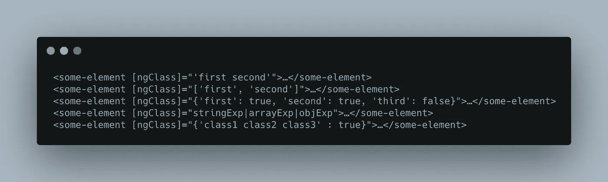
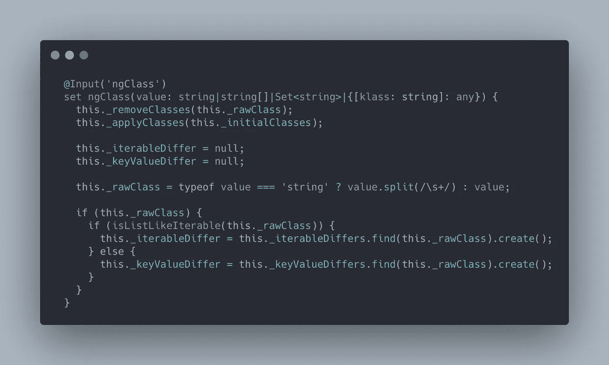
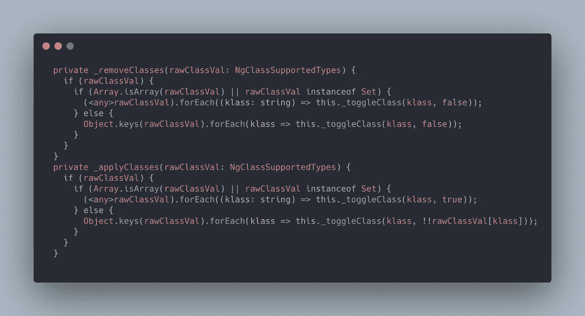
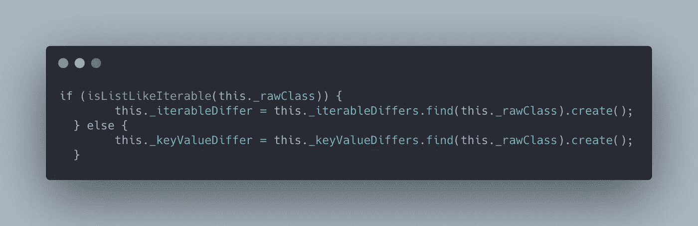
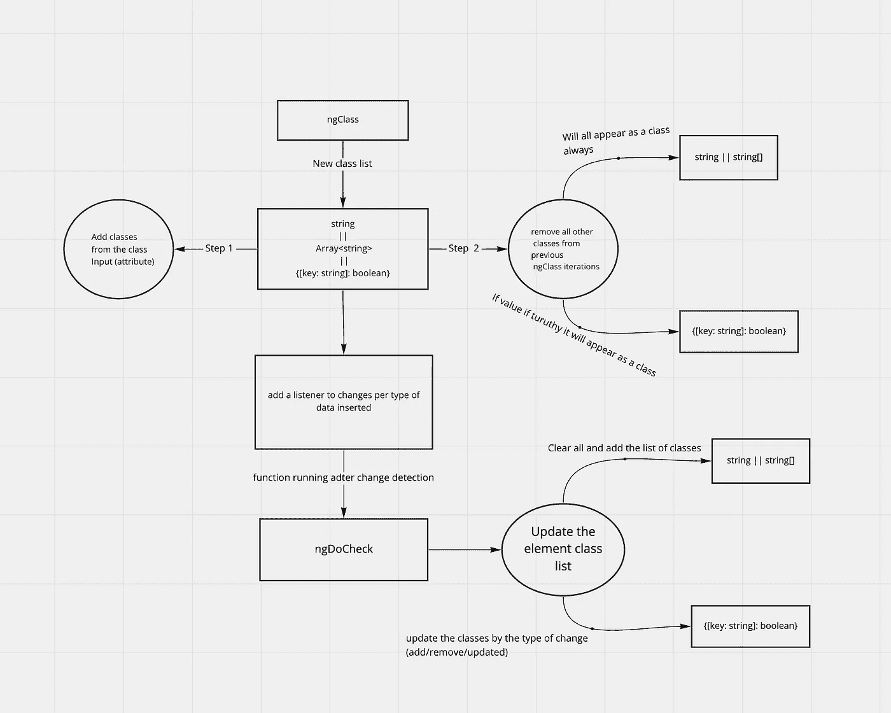

# Angular 的来龙去脉— [ngClass]

> 原文：<https://itnext.io/the-ins-and-outs-of-angular-ngclass-6eeaa01a2013?source=collection_archive---------3----------------------->

今天我将深入研究另一个常用的角度指令，叫做 NgClass，和其他指令一样(ngIf，ngFor，和 ngStyle)，我们使用它们的时候不会去想在引擎盖下有什么黑魔法。我们去看看。

传递给 ngClass 指令的所有有效选项

类似于 [ngIf](/the-in-and-outs-of-angular-ngif-2bc3ca7bc0fe?source=your_stories_page-------------------------------------) 和 [ngFor](/the-ins-and-outs-of-angular-ngfor-88fece4b319c) 的 ngClass 实际上是一个 setter，它接受给它的数据，并在 ElementRef(对我们当前所在的 HTML 元素的引用)和 Renderer2(用于 DOM 操作的浏览器 API 函数的包装器)的帮助下，开始为它所在的元素构建类列表。

NgClass 设置器

ngClass 函数的第一步是删除任何现有的类，这些类可能是从指令的前一次数据迭代中设置的，并分配 Class 属性下的“初始”类。当使用 *ngClass 时，Class 属性不再是我们从普通 JS 中知道的属性，而是一个输入，是 ngClass 指令的一部分。* 我们可以在代码中看到术语“klass”的用法。它是对原始类属性的引用，原始类属性可以有一个作为类的字符串列表

删除和添加类

移除和添加类本质上是相同的逻辑，它遍历字符串或对象的数组，从 HTML 元素中添加或移除适当的类。(很多冗余代码，在我看来，构建一个 praser 来统一字符串到对象的原理图会使它更整洁)。
注意，Angular 尽最大努力通过类型检查来保证我们的 UI 安全，例如，检查 isArray 或者是 Set 的实例。Angular 不会让任何事情碰运气。 ***即使多余也是显而易见的。***

函数 _toggleClass 非常简单，它接收类字符串和一个布尔值，该值指示它应该打开还是关闭(即通过另一个 Angular black magic 类 Renderer2 删除或添加类)。

在删除和添加更新的类之后，我们的指令还做了一件事，在相应的变量中添加一个侦听器，以查看是否发生了变化。或者更准确地说，发生了什么变化(添加/删除/更新)。

_rawClass =我们作为参数传递给[ngClass]的类

完成所有设置后，该指令使用一个名为 ngDoCheck(实现 DoCheck)的指令生命周期函数。每当我们的 Angular 应用程序运行其变化检测机制时，ngDoCheck 就会运行。当 ngDoCheck 运行时，它验证它自己的内部变化。如果与前一次迭代相比有变化，ngClass 会用新的类列表或给定的对象正确地更新元素的类。

正如我们所看到的，该指令做了许多“棘手”的事情来保护我们的代码，但同时也为我们提供了不改变我们编写代码方式的能力。事实上，当 ngClass 出现时，Class 属性不再是一个属性，而是一个角度输入，非常智能和直观。

下面是一个流程图，用简单的术语展示了在 ngClass 指令中发生了什么。

ngClass 流程图

下一个——角度路由器。如果你想让我在 Angular 上看一些其他的主题，请联系我。