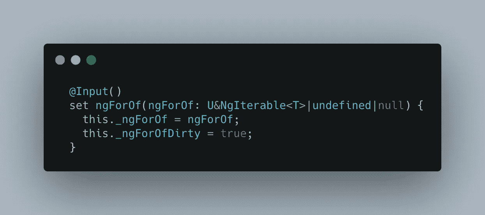
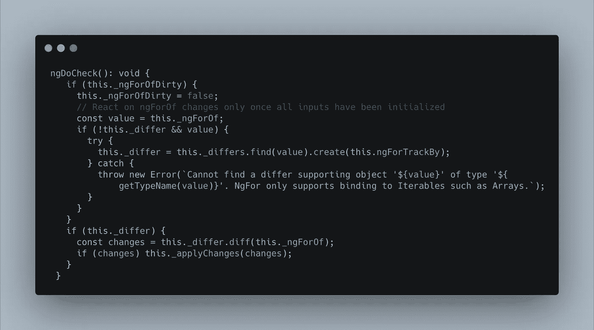
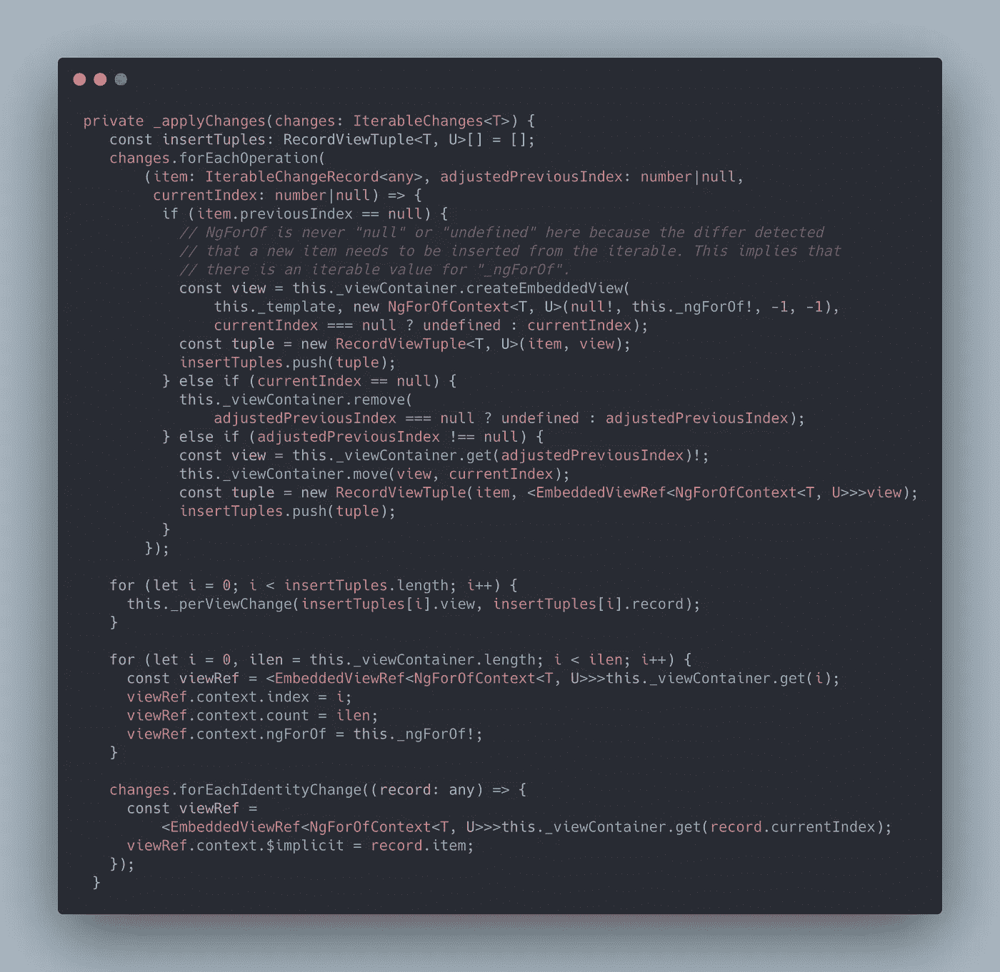
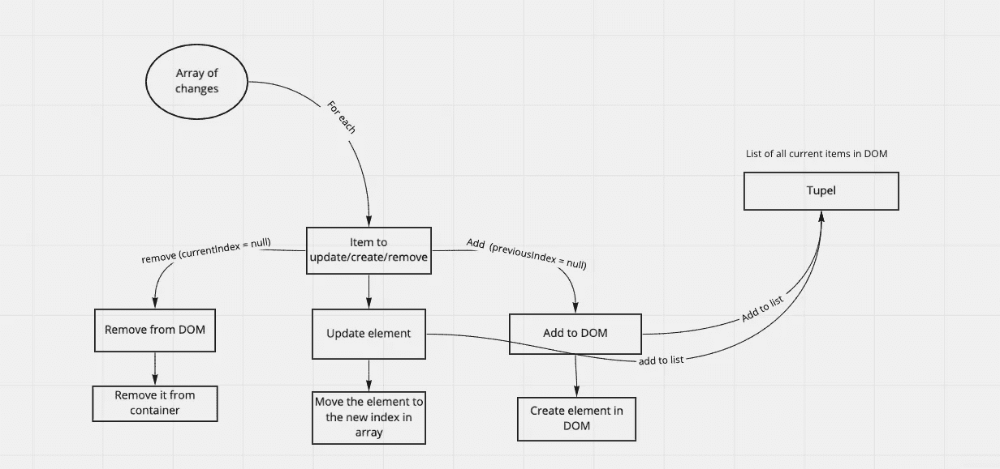
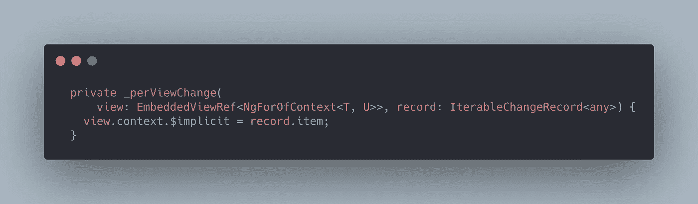
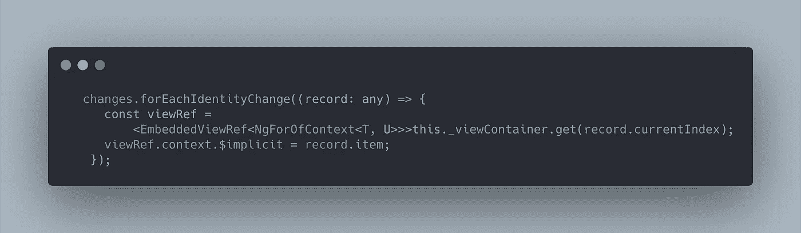
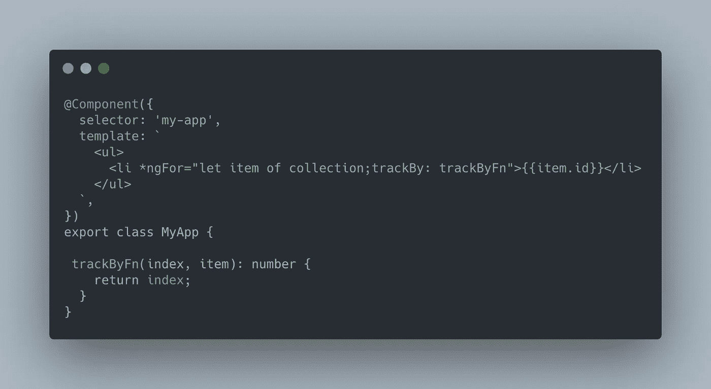

# Angular-*ngFor 的来龙去脉

> 原文：<https://itnext.io/the-ins-and-outs-of-angular-ngfor-88fece4b319c?source=collection_archive---------3----------------------->

欢迎阅读我的第二篇文章“Angular 的来龙去脉”,在这篇文章中，我深入研究了 Angular 的代码库，了解并展示了 Angular 在幕后为我们做了什么，让 Angular 变得如此伟大。今天的主题是*ngFor，这是最常用的指令之一。

角度定义:"*为集合中的每一项呈现模板的[结构指令]。该指令放在一个元素上，该元素成为克隆模板的父级。
简单地说，这些指令接受一个任意数组(对象、数字，甚至空值),并为每次迭代提供模板。如果我们给定一个包含 5 个元素的数组(array . length = = = 5 ), ngFor 指令将呈现 5 个 HTML 元素，它们的父元素是 ng-container。*

对 ngfore 的深入研究从 setter 开始，它是 NgForOf 的一个输入(ngfore 是一个简写，在编译中变成 NgForOf)。它接收 ngi changeable 类型的数据，这意味着它可以接收任何可迭代的对象(记住，数组是一种独特的对象类型)。
这种唯一可迭代的一个例子是[节点列表](https://developer.mozilla.org/en-US/docs/Web/API/NodeList)

ngFor 的入口点

Angular 利用自己生命周期的优势来更新 DOM。它使用“ngDoCheck ”,这是另一个(但很少见的)生命周期事件。

ngFor 的 ngDoCheck 生命周期函数

DoCheck 是一个为指令创建的生命周期类，它的工作是通知指令发生了一个变更检测事件(这是所有事件中最神奇的)。当调用 ngDoCheck 时，它检查:
1。有一个要迭代的值。
2。检查与之前的状态是否有所不同(减少不必要的 DOM 操作。
3。从先前的数据对象获取更新的数据对象的变化。

如果前面列表中的所有复选框都为真，它将最终调用 _ applyChanages 函数，该函数接收可迭代数据的差异，并开始更新 DOM。

迭代修改并更新 DOM

在 _applyChanges 中，它将迭代每个更改。每次迭代将有 3 个参数注入其中。
1。记录:将成为 DOM 的数据将被呈现/重新呈现。
2。previous index:DOM 容器中的前一个索引(如果是新的，可以为空)。
3。current index:DOM 容器中的当前索引(如果移除，可以为空)。
function _ apply changes 相当复杂，所以我将使用一个图表来解释流程。

ngFor 如何在 DOM 中构建项目列表

在我们构建了包含 DOM 中所有条目的 Tupel 列表之后，我们需要将数据插入其中。为此，我们迭代 Tupel 中的条目列表，并将数据插入每一行的上下文中。

将索引的数据添加到该迭代的隐式中，但不将其放入 DOM 中

还有一个迭代要完成，就是最终将 or 数据嵌入到 DOM 中。

将更新后的数据逐个呈现到 DOM 中

从我们所做的迭代次数来看，性能似乎应该很差，我们对许多不同形式的数据进行了多次迭代。Angular 做了很多工作来保护我们的代码和它本身免受不良实践的影响。这是有代价的，但是在非常大的列表中有两个解决方案。第一种方法是使用一个带有角度/CDK 的虚拟滚动条([链接](https://material.angular.io/cdk/scrolling/overview))。或者使用提供的“*跟踪”选项。*

TrackBy 是一个函数，它获取每个项目及其索引，并创建一个哈希映射，以使跟踪算法更好地满足您的应用程序/网络应用程序需求
track by 的一个示例:

跟踪比的例子

总结:

NgFor 是一个复杂的指令，它首先考虑的是用户体验，而不是每次都从头开始渲染，多次迭代相同的数组，所有这些都是为了保护我们的 UI 不被破坏，并为我们的用户提供更无缝的体验。
ngFor lot 使用独特的类来给它一个更“干净”的代码视图，其中许多“硬”工作都是在这些类中完成的(IterableDiffers，IterableChangeRecord *，* NgForOfContext *)。代码看起来非常光滑小巧，但是我觉得我们都知道，这通常意味着隐藏在引擎盖下的东西更多。*

*在这篇关于 ngFor 如何工作的文章中，我将尽可能地深入。希望这是有帮助的，并随时评论联系*