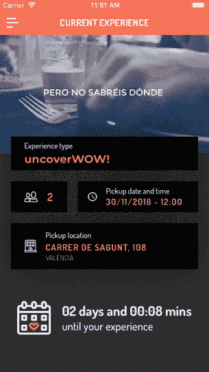
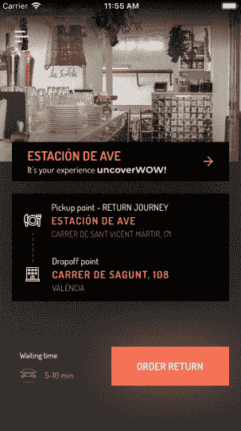

# 使用 react-navigation 在 React Native 中嵌套导航器的复杂性

> 原文：<https://itnext.io/the-intricacies-of-nesting-navigators-in-react-native-using-react-navigation-fef52ca72964?source=collection_archive---------0----------------------->


[安德鲁·尼尔](https://unsplash.com/@andrewtneel?utm_source=medium&utm_medium=referral)在 [Unsplash](https://unsplash.com?utm_source=medium&utm_medium=referral) 上拍照

**这是关于使用 React Native 为**[**uncovercity**](https://uncovercity.com/)**构建 iOS 和 Android 应用程序的 4 部分系列文章中的最后一篇。你可以在这里找到其他的:**

1.  [使用 Expo 加速 React Native 中惊喜晚餐应用的构建](/speeding-up-the-build-of-a-surprise-dinner-app-in-react-native-using-expo-2c18beabaaa7)
2.  [在 Expo 中对战测试拼车 API 和 React Native 的 MapView](/battle-testing-a-ride-sharing-api-and-react-natives-mapview-in-expo-c0ce5d50cbf0?source=your_stories_page---------------------------)
3.  [通过 Expo 本地化在 React Native 中支持多种语言](https://medium.com/@marcelkalveram/supporting-multiple-languages-in-react-native-with-expos-localization-module-9611f9e3b6a0)
4.  使用 react-navigation 在 React Native 中嵌套导航器的复杂性

在我最近的一个项目中，我使用 React Native 为西班牙初创公司 [uncovercity](https://uncovercity.com/) 开发了原生应用。

我面临的最有趣的挑战之一是基于一组视觉设计建立导航结构。在这篇文章中，我将详细讨论它们，并向你介绍我提出的解决方案。

# 一切都从一棵树开始

以下要点说明了该应用程序的结构。我已经给了您一点提示，告诉您我对包含子路由的每个元素使用了哪种类型的导航器。

```
- Main **(StackNavigator)**
  - Home
  - Login
  - Recover password
  - Sidebar **(DrawerNavigator)**
    - Router **(StackNavigator)**
      - Experience
      - Experience Map
      - Experience Active
      - Experience Active Detail
      - Map
      - Evaluation
    - PastExperiences
    - FAQ
    - Contact
```

让我一步一步带你穿过这棵树。

## 级别 1:堆栈导航器—欢迎和登录屏幕

如您所见，根元素是一个`**StackNavigator**`。由于前三个屏幕(主页、登录、恢复密码)只是在你从一个屏幕移动到下一个屏幕时一个接一个地显示，我们可以使用一个简单的`StackNavigator`，它有一个很好的默认过渡(iOS 上向左滑动，Android 上向上滑动)。


运行中的堆栈导航器

## 级别 2:抽屉导航器——侧边栏

下一个组件充当一组其他路由的容器。我们在这里使用`**DrawerNavigator**`,这样用户可以使用触摸手势或屏幕左上角有争议的汉堡图标从左侧滑入侧边栏菜单。

从侧边栏，用户可以快速访问一些静态页面，如 FAQ 和 Contact。但是默认情况下，它显示另一个容器元素，其中包含几个其他子路由，即**路由器**。



运行中的抽屉导航器

## 第 3 级:堆栈导航器—路由器

路由器是应用程序的核心，包含了大部分内容。在这里，用户可以看到她(晚餐)体验的当前状态，一个显示场地详细信息的屏幕，一个显示接送点的地图，以及一个让她在结束时对体验进行评级的评估屏幕。

这又是一个`**StackNavigator**`，因为我们想在 iOS 和 Android 上使用默认过渡。但是路由器还包含一些额外的启动逻辑，我将在下面详细介绍。



运行中的嵌套堆栈导航器

# 我在使用 react-navigation 时面临的挑战

[React 导航](https://reactnavigation.org/)简化了很多原生 iOS 和 Android 很难实现的东西。但它也有自己的一系列问题，其解决方案或变通办法并不总是直截了当的。

以下是我遇到的不同问题以及我是如何解决它们的。

## 挑战#1:在 DrawerNavigator 中启用标题栏

`StackNavigator`有一个默认启用的标题栏。可以使用`StackNavigator`的[视觉选项](https://reactnavigation.org/docs/en/stack-navigator.html#stacknavigatorconfig)上的`headerMode: none`将其禁用。当您希望当前屏幕覆盖整个视窗，包括标题通常占据的空间时，这是可取的。

不太直观的是，当你在一个`DrawerNavigator`中，想要为它的所有子元素启用标题栏。`DrawerNavigator`不像`StackNavigator`那样提供可继承的`headerMode`选项，因为它的目的不是给你一个可导航的屏幕堆栈，而是一个包含默认无标题屏幕的平面层次结构。

为了启用这些屏幕的标题栏，您需要用一个额外的`StackNavigator`将它们包装起来。这将带回每个子屏幕的标题栏，尽管我们只有一个标题栏，并且实际上为了这个简单的目的滥用了`StackNavigator`。虽然这看起来像是一个黑客，但它似乎仍然是大多数情况下最常见的解决方法。

```
const One = **StackNavigator**(
  {
    main: { screen: Main } // only has one route
  },
  {
    navigationOptions: {
      **headerMode: 'screen'** // enabling header mode for main screen
    }
  }
);const AppNavigator = **DrawerNavigator**({
  one: { screen: One },
  two: { screen: Two }
});
```

## 挑战 2:从嵌套路由中切换侧边栏

接下来，我想知道如何从嵌套路由中的组件切换`DrawerNavigator`的侧边栏。

自从 React Navigation 的 2.0 更新以来，您可以在`navigation`属性上使用`openDrawer`功能。但是这个属性并不是在每个组件中都可用的，除非你把它作为一个`prop`传递下去，这有时意味着沿着一个长的组件链传递下去。

一个更简洁的解决方案(在 [react-navigation 的文档](https://reactnavigation.org/docs/en/navigating-without-navigation-prop.html)中发现)是将`DrawerNavigator`的引用存储在一个服务中，并在需要访问`openDrawer`函数的任何地方导入它。这是服务的方法所做的事情:

```
function **setTopLevelNavigator**(navigatorRef) {
  _navigator = navigatorRef;
}function **openDrawer**(routeName, params){
  _navigator.dispatch(DrawerActions.openDrawer());
}
```

呈现`DrawerNavigator`的组件必须将导航器引用传递给`setTopLevelNavigator`函数。

```
<TopLevelNavigator
  ref={**navigatorRef** => {   NavigationService.setTopLevelNavigator(**navigatorRef**);
  }}
/>
```

现在你可以简单地从任何地方调用`navigate`函数来访问`DrawerNavigator`的`openDrawer`方法:

```
NavigationService.**openDrawer**();
```

> 您也许可以使用 React 的上下文 API(React 16.3 中引入的)或使用 Redux 或 Mobx 来完成相同的任务，但是在编写这段代码时，这似乎是最简单的解决方案，没有引入任何开销。

## 挑战#3:将经过身份验证的用户带到用户区

如果你是一名注册用户，并且之前已经登录过该应用程序，显然你希望下次回来时被视为已登录用户。

回到上面概述的导航树，这意味着将她从根导航器(主)带到嵌套在路由器堆栈中的一个屏幕。相当大的飞跃！

```
**Main** **->** Sidebar **->** Router **->** **Experience
     -> Login**
```

在 **Main** 中，我们从手机的本地存储中获取用户的当前状态(`AsyncStorage`)。如果用户*登录了*，它将包含一个包含用户详细信息(ID、电子邮件、姓名)的对象，我们将她带到下一个级别，**侧栏。**如果她*未*登录，她将转到**登录**屏幕。

```
const user = await **AsyncStorage**.getItem('user');
```

因为它是一个`async`函数，我们需要在渲染外部导航器之前等待它完成，所以我们在渲染函数中返回一个加载屏幕，并且我们只在`AsyncStorage`操作完成后将`loading`设置为 true。

```
if (this.state.loading) {
  return <**LoadingScreen** />;
}
```

在我们第二级导航器的`navigationOptions`(**侧栏**)中，我们根据用户的登录状态将`initialRouteName`设置为导航层级中的下一个屏幕。

```
const Navigator = createStackNavigator({
   ...routesObject...
  }, 
    {
      **initialRouteName**: (this.props.loggedIn) ? '**Sidebar**' : '**Login**',
    },
});
```

在**侧栏**中，我们接着进入初始路由**路由器**，其同级路由器可通过`DrawerNavigator`访问。

```
const Drawer = createDrawerNavigator({
  **Router**: { screen: **Router** }, // another StackNavigator in here
  **PastExperiences**: { screen: PastExperiencesScreen },
  **FAQ**: { screen: FaqScreen },
  **Contact**: { ContactScreen }
})
```

然而，我们向用户显示的屏幕取决于用户体验的当前状态。体验细节是后续 API 请求的一部分，只有在用户登录后才会解决。

这导致了我必须解决的另外几个路由问题，这是我接下来要讨论的。

## 挑战#4:在不破坏用户体验的情况下，显示基于 API 响应的嵌套屏幕

最后但同样重要的是，我必须解决一个与应用程序如何与 API 交互相关的问题。在**路由器**内部，用户看到的屏幕基于来自拼车服务的 API 响应。

用户看到以下之一:**接送**、**返回**、**地图**或**评估、**基于带她去餐馆并返回的乘坐装置的当前状态。

```
Main -> Sidebar -> **Router** -> Pickup screen
                          -> Map
                          -> Return screen
                          -> Evaluation
```

这在理论上听起来很容易，但我必须注意三件事，以防止应用程序的 UX 感到尴尬和困惑:

*   首先，我必须只渲染初始屏幕*一次*。因为我们依靠[轮询](/battle-testing-a-ride-sharing-api-and-react-natives-mapview-in-expo-c0ce5d50cbf0)来获取 API 更新，所以每个后续的更新都不应该重新渲染路由器，否则会导致非常讨厌的闪烁效果。
*   其次，我必须确保在调用初始路线或打开应用程序之前获得拼车更新，这将总是导致从初始屏幕(接送)到当前屏幕(地图、返回或评估)的转换。
*   第三，我必须考虑到，用户可能会在一段时间内对应用程序进行后台处理，一旦他们回到应用程序，当前屏幕的更新就会被触发，以防其间发生任何变化。

**第一期**，我用了`shouldComponentUpdate`，写了一些逻辑，只在实际路线改变的情况下更新屏幕。这帮助我摆脱了闪烁效应，尽管我最近了解到`shouldComponentUpdate`实际上不应该被[滥用于这种目的](https://reactjs.org/docs/react-component.html#shouldcomponentupdate)。

**对于第二个问题**，我必须请求对 API 做一点小小的修改，以便在来自服务器的*初始*响应中返回用户的状态(最初并不是为此目的而设计的)。但在评估响应之前，我还必须确保屏幕不会出现。所以我不得不使用我在挑战 2 中已经用过的技术，只要组件生命周期中正在执行其他逻辑，就返回一个`LoadingScreen`。

对于那些生活在技术前沿的人来说， [React 悬念](https://blog.logrocket.com/async-rendering-in-react-with-suspense-5d0eaac886c8)将在未来帮助实现这种异步渲染。

**对于第三个问题**(到目前为止最棘手的)，我必须将路由器包装在另一个 React 组件中，以确保在应用程序后台化后进行更新。

因为我之前提到的预防逻辑(`shouldComponentUpdate`)也让用户停留在当前屏幕上，所以我必须确保包含路由器的组件在发生更新时呈现一个新的路由器。

这大概就是无状态功能组件的样子。它在两种情况下创造了一个新的`StackNavigator`:

*   `initialRouteName`变了
*   以前没有定义过`RouterStack`。

```
let RouterStack;
let lastRouteNameconst **RouterStackWithInitialRoute** = ({ initialRouteName }) => {
  if (RouterStack === null || lastRouteName !== initialRouteName) {
    lastRouteName = initialRouteName;
    **RouterStack** = createStackNavigator(
      require('../../../constants/routeConfig').default,
      {
        initialRouteName,
      });
     }
  return <**RouterStack** />;
};
```

将初始路由名传递给该组件，如下所示:

```
render() {
  return this.state.loading ?
    <LoadingScreen /> :
    <RouterStackWithInitialRoute 
      **initialRouteName={this.state.initialRouteName}** />;
}
```

现在，每次用户回到应用程序，她都会立即看到与当前体验状态相对应的屏幕。

> 请记住，所有代码示例都只是对实际代码的简化，以说明我想要表达的观点。因此，如果您试图复制/粘贴它们中的任何一个，也不能保证它们会正常工作:)

# 在 React Native 中构建一个看似简单的移动应用的心得

这就是我为非覆盖性构建移动应用系列的全部内容。

我不得不承认，从最初的用户旅程来看，我没有预料到表面上看起来如此简单的东西会如此复杂。我可能也不总是能为这些问题中的每一个提出最优雅的解决方案。

但是考虑到所有可能的用户场景和在现实生活条件下项目中出现的 API 问题，很容易低估像这样的项目需要付出的努力。

如果你必须处理第三方 API、社区驱动的库和像 React Native 这样的尖端技术，那么发布一个经过战斗测试、没有错误的移动应用程序的实际工作可能会呈指数级增长。

如果你碰巧在西班牙，你可以在 [iOS](https://itunes.apple.com/us/app/uncovercity/id1394531362?l=es&ls=1&mt=8) 和[谷歌](https://play.google.com/store/apps/details?id=com.uncovercity.app&hl=de)应用商店找到这款应用。请务必在上预订一张桌子，以获得完整的应用程序体验:)