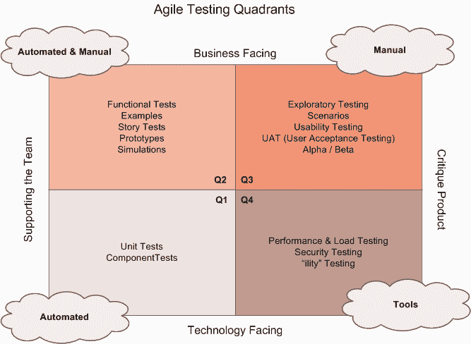
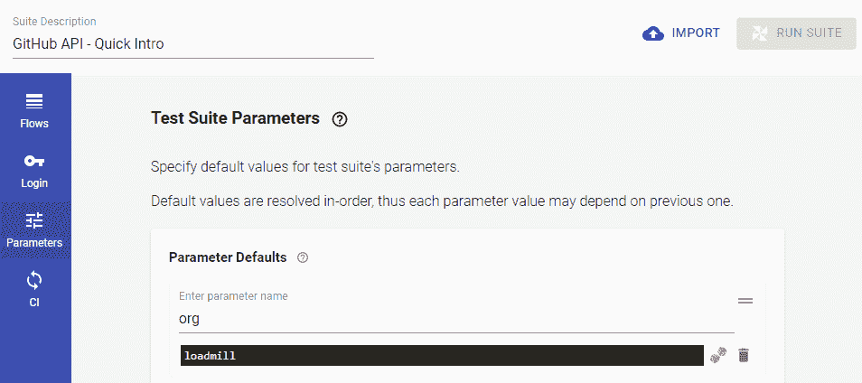
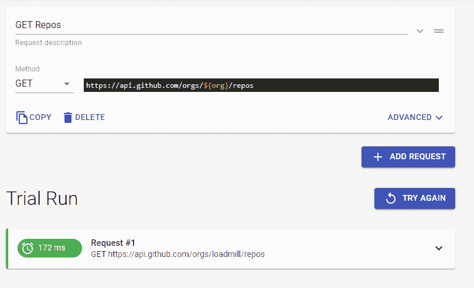
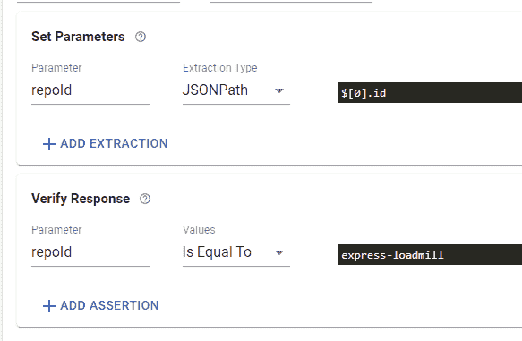
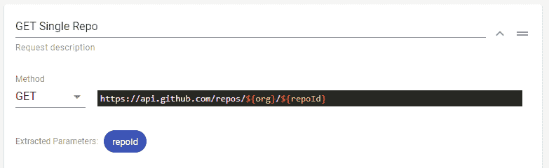
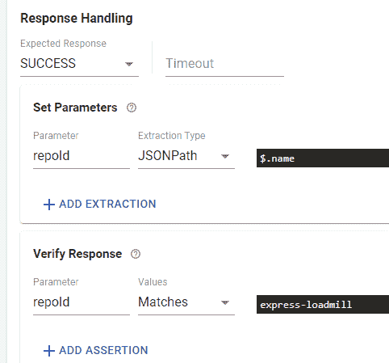

# 提高 API 质量的关键

> 原文：<https://itnext.io/the-key-to-improve-your-apis-quality-31c5d5a32505?source=collection_archive---------3----------------------->

您可能正在考虑或者正在为您最新的关键 API 项目进行各种测试。这可以从单元测试到集成测试。

**太好了！**一旦专门的团队将您的 API 连接到您的前端，您还需要测试它的行为。您计划直接从您的 UI 测试它。

然而，即使你和你的 QA 团队已经在那里测试了各个方面，你也没有足够的信心来发布你的产品。
为什么？因为你不知道当它面向你的消费者时，它在现实世界中的表现如何。

**为了理解你为什么不自信，让我们来看看你的 API 在某些时候可能出现的一些故障:**

*   API 响应时间长
*   您可能会从缓存中获得过时的响应
*   外部服务不可用
*   最糟糕的是:你没有得到预期的回应

在没有任何东西保护的情况下，很难在生产中测量这些东西。当你的消费者最终报告它或者当你深入挖掘你的日志时，你可能会知道它。

为了减轻这种情况，您可以进行额外的测试。如果我们仔细观察敏捷测试象限，你可能会发现那些你已经在做的方法。

[lisacrispin.com 的敏捷测试象限](https://lisacrispin.com/2011/11/08/using-the-agile-testing-quadrants/)

我们想要批评我们的产品并支持团队的东西。基于测试象限，我们最好的选择是采用面向技术的方法，这是自动化测试和支持我们开发旅程的工具之间的完美结合。

许多工具可以帮助完成这项任务。你可能正在寻找一些免费的、文档完善的、易于使用的、功能丰富的、轻量级的东西。例如，Loadmill 有一个免费的工具，可以轻松地运行自动化 API 和负载测试，而不需要修改整个 API 项目。

首先，你可以在 Loadmill 的网站上注册一个免费计划。注册之后，进入 API 测试并创建第一个测试套件。

# 所有功能的简要概述:

*   在流中，您可以创建单独的流，*一个接一个地执行请求*。对于每个请求，您可以在当前的测试会话中设置额外的头、提供验证参数和分配变量。
*   基于流，您可以设置一个登录流，每次访问需要某种身份验证的路由时都会执行该登录流。您不需要在每次执行特定请求时重新进行身份验证。
*   参数允许您为您的测试套件设置会话范围的参数。这些可以在运行时更改。如果您喜欢存储某些令牌或简单的参数，如 id 等，这将很有帮助。
*   CI 部分指导您如何在 CI 环境中运行 API 测试。Loadmill 附带了一个 npm 包。你只需要运行它伴随着你的测试套件的令牌。

这就是你需要知道的关于 Loadmill 的 API 测试特性的全部内容。

# 动作时间

让我们动手吧。为此，我们将使用我们喜爱的 API，GitHub 的 API，所以您还不需要为这个快速介绍的范围设置您的环境。

我们想做什么？我们想要查询我们的组织及其存储库，并挖掘细节。为此，我们希望尽可能灵活，允许我们自己替换掉某些参数，如组织的 ID。我们还想在运行时测量响应时间和设置参数。

首先，让我们将组织存储为一个参数，以后再访问它。我们转到参数并添加一个新参数。

我们回到流程，创建我们的第一个。为此，我们只想查询我们组织的存储库。

这是一个简单的任务，因为我们已经知道了它的 URL 和参数。为了查询存储库，我们需要调用`[https://api.github.com/orgs/loadmill/repos](https://api.github.com/orgs/loadmill/repos)`。

我们希望尽可能灵活地使用组织的名称，所以我们通过使用我们的参数名称来交换它:`[https://api.github.com/orgs/${org}/repos](https://api.github.com/orgs/${org}/repos)`

如果我们单击 Run 按钮，您会注意到我们的测试通过了。

为了验证我们的请求，我们展开高级选项并查看“验证响应”部分。在这里，我们可以用 JSONPath 验证我们的响应消息。出于测试目的，我们可以用类似于下面的 JSONPath 来验证最顶层的存储库:

在这里，我们只是将存储库规范名称存储为一个新的会话参数，并根据下面的测试平台对其进行验证。我们再次点击 run，看到我们的测试顺利通过。

(哦，您还可以在那里检查请求和响应头)

太好了，我们继续。现在我们想查询最顶层的存储库，看看它是如何工作的。我们已经存储了存储库 ID，所以没有任何遗漏。我们知道我们可以通过请求`https://api.github.com/repos/loadmill/express-loadmill`来访问它。像`https://api.github.com/repos/${org}/${repoId}`这样的一点改变就能让它按照我们需要的方式运行。Loadmill 会自动为我们填充参数。

因为我们希望我们的 API 返回与存储库相同的名称，所以我们可以在响应处理部分根据它进行验证。

一旦我们运行了这个套件，我们会注意到流程没有错误地通过了。

您可能已经注意到创建这些测试很容易。你没有理由害怕做这件事，也没有浪费你或任何人的时间。

请随意玩，并确保查看 [Loadmill 的文档](https://docs.loadmill.com/)以了解更多信息。

测试愉快。