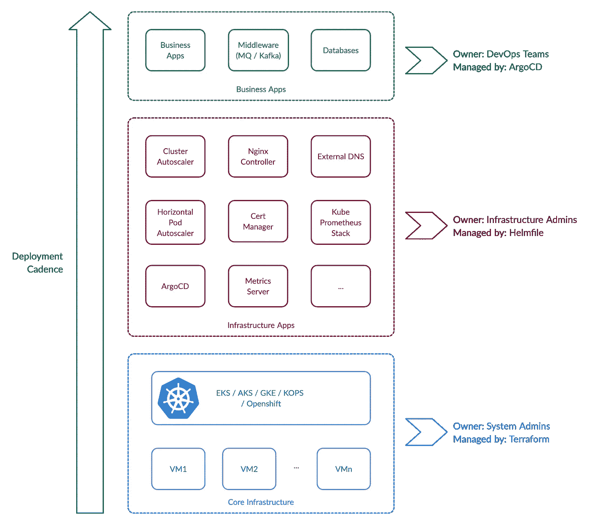

# Kubernetes 所有权模型

> 原文：<https://itnext.io/the-kubernetes-ownership-model-50802b9f264?source=collection_archive---------0----------------------->

所以你决定在你的组织中采用 Kubernetes？恭喜你！你可能做了一个很棒或者很糟糕的决定，我不知道。这个博客不会帮你回答这个问题。相反，本博客的重点是解决任何规模的组织在采用 Kubernetes 时面临的最初挑战，以及如果您从一开始就仔细规划，如何避免一些陷阱。我们开始吧！

# 什么是所有权模型？

Kubernetes 所有权模型描述了负责管理 Kubernetes 实现的不同方面的人员或团队的职责和责任。它确保了人们不会互相冒犯，治理也变得更加简单。让我来介绍一下对我有效的模式。



Kubernetes 所有权模型

该模型不仅描述了所有权团队，还描述了实现所有权的工具。这些工具鼓励[基础设施作为代码](https://en.wikipedia.org/wiki/Infrastructure_as_code)原则，比如 GitOps，这样你就可以得到可审计和可重复的系统。这些绝不是唯一可用于这项工作的工具，还有许多其他工具。我在这里提供了一个对我有用的固执己见的列表。

另一件要记住的事情是，拥有团队是代表角色。这些角色(如 IAM 角色)可以由同一个人担任。这在初创企业中很常见，一个人身兼数职来满足各种需求。

# 为什么我们需要所有权模型？

当开始采用 Kubernetes 时，您会很快意识到，在部署您自己的容器化应用程序之前，您必须安装无数的工具来支持您的应用程序所需的不同功能。这些功能包括 Nginx Ingress 之类的第 7 层路由、使用外部 DNS 的 DNS 管理、使用 Cert Manager 的 TLS 证书等等。不久之后，你将会面临这样的问题:“谁负责这些应用程序？”，“我们应该在哪里部署它？”，“我们如何跟踪各种应用程序部署？”诸如此类。

甚至在此之前就出现了 Kubernetes 本身的问题。"谁负责维护库伯内特集群(EKS、阿拉斯加、GKE、KOPS 等)？"，“任何人都可以请求/创建新的 Kubernetes 集群吗？”还有更多。

所有这些问题以及更多的问题都可以通过实现所有权模型来解决。

# 核心基础设施层

模型中的第一层描述了 Kubernetes 集群本身和工作节点。无论您是决定使用 Kops 创建自己的集群，还是选择 EKS、AKS 等云提供商的托管产品。，将需要一些管理。您仍然负责升级控制平面、更新工作节点 ami 等。对此负责的人员将需要提升权限，而这些权限不应属于常规开发运维团队。

在我的公司设置这一层时(我们选择了 EKS 和 AKS)，我发现 Terraform 是这项工作最简单的工具。这是 HashiCorp 的成熟产品，拥有强大的社区。特别是对于 EKS，需要一些安装后的步骤来设置`aws-auth`配置图，我发现[地形 EKS 模块](https://github.com/terraform-aws-modules/terraform-aws-eks/)非常有用。事实上，你应该使用 Terraform 来管理你所有的云基础设施。

下面是一个简单的 EKS 集群和带有 EKS 模块的节点组的示例。

```
module "my_dev_eks" {
  source  = "terraform-aws-modules/eks/aws"
  version = "12.2.0"

  cluster_name                    = "my-dev-eks"
  cluster_version                 = "1.18"
  cluster_endpoint_private_access = true
  cluster_endpoint_public_access  = true

  cluster_endpoint_public_access_cidrs = [
"0.0.0.0/0"
  ]

  subnets     = flatten([*module*.my_dev_eks_vpc.public_subnets, *module*.my_dev_eks_vpc.private_subnets])
  vpc_id      = *module*.my_dev_eks_vpc.vpc_id
  enable_irsa = truecluster_log_retention_in_days = 7cluster_enabled_log_types     = ["api", "scheduler", "audit"]tags = *var*.tags

  node_groups_defaults = {
    ami_type  = "AL2_x86_64"
    disk_size = 20
  }

  # to manage aws-auth config map.
  map_users = [
    {
      userarn  = "arn:aws:iam::xxxxx:user/user@domain.com"
      username = "username"
      groups   = ["system:masters"]
    }
  ] node_groups = {
    node_a = {
      instance_type       = *var*.nodegroup_kafka_brokers
      subnets             = [*module*.my_dev_eks_vpc.private_subnets[0]]
      ami_release_version = "1.18.8-20201007"
      version             = "1.18"
      desired_capacity    = 1
      max_capacity        = 3
      min_capacity        = 1
      key_name            = "my ssh key"
    }
  }
}
```

只要确保只允许特定的人对保存 terraform 文件的 Git 存储库进行写访问，就可以了。

# 基础设施应用层

模型中的第二层描述了为您的实际业务应用程序所需的基础设施提供动力的应用程序。Kubernetes 的承诺不仅仅在于它的调度和容器编排，还在于基础设施自动化和由 Kubernetes 社区构建的很酷的应用程序，其中大部分现在被 CNCF 采用。

> 我记得申请更换防火墙需要 14 个工作日。今天，它是 Git 存储库中的一个提交，然后一些应用程序在几秒钟内就变得不可思议了。这是一个多么适合做行动人员的时代啊！

这一层可以由拥有第一层的同一个团队拥有，即系统管理员。但是，如果您想要进行分离，这些应用程序集可以由单独的基础架构管理团队来处理。这里的正确答案是任何适合你现有组织结构的。

那么这一层有哪些应用呢？这一层处理基础设施问题，如 DNS、TLS 证书、TCP/HTTP 路由、连续部署等。并且旨在尽可能自动地启用它们。Kubernetes 控制器应用，如外部 DNS、证书管理器、入口控制器、ArgoCD 等。通过构建 Kubernetes API 扩展(定制资源控制器或 CRD)来实现这一点。在架构中采用这些应用程序，让您的生活变得轻松！

下一个问题是如何采用这些工具。几乎所有的基础设施应用都有一个共同点:**掌舵图**。它们都提供了复杂的导航图，允许配置应用程序的各个方面。我发现这是测试应用程序甚至在生产中部署的最快方法。它也有助于多种环境(您有单独的 Kubernetes 集群用于生产和测试，对吗？)，你也不想发现自己直接在 PROD 里把 Nginx Ingress 升级到新版本。一次错误配置，突然之间你的应用就没有流量了——哎哟！

因此，我们决定采用这些应用程序使用他们的舵图。太好了！我们如何在这些掌舵图上应用 IaC 原则？您是否正在使用通过`--set ...`设置的配置来部署舵图？这是命令式命令的经典例子。你在哪里追踪它？您能肯定地说一下当前应用于 PROD 中运行的应用程序的配置吗？我在 **Helmfile** 中找到了这些问题的答案。如果 Helm 是 Kubernetes 资源的包管理器，那么 Helmfile 就是 Helm 本身的包管理器。疯狂吧？Helmfile 允许您在多种环境中以声明方式定义您的 helm 部署。这里是一个`helmfile`的例子，它可以在两个不同的 Kubernetes 集群中声明性地部署`ingress-nginx`和`external-dns` helm 图表。

```
environments:
  my-dev-eks:
  my-prod-eks:repositories:
  - name: ingress-nginx
    url: [https://kubernetes.github.io/ingress-nginx](https://kubernetes.github.io/ingress-nginx)
  - name: bitnami
    url: https://charts.bitnami.com/bitnamihelmDefaults:
  {{ if eq .Environment.Name "my-dev-eks" }}
  kubeContext: arn:aws:eks:eu-central-1:xxxx:cluster/my-dev-eks
  {{ end }}
  {{ if eq .Environment.Name "my-prod-eks" }}
  kubeContext: arn:aws:eks:eu-central-1:xxxx:cluster/my-prod-eks
  {{ end }}releases:
  - name: nginx-ingress
    namespace: nginx
    createNamespace: true
    chart: ingress-nginx/ingress-nginx
    labels:
      app: nginx-ingress
    version: 3.3.0
    values:
      - apps/nginx-ingress/values-{{ .Environment.Name }}.yaml
    secrets:
      - apps/nginx-ingress/secrets-{{ .Environment.Name }}.yaml - name: external-dns
    namespace: external-dns
    createNamespace: true
    chart: bitnami/external-dns
    labels:
      app: external-dns
    version: 3.2.3
    values:
      - apps/external-dns/values-{{ .Environment.Name }}.yaml
    secrets:
      - apps/external-dns/secrets-{{ .Environment.Name }}.yaml
```

定义好之后，在`my-dev-eks`集群中部署 Nginx 入口就像下面这样简单:

```
helmfile -e my-dev-eks -l app=ingress-nginx apply
```

`-e`选择环境，`-l`选择通过标签发布。

简单吧？当然，除了手动运行该命令，您还可以设置一个管道，在某些配置发生变化时自动运行该命令，但这超出了本博客的范围。

# 业务应用层

最后，我们来到模型的最后一层，这一层是我们最初采用 Kubernetes 的最终原因——业务应用层。这些应用程序为您的客户提供价值，并为您的企业赚钱。这是最后一局。容易忘记真正的目标，在 Kubernetes 迷失自我！

这些是您最熟悉的应用程序。你可能已经把它装箱了，或者正在去的路上。你可能也已经决定了如何创建你的 Kubernetes 资源:Kustomize，Helm Charts，Jsonnet 等。将它们部署到不同的 Kubernetes 集群的最佳方式是什么？

考虑到 GitOps，在我的公司，我决定使用 ArgoCD。FluxCD 紧随其后，但 ArgoCD 最终胜出，因为它具有多租户、多集群、与 Azure AD/OIDC 的集成以及令人印象深刻的用户界面等特性。这些对我来说很重要。经过 6 个月的使用，我对这个选择非常满意。使用 Kubernetes 资源的 Helm charts 和持续部署的 ArgoCD，开发人员的工作简化为简单地在 Git 存储库中提交新版本。将这个逻辑放入您现有的 CI 管道中，您就有了一个端到端的 CI/CD 管道，可以自动将新的提交部署到 Kubernetes 集群。

下面是一个 ArgoCD 应用程序 CRD 规范的例子，它从包含在`source`中定义的 Kubernetes 资源的 Git 存储库中读取数据，并将它们应用到在`target`中定义的 Kubernetes 集群:

```
apiVersion: argoproj.io/v1alpha1
kind: Application
metadata:
  name: my-awesome-app
  finalizers:
    - resources-finalizer.argocd.argoproj.io
spec:
  destination:
    namespace: prod
    server: https://kubernetes.default.svc
  source:
    path: my-awesome-helm-charts
    repoURL: git@gitlab.com/my-awesome-app-resources-repo
    targetRevision: master
    helm:
      valueFiles:
        - values/values.yaml
        - values/secrets.yaml
  project: my-apps
  syncPolicy:
    automated: {}
```

你可能想知道为什么我没有使用 Helmfile 进行商业应用，即使我使用了 Helm Charts。答案在于部署节奏。

# 部署节奏

部署节奏定义了软件新版本发布和部署的频率。在 Kubernetes 所有权模型中，部署节奏在第一层最慢，在最终的业务应用层最快。

在第一层，EKS 和 AK 的新版本通常在 Kubernetes 新版本发布一个月后发布。EKS 工人节点 AMI 版本发布更频繁，我们通常选择每月**部署一次**或更少。对于这样一个低节奏，Terraform 符合要求。它不需要在集群或任何其他地方运行任何东西。它是管道在请求时调用的潜在代码。所有地形状态在不同的 S3 桶中维护。

在第二层，基础设施应用程序的发布要频繁得多。根据发布的重要性和有用性，您可以选择每周**或大约**部署它们。Helmfile 也不需要任何活动组件一直运行。它是另一段隐藏的代码，只在需要时才执行。非常适合这个节奏。

最后，在业务应用程序层，部署节奏是最高的。新功能一直在增加，部署每隔一天进行一次，如果不是每天进行**(这是梦想)。在这种节奏下，你需要最大的控制力和灵活性。ArgoCD 有自己的应用程序控制器，它在集群中运行，每两分钟轮询一次 Git 存储库，寻找要应用到集群的更改。尽管 Helmfile 很好，但它不适合这一层的节奏要求。另外值得注意的是，ArgoCD 实际上并没有部署 helm 版本，它相当于`helm template | kubectl apply -f -`，有效地将 Helm 图表转换为直接应用于集群的原始 Kubernetes 资源的集合。对于我的商业应用程序，我更喜欢这个版本。**

# **结论**

**在这篇博客中，我想强调 Kubernetes 采用之旅不仅仅是部署您的容器化业务应用程序。您可以很快开始，但要在不影响治理、安全性和可靠性的情况下保持生产规模，您需要将基础架构作为代码原则应用于整个基础架构堆栈。我希望这里介绍的 Kubernetes 所有权模型能够帮助您安全地开始这一旅程！**