# 机器学习的魔力:梯度下降解释简单，但所有的数学

> 原文：<https://itnext.io/the-magic-of-machine-learning-gradient-descent-explained-simply-but-with-all-math-f19352f5e73c?source=collection_archive---------0----------------------->

从头开始用梯度下降代码

**简介**

梯度下降算法是许多机器学习算法的本质，尤其是在神经网络以及任何预测任务中。这种算法用于许多人工智能应用，从人脸识别到其他计算机视觉产品，用于不同的预测，既用于连续目标的预测(即回归，如价格)，也用于分类目标的预测(即某些结果的概率)。

在梯度下降算法中，部分是梯度，也就是说，简单地说，两个参数之间的变化和下降之间的关系，这种关系中的某个点使某个期望的参数最小化。但是我们想要最小化什么呢？成本函数。成本函数是什么？

**成本函数**

在具有连续目标的任务中，成本函数是损失误差函数(通常称为均方误差)，而在具有分类目标的任务中，损失函数是交叉熵。我们将在这里集中讨论第一个问题。

利用模型 m，我们得到每行(数据点)的一些预测值**y’**。对于我们的每个数据点，我们可以看到每个数据点的预测与真实值的差异( **y** )。

J = (∑(y'-y) )/n

其中 n 是数据点的数量(即我们样本的大小)

**梯度下降的目标是找到最佳权重**

假设我们有一个特征(预测值)— x。我们的预测值(**y’)**取决于该预测，但是我们必须找到给出预测值的权重(𝛉):

y' = 𝛉⁰ + 𝛉*x

该公式适用于每个数据点(即，如果我们希望根据学习时间预测学生成绩，则适用于每个学生)。但是最优𝛉对于每个数据点(学生， *i* )都是相同的，因为我们可以将成本函数改写为:

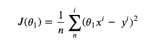

加权𝛉.的成本函数

因为在这个例子中我们只有一个特征，所以总成本函数的导数和成本函数的偏导数是相同的，但是实际上，通常成本函数的总导数是由所有偏导数构成的。但是导数是什么呢？我们如何获得最佳𝛉，使我们的误差函数最小(本例中为 MSE)？通过衍生！

**函数的导数**

梯度基本上是某个函数的斜率，函数变化的度量。为了得到梯度，我们必须计算两个参数的导数，在这种情况下是成本函数(j)和(𝛉).)基本上，我们想找到误差函数最小的𝛉的值。

函数的斜率是𝛥𝛉和𝛥J (𝛥𝛉/𝛥J).)之间的比率我们希望相对于𝛥J 的梯度尽可能小，因为在这一点上，我们将得到我们想要的 j 的最小值，因为我们希望误差函数尽可能小。在这个简单的例子中，可能是这样的，但是即使对于更复杂的情况，规则也是相似的。

更一般地，线性和非线性函数的导数可以用以下公式计算:

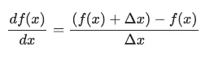

导数𝛥x 的计算

其中 *df(x)/dx* 是我们将用于表示函数相对于 x 的导数的符号。我们可以注意到，当𝛥x 接近 0 时，这是正确的。另一方面，(f(x)+𝛥x ) — f(x)对应于给定 x 和𝛥x.的𝛥y

**常数、线性和非线性函数的梯度。**


简单线性函数:y = 3x + 1

线性函数的导数始终等于回归权重，在本例中为 3。这意味着 **y** 比 x 变化快 3 倍，这个梯度值是恒定的，不变，因为我们有线性函数，即 y 的线性恒定变化依赖于 x

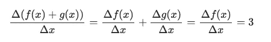

上述线性函数(y = 3x + 1)的梯度计算。

对于非线性二次函数，我们最终会有梯度(斜率)的变化:

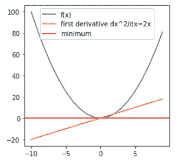

蓝色—原始功能；橙色—一阶导数；红色-0 渐变

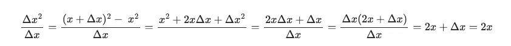

x 的导数。

从上图可以看出，斜率取决于 x 的值，并且它会不断变化，取决于 x。因此，我们可以使用梯度作为方向的标志，以便最小化 y(或成本函数)。当 x 为负时，斜率为负。当 x 很大且为负时，该值很大且为负，当 x =0 时，该值增加直至达到 0。因此，我们可以看到，只要看一下图，**x 和斜率(梯度)之间有关系。在 ML 问题中，我们希望找到使成本函数**最小化的 𝛉 **的值，即最小梯度。现在让我们看看我们真正感兴趣的是什么:成本函数的导数。**

**成本函数的导数**

让我们区分这个成本函数 J(𝛉).可以写成 dJ(𝛉)/d𝛉，意思是对𝛉:做了区分

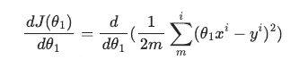

成本函数的导数:第一个方程。

我们可以从导数中得出，因为乘法按常数规律进行。也可以使用求和规则从导数中提取总和。

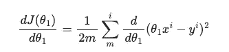

下一步

为了区分这个函数，我们需要把它分离为两个函数的组合。因此，让我们创建以下函数:


每个数据点的变换。

进一步求解，使用链式法则计算每个数据点，我们将计算 dJ(𝛉相对于 u(𝛉,i):的导数

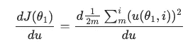

关于每个数据点(du)。

现在它变得有点复杂，但逻辑是清晰而简单的。完整的方程式你可以在这里看到。

最后，我们得到:

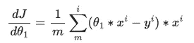

成本函数的最终导数。

dJ(𝛉)/d𝛉函数是我们关注的重点，因为它采用了我们想要优化的参数𝛉的值，并返回了𝛉.值的成本函数的正切斜率斜率告诉我们最小化成本的方向。

**编程梯度下降从零开始**

现在，我们将创建一个简单的函数来实现线性回归的所有功能。这远比你想象的简单！

让我们首先简单地写出误差的计算，即成本函数的导数:

```
**def** calculate_error_j_(theta1, x_i, y_i):
    **return** ((theta1 ***** x_i) **-** y_i) ***** x_i
```

它需要一些权重、预测特征和目标。简单。

好的，但是现在我们必须提到几个新概念。这种斜率计算可以在不同的时间间隔进行，即𝛉中的“跳跃”，这可以通过称为**学习率**的参数来调节。该参数基本上规定了在𝛉观测斜率变化时的跳跃幅度。这是有代价的——学习率越高，跳跃越大，计算越快，但它可以过冲并监督最优点，即成本函数的最小值，因此它可以有不太精确的解决方案。此外，这些具有不同跳转的更新是通过被称为**时期**的迭代来完成的。一些高级梯度下降算法，如 ADAM、RMSProp 等，改变学习速率，当斜率较小时，学习速率变小，从而围绕最佳𝛉值进行一些微调。

好了，我们准备好了，我们将创建一个函数，它将在几个不同的步骤中计算和更新权重。

```
**def** linear_regression(x, y, b**=**0, b0**=**0, epochs**=**1000, learning_rate**=**0.001):
    N **=** float(len(y))
    **for** i **in** range(epochs):
        y_predicted **=** b0 **+** (b ***** X)
        cost **=** sum([data******2 **for** data **in** (y**-**y_predicted)]) **/** N
        b_gradient **=** **-**(2**/**N) ***** sum(X ***** (y **-** y_predicted))
        b0_gradient **=** **-**(2**/**N) ***** sum(y **-** y_predicted)
        b **=** b **-** (learning_rate ***** b_gradient)
        b0 **=** b0 **-** (learning_rate ***** b0_gradient)
*#         print(f'b0:{b0}', f'b:{b}')*
    **return** b, b0, cost
```

该函数采用真实的 x(特征预测)和 y(目标)值，以及时期数和学习率，然后在每个时期结束时进行迭代和𝛉更新。𝛉在代码中表示为 **b** ，而 b0 是线性函数中的截距。首先计算预测值(y_predicted)，然后计算成本函数(MSE)，然后根据上述公式计算梯度。然后 **b** 由该梯度更新，并且该更新的强度由学习率调节。然后，该过程针对新的时期重复自身，直到时期数结束，而在这种情况下，我们预计梯度将为 0，直到现在，因此它将达到 b 的最优值。这是机器学习的揭示秘密，尽管在更复杂的示例中它可能复杂得多。

所以，让我们制造一些假数据，看看这个简单的算法收敛到𝛉.的最优值我们将看到他移动不同的迭代次数(时期)。

先来点假数据:

```
**import** numpy **as** np
**import** matplotlib.pyplot **as** plt
predictor **=** np**.**random**.**randn(1000)
target **=** [2*****x **+** 4 **+** 0.02*****np**.**random**.**uniform(1000) **for** x **in** predictor] *# we create some fake data*
plt**.**figure(figsize**=**(4,4))
plt**.**scatter(predictor, target);
```

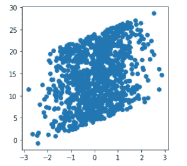

伪造简单数据。

现在，我们将绘制不同时段大小的预测值，我们将看到𝛉如何缓慢收敛到最佳值(红色):

```
plt**.**figure(figsize**=**(8,8))
plt**.**xlabel('x')
plt**.**ylabel('y')

epochs **=** {'y':10, 'orange':20, 'blue':30, 'green':100, 'red':1000}

**for** color, epoch **in** epochs**.**items():
    b, b0, cost **=** linear_regression(predictor, target, b**=**0, b0**=**0, epochs**=**epoch, learning_rate**=**0.01) 
    predicted **=** [b0**+**b*****x **for** x **in** predictor]

    plt**.**scatter(predictor, target);
    plt**.**plot(predictor, predicted, color**=**color, label**=**f'fitted line - prediction for {epoch} epoch')
    plt**.**legend(loc**=**'best')
    plt**.**xlabel('x')
    plt**.**ylabel('y');
```

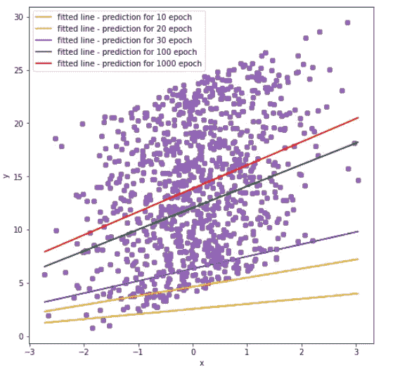

将重量𝛉转换为最佳值。

这是一个非常简单但本质上非常强大的算法，可确保在其他强力或其他方法无法处理大量数据和要素的情况下找到最佳解决方案。因此，ML 可以被视为优化。希望这对你的学习有所帮助。