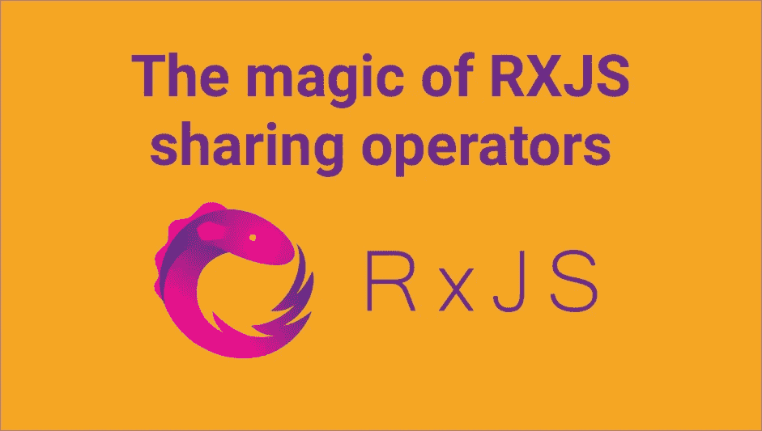
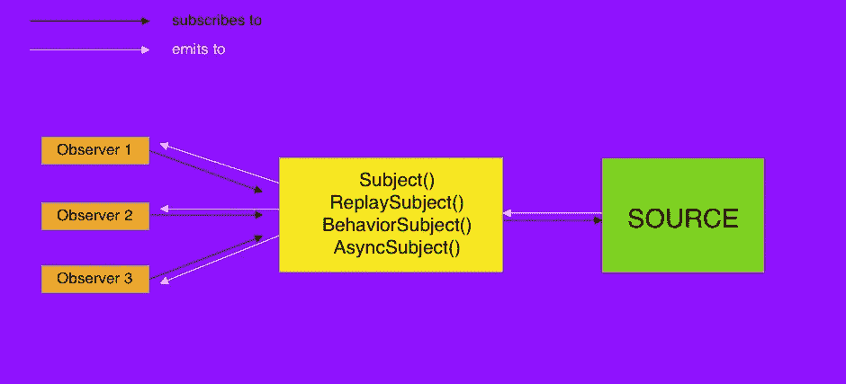

# RXJS 共享运算符的魔力及其差异

> 原文：<https://itnext.io/the-magic-of-rxjs-sharing-operators-and-their-differences-3a03d699d255?source=collection_archive---------0----------------------->



在开始讨论共享操作符之前，我们首先需要确定在 RxJs 中存在什么样的可观测量。通常有两种可观察的，热的和冷的。有一篇很棒的文章[热与冷的对比](https://medium.com/@benlesh/hot-vs-cold-observables-f8094ed53339)，但总的来说主要区别在于

> **cold** observables 中的通知生成者是由可观察对象自身创建的，并且只有当观察者订阅它时才会创建。

例如`interval()`创造冷可观察。在可观测范围内创建数据，并且对于每个新的订阅，将创建新的间隔

> **hot** observables 中的通知生成器是在 observables 之外创建的，不管是否有订户

例如,`fromEvent()`创建热可观察对象，因为通知生产者在 DOM 中，并且不管订阅者的数量如何都存在。

有时我们需要让冷的可观察对象表现为热的，例如对于 http 请求。考虑下面的 Angular 中的 http 请求示例

```
ngOnInit() {
   this.user$ = this.http.get(`api/user/1`) this.name$ = this.user$.pipe(
      map(user => user.name)
   ); this.age$ = this.user$.pipe(
      map(user => user.age)
   );}
```

我们使用异步管道在模板中显示用户的姓名和年龄(假设在不同的地方，所以不可能将其包装在一个异步管道中)

```
<div>{{name$ | async}}</div>
<div>{{age$ | async}}</div>
```

在浏览器的网络选项卡中，我们将看到两个请求。原因是 Angular 的 Http 创建了 cold observable，所以每个新用户都等于新请求。我们绝对不希望有几个请求。首先让我们解决这个问题，然后看看它是如何工作的。

解决这个问题其实很简单。我们需要做的就是像这样添加`share()`或`publish(), refCount()`

```
*this*.user$ = *this*.http.get(`api/user/1`).pipe(share()
);//or this.user$ = this.http.get(`api/user/1`).pipe(
 publish(),
 refCount()
);
```

现在，在“网络”选项卡中，我们有一个请求，因为数据在所有订户之间共享。那么`share()`或`publish()`是如何神奇地解决这个问题的？如果他们做同样的事情，他们之间有什么区别？

> TL；DR share()、publish()和其他多播运营商使冷的可观察对象表现为热的

为了理解共享操作符是如何工作的，我们需要理解什么是*多播。*

> 当所有用户从同一个生产者那里获得数据时，热观测值被**多播**。冷可观测量是**单播**，因为每个用户从不同的生产者那里获得数据。

## 多播()

RxJs 有`multicast()`操作符，它接受主题或主题工厂并返回`ConnectableObservable`。作为参数传递的主题就像多播观察中的中间人。它只是将来自可观察源的数据转发给所有订户。`ConnectableObservable`是一个常规的可观察对象，但在调用`connect()`方法之前，它不会订阅源。让我们用`multicast()`改变上面的例子来理解它是如何工作的。

```
*this*.user$ = *this*.http.get(`api/user/1`).pipe(**multicast(new Subject())**
);
```

光靠这个不行，因为我们需要手动调用`connect()`

```
this.name$ = this.user$.pipe(
      map(user => user.name)
   );this.age$ = this.user$.pipe(
      map(user => user.age)
   );**this.user$.connect();**
```

在此之后，我们将看到同样的行为，将只有一个 http 调用，而不是两个。手动连接和断开可能很难实现，因此有一个`refCount()`操作符，它将自动`connect()`第一次订阅，记录订阅数并保持*主题*连接到*源*，只要至少有一个订阅者。当 S*subscriptions*计数降至零时， *Subject* 将与 *Source* 断开。

*Source**observable*在我们的例子中是由**this . http . get()**
*Subject*是作为参数传递给**multicast()**
*subscription 或 observer*是 **this.name$** 和 **this.age$** 以及订阅 Subject 的其他 observer。

简而言之，我们所有的订户都将订阅主题 X(传递给多播)，而主题 X(T42)本身将订阅我们的 http 呼叫。当 http 调用返回的 observable 发出时，我们的 *subject X* 将获取该值并在所有订阅者之间共享。

> 多播的一般思想是主体订阅源，多个观察者订阅主体。



RXJS 中多播的工作原理

现在让我们修改代码来使用`refCount()`，这样我们就不需要手动连接了。

```
*this*.user$ = *this*.http.get(`api/user/1`).pipe(multicast(new Subject()),
  **refCount()**
);
```

现在我们不需要手动调用 connect()而担心断线。第一次订阅时将主题连接到源，当不再有观察者时将断开连接。
事实上，之前我们使用了`publish(), refCount()`的组合，这与`multicast(new Subject()), refCount()`完全相同

## 发布()

RxJs 有`publish()`操作符，如果我们查看源代码，我们会看到它使用了带有 Subject()的多播

> publish() ===多播(新主题())

`publish()`可选地接受选择器函数，事实上它改变了操作者的行为，值得自己的文章。我们将跳过这一部分，考虑使用没有选择器功能的`publish()`。

所以当我们使用`publish()`时，我们实际上使用的是旧的`multicast()`和`Subject()`，所以我们要么需要手动进行连接和断开，要么使用`refCount()`来自动完成这个过程。

因为我们通常将`publish()`与`refCount()`一起使用，所以有一个非常相似的操作符，它在内部使用`refCount()`，并且行为相似。那就是`share()`

## 共享()

> share() ===多播(()= >新主题())。refCount()

在我们的第一个例子中，我们看到`share()`和`publish(), refCount()`做同样的事情，在大多数情况下它们是一样的。`share()`是内部使用`refCount()`的运算符，我们不需要调用它。`share()`就像`publish()`使用`multicast()`一样，但不同之处在于传递给`multicast().`的参数

> `publish()`使用主题实例— `multicast(new Subject())`
> 
> `share()`使用返回主题实例的工厂函数— `multicast(() => new Subject()).refCount()`

这是我们不能说`share()`和`publish() + refCount()`一样的唯一原因。当源完成时，这种差异会导致后期订阅者不同行为。

## share()和 publish() + refCount()之间的区别

然而，他们都使用`refCount()`来管理订阅

> `publish() + refCount()` —只要 Subject 至少有一个订阅者，就会发出值。一旦没有订户，主题将与源断开连接。**对于所有新订户，如果源已完成，他们将收到“已完成”发射**，但是**如果源未完成，受试者将重新订阅源**
> 
> `share()` —只要 Subject 至少有一个订阅者，就会发出值。一旦没有订户，主题将与源断开连接。**对于任何新订阅者，无论 Source 是否已完成，都将使用新主题再次订阅 Source**

这种差别很微妙，但非常重要。让我们修改代码，让它有一个更新用户数据的按钮。当点击它时，将从服务器重新获取数据。
首先让我们使用`share()`

```
ngOnInit() {
   this.user$ = this.http.get(`api/user/1`).pipe(
      **share()**
   )this.name$ = this.user$.pipe(
      map(user => user.name)
   );this.age$ = this.user$.pipe(
      map(user => user.age)
   );}**update() {
  *this*.name$ = *this*.user$.pipe(
    map(user => user.name + 'update')
  );
  *this*.age$ = *this*.user$.pipe(
    map(user => user.age + 'updated')
  );
}**
```

当我们最初加载数据时,`refCount()`会统计所有引用。所以我们将有两个主题的引用。一旦我们从服务器获取数据，主题将从源和完整的数据。我们的两个订户都将从 Subject 和 complete 获得数据，这意味着`refCount()` 中的参考号将为 0。在这种情况下，受试者将与源断开连接。
当我们执行`update()`方法时，将创建新的 Subject()实例并订阅源。所以每次执行 update()都会向服务器发送请求。

现在考虑与`publish(), refCount()`相同的例子

```
this.user$ = this.http.get(`api/user/1`).pipe(
 **publish(),
 refCount()**
);
```

同样，我们将 `refCount()`计数器设置为 2，一旦源发射并完成，计数器将为 0。但是当我们执行`update()`方法时，什么也不会发生，也不会向服务器发出请求。如上所述，如果源完成，新订户将仅获得“完成”通知。

他们如此表现的原因在`multicast()`。因为`publish()`使用 Subject 实例，所以当 Source 完成时，Subject 也将完成，所以该 Subject 的任何新订阅者将只收到“完成”通知。
`share()`使用返回主题实例的工厂函数。当 Source 完成时，Subject 也将完成，但是对于新的订阅者，将创建新的 Subject 实例并订阅 Source。

## 具有不同主题类型的多播()

到目前为止，我们讨论了使用主题的多播。很少有其他类型的主题——重放主题、行为主题和异步主题。向多播传递不同的主题将返回 ConnectableObservable，但它们的行为会有所不同。

首先让我们看看`ReplaySubject(n)`，它将 number 作为参数，这是它将保存在缓冲区中的发射计数。对于任何新的用户，它将重放 n 次。

如果我们将 ReplaySubject(n)传递给 multicast()，所有新的订阅者都将获得 n 个重播值。

## 发布重放()

> publishReplay() ===多播(new ReplaySubject())

`publishReplay()`返回`ConnectableObservable`，所以我们需要使用`connect()`或者使用`refCount()`来管理连接。让我们修改一下我们的例子，这样每个新的订阅者都会得到缓冲值。所以当我们点击`update()`时，我们不会收到新的数据，但会得到缓存的值。

```
this.user$ = this.http.get(`api/user/1`).pipe(
 **publishReplay(1),
 refCount()**
);
```

在 Source 完成之前，ReplaySubject 的所有订阅者都将获得发出的值(在我们的例子中只有 1 个值，因为 Http 只发出一次)。对于所有新订户，ReplaySubject 将重放 N 个缓冲值。

因为我们大多用`publishReplay()`搭配`refCount()`，所以有一个非常相似的运算符，它在内部使用引用计数机制，行为也很相似。那就是`shareReplay()`

## 共享重播()

`shareReplay()`是非常有趣的运算符。它的行为方式与`publishReplay() + refCount()`相似，但这取决于我们如何使用这个操作符。

在 RxJs 版本 6.4.0 之前，`shareReplay()`中的引用计数机制以不同的方式工作。从 6.4.0 开始，我们可以显式地传递一个参数给 `shareReplay()`来使用“正常”的引用计数机制。让我们更详细地看看

## share replay({ ref count:true })(RXJS 6 . 4 . 0 或更高版本)

`refCount: true`告诉`shareReplay()`使用参考计数机制，类似于`refCount()`。在这种情况下`shareReplay({refCount: true})`与`publishReplay() + refCount()`几乎相同。让我们修改我们的例子来使用 shareReplay。

```
this.user$ = this.http.get(`api/user/1`).pipe(
 **shareReplay({refCount: true, bufferSize: 1})**
);
```

如你所见，我们不再使用`refCount()`，因为`shareReplay({refCount: true})`使用它自己的引用计数机制。结果将是一样的。只要 ReplaySubject 发出值，它的所有订阅者都将获得这些值。所有新订户将获得 N 个缓冲值。
在说 shareReplay 的其他使用方法之前，我们先来看看它们的区别。

## shareReplay({refCount: true})和 publishReplay() + refCount()之间的区别

他们都使用`ReplaySubject()`但是`shareReplay()`没有用`multicast()`实现。

> `publishReplay(n) + refCount()` — *只要至少有一个订阅者，源 ReplaySubject 将发出值，一旦没有订阅者，ReplaySubject 将与源断开连接。* ***任何新订阅者将从 ReplaySubject 中获取最后 N 个值，如果源尚未完成，则使用相同的 ReplaySubject 再次重新订阅源。***
> 
> `*shareReplay({refCount: true, bufferSize: n})*` *—只要至少有一个订阅者 ReplaySubject 就会发出值，一旦没有订阅者 ReplaySubject 就会与源断开连接。* ***对于新订阅者，如果源已完成，它将从 ReplaySubject 发出最后 N 个值，但如果源未完成，或出错，它将仅使用新 ReplaySubject 再次订阅源***

为了看出区别，让我们使用`interval()`,这样对于新的订户来说，源将不会被完成

```
*this*.source = interval(1000).pipe(
  publishReplay(1),
  refCount()
);
*const* sub1 = *this*.source.subscribe(x => console.log('sub 1', x));
*const* sub2 = *this*.source.subscribe(x => console.log('sub 2', x));

setTimeout(() => {
  sub1.unsubscribe();
  sub2.unsubscribe();
}, 2000);
```

我们有 2 个 ReplaySubject 订阅，sub1 和 sub2。2 秒钟后，他们都将取消订阅主题。因为当不再有订阅者时，我们使用`refCount()`(例如，引用计数下降到零)，它将从源断开 ReplaySubject。到目前为止，我们将在控制台中看到。

```
 sub 1– 0
 sub 2– 0
 sub 1– 1
 sub 2– 1
```

现在，假设我们将创建新的订阅者，通过单击按钮来 ReplaySubject。(在 refCount 降至零之后)

```
 newSub() {
 *const* sub3 = *this*.source.subscribe(x => console.log(‘sub 3’, x));
}
```

当`newSub()`被执行时，sub3 将从 ReplaySubject(将是 **1** )获取最后一个缓冲值，并检查 Source 是否已完成。如果完成，sub3 将收到“已完成”通知，并且也将完成。但是，因为我们使用的是`interval()`，Source 将不会完成，内部 ReplaySubject 将再次重新订阅 Source。结果将会是

```
 sub 1– 0
 sub 2– 0
 sub 1– 1
 sub 2– 1
*/**** execution of newSub() ****/*
 **sub 3– 1 <- replayed value**
 sub 3– 0 <- new subscription
 sub 3– 1
 sub 3– 2
...
```

内部重放主体向新的观察者重放缓冲的值，并根据源完成的状态完成或重新订阅源。

现在使用`shareReplay({refCount:true })`的相同`interval()`示例

```
*this*.source = interval(1000).pipe(
  shareReplay({refCount: true, bufferSize: 1})
);
*const* sub1 = *this*.source.subscribe(x => console.log('sub 1', x));
*const* sub2 = *this*.source.subscribe(x => console.log('sub 2', x));

setTimeout(() => {
  sub1.unsubscribe();
  sub2.unsubscribe();
}, 2000);//execute newSub() after sub1 and sub2 unsubscribe
newSub() {
 *const* sub3 = *this*.source.subscribe(x => console.log(‘sub 3’, x));
}
```

`shareReplay()`未通过`multicast`实现，但它在内部使用工厂函数，如果我们将它与`refCount: true`一起使用，并且引用计数降至零，对于任何新订户，如果源已完成，它将重放缓冲值并发出“完成”通知。如果任何新订阅者的源尚未完成，将创建新的 ReplaySubject 并订阅源。
运行上面的代码并执行`newSub()`后，我们将看到结果。

```
 sub 1– 0
 sub 2– 0
 sub 1– 1
 sub 2– 1
*/**** execution of newSub() ****/*
 sub 3– 0 <- new subscription
 sub 3– 1
 sub 3– 2
...
```

如您所见，sub3 没有重放任何值。原因是，当 sub1 和 sub2 取消订阅时，ref 计数将为零，并且如果源已完成，所有新订阅者(如 sub3)将获得所有缓冲值和“已完成”通知，但是由于我们正在使用`interval()`并且源不会完成，ReplaySubject 将被销毁，任何新订阅者(如 sub3)将创建新的 ReplaySubject 实例并再次订阅源。

## 不带 refCount 的 shareReplay()

到目前为止，我们使用`shareReplay`和`refCount: true`。我们可以使用 shareReplay，将 refCount 设置为 false 或者根本不设置，只指定缓冲区大小——例如`shareReplay({refCount: false, bufferSize: 3})`和`shareReplay(3)` 是相同的。这意味着 ReplaySubject 将发出最后 3 个值，refCount 将为 false。这并不意味着没有引用计数机制，只是行为不同而已。

> 默认情况下，`shareReplay()`中的`refCount`被设置为`false`

`refCount: false`表示首次订阅 ReplaySubject 时，它将订阅 Source。但它不会断开 ReplaySubject 与源的连接，因为源中不再有 ReplaySubject 的订阅者。让我们使用 refCount false 再次修改我们的示例

```
*this*.source = interval(1000).pipe(
  **shareReplay({refCount: false, bufferSize: 2})
  //or just shareReplay(2)**
);
*const* sub1 = *this*.source.subscribe(x => console.log('sub 1', x));
*const* sub2 = *this*.source.subscribe(x => console.log('sub 2', x));

setTimeout(() => {
  sub1.unsubscribe();
  sub2.unsubscribe();
}, 2000);**setTimeout(() => {
 *const* sub3 = *this*.source.subscribe(x => console.log(‘sub 3’, x));
}, 4000);**
```

sub1 和 sub2 订阅 ReplaySubject，ReplaySubject 订阅源间隔。2 秒钟后，sub1 和 sub2 将取消订阅，但在这种情况下，ReplaySubject 不会取消订阅源。即使没有订阅者来获取这些值，源也将继续发出这些值。
4 秒后，新订户将订阅 ReplaySubject，并将获取最后 2 个缓冲值，并继续从源获取值。结果将会是

```
 sub 1– 0
 sub 2– 0
 sub 1– 1
 sub 2– 1
*/**** after 4 seconds  ****/* **sub 3– 2 <- replayed values
 sub 3– 3 <-**
 sub 3– 4 <- continues receiving values
 sub 3– 5
...
```

sub1 和 sub2 订阅，打印值并在两秒后取消订阅，但因为源尚未完成，ReplaySubject 将从源接收数据，因此当 4 秒后 sub3 订阅 ReplaySubject 时，它将获得的不是作为缓冲值的 **0** 和 **1** ，而是 **2** 和 **3** 、，因为在此时间内**replay subject 设法从源获得新值 ReplaySubject 取消订阅源的唯一情况是当源完成或出错时。在这种情况下，任何新订户都将获得重播值并完成。**

> **`*shareReplay(n)*` *—* ***无论是否有活动订户，主体都将继续发出值并保持与源的连接，直到源完成或出错*** *。***【任何新订户都将获得最后 N 个值(如果不出错)。如果源尚未完成，新订户将继续从源获取值****

## ***发布行为()***

***`publishBehavior()`将`multicast`用于另一个主题。行为主体***

> ***publishBehavior() ===多播(新的 BehaviorSubject())***

***`publishBehavior()`返回`ConnectableObservable`，所以我们需要使用`refCount()`或者手动连接。***

***`publishBehavior()`接受缺省值作为参数，如果 Source 没有发出，将把该值发送给所有订阅者。考虑这个例子***

```
**this*.source = interval(1000).pipe(
 **publishBehavior(47),
  refCount()**
);
*const* sub1 = *this*.source.subscribe(x => console.log('sub 1', x));
*const* sub2 = *this*.source.subscribe(x => console.log('sub 2', x));

setTimeout(() => {
  sub1.unsubscribe();
  sub2.unsubscribe();
}, 2000);setTimeout(() => {
  *const* sub3 = *this*.source.subscribe(x => console.log('sub 3', x));
}, 4000);*
```

***结果将会是***

```
 ***sub 1– 47 <- default values
 sub 2– 47 <-**
 sub 1– 0
 sub 2– 0
 sub 1– 1
 sub 2– 1
*/**** after 4 seconds ****/*
 **sub 3– 1 <- last buffered value**
 sub 3– 0
 sub 3– 1
...*
```

***因为 interval 是异步的，当 sub1 和 sub2 订阅 BehaviorSubject 时，那时 Source 还没有发出，所以 sub1 和 sub2 将从 BehaviorSubject 获取默认值。两秒钟后，sub1 和 sub2 将取消订阅 BehaviorSubject，BehaviorSubject 本身将取消订阅 Source。4 秒钟后，sub3 将订阅 BehaviorSubject，因为 Source 尚未完成，sub3 将获取最后发出的值，并使用相同的 BehaviorSubject 重新订阅 Source。***

> ***`*publishBehavior(default_value)*` *—* ***如果在源发出值之前订阅了行为主体，行为主体会将默认值传递给该订阅者。*** *只要至少有一个订阅者对源行为 Subject 就会发出值。一旦没有订户，行为主体将与源断开连接。* ***如果源尚未完成，新订阅者将从 BehaviorSubject 获取最后一个值，并使用相同的 BehaviorSubject 重新订阅源。如果源已完成，所有新订户将仅获得“已完成”通知。******

## ***publishLast()***

***`publishLast()`使用带有异步主题的多播***

> ***publishLast() ===多播(new AsyncSubject())***

***与所有多播操作符一样，`publishLast()`最好与`refCount()`一起使用。
这个运算符中使用的 AsyncSubject 很有意思。它不会发出值，如果订阅，直到完成后，发出最后一个值。***

```
**this*.source = interval(1000).pipe(
 **take(2),
 publishLast(),
 refCount()**
);*const* sub1 = *this*.source.subscribe(x => console.log('sub 1', x));
*const* sub2 = *this*.source.subscribe(x => console.log('sub 2', x));

setTimeout(() => {
  *const* sub3 = *this*.source.subscribe(x => console.log('sub 3', x));
}, 7000);*
```

***因为区间是无限可观测的，我们使用了`take(2)`,所以它将发出 2 个值并完成。这就是结果***

```
 *sub 1– 1 //completed
 sub 2– 1 //completed
*/**** after 7 seconds ****/*
 sub 3– 1 //completed*
```

***当 sub1 和 sub2 订阅 AsyncSubject 时，在源完成之前，它们不会收到任何值。当源完成时，AsyncSubject 将把最后一个值传递给所有观察器，并且也完成。7 秒钟后，sub3 订阅 AsyncSubject，因为它已完成，所以它也会将最后一个值和“已完成”通知传递给 sub3。***

> ***`*publishLast()*` *—无论有多少订户连接到
> AsyncSubject、* ***都不会发出任何值，直到 Source 完成*** *、* ***，但是任何副作用都会被执行*** *。* ***当源完成异步时，主题也完成，并且*** ***向所有订户(当前订户和新订户)发出最后一个值和“完成”通知。******

***Rxjs 中有很多正在进行的事情，多播是图书馆中最重要的事情之一。希望这篇文章能帮助你理解共享操作符是如何工作的，它们有什么不同。感谢阅读。***