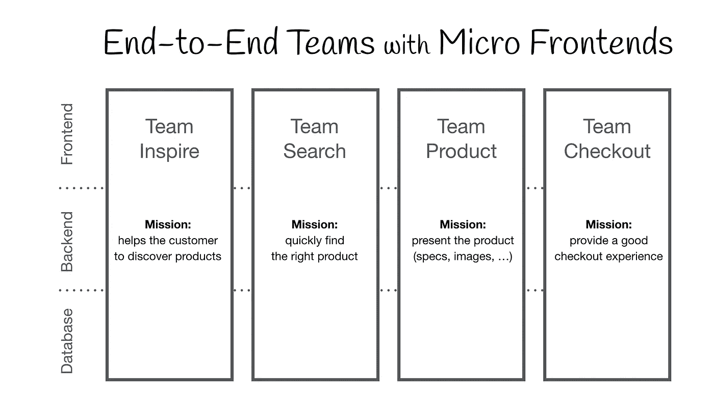
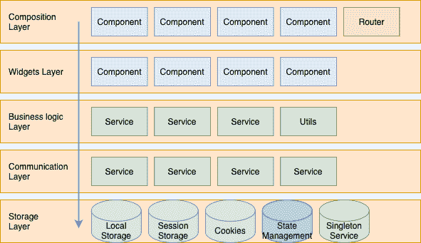
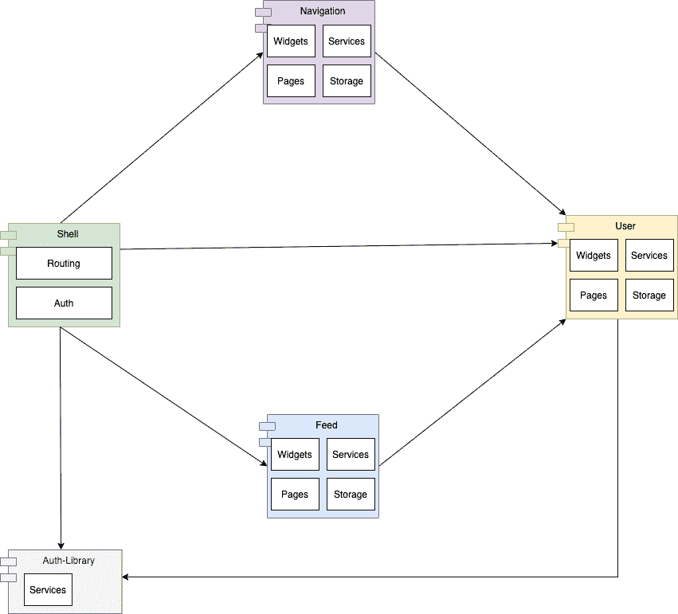
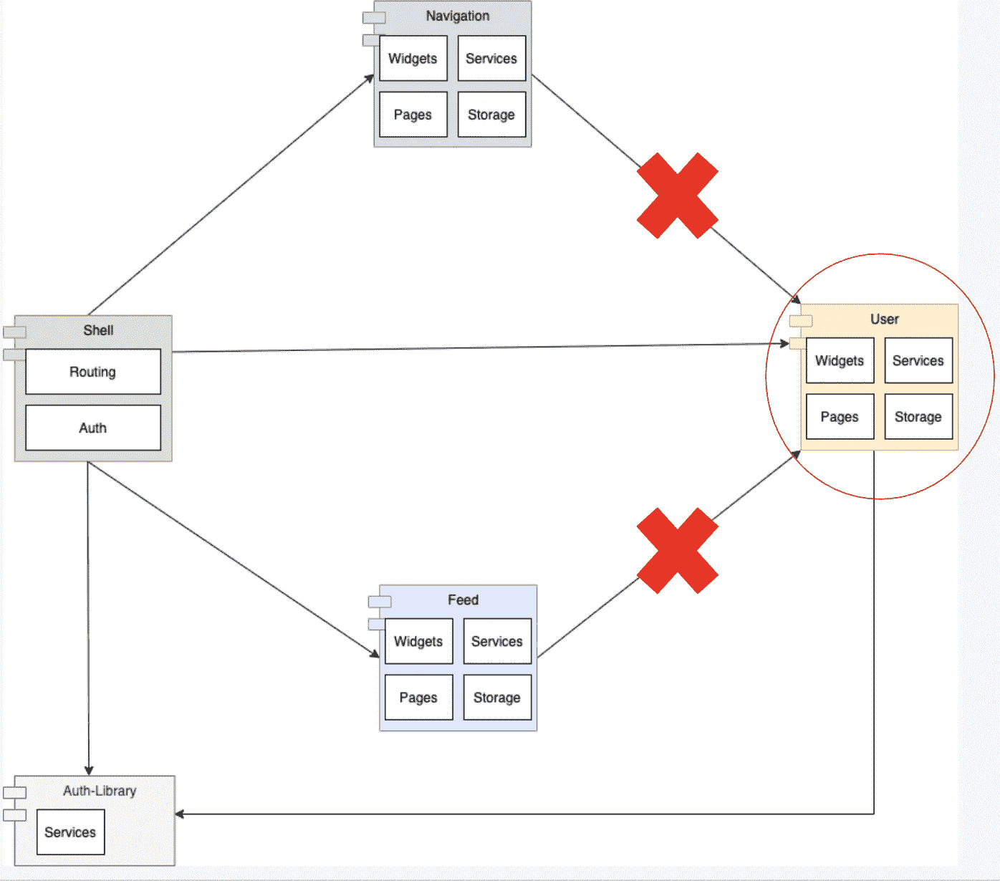
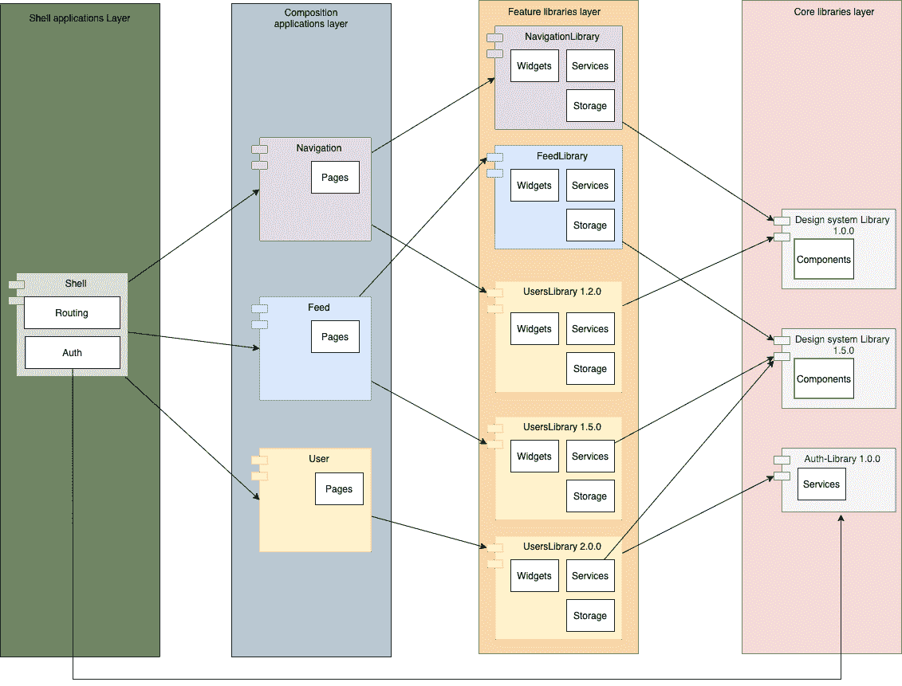
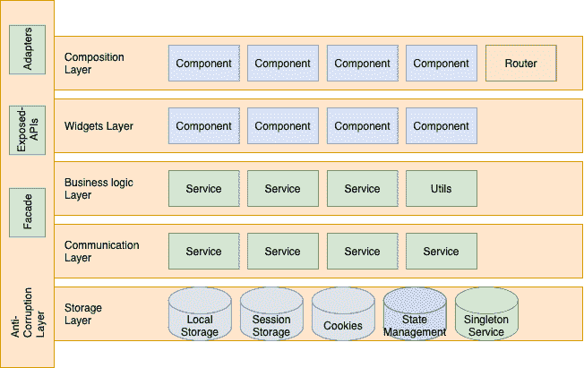
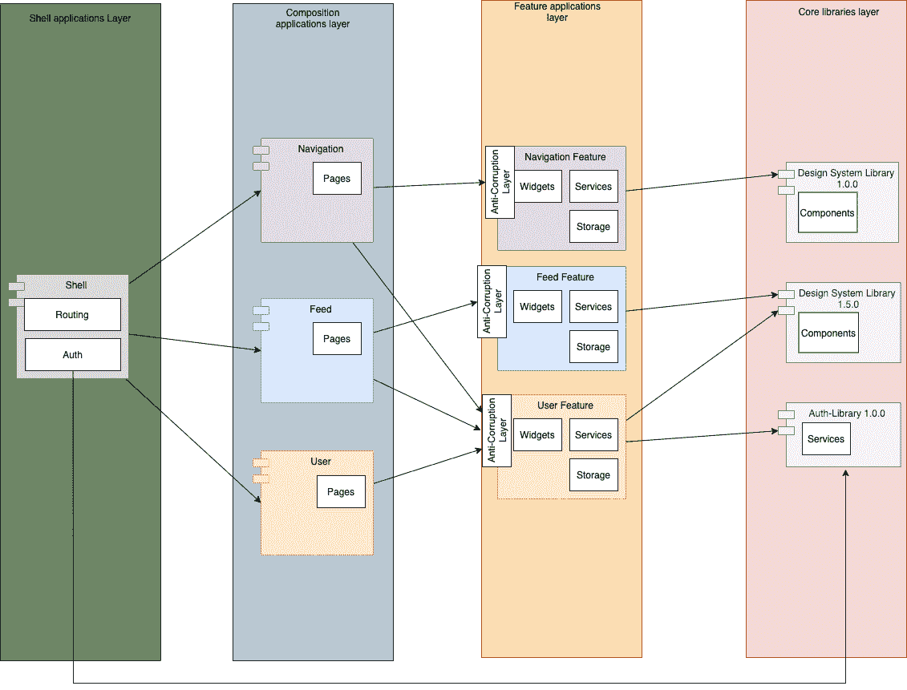
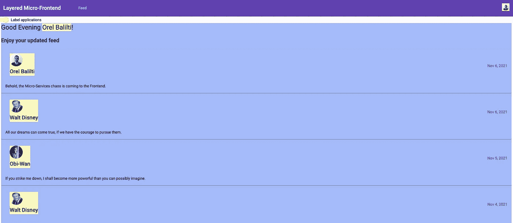

# 微前端混乱(以及如何解决)

> 原文：<https://itnext.io/the-micro-frontend-chaos-and-how-to-solve-it-960b0a90c58?source=collection_archive---------1----------------------->

微前端，这可能是完全隔离的多应用平台缺少的部分，它将为我们提供所需的灵活性和敏捷性，但成本是多少？

编辑—一个[视频讲座](https://www.youtube.com/watch?v=wgip0pm4cdI)现已推出！

# 为什么我们需要微前端？

在过去的十年中，前端应用程序的复杂性增加了。许多业务逻辑不再保留在后端，而是也存在于客户端，这影响了应用程序的复杂性，并引入了一个新的整体—前端应用程序。

随着前端变得更大，同时承担多个责任域(例如，导航、用户、授权)，前端应用程序作为单个应用程序来开发、部署和托管。

当使用每个模块、库，有时甚至是应用程序的目录时，这种分离通常已经存在于代码库中。

微前端允许我们不仅在代码基础上，而且在开发、部署和服务中使用这些不同的应用程序，以便提供:

*   松散耦合的应用
*   更快的开发、调试和测试流程
*   性能—更小的区块
*   测试、开发和部署时完全隔离



不同团队持有的 E2E 域名

# 概观

在本文中，我们将回顾构建在 shell 之外的前端应用程序和代表一个域的 3 个应用程序:

*   shell——用作基于 URL 路径加载每个微应用程序的入口点。外壳应用程序还将触发对路由守卫的授权。
*   导航—负责导航逻辑和状态，包括导航条组件、导航服务
*   用户—负责用户逻辑和状态，包括用户查询和存储逻辑、用户信息组件和用户管理页面
*   Feed —负责获取和呈现 Feed 项目，每个项目都包含用户逻辑和状态，包括用户查询和存储逻辑。

每个应用程序都构建了以下层



*   复合层—这一层包含一组应用程序页面及其相应的路由
*   小部件层——这一层包含一组与领域相关的组件，用于构建组合层上的不同页面
*   业务逻辑层——这一层包含一组负责领域业务逻辑的服务和实用程序。
*   通信层—这一层包含一组用于与不同服务提供商通信的服务(例如后端服务)。
*   存储层—这一层包含将数据持久存储到存储对象
    中的逻辑—内存状态、挂钩(如
    )磁盘—本地存储、索引数据库、cookies 等

# 混乱



在这种情况下，导航应用程序和提要应用程序与用户应用程序之间存在明确的关系。

感谢[模块联合](https://webpack.js.org/concepts/module-federation/)，我们可以在运行时加载微前端应用程序，而不需要构建整个依赖图。
这为我们提供了独立构建和部署每个应用的能力。但是，尽管如此，我们需要记住，所有这些应用程序将作为用户浏览器上的一个整体并排托管。

这带来了前端应用程序稳定性问题的全新方面:

*   当我们部署新版本的应用程序(我们场景中的用户)时会发生什么？
*   我们如何识别受影响的区域？
*   我们如何保证每个部署背后没有隐藏重大变化？
*   我们如何防止托管在一起的多个应用程序之间的紧密耦合？

在我们的例子中，假设一个开发人员修改了来自*用户*应用程序的一个小部件，这个小部件被*提要*和*导航*应用程序使用。现在，让我们想象一下开发人员所做的改变正在破坏契约(组件 API——输入/输出，又名。道具)。
这将导致在现有应用程序中加载新版本时出现运行时错误。
结果呢？部署新用户应用程序后，我们的前端应用程序出现级联故障。



# 解决问题

首先，让我们回顾一下微前端应用的要求:

1.  每个应用程序都应该作为一个独立的单元来构建、测试和服务。
2.  单个应用程序的修改应该可供任何其他应用程序使用。
3.  应用程序小部件和服务应该是可重用和可互换的。
4.  应用内部模型和业务逻辑的封装——修改不应该影响应用消费者。
5.  识别每个修改的依赖图——将帮助我们只触发相关的测试套件和构建。

接下来，让我们回顾一下上一节中的方法:
该方法涵盖了需求列表中的第 1 到第 3 项。但是，对于向我们承诺产品稳定性的项目 4 和项目 5，它仍然失败。

让我们回顾一下处理这种混乱的不同方法:

## 图书馆方法

为了增加应用程序的稳定性，我们需要防止隐藏的破坏性更改。
通过库方法，这可以在使用 npm 包版本时轻松实现。由于我们的应用程序的每个构建都密封了它所使用的库版本，我们可以防止使用可能包含重大更改的库版本。

使用模块联合，我们可以设置共享库，作为此配置的一部分，我们可以使用 npm 包版本控制约定设置满意的包版本。

这种方法有助于我们将整体结构分成 4 层:



图书馆 4 层方法

*   核心库—这一层包含与领域无关的库，这些库为我们的特性库层提供了构建块。
*   功能库层—这一层包含特定于领域的业务逻辑、存储逻辑和小部件。这些小部件是基于核心库组件包和属于特定责任领域的附加组件开发的。
*   合成应用程序—这一层包含特定于域的路由和页面。这些页面是基于作为“特性库”层的一部分开发的小部件、服务和业务逻辑构建的。
*   shell——应用程序的入口点，通常充当容器和路由器，根据路径加载每个微应用程序。外壳应用程序也可能触发授权逻辑。

虽然这种方法涵盖了第 1、3-5 条，但第 2 条是需要付出的代价。因为库的修改不会自动反映到每个消费者应用程序，而是需要重建和重新部署这些应用程序。

**设置**

*结构:*

```
- apps
  - user
  - feed
  - navigation
  - shell
- libs
  - users-lib
  - feed-lib
  - navigation-lib
  - auth
```

*网络包配置:*

```
plugins: [
  new ModuleFederationPlugin({
      name: "user",
      filename: "remoteEntry.js",
      exposes: {
          './bootstrap': './apps/user/bootstrap.module.ts',
      },
      shared: share({
        "@angular/core": { singleton: true, strictVersion: true, requiredVersion: '^12.0.0' },
        "@angular/common": { singleton: true, strictVersion: true, requiredVersion: '^12.0.0' },
        "@angular/common/http": { singleton: true, strictVersion: true, requiredVersion: '^12.0.0' },
        "@angular/router": { singleton: true, strictVersion: true, requiredVersion: '^12.0.0' },
        "@mfe/auth": { singleton: true, strictVersion: true, requiredVersion: '^1.0.0' },
        "@mfe/user": { singleton: true, strictVersion: true, requiredVersion: '^1.5.0' },        ...sharedMappings.getDescriptors()
      }) }),
  sharedMappings.getPlugin()
],
```

**优点**

*   跨应用程序共享的小部件、服务和页面(组合)。
*   防止破坏更改—在构建期间使用已使用库的密封版本。

**缺点**

*   数据损坏—可能是由于同一库的多个版本之间的冲突(覆盖状态，例如本地存储)。
*   包大小增加—由于版本不同，库可能会被加载多次。
*   部署图的复杂性——关键的修改需要重新构建和重新部署整个依赖图。

## 反腐败层级方法

**什么是反腐层？**

反腐败层是应用程序为集成使用而公开的一组公共 API，这些公共 API 充当合同，以便隔离应用程序的内部模型和业务逻辑复杂性。
和用作导出的模块、组件、外观*和适配器*类。

该层可以是单向或双向的(获取或接收数据)。

***立面***

为复杂的应用程序提供简单接口的服务，封装了启动应用程序的复杂性。
外观可能提供有限的功能，这些是与微前端应用程序集成所需的子集

***适配器***

一种服务，负责将一个对象的接口和数据模型转换为另一个被消费者接受的结构/接口。



**更新的 4 层方法**



反腐败 4 层方法

唯一的修改是将功能层从库转换到应用程序，这允许我们无缝地为消费者提供这些小部件和服务。话虽如此，我们仍然需要防止突破性的变化，这就是反腐败层发生的地方

*   核心库—这一层包含与领域无关的库，这些库为我们的特性库层提供了构建块。
*   特性**应用**层——这一层包含特定领域的业务逻辑、存储逻辑和小部件。
    这些小部件是基于核心库组件包和特定领域的附加组件开发的。
    暴露的逻辑和元件由**防腐蚀层**保护，以防止破坏性改变。
*   合成应用程序—这一层包含特定于域的路由和页面。这些页面是基于作为“特性应用”层的一部分开发的小部件、服务和业务逻辑构建的。
*   shell——应用程序的入口点，通常充当容器和路由器，根据路径加载每个微应用程序。外壳应用程序也可能触发授权逻辑。

**设置**

*结构:*

```
- apps
  - user
    - src
      - modules
        - bootstrap
          - bootstrap.module.ts
    - public-api.ts
    - public-api.d.ts
  - feed
     - src
      - modules
        - bootstrap
          - bootstrap.module.ts
    - public-api.ts
    - public-api.d.ts
  - navigation
    - src
      - modules
        - bootstrap
          - bootstrap.module.ts
    - public-api.ts
    - public-api.d.ts
  - shell
- libs
  - auth
```

*网络包配置:*

```
plugins: [
  new ModuleFederationPlugin({
      name: "user",
      filename: "remoteEntry.js",
      exposes: {
          './public-api': './apps/user/public-api.ts',
      },
      shared: share({
        "@angular/core": { singleton: true, strictVersion: true, requiredVersion: '^12.0.0' },
        "@angular/common": { singleton: true, strictVersion: true, requiredVersion: '^12.0.0' },
        "@angular/common/http": { singleton: true, strictVersion: true, requiredVersion: '^12.0.0' },
        "@angular/router": { singleton: true, strictVersion: true, requiredVersion: '^12.0.0' },
        "@mfe/auth": { singleton: true, strictVersion: true, requiredVersion: '^1.0.0' },
        ...sharedMappings.getDescriptors()
      })}),
  sharedMappings.getPlugin()
],
```

*tsconfig:*

为了帮助我们识别不同应用程序之间的依赖图，我们将公开定义文件，这些文件将用于我们应用程序的构建步骤，并将针对外观和适配器接口应用静态代码分析

```
{
...
"paths": {
  "@mfe/feed": ["apps/feed/public-api.d.ts"],
  "@mfe/navigation-bar": ["apps/navigation-bar/public-api.d.ts"],
  "@mfe/user": ["apps/user/public-api.d.ts"]
}...
}
```

**优点**

*   跨应用程序共享的小部件、服务和页面(组合)
*   升级的无缝传播
*   使用反腐败层防止破坏更改。
*   由于封装，重构变得更加简单。

**缺点**

*   需要维护的另一层
*   教育和学习曲线
*   集成测试需要承诺牢不可破的变化


# 奖金

[Angular 演示项目](https://github.com/o-b-one/module-federation)使用反腐败层

[React 演示项目](https://github.com/o-b-one/react-mfe)使用反腐败层(与下面的图片和描述略有不同)



微前端演示应用程序

前端应用程序构建于:

*   外壳应用程序
*   饲料应用(蓝色)
*   导航应用程序(紫色)
*   用户应用程序(黄色)

提要和导航都使用用户应用程序的组件和功能。
外壳应用程序使用提要、导航和用户的合成应用程序来服务不同的页面。