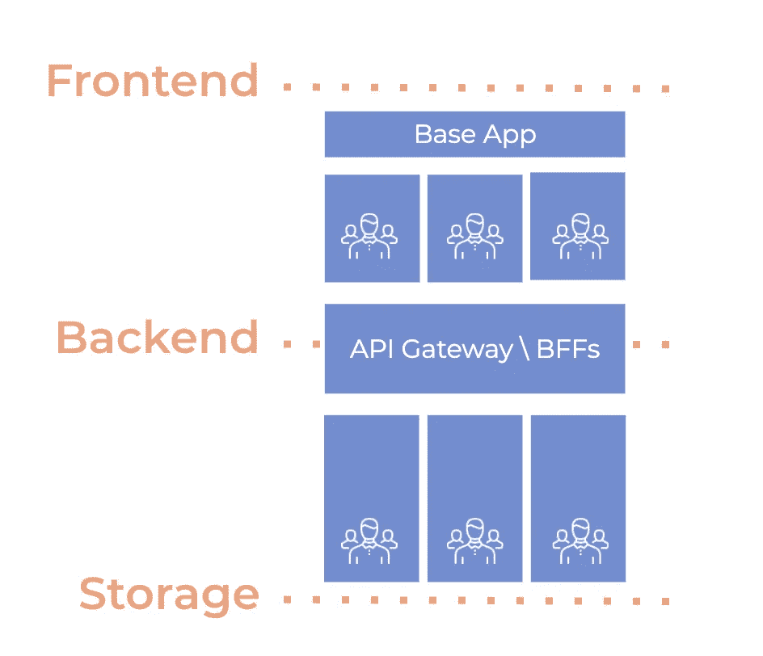
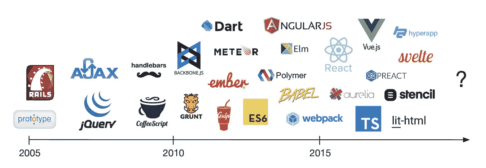
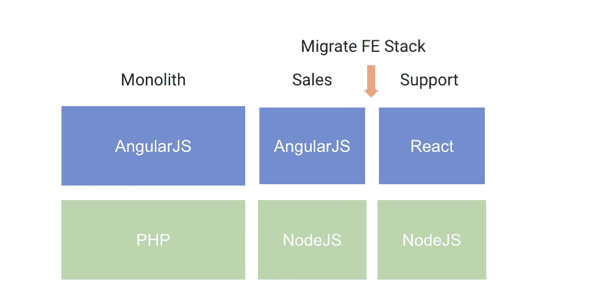

# 微前端之旅:技术不可知原则

> 原文：<https://itnext.io/the-micro-frontends-journey-tech-agnostic-principle-b61414b19505?source=collection_archive---------4----------------------->

微前端这个术语最早出现在 2016 年底的 [ThoughtWorks 技术雷达](https://micro-frontends.org/)中。去年，它从“评估”技术转变为“**采纳”技术。**

微前端与微服务共享一些设计原则，例如:

*   **团队所有权:**团队围绕一个特定的业务领域或功能建立，独立于其他团队来开发、测试和部署他们的特性。
*   **技术不可知:**每个团队可以选择不同的技术来解决不同的问题。

等等！你的意思是我们可以在同一个应用中混合 React 和 Vue.js 等框架？

是的。然而，你**能**的事实并不意味着你**应该**去做，至少在没有确凿理由的情况下。

作为一个组织，我们必须在整个公司范围内标准化实践和技术，最重要的是，我们必须发展它们。

## 前端技术变化很快

前端技术发展和变化非常快。新技术每年都会出现，社区开始尝试采用它们。

微前端——前端、后端，🌈快乐的——米卡赫尔·吉尔斯

我们看到一些公司几年前就开始使用旧的框架/库(AngularJS，BackboneJS)开发他们的应用程序。在某个时候，新的框架出现了(React，Vue.js ),然后开发人员开始学习并选择这些作为他们的主要技术栈。

在组织中，这可能导致人员配备和雇佣问题，以保持开发人员的参与，并雇佣那些乐于使用旧技术维护应用程序的开发人员。

开发人员随着技术发展他们的职业生涯。因此，本组织也必须与他们一起发展。

## 发展前端应用

我们认为为了采用新技术而从零开始迁移并不是一个好的商业方法，因为在完成之前我们不能交付新的特性。然后，我们需要找到另一种方法来逐步迁移它，并为轻松集成新功能奠定基础。

过去，我们已经看到一些公司开始逐步迁移他们的旧前端应用程序。然而，在这次迁移的某个时候，他们有两种技术(AngularJS，React)共存于同一个应用程序中。

使用微前端扼杀一个整体

在这种情况下，微前端的**技术不可知**原则更有意义。它帮助公司随着新技术和工程实践发展他们的应用。

它还让我们能够根据业务能力灵活地评估迁移的成本价值，从而做出相应的规划。

## 最后的想法

微前端并不是一项新技术，公司在过去已经这样做了，但是我们还没有使用微前端这个术语。像 Airbnb 这样的公司也使用类似的方法来迁移他们的堆栈。

此外，还有诸如 [Ara](https://ara-framework.github.io/website/) 和 [Single-Spa](https://single-spa.js.org/) 这样的框架来解决这个问题。

感谢阅读！留下你的评论😃