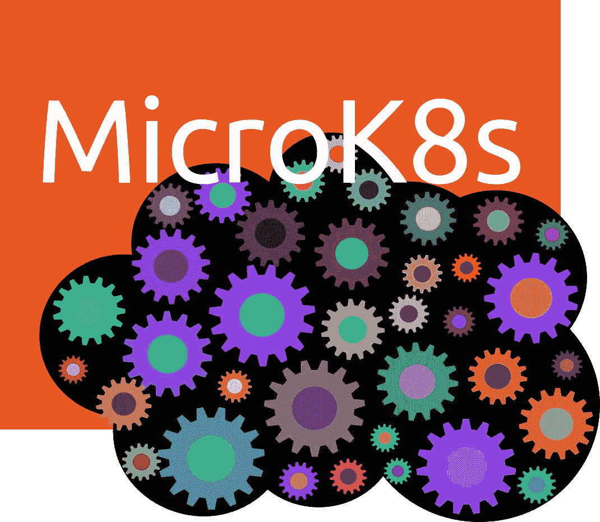
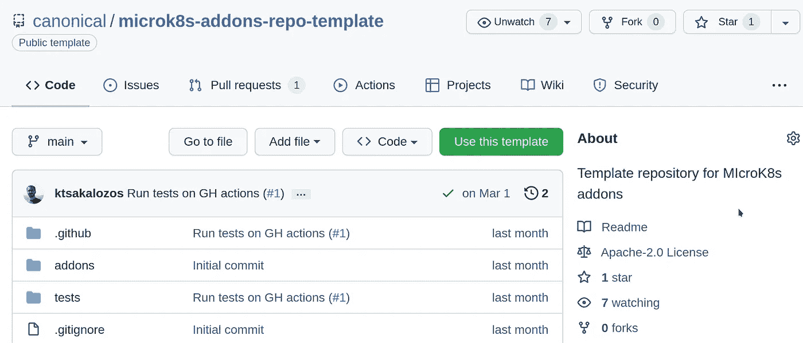

# MicroK8s 插件框架现在对所有人开放

> 原文：<https://itnext.io/the-microk8s-addons-framework-is-now-open-to-everyone-b8bea5a53a5d?source=collection_archive---------2----------------------->

插件是 MicroK8s Kubernetes 发行版中最受欢迎的特性之一，因为它们允许您在相同的同质 UX 下实现不同的 DevOps 操作。是否要应用 CoreDNS 清单，重新配置 kubelet 并重新启动群集上的节点？`microk8s enable dns`就是你所说的。是否要安装主机路径存储资源调配器并启动 Portainer？`microk8s enable portainer`正是如此。插件能做什么没有限制，唯一的限制因素是你的想象力！

随着即将到来的 *v1.24* 发布，我们已经向公众开放了插件框架。我们确保软件供应商和爱好者可以建立他们自己的插件库，并在运行的集群中就地编辑任何可用的插件。



在下文中，我们将探讨:

*   如何使用插件，
*   如何调整它们来满足你的需求，
*   创作插件并把它们放到你自己的 repo 中的过程，
*   如何通过社区插件库推广你的作品？

# 使用插件

在撰写本文时， *v1.24* 版本还处于测试阶段，因此您需要从最新的/edge 渠道安装 MicroK8s，以获得 addons 框架的最新更新:

```
sudo snap install microk8s --classic --channel=latest/edge
```

用`microk8s status`你可以看到可用插件的列表:

要启用一个插件，你需要调用`microk8s enable`，后跟插件的名字，例如`microk8s enable dns`。同样，`microk8s disable`禁用插件。

在上面的输出例子中，你可能会注意到每个插件的描述都是以`(core)`开头的，表示插件是从哪个库获得的。核心插件是由 MicroK8s 团队维护和支持的。除了核心插件之外，我们还提供了一套由社区维护的插件。要显示这些，您只需`microk8s enable community`

正如我们将看到的，添加、删除和更新存储库是通过`microk8s addons repo`命令完成的。`microk8s enable community`是一种快捷方式，可以让社区贡献可见，而无需知道相应回购的确切 URL。

# 根据您的需求就地成型插件

插件库是在`/var/snap/microk8s/common/addons`下克隆的 git 项目。例如，`core`存储库是一个`/var/snap/microk8s/common/addons/core`目录，其中有一个名为`addons`的文件夹及其所有附件。

注意到每个插件上的`enable`和`disable`可执行文件了吗？这些是每个插件实现的钩子脚本以及`microk8s enable`和`microk8s disable`命令期望找到和调用的。

有可能一个插件做了 95%你想要的，但不完全是你需要的。没有什么可以阻止你编辑各自的`enable`钩子来满足你的需求。尽管对编写这些钩子的语言没有限制，但它们通常以 bash 或 python 脚本的形式出现。

你自己试试这个。编辑`/var/snap/microk8s/common/addons/helm3/enable`并将`HELM_VERSION`设置为*“v 3 . 7 . 0”*。保存`enable`文件，调用`microk8s enable helm3`。是的，就是这么简单！

# 建立你自己的仓库

*v1.24 版本*最激动人心的特性是可以选择将第三方存储库添加到 MicroK8s 集群中。

为了引导存储库创作过程，MicroK8s 团队提供了一个带有两个玩具插件(python 和 bash)的模板存储库。那个仓库可以在 https://github.com/canonical/microk8s-addons-repo-template 找到。 [README.md](https://github.com/canonical/microk8s-addons-repo-template#readme) 和 [HACKING.md](https://github.com/canonical/microk8s-addons-repo-template/blob/main/HACKING.md) 页面将指导您完成这项任务。



在这里，我们简要介绍一下您需要采取的主要步骤:

*   分叉[模板库](https://github.com/canonical/microk8s-addons-repo-template)。如果你登录到 Github，只需点击*“使用这个模板”*按钮，并填写“新建库”表格。
*   每个 repo 顶层的`addons.yaml`保存着插件列表。用你要运送的附件列表替换这个列表。每个条目都有以下字段:
    - **名称:**插件名称
    - **描述:**打印在`microk8s status`输出中
    - **版本:**一个字符串，包含你的插件版本
    -**check _ status:**`microk8s status`将检查什么来判断插件是否被启用。这可以是 Kubernetes 中的部署，也可以是主机上充当锁文件的文件。
    - **支持的架构:**目前 MicroK8s 支持 AMD64、ARM64 和 S390x。
*   在`addons`下创建一个目录，以您将要实现的插件命名。
*   在您创建的目录中添加两个**可执行文件**，分别命名为*启用*和*禁用*。这些可执行文件可以用任何语言编写，并由`microk8s enable/disable`命令调用。

此时，您可以将您的存储库添加到 MicroK8s 中，如下所示:

```
sudo microk8s addons repo add fantastic https://github.com/myorg/myrepo
```

`fantastic`是您给存储库的 ID。从这一点开始，该 ID 用于在更新和删除回购时引用回购，例如:

```
sudo microk8s addons repo update fantastic
sudo microk8s addons repo remove fantastic
```

知道了插件是 git 项目，在开发时就有了许多工作流:

*   使用`--reference`标志，您可以添加一个存储库并指向一个分支/标签:

*   您可以添加一个 git 项目作为您主机上的本地存储库:

*   使用`microk8s addons repo update`获取您正在工作的存储库上的最新变更。或者，您可以直接在`/var/snap/microk8s/common/addons/`下克隆一个 git 存储库，MicroK8s 会将其作为一个存储库。

# 在社区回购中推广您的工作

MicroK8s 附带了核心插件和社区插件。为了不扰乱用户输出，社区插件是不可见的。您需要`microk8s enable community`或者像添加任何其他存储库一样添加社区存储库:

为了推广你的作品，你可以分叉[社区库](https://github.com/canonical/microk8s-addons.git)，添加你的插件，并放置一个针对上游回购的 PR。一些你应该知道的事情:

*   新插件只在新版本中添加。这意味着一个版本的插件集(例如 *v1.24* )在补丁发布期间不会改变。新合并的插件将在下一个版本中提供。
*   每个插件都应该有一个维护者。这些插件不是“捐赠”给 MicroK8s 团队的。
*   每一个插件都应该有一个测试，以确保它正确部署。此时，测试是基于 python 的，位于`tests`目录下。在每个补丁发布之前，我们确保所有的测试都通过了。

# 总结

MicroK8s 最强大的特性之一，插件，现在对每个人都是免费的。我希望你会享受这种自由，期待看到你会想出什么插件！

如果你在旅途中需要任何帮助，请不要犹豫[伸出援手](https://microk8s.io/docs/get-in-touch)。

# 参考

[](https://microk8s.io) [## MicroK8s -面向开发人员、edge 和物联网的零运营 Kubernetes | MicroK8s

### 面向开发人员、云、集群、工作站、边缘和物联网的低运营成本、最小生产量 Kubernetes。取得联系选择…

microk8s.io](https://microk8s.io) [](https://github.com/canonical/microk8s-addons-repo-template) [## GitHub-canonical/micro k8s-addons-repo-Template:micro k8s 插件的模板库

### 一个 MicroK8s 插件库应该对它所包含的插件集合有一个全面的描述。当前…

github.com](https://github.com/canonical/microk8s-addons-repo-template)