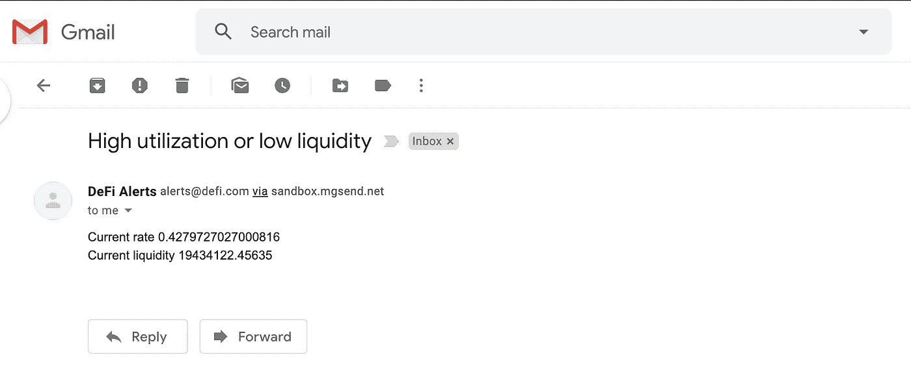

# 极简 DeFi 流动性警报——管理 DeFi 银行挤兑风险的有效方法

> 原文：<https://itnext.io/the-minimalist-defi-liquidity-alert-an-effective-way-to-manage-defi-bank-run-risk-f5e74150a526?source=collection_archive---------6----------------------->


对于那些不知道标题内容的人，我在此道歉。金融本身是一个很深的话题，有许多权衡，类似于工程领域。据一位伟大的经济学家[托马斯·索威尔](https://en.wikipedia.org/wiki/Thomas_Sowell)

> *没有解决方案，只有权衡取舍*

在 DeFi(去中心化金融)的意义上，尽管我们都喜欢[的高利率](https://interest.coinmarketcap.com/currencies/usd-coin)，但在这个新兴行业中，取舍并不总是很明确。基本概念非常简单合理。事情是这样的:

*   对于美元借款人:他们将自己的加密货币作为抵押品来借入美元，并支付利息
*   对于美元贷款人:他们将美元存入银行，然后贷给借款人，并收取利息

高利率和健全的模型感觉超级好。现在，我们来谈谈其中的取舍，嗯，有很多。Ameen 的这篇文章在阐述风险方面比我做得更好。如果你对 DeFi 感兴趣，并梦想在夏威夷靠被动收入生活，我强烈推荐你完整阅读。这篇文章是关于一种风险，被称为银行挤兑风险。

那到底是什么？简而言之，就是当系统中没有足够的美元供贷方完全提取所需金额时。他们需要等待借款人还款，或者等待新的贷款人向金融体系注入新的美元。这可能发生在传统银行，也可能发生在 DeFi。对于贷方来说，保护自己的最好方法是密切关注系统中可用的美元数量。这就是 DeFi 打败传统银行系统的地方。一切都是公开的，对程序员友好，定义良好。我不知道你怎么想，但比起法律或金融术语，我更擅长阅读代码。同样，权衡是没有中心化，真正由我们来管理我们自己的风险。

现在，我希望你对这篇文章有一些基本的概念。让我们深入研究它的技术部分。

# 复合协议

这篇文章聚焦于一个特定的借贷协议，被称为[复合](https://compound.finance/)，并且只关注一个市场，即[美元硬币](https://app.compound.finance/asset/cUSDC)。在撰写本文时，复利提供了最高的流动性(最可用的美元硬币)，他们的智能合约由第三方公司[审计和验证](https://compound.finance/developers/security)。在撰写本文时，它还在 [DeFiS 得分](https://defiscore.io/)中得分最高。

美元硬币(又名 USDC)和稳定币也是如此。它是由业内享有盛誉的[比特币基地](https://www.coinbase.com/usdc)和[圈子](https://usdc.circle.com/)推出的。我个人认为他们提供了最好的法定货币入口/出口体验。

请 [DYOR](https://www.urbandictionary.com/define.php?term=DYOR) 选一个借贷协议和稳定币。这篇文章纯粹是为了区块链技术的教育目的，而不是投资。

# 在 Python 中我们信任

我想要的只是一个简单的警报，当可用的 USDC 数量很低时，或者当超过 65%的美元存款被借入，只剩下 35%可供贷方提取时，给我发一封电子邮件。我坚信最好的代码就是没有代码。就像我在标题中承诺的那样，让我们看看是否可以用尽可能少的行来逃脱。

## Requirements.txt

简单，我们只需要 2 个包

```
web3~=5.0 
requests~=2.0
```

web3 包用于与以太坊区块链上的智能合约通信，因此我们可以获得警报所需的数字。这个帖子只用了其中的一小部分。如果你想了解更多关于区块链编程的知识，我强烈推荐[这篇文章](https://www.dappuniversity.com/articles/web3-py-intro)作为开始。

## Infura —您需要的以太坊 API

现在在 [Infura](https://infura.io/) 上注册一个免费账户。相信我，有人来运行一个完整的节点并为您提供 API 要容易得多。在本地运行一个完整的以太坊节点并不好玩。一旦你在 Infura 中创建了一个项目，你会得到一个项目 ID，它可以用来创建一个 w3 对象。

```
from web3 import Web3 w3 = Web3(Web3.HTTPProvider('https://mainnet.infura.io/v3/<YOUR PROJECT ID>'))
```

# 与智能合同对话

要与智能合同对话，您需要其地址。这里是如何得到它

```
CONTRACT_ADDRESS = '0x39aa39c021dfbae8fac545936693ac917d5e7563' checksummed_address = w3.toChecksumAddress(CONTRACT_ADDRESS)
```

[合同地址](https://etherscan.io/address/0x39aa39c021dfbae8fac545936693ac917d5e7563)指向复合 USDC 市场。这是我们需要交互的契约。

好了，是时候建立一个契约对象并访问它的数据了。要做到这一点，我们将需要一个叫做 [ABI](https://solidity.readthedocs.io/en/v0.5.3/abi-spec.html) 的东西来指定一个合同能做什么。像提出请求一样简单，然后传递出去。

```
import requests r = requests.get(f'https://api.etherscan.io/api?module=contract&action=getabi&address={CONTRACT_ADDRESS}') contract = w3.eth.contract(address=checksummed_address, abi=r.json()['result'])
```

现在我们完成了所有的设置。让我们通过得到所有需要的数字来开始聚会。

```
liquidity = contract.functions.getCash().call()total_borrow = contract.functions.totalBorrows().call()total_supply = liquidity + total_borrow
```

*   流动性:剩余的可用美元数量
*   total _ borrow:USDC 借入的金额
*   total_supply:当前可用加上借出的美元

# 发送警报

为了简单起见，我再次使用了[气枪](https://www.mailgun.com/)。对我来说，发送一封带有 post call 的电子邮件就足够了。它也可以免费用于本文的目的。

# 利润

出于测试目的，我将阈值设置为 30%来触发警报。这是您将在电子邮件中收到的内容。



现在你需要做的就是在 linux 机器上部署代码，并使用 [crontab](http://man7.org/linux/man-pages/man5/crontab.5.html) 运行它。我会把这部分留给你。如果你需要任何帮助，请在推特上给我打电话。

# 那么，它有多少行代码？

这是完整的 Python 脚本。原来是只有 28 行的:D

*原载于*[*http://github.com*](https://gist.github.com/stevenc81/f59aa2d91736b7ef3eeb74d0498280cd)*。*