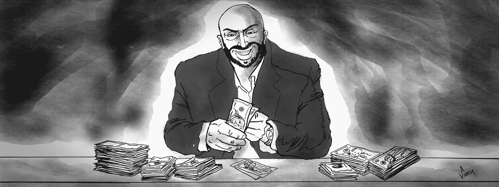
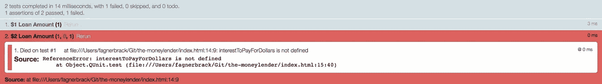
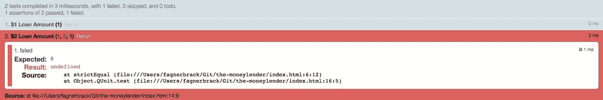

# 缺少实用的分步 TDD🔊

> 原文：<https://itnext.io/the-missing-practical-step-by-step-test-driven-development-a7140ca4b71?source=collection_archive---------0----------------------->

## 所以你有固定的规格和期限？抱歉，这不是借口

一个留着短胡须的秃顶男人的照片。他微笑着在桌子上数钱。他周围笼罩着一层阴影。

听听音频版！

很多人说 [TDD 有用](https://medium.freecodecamp.org/why-test-driven-development-4fb92d56487c)。然而，经常会遇到这样的情况，一个开发人员说他们已经做了很长时间的 TDD，但是却发现他们一直在做一些完全不同的事情。

这就像[维特根斯坦的甲虫](https://medium.com/@fagnerbrack/wittgenstein-s-beetle-in-software-engineering-dcea89a5db92)。如果每个人都有一个黑盒子，他们把盒子里的东西叫做“甲虫”，那么两个人笼统地谈论同一件事是正常的，比如“TDD 是好的”或“TDD 是坏的”然而，也很有可能他们每个人对他们谈论的主题都有不同的观点和理解。

这是我写的一篇文章，试图展示在实践中找到解决问题的更好方法。这是一种确保你理解 TDD 是什么意思的方法，或者至少对我来说是什么意思。

我会试着遵循[三大法则](http://butunclebob.com/ArticleS.UncleBob.TheThreeRulesOfTdd):

> 1.除非是为了通过失败的单元测试，否则不允许编写任何产品代码。
> 2。不允许编写任何超过足以导致失败的单元测试；编译失败就是失败。
> 3。除了足以通过一个失败的单元测试之外，您不允许编写更多的产品代码。

> 测试驱动开发是主观的。每个人对如何应用它有不同的理解。

好的，那么我们要解决的[问题是什么](https://levelup.gitconnected.com/the-problem-you-solve-is-more-important-than-the-code-you-write-d0e5493132c6)？

让我们问问臭名昭著的杰克:

> 嗨，书呆子，我是放债人杰克。
> 
> 我的业务是发放贷款。例如，我可以给你一笔小额贷款，但不要试图得到太多。如果你这样做，那么我将收取超过一定门槛的每一美元的利息。
> 
> 然而，我很难计算出。做一些能帮我做到的东西，好吗？这就是你的工作，对吗？
> 
> 哦，我差点忘了:我周五需要那个。
> 
> 0 美元到 2000 美元=无利息
> 
> 从 2001 美元到 5000 美元=每美元 9 美分
> 
> 5001 美元到 10000 美元=每美元 14 美分
> 
> 10001 美元+ =每美元 21 美分

这个故事与你在现实生活中可能遇到的小问题有很好的联系，甚至是“星期五的事情”

鉴于“放债人杰克”问题的特点，这篇文章将使用伦敦 TDD 学校，也称为 [Inside Out 测试驱动开发](https://8thlight.com/blog/georgina-mcfadyen/2016/06/27/inside-out-tdd-vs-outside-in.html)。

有一个[存储库](https://github.com/FagnerMartinsBrack/jack-the-moneylender/commits/v1)，在那里你可以看到每个测试运行的一个提交。该存储库显示了红色/绿色/重构步骤。

*   提交有一个🔴当它代表**红色**步骤时。
*   当提交代表绿色的**步骤时，它有一个绿色的✅。**
*   提交有一个🔨当它代表**重构**步骤时。

这篇文章遵循与[代码审查和测试优先开发](https://medium.com/@fagnerbrack/code-review-and-test-driven-development-4c19b69b5761)相同的原则。不同之处在于，我将提交进行了拆分，以暴露我对测试驱动开发的想法，而不是测试优先。

> 杰克是个放债人，也是个败类。

第一件事是建立一个绿色测试的编码环境，以确保所有的依赖项都工作正常。我的偏好是让事情变得简单，除了测试库之外，没有 npm 或任何其他依赖关系。

让我们回到原点，从 QUnit 开始:

代表测试环境设置的[提交](https://github.com/FagnerMartinsBrack/jack-the-moneylender/commit/da4e3f49de3b9df1351b0fce2f5c52e7c1870055)的差异。

在断言中，我想避免 QUnit 的 API 中的[参数陷阱](https://youtu.be/loj3CLHovt0?t=22m25s)，它存在于“实际”和“预期”参数上。因此，我创建了另一个带有命名参数的函数，它可以接收 QUnit 的“assert”对象。

🔴[提交](https://github.com/FagnerMartinsBrack/jack-the-moneylender/commit/494cb32d0782370f49e88b23db60a68e7dd86d38)的差异，它将一个伪断言更改为使用自定义函数“严格相等”

✅The diff 用于创建自定义函数“严格相等”并使测试通过的[提交](https://github.com/FagnerMartinsBrack/jack-the-moneylender/commit/1e0600d17f7a4367cb573950c7c176a19baae26d)。

现在我们来看问题。这有一些关键的界限:0 到 2k，2k 到 5k，5k 到 10k 和 10k+。

先说简单的。我将只关注一个可能驱使我增加代码的最低层次的[转换](https://8thlight.com/blog/uncle-bob/2013/05/27/TheTransformationPriorityPremise.html)的断言，没有别的。

我能想到的最直接的测试是贷款金额为零美元。然而，这似乎不是一个合理的商业案例。如果杰克想计算贷款金额为零，这意味着他没有给任何人贷款。因此，他不会在我写的代码中看到价值。

一想到第一次测试，我就向杰克询问这个特殊案例:

> 贷款为零？拜托，这太荒谬了！
> 
> 哦，等等，我确实给你寄了零美元的说明书…好的。
> 
> 很高兴看到你发现了我逻辑上的一个漏洞。我不知道你能做到这一点！
> 
> —杰克，那个混蛋……呃……放债人

我将变量“利息支付”初始化为“未定义”,得到默认的“空”结果和测试失败。假设杰克贷款 1 美元，预期结果为零。

因此，测试失败，因为变量是“未定义的”

🔴[提交](https://github.com/FagnerMartinsBrack/jack-the-moneylender/commit/caf994034d845f15a8b968b27e65c6a6463baa2d)的差异增加了对 1 美元贷款金额的测试。

出于本文的目的，让我们想象一下,**服务器**代表了为客户端产生可消费的东西的代码。**客户机**消费服务器产生的任何东西。

在上面测试的上下文中，**服务器**计算变量“支付利息”的结果。在这个阶段，服务器没有被明确地建模。**客户端**是测试代码。测试代码读取变量“利息支付”并将其传递给断言函数。

我在**服务器**中可以做出的最直接的改变是将$0 返回给变量“要支付的利息”，这可以促使我通过测试

将变量“利息支付”设置为 0 的[提交](https://github.com/FagnerMartinsBrack/jack-the-moneylender/commit/12700e1666af6d2e17edfaeefe42c6b20c7683da)的差异。

在下一个测试中，让我们对贷款金额为 2 美元的行为进行编码。鉴于我以前没有建模过**服务器**,现在这是一个绝佳的机会。下一个测试假设一个名为“支付美元利息”的函数

🔴[提交](https://github.com/FagnerMartinsBrack/jack-the-moneylender/commit/1ce93015b0f12ad2b8ac076588b297376d7ca447)的差异增加了对$2 贷款金额的测试。

哦，测试抛出“引用错误”是因为函数不存在，不过没关系。

TDD 的[规则 2](http://butunclebob.com/ArticleS.UncleBob.TheThreeRulesOfTdd) 明确表示:

> […];编译失败就是失败
> 
> —[TDD 编号 2 的规则](http://butunclebob.com/ArticleS.UncleBob.TheThreeRulesOfTdd)

在这种情况下，您可以将规则理解为:

> […];而引用错误就是失败

QUnit 测试失败的屏幕截图。它因引用错误而失败；消息是函数“支付美元的利息”没有被定义。

好吧，我假设这个错误是一个常规的测试失败。然而，这种情况下的“修复”不会导致通过测试，而是会导致不同的错误消息。

🔴定义函数“支付美元的利息”的[提交](https://github.com/FagnerMartinsBrack/jack-the-moneylender/commit/287deb585a0967c29137e1751f0e845e3d97a4a3)的差异

现在失败来自于 QUnit 断言。看起来我已经修好了。

和之前一样的截图，只是现在显示的是断言失败。它显示“预期:0”，“结果:未定义”

如果用户要求贷款 2 美元，利息将为零..

✅为从函数“支付美元的利息”返回预期结果的[提交](https://github.com/FagnerMartinsBrack/jack-the-moneylender/commit/128f784fd18634c14804b05c226b3b86fcd8fa1b)的差异

如果我一次又一次地增加一美元，就没有什么能驱使我去修改代码，使它更通用。遵循这种模式的新测试对我没有任何价值。它总是会过去的，因为在我开始测试 2001 美元或更高的下一个边界之前，没有利息回报的每一笔贷款都是有效的。

是时候改变策略了。

✅为[提交](https://github.com/FagnerMartinsBrack/jack-the-moneylender/commit/c5823786061da4b8a8e7b421ad042f528794fe59)添加了对$3 贷款金额的测试。

然而，尽管一个新的通过测试并没有为我的测试驱动方法提供价值，但它帮助我理解了 [DRY](https://en.wikipedia.org/wiki/Don%27t_repeat_yourself) 是否有意义。

请注意，我已经第三次复制了代码。因此，[正如我过去写的](https://medium.com/@fagnerbrack/how-to-solve-the-challenge-of-reusability-ac4edce069c9)，有足够的证据表明我可以将代码重构为可重用的函数。

🔨[提交](https://github.com/FagnerMartinsBrack/jack-the-moneylender/commit/9cad810bc725fd958e555b969bc9b7bd22360969)的不同之处在于重构测试以重用函数“支付美元的利息”

在测试一个问题的边界时，我发现有一件事非常有帮助，那就是至少测试三次周围环境。在“放债人杰克”问题的上下文中，环境是 2000 美元、2001 美元和 2002 美元的贷款金额。

***注:*** *为了简洁起见，我不再分别提及红色和绿色测试。然而，假设每个片段都有一个失败的测试。如果转到* [*Github 项目*](https://github.com/FagnerMartinsBrack/jack-the-moneylender/commits/master) *，可以分别看到每个提交中的通过和失败测试。*

✅为[提交](https://github.com/FagnerMartinsBrack/jack-the-moneylender/commit/5bf0a77c7ebd3ae288bc19af4226d063b49c3875)添加了对$2000 贷款金额的测试。

2000 美元的贷款金额没有多大帮助，测试刚刚通过，因为它与之前的范围相同。我仍然期望它是零。

让我们试试 2001 美元。它不应该返回零，而是 9 美分。

🔴✅为[提交的 diff](https://github.com/FagnerMartinsBrack/jack-the-moneylender/compare/5bf0a77c7ebd3ae288bc19af4226d063b49c3875...ba43be5e06c5edceb47528872c832c7f0a98792a)创建了贷款金额为$2001 的代码。

这里你可以看到一个普遍的软件开发错误:使用浮点数来表示货币。有[很多](http://wiki.c2.com/?FloatingPointCurrency)的[内容](https://husobee.github.io/money/float/2016/09/23/never-use-floats-for-currency.html)出来[那里](https://stackoverflow.com/questions/3730019/why-not-use-double-or-float-to-represent-currency)关于[这个主题](https://spin.atomicobject.com/2014/08/14/currency-rounding-errors/)。所以，这里就不赘述了。

为了理解我的代码将会产生的精度影响，我创建了一个 JSFiddle 来模拟$2001 到$5000 之间的美元:

***注意:*** *为了避免跑题和偏离本文的主题 TDD，我将使用 JavaScript“Number”类型，好像它可以正确地表示一种货币。* [*还有另一篇文章*](https://medium.com/@fagnerbrack/how-to-build-a-money-data-type-in-javascript-7b622beabe00) *展示了如何将它转换成一个合适的货币模型。*

如果我们继续我们之前走的路，我们最终会得到如下所示的产品代码:

🔴[的 diff 提交](https://github.com/FagnerMartinsBrack/jack-the-moneylender/compare/9cad810bc725fd958e555b969bc9b7bd22360969...b03fb7751415ef1abed6fb9626a65eb74dbd1f8f)，为贷款金额$2000、$2001、$2002 和$2003 创建代码。

我能在代码里看到很多[不良代码气味](https://medium.com/@fagnerbrack/code-smell-92ebb99a62d0)。最烦人的似乎是代表 9 美分的常数相加的结果。重构代码以使用乘法是有意义的。

🔨用于[提交](https://github.com/FagnerMartinsBrack/jack-the-moneylender/commit/f5202a4e62614f13cf3e1e2547fd78abb257cb31)的代码，该代码重构代码以将和变为乘。

现在我看到了一种模式。虽然写愚蠢的条件句初看起来很幼稚，但它们向我展示了，对于 2000 美元以上的每一美元，我可以将这个数字乘以 9 美分。当然，直到我到达下一个区间 5001 美元。

此外，我可以更改代表右侧乘法因子的[幻数](http://wiki.c2.com/?MagicNumber)。如果我把“贷款金额”减去前一个范围的最后一个值，我将总是得到条件内每个值的增量结果。

🔨[提交](https://github.com/FagnerMartinsBrack/jack-the-moneylender/commit/532d3e8e9853bcd4cd482a42ce08942507660474)的差异重构代码，以动态计算每个条件的美元值。

现在我发现了一个[渐进式思考的绝佳机会](https://levelup.gitconnected.com/code-less-think-more-incrementally-98adee22df9b)！。

需求说我需要支持很多范围。然而，如果杰克同意的话，他现在就可以拥有一个工作软件**。他可以将该函数粘贴到 Chrome DevTools 中，并查看他提供的贷款金额是否“没有利息”,或者在每美元 9 美分的基础上他应该收取多少费用。对于超过 2001 美元的贷款，他需要等到我可以支持其他范围。**

**我问了杰克，他印象深刻。他甚至不知道这种事是可能的！他认为他将不得不等待很长时间才能得到满足所有要求的软件。他的大多数客户都获得了 2000 美元左右的贷款，所以这种方法对他来说很有价值！**

**为了产生有价值的软件，我需要去掉所有其他的条件，只留下第一个。此外，我需要将相等比较改为“大于或等于”**

**🔨[提交](https://github.com/FagnerMartinsBrack/jack-the-moneylender/commit/5864165bff4061532c38791c356df5d2a9d4a8e2)的区别在于重构代码以删除不必要的条件。**

**下一步可以是在测试中为问题的每个边界添加描述。**

**🔨[提交](https://github.com/FagnerMartinsBrack/jack-the-moneylender/commit/e413fd6ed9de898820ee331d578da40ef07c6413)的不同之处在于重构代码，将测试分成块。**

**还没完成。**

**我需要移除所有剩余的[幻数](http://wiki.c2.com/?MagicNumber)。毕竟，谁会用对下一个开发人员毫无意义的常量来发布代码呢？我不知道。**

**🔨[提交](https://github.com/FagnerMartinsBrack/jack-the-moneylender/commit/d0de7c4f03fc3c85af62a392a747a9bff9f6f0c7)的区别在于重构代码以移除所有幻数。**

**一旦完成，我就可以说我有了一个可交付的软件；只是它没有包含所有的特性。如果我愿意，我可以编写一个简单的 web 服务器，将结果打印成 HTML，并在后端使用这个函数。**

> **如果你有一个固定的规格和一个设定的截止日期，你必须跳出那个黑箱去思考**

**我遇到了一个有固定规格和固定期限的问题。TDD 帮助我找出了原始规范中的缺陷。此外，通过将[增量思想](https://levelup.gitconnected.com/code-less-think-more-incrementally-98adee22df9b)与 TDD 过程和[专注于手头的问题](https://levelup.gitconnected.com/the-problem-you-solve-is-more-important-than-the-code-you-write-d0e5493132c6)相结合，我设法减少了交付时间。如果我一口气开始编写所有的代码，我就做不到这一点。**

**大爆炸思维模式。**

**也许最后的结果并不是[的**最好的**方案](https://hackernoon.com/how-to-destroy-the-myth-of-the-proper-solution-94ca958def1f)。测试驱动的开发不是关于完美，而是关于编写代码，这样测试就可以驱动你找到某个解决方案。它有助于你对这个问题有更好的理解。它不会神奇地把你变成伟大的程序员、问题解决者或软件设计师。**

**此外，TDD 可以作为一种训练来帮助记录您在测试中的想法，同时编写代码。这对[结对编程](https://medium.com/@fagnerbrack/pair-programming-8cfbf2dc4d00)和[乌合之众编程](https://hackernoon.com/how-mob-programming-will-make-you-more-effective-590a1b7e0418)非常有用，在这种情况下，没有人知道甲虫彼此头部的细节。**

**在下一篇文章中，我将改进这段代码来测试后续的边界。您将看到如何应用同样的[技术](https://medium.com/@fagnerbrack/the-trick-to-write-better-software-lies-on-the-technique-944015f84ce4)来计算贷款金额，5000 美元以上的每一美元的利率为 0.14 美元。此外，我将对测试描述进行一些更改，以便它们使用领域的语言，而不是开发人员的语言。**

**敬请期待📻。**

****编辑 2018 年 11 月 8 日:** [下面是下一个帖子](https://medium.com/@fagnerbrack/this-is-the-one-thing-nobody-told-you-about-tdd-7f549254cd74)**

**感谢阅读。如果您有任何反馈，请通过 [Twitter](https://twitter.com/FagnerBrack) 、[脸书](https://www.facebook.com/fagner.brack)或 [Github](http://github.com/FagnerMartinsBrack) 联系我。**

**感谢[乔恩·艾夫斯](https://joneaves.wordpress.com/)、[杰伊·巴祖齐](http://jay.bazuzi.com/)、[里卡多·奥东内](https://twitter.com/RiccardoOdone)、[西达尔特·萨伦克](https://www.linkedin.com/in/siddharthsalunke/)、**斯蒂芬·克拉森**和**莱昂蒂·比尔斯基**对这篇文章的真知灼见。**