# 编写 API 请求最常见的错误

> 原文：<https://itnext.io/the-most-common-mistake-of-writing-api-requests-4eda46dce03d?source=collection_archive---------1----------------------->

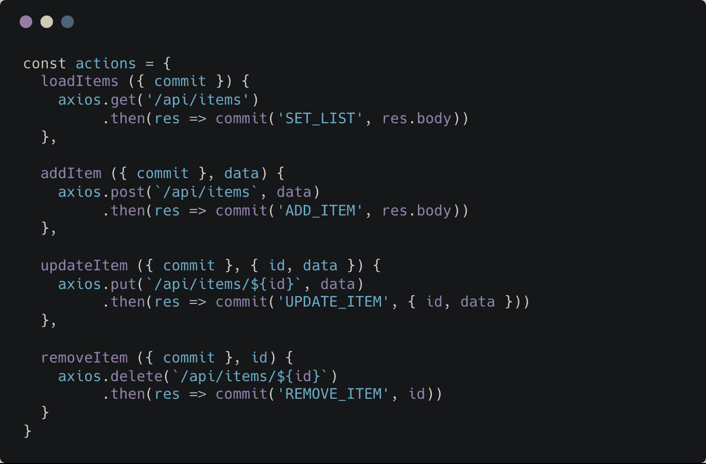

大家好！今天我将再次谈论 API 请求组织，并且我将提出一点建议

大多数被认为是“最佳实践”的指南甚至框架文档都告诉我们要遵循以下方法

如果你在 Vue.js 和 Vuex 上，你可能经常会看到这样的 smth:

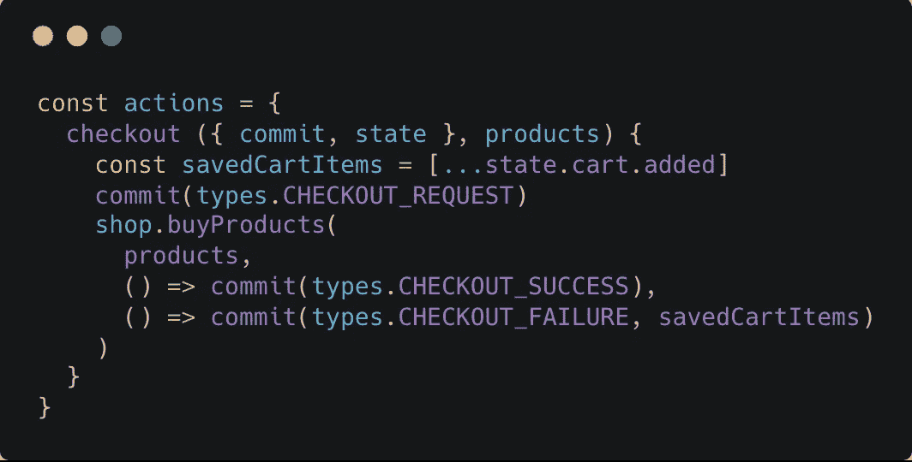

官方示例来自 [**Vuex 文档**](https://vuex.vuejs.org/en/actions.html#dispatching-actions)

如果您在 React 和 Redux 上，您会看到更多的变体，但您通常只会看到以下内容的包装:

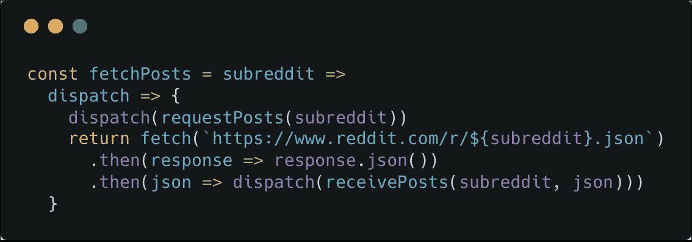

官方示例来自 [**Redux docs**](https://redux.js.org/advanced/async-actions#actions.js-(with-fetch))

我敢打赌，你的大多数 Vuex/Redux 动作只是做 API 请求，然后更新状态。不是吗？

但是..如果我说只是**错**呢？**有人马上关闭帖子**

# 那么，什么是错的？

我将跳过创建仅包装 API 请求的愚蠢动作的争论。这是一个样板代码，但这不是一个大问题。

这里只有一个非常错误的时刻。

> Redux/Vuex(在适用的地方加下划线)是一个**状态**管理，**不是 API** 。它应该只关心数据及其变化，但也处理 API 请求

想象一下，我们有一些存储模块，我们应该保持正确的状态。我们有一些 API 为我们做一部分工作(添加客户端令牌，处理结果等)。

我将使用 Vuex 作为代码示例。因此，我们将创建执行 API 请求的动作，然后更新我们的状态

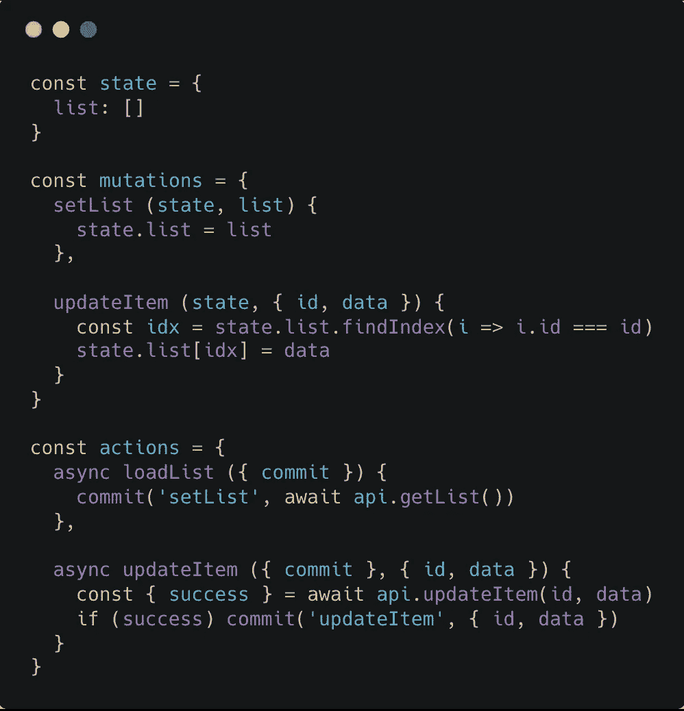

典型的商店模块。不是吗？

然后，我们只需调用我们的行动，并感觉良好

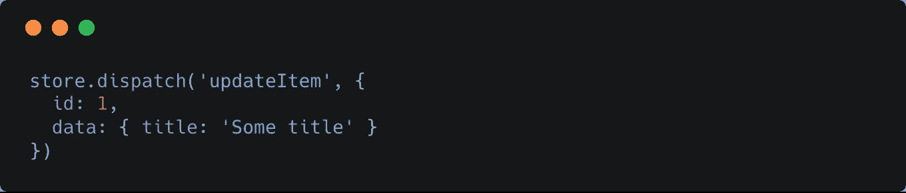

但是如果我做了呢..这个？..

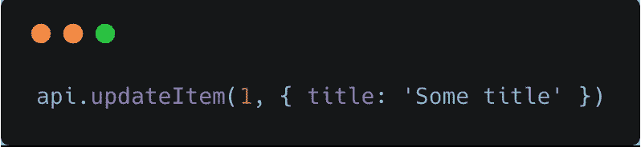

不对不对！！！

因此，状态中没有更新。商店操作日志中没有信息。它刚刚发生，你的应用程序不知道。不管你使用什么工具，这只是一个最常见的架构错误。

如果您认为*文档只提供了显示%technology_name%如何工作的基本示例*，请尝试找到其他示例。

# 什么是替代方案？

我的观点是—

> 如果你有一些 API 总是必须在请求后做一些事情，那么它应该由 API 方法来完成，而不是由它的包装器或其他应用程序部件来完成

这就是为什么我们需要 API 层的原因。

到目前为止，我发表了一篇关于我的新图书馆——API case 的文章。它解决了这个问题，你不需要*创造自己的自行车*。你可以在这里阅读更多关于 Apicase 的内容:

 [## 如何不受 API 的困扰

### 重新思考 Apicase 和为什么我仍然没有使用 axios

itnext.io](/how-not-to-suffer-with-apis-8aa75f890fe6) 

我不想在这里深究 Apicase，但我认为这是解释和展示我的想法的最佳方式。

想法是写依赖于 API 请求**的逻辑在这些请求**里面。在 Apicase 中，可以和 events + meta 一起使用。元在请求中通过有效负载传递。在请求开始/进展/完成/失败等时调用事件。

所以，*存储动作* **不应该**调用 *API 请求*，而是 *API 请求* **应该**调用存储动作*。*

*我将基于 Vue.js 编写例子，因为它是我最喜欢的前端框架。所以，让我们写一些猴子代码，然后我们会尽量使它更简单。*

## *第一步。提交存储*

*Apicase 有两个很好的特性可以轻松实现这个想法:*

*   *接受请求的事件`context`*
*   *Context 有`meta`选项，你可以传递任何你想要的东西，这样它就可以在事件中使用*

*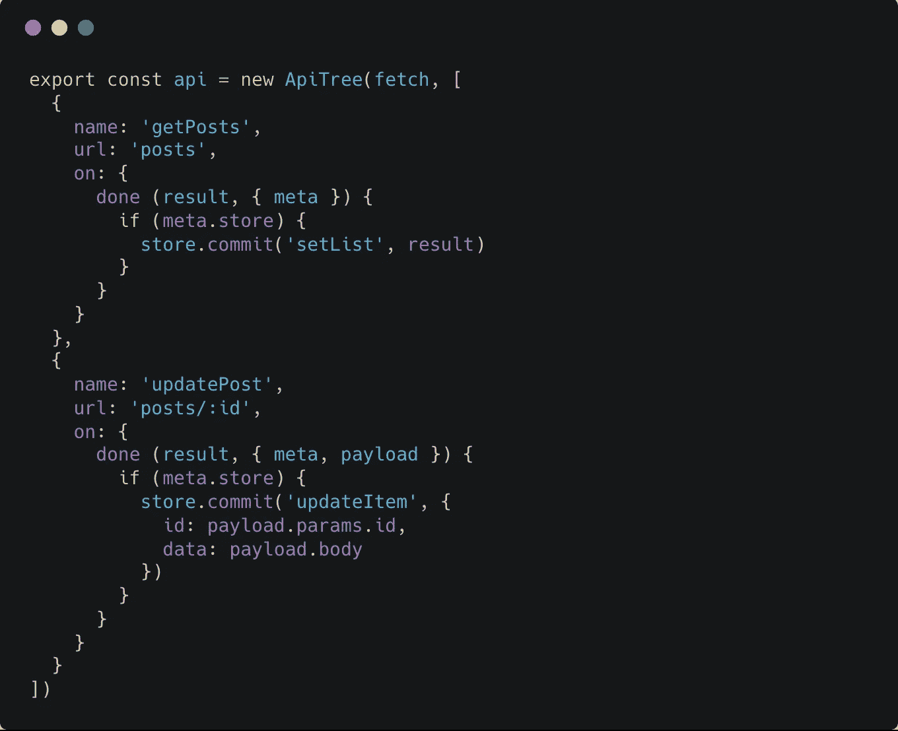*

***完成**事件的服务。如果我们有 store —提交一些更改*

*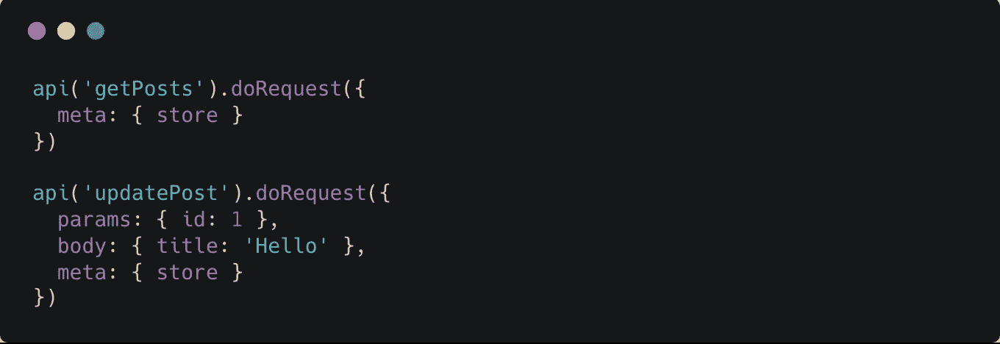*

*只需传递有效负载和存储请求*

*看起来好多了，但还是不安全。我们可以只做请求而不存储。因此，如果没有存储通过，我们将抛出一个错误。*

## *第二步。添加一些检查*

*Apicase 有两个特性:*

*   *具有无限继承性的服务，允许你拆分和“堆叠”有效负载、元、钩子等。*
*   *在请求之前/之后调用的中间件(称为“钩子”)，可以修改有效负载、改变响应状态、中止请求、重试请求等。*

*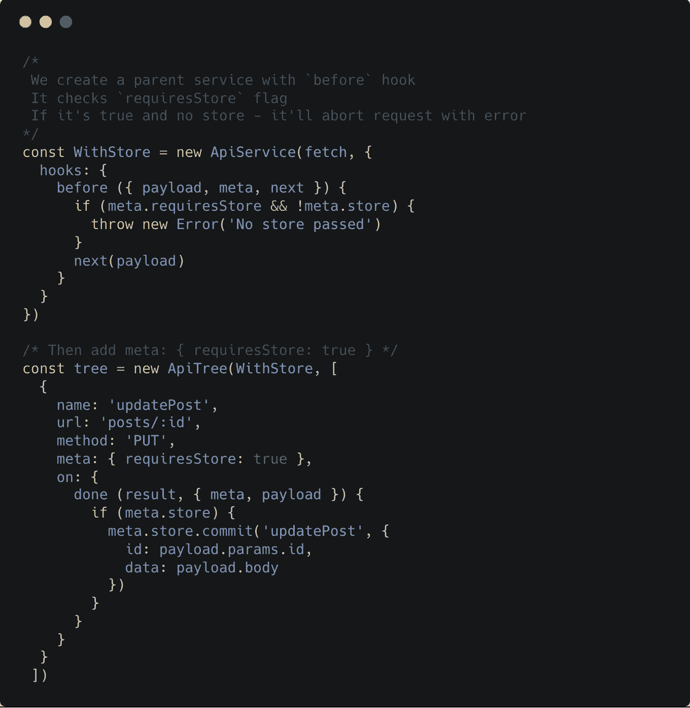*

*我觉得更安全，你呢？*

*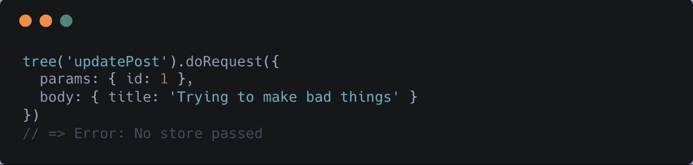*

*现在，如果没有经过存储，我们就不能进行请求*

*但是它提供了大量的样板代码。我们将进入第 3 步！*

## *第三步。减少样板文件*

*因此，我们不想为此复制粘贴事件。我建议为此编写*提交助手*:*

*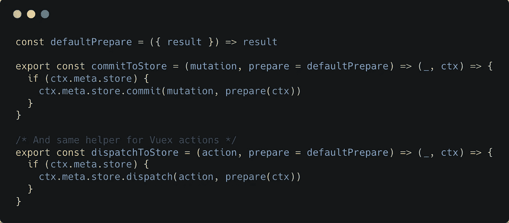*

*将它移出我们的 API*

*然后我们可以减少一些样板代码:*

*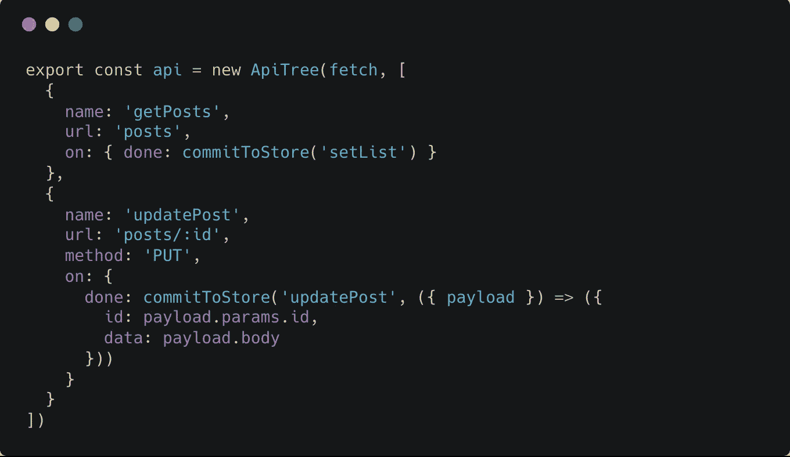*

*我们也可以通过存储在树中:*

*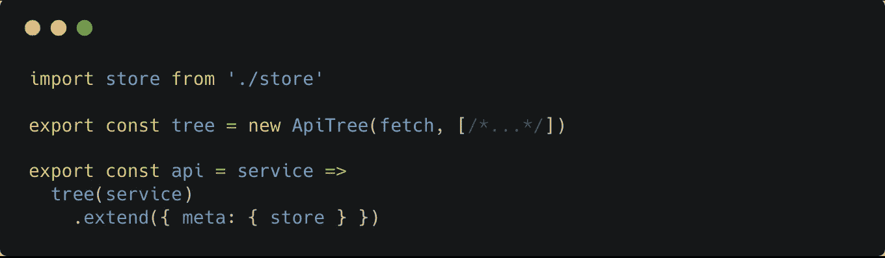*

*现在，商店中的更新是真正有保证的:*

*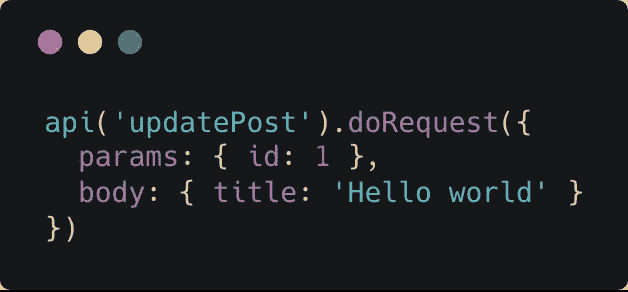*

## *关于 API 层的说明*

*总之，我想说的是，向 Apicase 服务添加这样的特性可能会使您的 API 层与您的应用程序密不可分。如果你想在不同的应用中使用相同的 API 层，这里还有一个指南:*

* [## 将您的 API 移到应用程序之外

### 修复我之前帖子的错误

itnext.io](/move-your-api-outside-your-application-b07ba6809412) 

如果你对 Apicase 有有趣的想法或问题，你可以在回复中写或者在 Twitter 上提到@apicase。随意讨论；)

文档:[点此](https://kelin2025.gitbooks.io/apicase/)
Github 回购:[点此](http://github.com/apicase/core)
推特:[点此](http://twitter.com/apicase)*