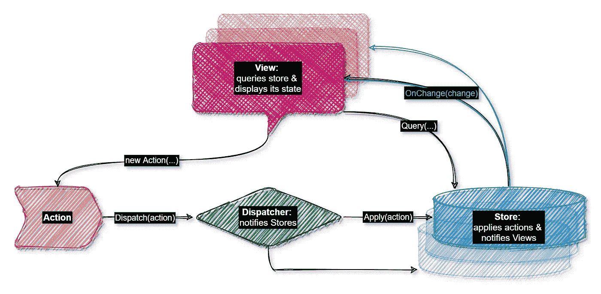
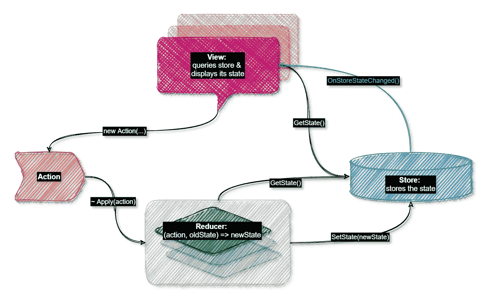
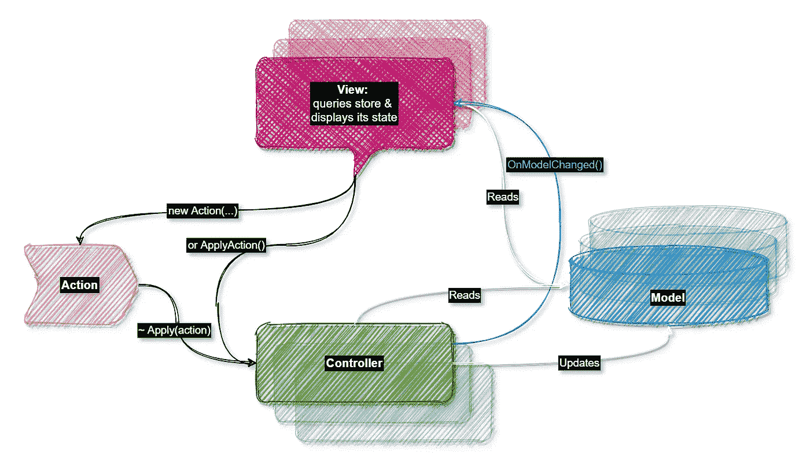
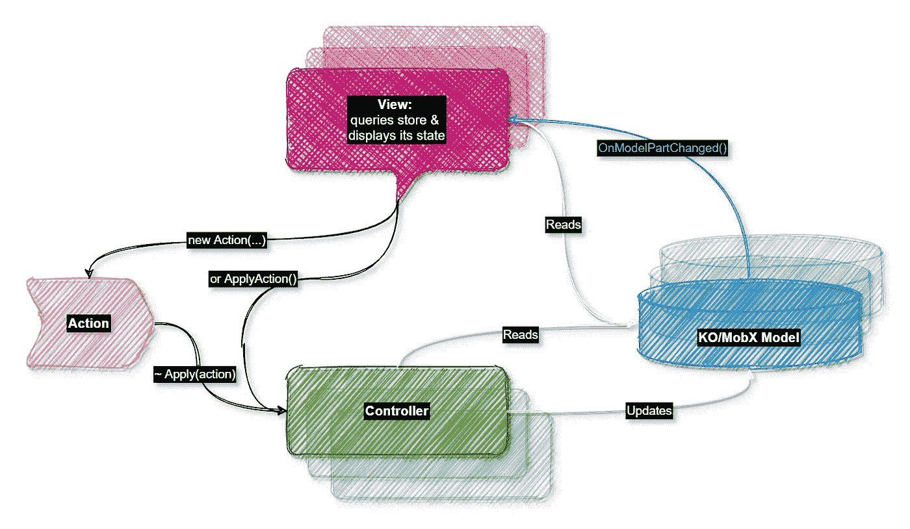
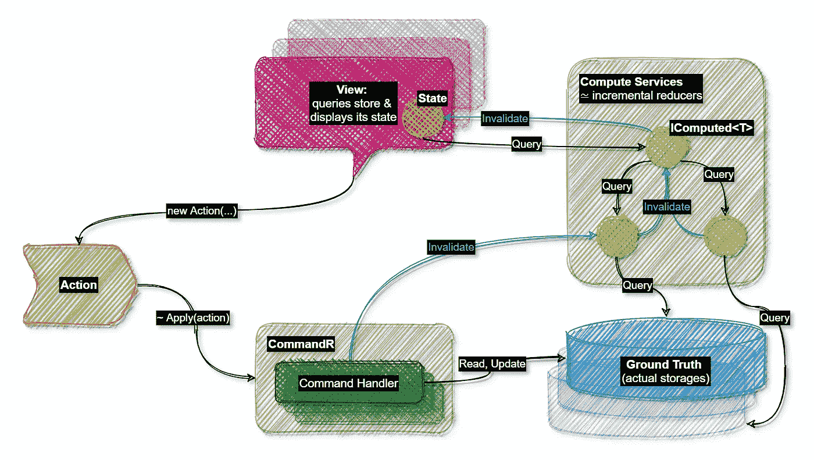
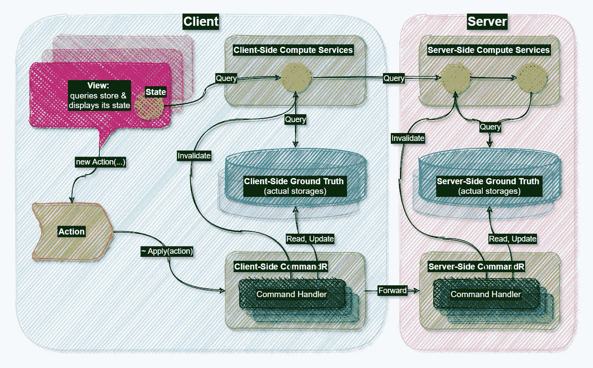

# 比较流行的用户界面架构& Blazor+Fusion 用户界面如何适应

> 原文：<https://itnext.io/the-most-popular-ui-architectures-and-how-fusion-based-ui-fits-in-there-fb47e45038a7?source=collection_archive---------1----------------------->

我最近做的一个有趣的观察是，几乎所有的 UI 架构都非常相似。

**让我们从** [**通量**](https://facebook.github.io/flux/docs/in-depth-overview/) **:** 开始

Flux UI 架构

这里发生的事情的简要描述:

*   视图:
    -通过将来自商店的数据转换为实际的 UI 控件来呈现 UI
    -将用户动作转换为动作对象，并将它们提供给 Dispatcher
*   调度程序将操作发送到商店
*   存储应用动作并通知视图那里发生的变化。

**现在，我们来看看**[**Redux**](https://redux.js.org/tutorials/fundamentals/part-1-overview)**:**

Redux UI 架构

什么变了？

*   Dispatcher 被 Reducers 取代——通常它们只是基于旧状态和当前动作生成新状态的函数
*   尽管这里单独显示了 Reducers，但它们通常是存储的一部分，即与 Flux 相比，Redux 定义了存储更新的特定方式。

**好的，那么**[**MVC**](https://en.wikipedia.org/wiki/Model%E2%80%93view%E2%80%93controller)**呢？**

MVC 架构—稍作调整:)

您可能会注意到这张图片与上一张非常相似——这是因为我决定在图上保留动作，尽管 *MVC 暗示视图在用户动作上调用控制器方法，所以实际上，视图直接调用动作处理程序*。但除此之外:

*   控制器取代了减速器
*   模型(通常是可变的)取代了存储(通常是不可变的)
*   最后，这里负责变更通知的是控制器，而不是模型/商店。

**最后，MVC+**[**knockout . js**](https://knockoutjs.com/)**/**[**MobX**](https://mobx.js.org/README.html)**，或者 MVC+**[**MVVM**](https://en.wikipedia.org/wiki/Model%E2%80%93view%E2%80%93viewmodel)**:**

MVC + MVVM 架构

区别？

*   模型(MVVM 术语中的视图模型)在这里是*可观察的*，所以他们是负责变更通知的人，而不是控制器。

如果我们试图概括这一点，很容易发现到处都是相同的*视图-动作-动作处理程序-模型*链——这是一个简单的*动作-反应*链，其中“反应”被分解为几个子组件。这就是为什么所有的 UI 架构都如此相似。

现在，如果你读了我以前的帖子，你会知道我主要写的是关于 [Fusion](https://github.com/servicetitan/Stl.Fusion) 的，所以**我也会简单地介绍一下 Fusion UI 架构:**

融合用户界面架构

看起来很相似，但是有点复杂，对吗？这是因为*之前我们只描述了客户端模型&的状态，但是这张图涵盖了一切，也就是服务器端组件！*

那么基于 Fusion 的 UI 更新管道是如何工作的呢？

*   视图产生动作。融合意味着在服务器端使用 CQRS 架构，所以所有的动作都是命令。
*   命令被发送到客户端[CommandR](https://github.com/servicetitan/Stl.Fusion.Samples/blob/master/docs/tutorial/Part09.md)——Fusion 的[mediator](https://github.com/jbogard/MediatR)版本，它或者在本地执行命令，或者根据命令的类型将命令发送到服务器端 CommandR 实例。
*   最后，服务器端 CommandR 调用与该命令相关联的命令处理程序，这改变了基本事实并使受这些改变影响的[计算服务](https://github.com/servicetitan/Stl.Fusion.Samples/blob/master/docs/tutorial/Part01.md)端点无效。
*   一连串的失效最终会影响客户端[副本服务](https://github.com/servicetitan/Stl.Fusion.Samples/blob/master/docs/tutorial/Part04.md)端点(服务器端计算服务的融合感知客户端)、使用它们的客户端计算服务，并最终到达受影响视图的[状态](https://github.com/servicetitan/Stl.Fusion.Samples/blob/master/docs/tutorial/Part03.md)。这使得这些状态对象重新计算它们的值。
*   当一个状态完成其值的重新计算时，使用它的视图被重新呈现。

所以上图更详细的版本是:

融合 UI 架构；客户端和服务器端组件显示在同一张图中

您可能会注意到，这里没有显示失效(~更改通知)——这是因为在 Fusion 的情况下，它们总是以与任何查询相反的方向“流动”。

最后，所有这些看起来非常类似于 MVC + MobX 或者基于[反冲](https://recoiljs.org/)的 UI，但是:

1.  Fusion 中没有“可观察模型”的概念，它是围绕“可观察查询端点”(计算服务)构建的，可自动跟踪它们所依赖的其他端点。你可以在服务器端和客户端使用计算服务，所以最终，*你在任何地方都使用相同的抽象。*
2.  由于客户端计算服务(生成视图模型的服务)可能会使用服务器端计算服务，所以您不需要担心将每个更改都应用到服务器端基本事实和客户端模型。*一旦客户端模型“看到”组成它们的数据片段(包括服务器端的)发生了变化，它们就会被简单地重新计算*。
3.  你不需要减速器和商店。您的客户端代码变得[简单，因为它必须](https://github.com/servicetitan/Stl.Fusion#enough-talk-show-me-the-code)——也就是说，它只构建您想要显示的模型，其余的(更改时的更新)自动发生！
4.  您甚至不需要考虑它们是如何交付给客户端的——即[不需要处理 SignalR，一旦您显示了一些 UI 组件，就考虑要订阅/取消订阅的主题，考虑如何确保您的 UI 最终是一致的，等等。](https://medium.com/swlh/how-similar-is-stl-fusion-to-signalr-e751c14b70c3)

如果这一切听起来很有趣，请查看:

*   融合 GitHub 库:[https://github.com/servicetitan/Stl.Fusion](https://github.com/servicetitan/Stl.Fusion)
*   融合样本:[https://github.com/servicetitan/Stl.Fusion.Samples](https://github.com/servicetitan/Stl.Fusion.Samples)