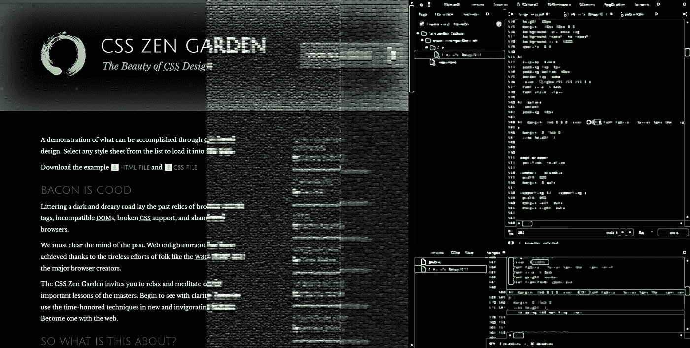
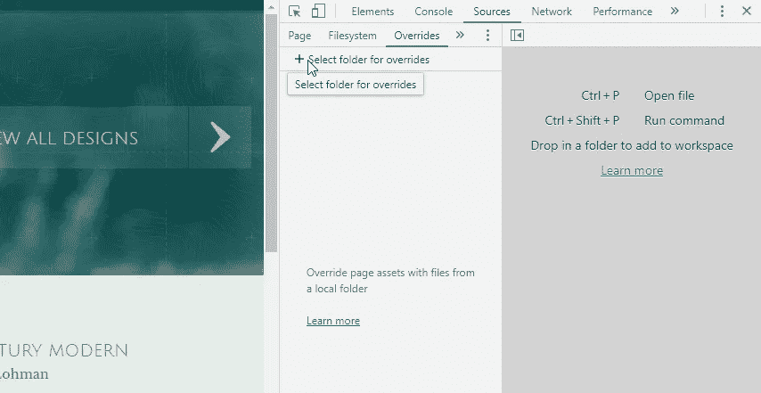
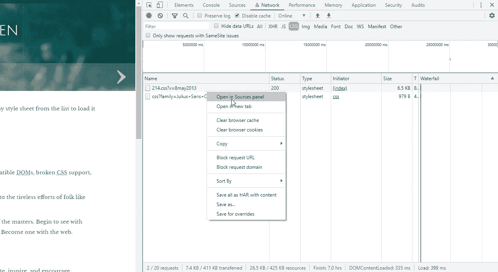
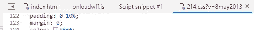
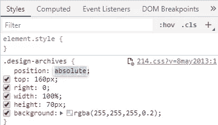
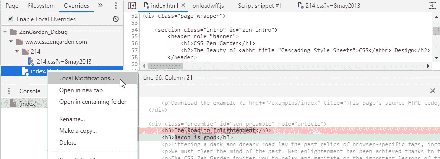

# Chrome 上最强大的调试功能你可能没用过。

> 原文：<https://itnext.io/the-most-powerful-debugging-feature-on-chrome-that-youre-probably-not-using-b7e95dfd0d1c?source=collection_archive---------3----------------------->

您的实时网站上有东西坏掉了！它可能是标记，一些坏的 CSS 或者一个流氓的 JS。经典的单步调试程序只适用于某些情况。

大多数时候，你有一些想法，你想在你的浏览器中测试那些实时代码，并在页面刷新后保持这些测试。嗯，我有好消息要告诉你。Chrome 通过一个叫做本地覆盖的相对较新的功能提供了这一点——它非常棒。

# 它是如何工作的

几乎每个浏览器都在本地缓存页面资源，如 js 和 css 文件，然后提供这些资源，而不是实时版本。本地覆盖特性基本上更进了一步，并允许您对这些文件进行更改。

# 如何启用它

*   在 Chrome 中按下 **F12** 打开开发工具，然后点击**源**标签
*   点击左侧窗格中的**覆盖**子选项卡
*   点击**选择覆盖的文件夹**并在系统上选择一个您想要存储这些修改过的资源文件的文件夹
*   在浏览器顶部弹出的通知上点击**允许**

# 如何使用它

*   导航到要调试的站点
*   按下 **F12** 调出开发工具并点击**网络**选项卡
*   在对页面进行硬刷新后，右键单击网络选项卡中的 html/css/js 资产，然后点击**在源代码中打开**进行编辑(您也可以点击**保存覆盖**稍后进行编辑)。一旦您做出更改并保存它，它会自动将该文件添加到您之前设置的覆盖目录中，并将提供该文件而不是实时版本。

# 凉爽

**紫色圆圈:**资产图标底部的紫色小圆圈表示该资产正在从您的本地覆盖目录中取出。

**检查元素**:如果您向您的覆盖添加一个 CSS 文件，当您右键单击页面元素并点击 Inspect 时，您在那里所做的任何样式更改都将自动写入您的覆盖，从而保存这些更改。

**查看更改:**您可以在您的覆盖中右键单击一个文件，然后点击“本地修改”来查看您对原始实时版本所做的更改！

