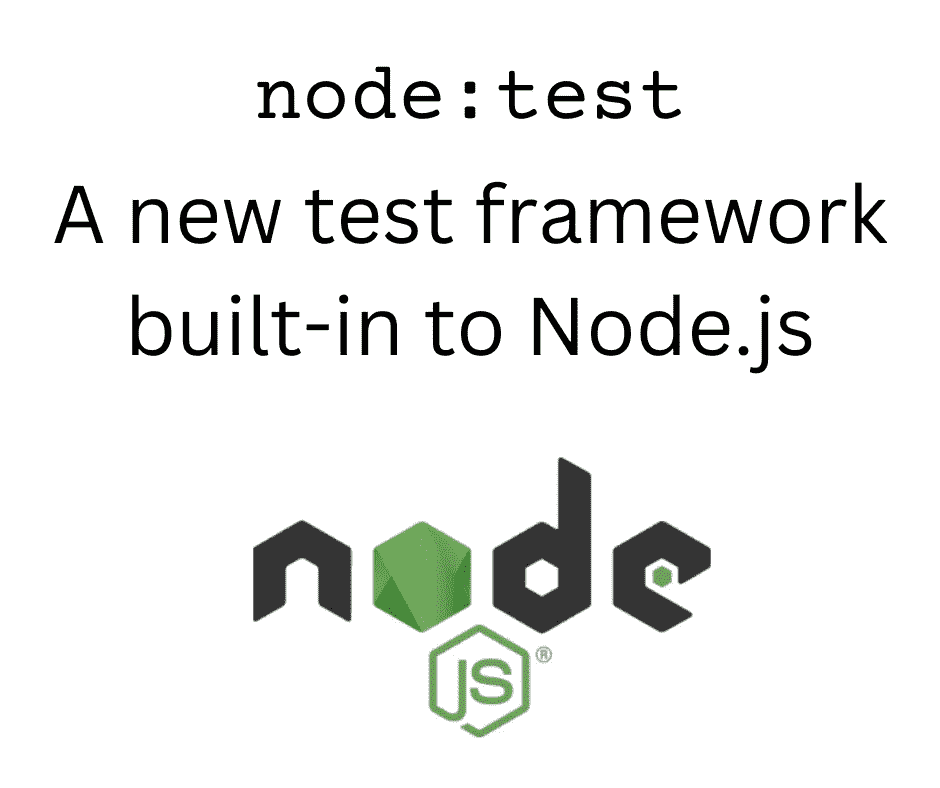

# Node.js 18.8.0 中内置的新测试框架

> 原文：<https://itnext.io/the-new-test-framework-built-in-to-node-js-18-8-0-1d78315ac9f9?source=collection_archive---------0----------------------->

## 节点。JS 测试

## 为 Node.js 应用程序创建测试套件的不依赖于需求的方式



图片由作者提供，使用官方 Node.js 徽标

**node . js v 18 . 8 . 0 中新增的是一个高度令人想起 Mocha 的测试框架。它被标记为*实验性的*,但是它指出了一个未来，我们的单元测试将不再需要像 Mocha 那样的外部依赖。**

多年来，我一直在使用 Mocha 单元测试框架，以及 Chai 的断言风格。这是一个非常有用的组合，但是当设置一个测试套件时，你必须记住将这些包作为依赖项来安装。此外，您必须记住更新您的依赖关系，以捕捉更新。

如果有更简单的方法，比如在编程平台中内置一个测试框架，会怎么样？如果不需要安装任何额外的东西来编写单元测试，这可能会简化您的工作。

最近，我在 Node.js 中遇到了这样一个包。在为我正在开发的新包创建测试时，我键入了`describe('test description')`，Visual Studio 代码立即自动导入了以下内容:

```
import { describe } from 'node:test';
```

这可能发生在许多其他开发人员身上，他们会想知道`node:test`是什么。由于 Visual Studio 代码自动完成了这一点，当我们期望使用来自 Mocha 的`describe`时，我们可能会最终使用它。有了摩卡，没有什么需要`import`来获得`describe`和`it`功能。如果我们没有注意到这个新的导入，我们的测试输出会突然变得奇怪，导致混乱。

一种选择是简单地删除这个虚假的`import`语句，继续使用 Mocha。但是，同样的事情发生在`it`函数上，并且每次我输入`describe`或`it`函数时都会发生。对于这篇文章，让我们看看发生了什么，看看`node:test`框架是否有用。

这可能是您第一次看到带有`node:`前缀的包名。这是 Node.js 中的新特性，似乎在 Node.js 14 中已经开始使用。它是烘焙到 Node.js 中的包的包名前缀。因为 ES6 `import`语句采用 URL，所以`node:`前缀被视为 URL 协议。结果就是你可以导入`node:path`而不是`path`。

这意味着存在一个新的内置模块`node:test`。相关文档如下:

*   试跑者:【https://nodejs.org/api/test.html】T21
*   断言:[https://nodejs.org/api/assert.html](https://nodejs.org/api/assert.html)

`node:assert`模块一直在 Node.js 中。不依赖任何测试框架，用那个包编写单元测试总是可能的。测试框架的价值在于报告。例如，Mocha 支持几种测试结果报告格式。新的`node:test`框架支持 TAP，一种古老的报告测试结果的格式。

与 Mocha 和 Chai 或其他第三方测试框架相比，`node:assert`和`node:test`的功能非常少。好处是这些都是内置的。

# 用`node:test`和`node:assert`设置测试

为了了解这一点，让我们创建几个虚拟测试。

下面显示的代码可以在 GitHub 上找到:[https://github.com/robogeek/node-test-examples](https://github.com/robogeek/node-test-examples)

安装程序(确保安装了 Node.js 18.8 或更高版本之后):

```
$ mkdir node-test
$ npm init -y
```

第一个优点是我们不需要安装任何其他东西。

创建一个名为`test1.mjs`的文件，并键入以下内容:

```
import test from 'node:test';
import * as assert from 'node:assert';
```

你现在用的是 ES6 模块格式，是吗？如果您愿意，Node.js 文档显示了 CJS 模块格式。

注意一定要用`node:test`而不是`test`，因为后者不行。

```
test('simple-test', function() {
    assert.strictEqual(1, 1);
});

test('fail-test', function() {
    assert.strictEqual(1, 2);
});

test('async test', async () => {
    let result = await new Promise((resolve, reject) => {
        setImmediate(() => {
          resolve(1);
        });
    });
    assert.strictEqual(1, result);
});
```

我之前说过这个 API 类似于 Mocha，它描述了使用`describe`和`it`函数的测试。这里我们使用一个名为`test`的函数来描述测试。结构类似于 Mocha `it`函数，但函数名为`test`。我们后面会看到`describe`和`it`的使用。

除了使用这里显示的`test`,您可以选择导入包，如下所示:

```
import * as test from 'node:test';
import * as assert from 'node:assert';
```

如果这样做，执行`node:test`包中的函数需要在函数前加上前缀`test.`，所以在本例中，您将使用`test.test(...)`而不是`test(...)`。

一个明显的区别是这个框架允许使用轻量级的箭头函数，而 Mocha 要求使用普通函数。

要执行这些测试:

```
$ node --test test1.mjs
TAP version 13
# Subtest: /home/david/Projects/nodejs/node-test/test1.mjs
not ok 1 - /home/david/Projects/nodejs/node-test/test1.mjs
  ---
  duration_ms: 0.071377364
  failureType: 'subtestsFailed'
  exitCode: 1
  stdout: |-
    TAP version 13
    # Subtest: simple-test
    ok 1 - simple-test
      ---
      duration_ms: 0.001492959
      ...
    # Subtest: fail-test
    not ok 2 - fail-test
      ---
      duration_ms: 0.001347439
      failureType: 'testCodeFailure'
      error: |-
        Expected values to be strictly equal:

        1 !== 2

      code: 'ERR_ASSERTION'
      stack: |-
        TestContext.<anonymous> (file:///home/david/Projects/nodejs/node-test/test1.mjs:10:12)
        Test.runInAsyncScope (node:async_hooks:203:9)
        Test.run (node:internal/test_runner/test:483:25)
        Test.processPendingSubtests (node:internal/test_runner/test:249:27)
        Test.postRun (node:internal/test_runner/test:553:19)
        Test.run (node:internal/test_runner/test:511:10)
      ...
    # Subtest: async test
    ok 3 - async test
      ---
      duration_ms: 0.002986099
      ...
    1..3
    # tests 3
    # pass 2
    # fail 1
    # cancelled 0
    # skipped 0
    # todo 0
    # duration_ms 0.057180525

  stderr: |-
    (node:1638685) ExperimentalWarning: The test runner is an experimental feature. This feature could change at any time
    (Use `node --trace-warnings ...` to show where the warning was created)

  error: 'test failed'
  code: 'ERR_TEST_FAILURE'
  ...
1..1
# tests 1
# pass 0
# fail 1
# cancelled 0
# skipped 0
# todo 0
# duration_ms 0.134320729
```

运行测试需要`--test`标志。使用这个选项，Node.js 将搜索测试模块。但是我已经在命令行中明确地命名了测试模块。在这种情况下，Node.js 将只执行指定的测试模块。

测试结果以 TAP 格式打印。TAP 代表*测试任何东西协议*，在[维基百科](https://en.wikipedia.org/wiki/Test_Anything_Protocol)上有一篇很好的文章。

TAP 输出格式对人不友好，其设计目的是向报告软件提供测试结果数据。我发现很难处理这些结果，尤其是失败。

到目前为止，这些测试都是顶级的。我们经常想增加层次来帮助理解:

```
test('test container', () => {
    test('test 1', () => { assert.equal(1, 1); });
    test('test 2', () => { assert.equal(2, 2); });
});
```

另一个我不知道我想要但由`node:test`框架提供的东西是跳过测试的能力。

```
test('SKIP', { skip: true }, () => { assert.equal(1, 1); });
test.skip('SKIP2', () => { assert.equal(1, 1); });
```

在第一种形式中，在测试名称和测试函数之间传递的对象用于传递选项。其中一个选项`skip`表示忽略(跳过)这个测试。使用`.skip`达到同样的目的。

# 使用`describe`和`it`，就像使用摩卡一样

如前所述，`node:test`有`describe`和`it`功能，类似于摩卡提供的功能。

创建一个名为`test-describe.mjs`的新文件，包含:

```
import { describe, it } from 'node:test';
import * as assert from 'node:assert';

describe('Describe Container', function() {

    it('should equal 1 and 1', () => { assert.equal(1, 1); });
    it('should equal 2 and 2', () => { assert.equal(2, 2); });
    it('should FAIL equal 1 and 3', () => { assert.equal(1, 3); });
});
```

将`import`语句改为导入这些函数，而不是导入整个`test`包。

一个有趣的实验是注释掉`node:test`的`import`，然后使用 Mocha 运行测试套件。除了使用轻量级函数进行测试之外，测试套件将在 Mocha 下工作。

例如，options 对象可用于`describe`和`it`，以支持跳过测试。您也可以根据需要使用`describe.skip`和`it.skip`。

# 试图使用`before`、`beforeEach`、`after`和`afterEach`

Mocha 中另一组有用的测试函数是`before`、`beforeEach`、`after`和`afterEach`。这些函数在测试函数之前和之后执行，对于设置和删除测试条件非常有用。

根据 Node.js 文档，可以创建一个名为`test-before.mjs`的文件，如下所示:

```
import {
    describe, it, before, beforeEach, after, afterEach
} from 'node:test';
import * as assert from 'node:assert';

let did_before = false;
let did_before_each = 0;
let did_after = false;
let did_after_each = 0;

function print_status(stage) {
    console.log(`${stage}: before ${did_before} before_each ${did_before_each} after ${did_after} after_each ${did_after_each}`);
}

describe('Describe Container', function() {
    before(() => {
        did_before = true;
        print_status('BEFORE');
        // console.log('IN BEFORE');
    });
    beforeEach(() => {
        did_before_each++;
        print_status('BEFORE EACH');
        // console.log('IN BEFORE EACH');
    });

    after(() => {
        did_after = true;
        print_status('AFTER');
        // console.log('IN AFTER');
    });
    afterEach(() => {
        did_after_each++;
        print_status('AFTER EACH');
        // console.log('IN AFTER EACH');
    });

    it('should equal 1 and 1', () => {
        console.log('1 and 1');
        assert.equal(1, 1);
        // assert.equal(did_before, true);
        // assert.equal(did_before_each > 1, true);
    });
    it('should equal 2 and 2', () => {
        console.log('2 and 2');
        assert.equal(2, 2);
        // assert.equal(did_after, false);
        // assert.equal(did_after_each > 1, true);
    });

});

print_status('FINISH');
```

根据文档，这应该可以工作。但是，困惑仍然存在，尤其是如果所有测试都成功的话。因此，这个测试有过多的代码一次演示几件事情。

首先，输出非常简洁，没有显示来自子测试的任何信息:

```
$ node --test test-before.mjs 
TAP version 13
# Subtest: /home/david/Projects/nodejs/node-test/test-before.mjs
ok 1 - /home/david/Projects/nodejs/node-test/test-before.mjs
  ---
  duration_ms: 0.069937654
  ...
1..1
# tests 1
# pass 1
# fail 0
# cancelled 0
# skipped 0
# todo 0
# duration_ms 0.130741092
```

这可能与 TAP 结果格式有关。它似乎只显示顶级测试的结果。但是，我相信我们想要知道每个测试套件运行中每个测试用例的状态。

其次，`console.log`输出怎么了？在 Mocha 中`console.log`被简单地打印到终端，但是这里没有显示。

我们如何知道`before` / `after`函数被执行了？在这个例子中，我添加了额外的状态变量，我们可以插入`assert`函数来检查状态。取消对这些`assert`调用的注释让我们看到状态变量确实发生了变化，表明`before` / `after`函数确实执行了。

如果`console.log`输出刚打印出来不是更方便吗？见本期问题队列:【https://github.com/nodejs/node/issues/44372 

您可以取消注释的断言之一确实失败了:`assert.equal(did_after_each > 1, true)`，这使我们有机会看到输出包含了`console.log`输出。具体来说，子测试的数据只有在测试失败时才可见。如果测试失败，`node:test`打印所有子测试的结果，包括`console.log`输出。

```
TAP version 13
# Subtest: /home/david/Projects/nodejs/node-test/test-before.mjs
not ok 1 - /home/david/Projects/nodejs/node-test/test-before.mjs
  ---
  duration_ms: 75.884131
  failureType: 'subtestsFailed'
  exitCode: 1
  stdout: |-
    FINISH: before false before_each 0 after false after_each 0
    BEFORE: before true before_each 0 after false after_each 0
    BEFORE EACH: before true before_each 1 after false after_each 0
    1 and 1
    AFTER EACH: before true before_each 1 after false after_each 1
    BEFORE EACH: before true before_each 2 after false after_each 1
    2 and 2
    AFTER: before true before_each 2 after true after_each 1
    TAP version 13
    # Subtest: Describe Container
        # Subtest: should equal 1 and 1
        ok 1 - should equal 1 and 1
          ---
          duration_ms: 0.729738
          ...
        # Subtest: should equal 2 and 2
        not ok 2 - should equal 2 and 2
          ---
          duration_ms: 1.389875
          failureType: 'testCodeFailure'
          error: 'false == true'
          code: 'ERR_ASSERTION'
          stack: |-
            Object.<anonymous> (file:///home/david/Projects/nodejs/node-test/test-before.mjs:49:16)
            ItTest.runInAsyncScope (node:async_hooks:203:9)
            ItTest.run (node:internal/test_runner/test:483:25)
            async Suite.processPendingSubtests (node:internal/test_runner/test:249:7)
          ...
        1..2
    not ok 1 - Describe Container
      ---
      duration_ms: 6.009156
      failureType: 'subtestsFailed'
      error: '1 subtest failed'
      code: 'ERR_TEST_FAILURE'
      ...
    1..1
    # tests 1
    # pass 0
    # fail 1
    # cancelled 0
    # skipped 0
    # todo 0
    # duration_ms 13.041273

  stderr: |-
    (node:2457472) ExperimentalWarning: The test runner is an experimental feature. This feature could change at any time
    (Use `node --trace-warnings ...` to show where the warning was created)

  error: 'test failed'
  code: 'ERR_TEST_FAILURE'
  ...
1..1
# tests 1
# pass 0
# fail 1
# cancelled 0
# skipped 0
# todo 0
# duration_ms 79.742712
```

请注意，`stdout |-`行之后是我们期望从`console.log`语句中得到的输出。

对于成功的测试，我们只看到一行读数`duration_ms`。对于失败的测试，将打印更多信息，包括堆栈跟踪。

只有当测试失败时，`console.log`输出才可用。当测试失败时，测试结果会包含更多数据。

我想要的是在测试用例中插入跟踪的简单方法。当在 Mocha 中调试测试时，我插入`console.log`语句来查看测试中有什么可用的。并不是说我是一个毫无头绪的新手程序员，因为我做这个已经几十年了。`print`语句是一个非常有用的调试工具。你只需要记住在发送给客户之前删除所有的调试打印输出，等等。

原来`console.log`未必是正确的做法。稍后我们将研究`TestContext.diagnostic`函数。该功能允许我们将 TAP 结果中正确捕获的消息打印为诊断信息。这可能更正确地与 TAP 结果格式集成在一起。

# 如果所有测试都成功，为什么不打印`it`结果？

前一节还有一个问题。TAP 结果仅输出顶级测试的数据，不打印子测试的结果。为了理解我的意思，让我们回到前面显示的测试的修改版本。

```
import { describe, it } from 'node:test';
import * as assert from 'node:assert';

describe('Describe Container', function() {

    it('should equal 1 and 1', () => { assert.equal(1, 1); });
    it('should equal 2 and 2', () => { assert.equal(2, 2); });
    /* it('should FAIL equal 1 and 3', () => {
        assert.equal(1, 3); 
    }); */
});
```

这里的每个`it`测试都会成功，除了被注释掉的那个。运行该测试，您将看到以下输出:

```
$ npm run test:describe

> node-test-examples@1.0.0 test:describe
> node --test test-describe.mjs

TAP version 13
# Subtest: /home/david/Projects/nodejs/node-test/test-describe.mjs
ok 1 - /home/david/Projects/nodejs/node-test/test-describe.mjs
  ---
  duration_ms: 68.194493
  ...
1..1
# tests 1
# pass 1
# fail 0
# cancelled 0
# skipped 0
# todo 0
# duration_ms 71.352425
```

我们被告知有一个测试，并且那个测试成功了，但是那是不准确的。有一个`describe`包含两个`it`测试。这难道不是一个包含两个测试的测试容器吗？那不应该是作为输出打印出来的吗？

取消对失败测试的注释，您会看到以下输出:

```
TAP version 13
# Subtest: /home/david/Projects/nodejs/node-test/test-describe.mjs
not ok 1 - /home/david/Projects/nodejs/node-test/test-describe.mjs
  ---
  duration_ms: 72.890198
  failureType: 'subtestsFailed'
  exitCode: 1
  stdout: |-
    TAP version 13
    # Subtest: Describe Container
        # Subtest: should equal 1 and 1
        ok 1 - should equal 1 and 1
          ---
          duration_ms: 0.530474
          ...
        # Subtest: should equal 2 and 2
        ok 2 - should equal 2 and 2
          ---
          duration_ms: 0.213345
          ...
        # Subtest: should FAIL equal 1 and 3
        not ok 3 - should FAIL equal 1 and 3
          ---
          duration_ms: 1.318011
          failureType: 'testCodeFailure'
          error: '1 == 3'
          code: 'ERR_ASSERTION'
          stack: |-
            Object.<anonymous> (file:///home/david/Projects/nodejs/node-test/test-describe.mjs:10:16)
            ItTest.runInAsyncScope (node:async_hooks:203:9)
            ItTest.run (node:internal/test_runner/test:483:25)
            Suite.processPendingSubtests (node:internal/test_runner/test:249:27)
            ItTest.postRun (node:internal/test_runner/test:567:19)
            ItTest.run (node:internal/test_runner/test:511:10)
            async Suite.processPendingSubtests (node:internal/test_runner/test:249:7)
          ...
        1..3
    not ok 1 - Describe Container
      ---
      duration_ms: 5.370754
      failureType: 'subtestsFailed'
      error: '1 subtest failed'
      code: 'ERR_TEST_FAILURE'
      ...
    1..1
    # tests 1
    # pass 0
    # fail 1
    # cancelled 0
    # skipped 0
    # todo 0
    # duration_ms 11.093222

  stderr: |-
    (node:2435157) ExperimentalWarning: The test runner is an experimental feature. This feature could change at any time
    (Use `node --trace-warnings ...` to show where the warning was created)

  error: 'test failed'
  code: 'ERR_TEST_FAILURE'
  ...
1..1
# tests 1
# pass 0
# fail 1
# cancelled 0
# skipped 0
# todo 0
# duration_ms 77.252073
```

这一次打印子测试信息，包括失败的测试。子测试信息不应该总是打印出来吗？

我对 TAP 不是很熟悉，可能这就是 TAP 的设计用途。但是看这个用户体验，我想一直知道所有测试用例的状态。如果测试结果被输入到报告系统中，这一点尤其正确。

# 测试诊断允许跟踪执行和数据值

之前我们看到`console.log`输出没有像我预期的那样被处理。它不会简单地出现在控制台上，只有当测试失败时，您才能查看它。

`node:test`框架包含一个与`console.log`大致相当的特性，但是与 TAP 结果格式集成得更好。

考虑:

```
import { test } from 'node:test';
import * as assert from 'node:assert';

test('Describe Container', async function(t) {

    t.beforeEach((t) => {
        t.diagnostic(`DIAG before ${t.name}`);
    });

    t.afterEach((t) => {
        t.diagnostic(`DIAG after ${t.name}`);
    });

    await t.test('should equal 1 and 1', () => { assert.equal(1, 1); });
    await t.test('should equal 2 and 2', () => { assert.equal(2, 2); });
    /* await t.test('should FAIL equal 1 and 3', (t) => {
        t.diagnostic(`In FAIL test ${t.name}`);
        assert.equal(1, 3); 
    }); */

});
```

`test`函数回调的参数`t`是`TestContext`类的一个实例。文档说这个类不能被测试作者实例化。相反，`test`函数回调将它作为参数接收。`t`参数不适用于`it`功能，仅适用于`test`功能。

`t.beforeEach`和`t.afterEach`功能等同于`beforeEach`和`afterEach`，意味着它们在每次测试调用之前和之后被执行。并且，不嵌套`it`或`test`调用，而是使用`t.test`。还要注意，对于一个`async`外部函数，我们必须在`t.test`函数调用中使用`await`。

`t.diagnosic`功能允许我们将 TAP 诊断写入输出。换句话说，它类似于我通常用`console.log`做的事情，但是集成了 TAP 输出。

要查看诊断输出，必须有一个失败的测试。正如我们前面所说的，要看到完整的测试结果，必须有一个失败的测试。这也控制是否打印诊断输出。取消对此处显示的失败测试的注释，您将看到以下输出:

```
TAP version 13
# Subtest: /home/david/Projects/nodejs/node-test/test-diagnostic.mjs
not ok 1 - /home/david/Projects/nodejs/node-test/test-diagnostic.mjs
  ---
  duration_ms: 75.932386
  failureType: 'subtestsFailed'
  exitCode: 1
  stdout: |-
    TAP version 13
    # Subtest: Describe Container
        # Subtest: should equal 1 and 1
        ok 1 - should equal 1 and 1
          ---
          duration_ms: 1.290981
          ...
        # DIAG before should equal 1 and 1
        # DIAG after should equal 1 and 1
        # Subtest: should equal 2 and 2
        ok 2 - should equal 2 and 2
          ---
          duration_ms: 0.365355
          ...
        # DIAG before should equal 2 and 2
        # DIAG after should equal 2 and 2
        # Subtest: should FAIL equal 1 and 3
        not ok 3 - should FAIL equal 1 and 3
          ---
          duration_ms: 1.349598
          failureType: 'testCodeFailure'
          error: '1 == 3'
          code: 'ERR_ASSERTION'
          stack: |-
            TestContext.<anonymous> (file:///home/david/Projects/nodejs/node-test/test-diagnostic.mjs:20:16)
            Test.runInAsyncScope (node:async_hooks:203:9)
            Test.run (node:internal/test_runner/test:483:25)
            async TestContext.<anonymous> (file:///home/david/Projects/nodejs/node-test/test-diagnostic.mjs:18:5)
            async Test.run (node:internal/test_runner/test:484:9)
          ...
        # DIAG before should FAIL equal 1 and 3
        # In FAIL test should FAIL equal 1 and 3
        1..3
    not ok 1 - Describe Container
      ---
      duration_ms: 6.449412
      failureType: 'subtestsFailed'
      error: '1 subtest failed'
      code: 'ERR_TEST_FAILURE'
      ...
    1..1
    # tests 1
    # pass 0
    # fail 1
    # cancelled 0
    # skipped 0
    # todo 0
    # duration_ms 12.896941

  stderr: |-
    (node:2436416) ExperimentalWarning: The test runner is an experimental feature. This feature could change at any time
    (Use `node --trace-warnings ...` to show where the warning was created)

  error: 'test failed'
  code: 'ERR_TEST_FAILURE'
  ...
1..1
# tests 1
# pass 0
# fail 1
# cancelled 0
# skipped 0
# todo 0
# duration_ms 81.035372
```

诊断输出打印有`#`前缀。我们只能看到失败测试用例的诊断输出，而不能看到成功测试用例的诊断输出。以前`console.log`输出以`stdout |-`开始分段打印。

因此,`t.diagnostic`调用的行为类似于`console.log`,但看起来与 TAP 的集成更加正确。

# 摘要

将`node:test`添加到 Node.js 给了我们一个最小的测试框架。虽然它不像摩卡和柴那样功能齐全，但它可以立即使用。

为什么要把这个特性带入 Node.js 的核心？我在 Bun 项目中看到了类似的问题，有人提议在 Bun 中添加一个 YAML 解析器/序列化器。像 Node.js，或者 Bun，或者 PHP，或者 Python 这样的平台，应该增加每一个可能的特性吗？每个添加的特性都会使平台变得更大，并为项目团队带来更多的管理开销，因为他们必须维护/测试/更新/升级该特性。

为什么测试框架应该内置到核心平台中？我不太明白其中的道理。在核心平台中包含 YAML 支持的理由更加充分，因为许多应用程序需要读/写 YAML 文件。但是，我仍然不明白为什么在有大量 YAML 实现的情况下还必须添加 YAML。这同样适用于测试框架，因为安装一个充满特性的框架很容易。

对 PHP、Java 和 Python 文档的快速检查并没有显示内置的测试框架。在某些情况下，有`assert`语句，但是没有组织测试的框架。

作为 Node.js 或者 Bun 的用户，我希望平台尽可能的健壮。这意味着项目团队应该关注最重要的特性。添加一个测试框架足够重要吗？或者添加一个测试框架会分散注意力吗？

我相信 Node.js 团队已经讨论过这个问题了。他们选择将一个简单的测试框架整合到平台中，这说明这样做是有道理的。

用过这个之后，我发现还缺少什么:

*   选择`console.log`输出或其他调试输出，简单地显示在终端上。
*   其他测试结果格式的第三方插件系统。我特别想要一种人类可读的结果格式，就像 Mocha 提供的默认格式。这应该由第三方提供，以最小化 Node.js 平台上的膨胀。

应该放弃 Mocha 或其他现有的测试框架吗？这不太可能，因为现有的框架提供了更多的功能。由于`node:test`框架应该保持最小化以最小化平台膨胀，它不太可能获得足够的特性来与第三方框架竞争。这意味着现有的第三方框架将保持相关性，因为它们有更多的自由来添加任何所需的功能。

## 关于作者


[**大卫·赫伦**](https://davidherron.com/) :大卫·赫伦是一名作家和软件工程师，专注于技术的明智使用。他对太阳能、风能和电动汽车等清洁能源技术特别感兴趣。David 在硅谷从事了近 30 年的软件工作，包括电子邮件系统、视频流和 Java 编程语言，并出版了几本关于 Node.js 编程和电动汽车的书籍。

*最初发表于*[*https://techsparx.com*](https://techsparx.com/nodejs/testing/node-test.html)*。*