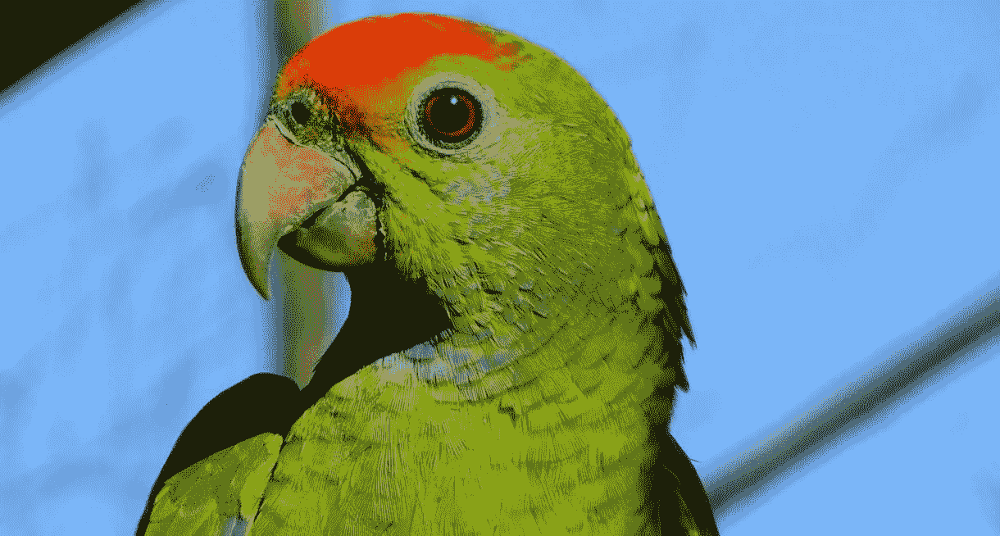
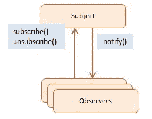
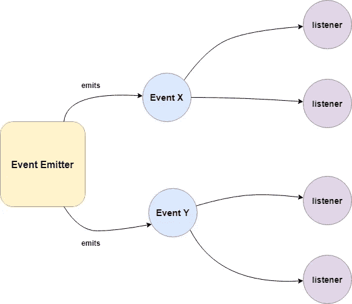
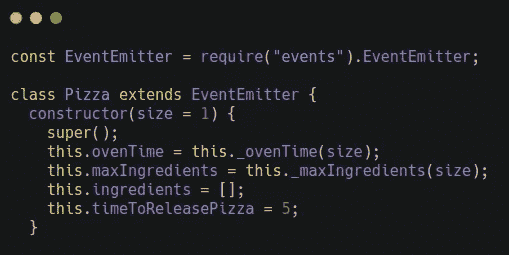
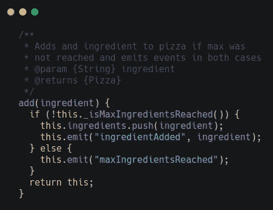
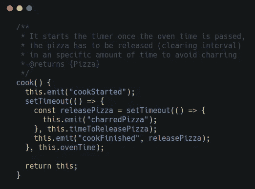
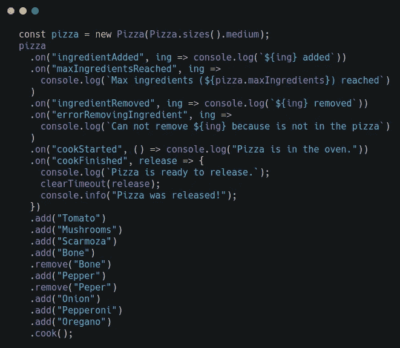
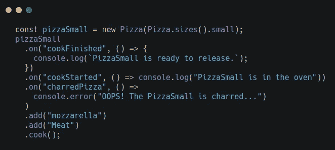

# NodeJS 中的观察者模式

> 原文：<https://itnext.io/the-observer-pattern-in-nodejs-c0cfffb4744a?source=collection_archive---------0----------------------->

这是 Node 的支柱之一，对于使用许多核心模块至关重要，因此由于其重要性而将其隔离。

观察者模式

观察者是一种行为模式，这意味着关注对象之间的**交流**。

是建模节点反应性质的理想解决方案，也是回调的补充。

在这种情况下，它负责一个**主体**(或可观察的)和多个**观察者**之间的通信。

主题目标是通知观察者状态的变化。

事件流

观察者可以**订阅**主题，以便跟踪主题可能发生的任何潜在状态变化。观察者也可以**取消订阅**，停下来*观察*主题。

在面向对象编程中，观察者模式需要**接口、**具体的**类**和**层次结构**。您可能注意到 JavaScript 没有接口，或者类实际上是函数。这可以被视为一种阻碍，但这与事实相去甚远。

在 NodeJS 中，一切都变得简单多了。观察者模式已经内置到内核中，可以通过 [**EventEmitter**](https://nodejs.org/api/events.html#events_class_eventemitter) 类获得。

EventEmitter 允许将函数注册为**监听器**，当特定的**事件**被触发时，将调用这些监听器。

事件发射器

EventEmitter 类由*事件*模块定义和公开。一些方法是:

*   `on(eventName:string, listener: Function)`:将*监听器*函数添加到名为 *eventName* 的事件的监听器数组的末尾。不检查是否已经添加了侦听器。多个调用通过*事件名称*和*监听器*的相同组合将导致监听器被添加和调用多次。
*   `once(eventName:string, listener: Function)`:为名为 *eventName* 的事件增加一个一次性*监听器*功能。下次触发 eventName 时，将删除该侦听器，然后调用它。
*   `emit(eventName:string, [...args])`:按照注册的顺序，同步调用为名为 *eventName* 的事件注册的每个监听器，并将提供的*参数*传递给每个监听器。
*   `removeListener(eventName:string, listener: Function)`:从名为 *eventName* 的事件的*监听器*数组中删除指定的监听器。

前面所有的方法都将返回 EventEmitter **实例**以允许**链接**。*监听器*函数具有签名`function([arg1], [...])`，因此它只接受事件发出时提供的参数。在*监听器*中， `this`是指产生事件的**事件发射器**的**实例**。

直接从 EventEmitter 类创建一个 observable 是不够的，因为当我们想要创建一个不仅仅是创建新事件的东西时，这是不灵活的。因此，创建一个通用对象 **observable** 是大多数情况下的解决方案。这可以通过扩展 EventEmitter 类来实现。

为了解释这是如何工作的，我举了一个例子。这个可观察的物体将会是一个比萨饼🍕。完整的[代码文件在这里](https://gist.github.com/boxgames1/95ea88f202f36f55c70af70f0f2f2b13)。让我们按部分来看代码。

构造函数和类型定义

这里没有什么特别的，除了 Pizza 类是从 EventEmitter 扩展而来的(如果你记得上面的评论，它来自于 *events* 模块)。我跳过了与这个模式无关的私有方法和静态大小。

添加方法

如果比萨饼没有达到配料的最大数量，那么作为参数传递的配料将被添加到列表中，并发出一个事件。否则，也会发出一个事件。返回实例以允许链接。这发生在所有公共方法中。

移除方法

非常类似于 add 方法。如果成分存在于列表中，它将被删除并发出一个事件。如果它不存在，则发出其他事件。

烹饪方法

好吧！最有趣的部分来了，我们的比萨饼正在进入烤箱😋
一个事件注意到了这种情况，并设置了超时。一旦烤箱时间到期，回调被执行并发出另一个超时的事件 *numberId* 。那个会在发布时间过后触发。如果超时没有被清除，我们的比萨饼将被烧焦，事件也被发出。

快乐之路

执行时间！现在我们的 Pizza 类已经创建，我们可以实例化它了。这一大块看起来有点乱，但是我鼓励你获取完整的代码示例并在你的本地环境中运行来看看结果。

我们创建了一些**听众**来了解**发生在我们披萨上的一切**。然后，我们添加/删除一些成分，并开始烹饪阶段。

这里有趣的部分是在 `cookFinished`监听器中。除了日志之外，我们正在使用作为参数接收的 *numberId* 清除超时。我们马上就做，避免我们的披萨被烧焦。

角落案例

在这种情况下，我们在没有清除超时的情况下管理 `cookFinished`监听器，所以比萨饼不会按时从烤箱中拿出来😟

我们已经看到，通过继承 EventEmitter 的功能，Pizza 对象除了是可观察的之外，还拥有一整套方法。

**Alert** ⚠️我们绝不能在同一个 EventEmitter 中混合使用同步和异步方法，这一点至关重要，但更重要的是，当发出相同的事件类型时，要避免产生同步问题，使我们的函数**变得不可预测。**

发出同步和异步事件的主要区别在于侦听器的注册方式。当事件被异步发出**时，即使在 EventEmitter 被初始化之后，程序也有足够的时间来注册新的监听器，因为事件被保证在事件循环的下一个周期之前不会被触发。它代表了大多数 Node.js 模块中使用的一种常见方法。**

**相反，同步发出事件**需要在 EventEmitter 函数开始发出任何事件之前注册所有侦听器，就像在我们的 **Pizza** 类中一样。以这种同步方式使用 EventEmitter 很有用，在某些场景中很有意义。****

****出于这个原因，在文档中清楚地突出我们的 EventEmitter 的行为以避免混淆和潜在的错误使用是非常重要的。****

****我是奥利弗·阿隆索，在西班牙远程工作的软件工程师。你可以在[我的网络](https://oliveralonso.dev/)或 [Github 账户中找到更多关于我的信息。](https://github.com/boxgames1)****

****感谢阅读！****