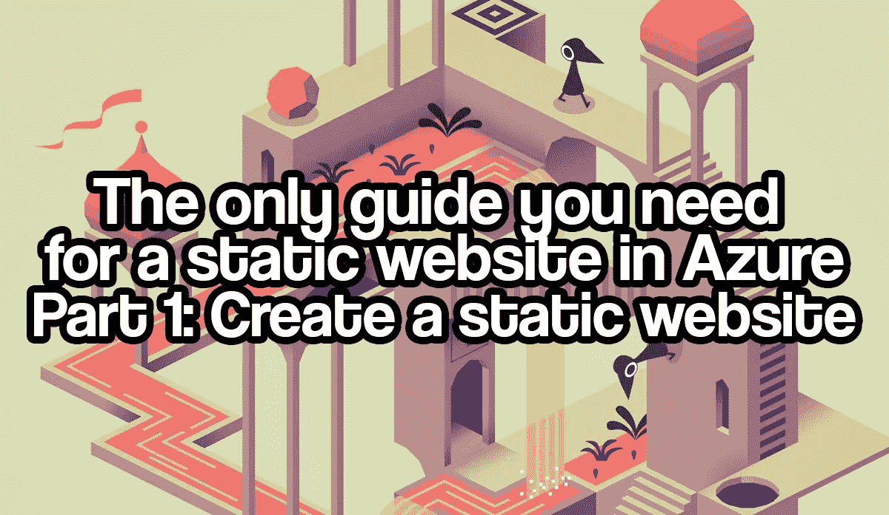
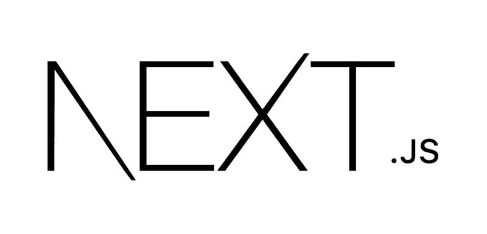
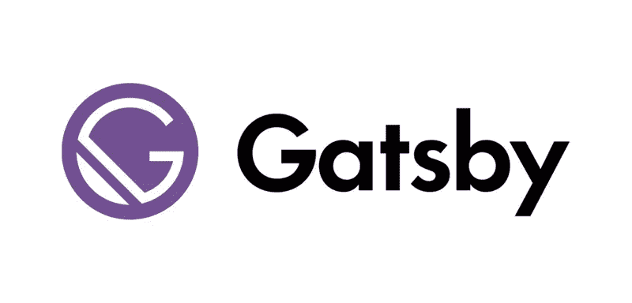
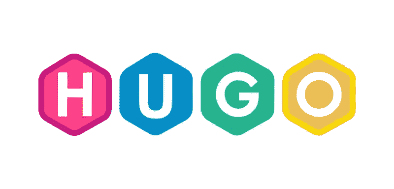
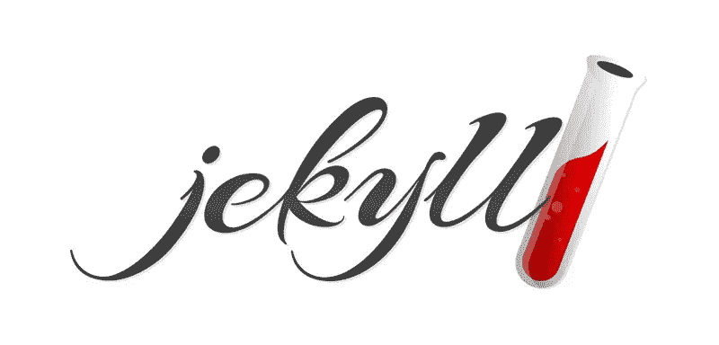
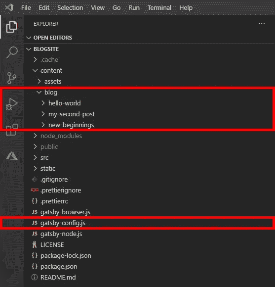
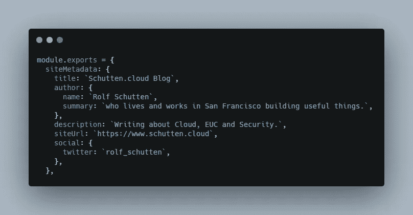
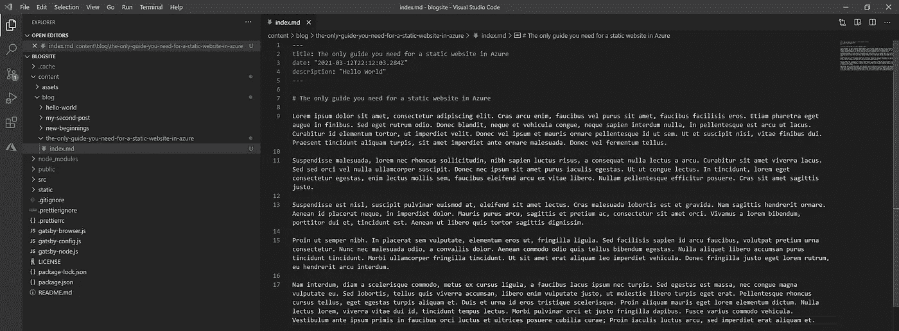
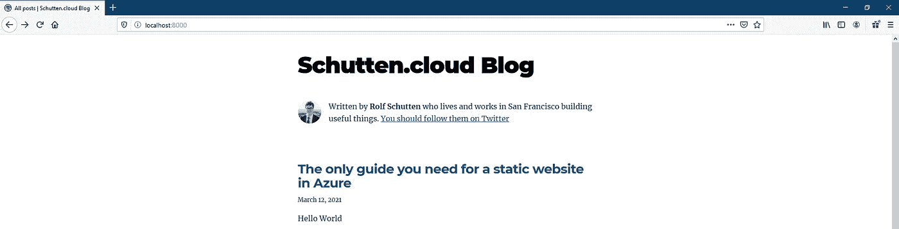
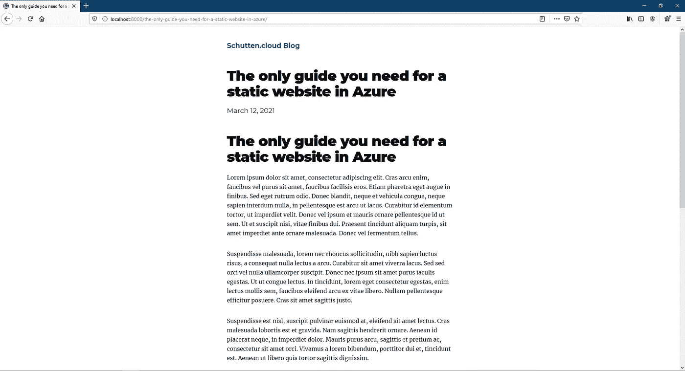

# Azure 中静态网站的唯一指南——第 1 部分创建静态网站

> 原文：<https://itnext.io/the-only-guide-you-need-for-a-static-website-in-azure-part-1-create-a-static-website-da00ddc85f2d?source=collection_archive---------2----------------------->



如果你正在阅读这篇文章，很可能你想创建自己的静态网站，想了解更多关于静态站点生成器的信息，想知道如何使用 Azure 服务托管你的静态网站，或者想知道如何自动化你的 web 代码的完全集成和你的站点构建的部署。不管怎样，这一系列的博文都是为你准备的！

本文是系列文章的一部分，包括:

*   对于 Azure 中的静态网站，你需要的唯一指南是:第 1 部分:创建一个静态网站。在这篇文章中，我介绍了什么是静态网站，有什么可供选择，以及如何创建一个(本地)静态网站。你现在在这里。
*   [Azure 静态网站的唯一指南——第 2 部分:使用 Azure Blob 存储托管你的站点](https://rolfschutten.medium.com/9114b7069db2?source=friends_link&sk=ba10cc60043f0456c8fef0fd7fd3909a)。在这篇文章中，我介绍了如何在 Azure Blob 存储中托管静态网站，有什么可供选择，以及一些关于内容交付网络(CDN)的基础知识。
*   [Azure 静态网站的唯一指南——第 3 部分:使用 Azure DevOps 管道实现自动化](https://rolfschutten.medium.com/e53aa65c1fba?source=friends_link&sk=60a4f5bb7a2fd07907df311461f00409)。在本文中，我将介绍什么是 Azure DevOps 服务，以及如何将静态网站的构建和部署自动化到 Azure storage。

让我们开始吧。在本文中，我们将讨论第一部分:创建一个静态网站。

# 了解静态网站

静态网站是指在用户的 web 浏览器中显示的与存储时完全一样的网站，而不是由 web 应用程序生成的动态网页。静态网页通常是以文件形式存储的 HTML 文件，由 web 服务器通过 HTTP(S)提供。静态网站主要适用于从不或很少需要更改或更新的内容。近年来，静态网站再次变得极为流行。使用静态网站最常见的原因来自于成本考虑、安全需求、技术优势、性能需求、可靠性需求、可扩展性需求等。然而，静态网站也有一些缺点。编辑内容需要 web 开发人员的技能，所有单独的(HTML 和 CSS)文件必须手动编辑。

幸运的是，已经有了解决这些挑战的方法:静态站点生成器(或 SSG)。这类生成器的例子有 [Next.js](https://nextjs.org/) 、[雨果](https://gohugo.io/)、[盖茨比](https://www.gatsbyjs.com/)、[杰基尔](https://jekyllrb.com/)、 [Eleventy](https://www.11ty.dev/) 、 [Nuxt.js](https://nuxtjs.org/) 等。这些静态站点生成器的共同点是它们解决了必须手动修改单个文件的问题。例如，在添加了一篇博客文章之后，只需要从框架中生成一个新的静态网站构建。然后，可以将输出上传到虚拟主机提供商。让我们看看一些最流行的静态站点生成器:

## Next.js



*图片由 Next.js 上传*[*Nextjs.org*](https://nextjs.org/)

Next.js 是一个基于 React 的 web 框架，可用于构建服务器端呈现(SSR) web 应用程序、静态站点生成(SSG)或两者的组合(混合)。因此，将 Next.js 称为静态站点生成器并不完全正确。得益于基于 React 的 web 框架，Next.js 提供了各种用于路由、代码拆分等的内置工具。这使得构建 React 单页面应用程序更加容易。

## 盖茨比（姓）



*图片由盖茨比上*[【Gatsbyjs.com】T21](https://gatsbyjs.com/)

Gatsby 是一个基于 React 的静态站点生成器，自 2015 年 Jamstack 推出以来产生了巨大的影响。Gatsby 是基于 JavaScript 框架的 SSGs 时代的创始人，并使 Jamstack 应用程序中的数据 GraphQL 流行起来。关于盖茨比最常见的抱怨是它的建造时间。Gatsby 已经(部分地)通过启动增量构建解决了这个问题，因此在许多情况下将构建时间减少到仅仅几秒钟。他们还修改了他们的路由，以自动创建类似 Next.js 的路由。

## 雨果



*图片由雨果上*[*go Hugo . io*](https://gohugo.io/)

Hugo 是一个基于 go 的静态站点生成器，成立于 2013 年，专注于提供生成完全静态站点的工具，没有前端框架。雨果因其建造时间而特别有特色。由于围棋内置了 Hugo，所以速度快得令人难以置信。这对于生成大型网站，以及使用提供静态网站实现选项的提供商提供的服务(如 [Netlify](https://www.netlify.com/) )非常有帮助，这些服务根据构建分钟数向您收费。

## 吉基尔博士



*图片由杰基尔上*[*Jekyllrb.com*](https://jekyllrb.com/)

Jekyll 是一个基于 Ruby 的静态站点生成器，由 GitHub 联合创始人 Tom Preston-Werner 于 2008 年创建。Jekyll 让静态站点生成器的概念变得非常流行，主要是因为 GitHub 页面中的支持。GitHub Pages 运行 Jekyll 的构建过程，只要一个更改被签入 GitHub。这个过程现在几乎可以在(软件)开发世界的任何地方看到，并且从那时起已经成为一个标准。Jekyll 几乎可以创建任何类型的网站，但它仍然很受欢迎，主要是因为静态博客可以简单地启动，因此非常受博客作者的喜爱。

在这篇博客中，我们以盖茨比为出发点，因为这是我个人的最爱，而且我的博客网站也是基于盖茨比。但是，您也可以选择不同的 SSG，因为本系列中的大多数步骤也适用于其他 SSG。

# 先决条件

要开始构建您的本地 Gatsby 静态博客站点，您需要确保已经安装了博客所需的所有软件。

## 安装 Node.js

Node.js 是一个开源的多平台 JavaScript 运行时环境，允许 JavaScript 在浏览器之外运行。Node.js 允许开发人员将 JavaScript 用于命令行工具和服务器端脚本。

要安装 Node.js，请转到他们的[下载页面](https://nodejs.org/en/download/)并根据您的操作系统下载。

当您按照安装提示完成后，打开您的终端并运行`node -v`来检查它是否安装正确。目前版本应该是 *14.16.0* 或以上。

## 安装 Gatsby CLI

Gatsby CLI(命令行界面)是让您构建 Gatsby 支持的站点的工具。要安装 Gatsby CLI，请打开终端并执行以下命令:

```
npm install -g gatsby-cli
```

## 安装 Visual Studio 代码

Visual Studio Code 是微软为 Windows、Linux 和 macOS 开发的源代码编辑器。它包括调试支持、内置 Git 检查、语法突出显示、智能代码完成、代码片段和代码重构。

尽管任何代码编辑器都可以，而且这是个人偏好，但我仍然在这个列表中提到 Visual Studio 代码。一个好的代码编辑器是每个博客所有者和(网络)开发者的绝对要求。帮自己一个忙，下载 Visual Studio 代码。它是免费的，而且在我看来是最好的。

要安装 Visual Studio 代码，去他们的[下载页面](https://code.visualstudio.com/download/)，根据你的操作系统下载。

现在你已经成功地设置好了一切，是时候创建你的第一个 Gatsby 站点了。

# 创建你的静态网站

您现在将创建一个 Gatsby 站点。在这个例子中，我们使用默认的 Gatsby starter 主题，但是你可以在 [Gatsby starter 库](https://www.gatsbyjs.com/starters/?v=2)上自由选择任何主题。

在终端中，运行执行以下命令来安装新的 Gatsby 博客:

```
gatsby new blogsite [https://github.com/gatsbyjs/gatsby-starter-blog](https://github.com/gatsbyjs/gatsby-starter-blog)
```

该命令所做的是创建一个新的**Gatsby 项目，名称为***【blogsite】*，从 URL 到保存启动代码的**代码库**。以我们为例*[*https://github.com/gatsbyjs/gatsby-starter-blog*](https://github.com/gatsbyjs/gatsby-starter-blog)*。如果您选择了不同的主题，您应该用您选择的模板中的一个替换此 URL。无论何时安装完成，您都可以运行`cd blogsite`命令，将您带到新创建的 Gatsby 项目的文件夹。******

****为了让您的站点在您的机器上本地运行，您将从 Gatsby 项目文件夹中执行`gatsby develop`命令。根据您的计算机规格，可能需要一段时间才能启动。一旦启动，你可以在你的互联网浏览器中打开一个新标签，然后进入[*http://localhost:8000/*](http://localhost:8000/)。你现在正在浏览你的新盖茨比网站！****

********

*****图片由 Rolf Schutten 上传*[*Schutten . cloud*](https://www.schutten.cloud/)****

## ****添加和编辑内容****

****博客网站当然是为了与世界其他地方分享内容。在 Visual Studio 代码中打开 Gatsby 项目所在的文件夹。在下面的步骤中，您将编辑 *"gatsby-config.js"* 文件中的作者信息，并且您将添加您的第一篇博客文章。****

********

*****图片由 Rolf Schutten 上*[Schutten . cloud](https://www.schutten.cloud/)****

## ****编辑作者信息****

****您需要在 *"gatsby-config.js"* 文件中编辑的信息非常明显。下面是对此文件所做更改的示例。你想做的改变完全取决于你自己。****

********

*****图片由 Rolf Schutten 上传*[*Schutten . cloud*](https://www.schutten.cloud/)****

## ****向您的站点添加文章****

****要将博客文章添加到您的网站，只需复制现有博客文章的文件夹。另一种方法是创建一个新文件夹，其中包含一个要创建的新的 *"index.md"* 文件。请注意，文件名中没有空格。通常用破折号代替空格。****

****博客文章是用 Markdown 写的。Markdown 不在这篇博文中，但是有很多关于如何编写 [Markdown](https://github.com/adam-p/markdown-here/wiki/Markdown-Cheatsheet) 文件的有用指南。****

****在下面的例子中，创建了一个新文件夹和一篇题为“Azure 中静态网站所需的唯一指南”的文章。****

********

*****图片由 Rolf Schutten 上传*[*Schutten . cloud*](https://www.schutten.cloud/)****

****回到您的互联网浏览器，显示您仍在运行的本地网站(如果没有，再次运行`gatsby develop`命令)。你的网站看起来会像这样:****

********

*****图片由 Rolf Schutten 上传*[*Schutten . cloud*](https://www.schutten.cloud/)****

********

*****图片由 Rolf Schutten 上传于*[*Schutten . cloud*](https://www.schutten.cloud/)****

****现在要做的最后一件事是在 Gatsby 站点目录的根目录下运行`gatsby build`命令。这将编译您的应用程序/博客站点，并为部署做好准备。构建过程的输出将在“*public”*文件夹中公开。恭喜你，你已经编译并构建了你的第一个静态的盖茨比博客网站！****

****我们已经完成了本系列的第一篇文章。在本文中，您了解了什么是静态站点生成器，存在哪些流行的生成器类型，以及如何基于初学者模板创建 gatsby 站点。在本系列的下一篇文章中，我们将在 Azure 中托管站点。****