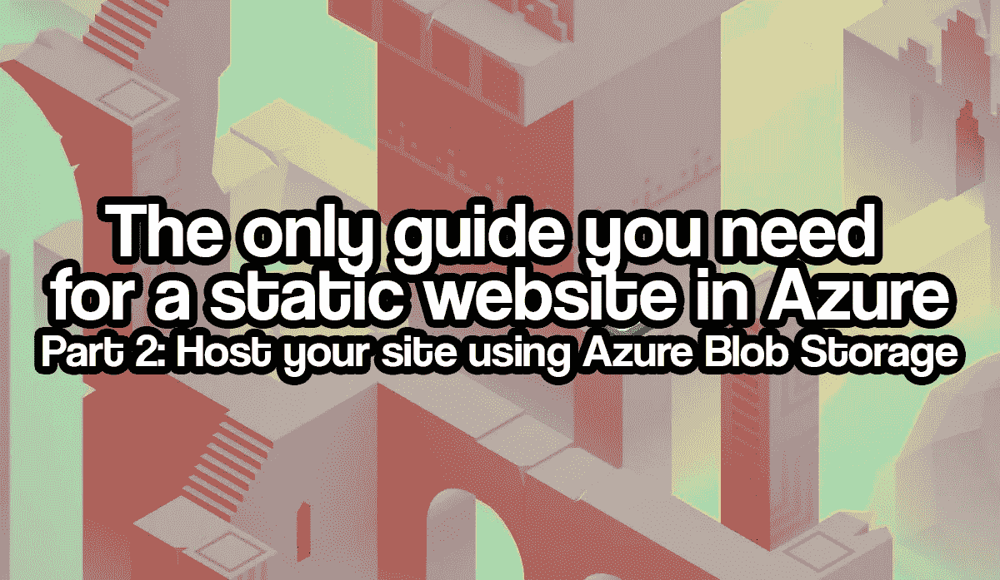
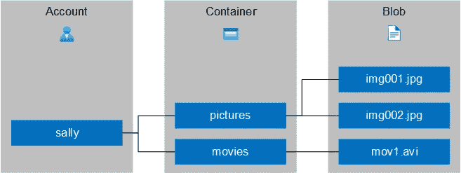
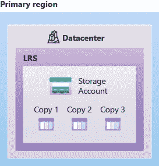
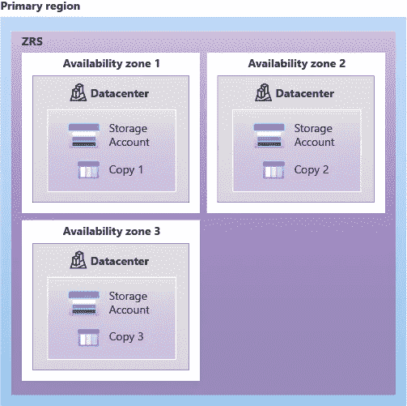
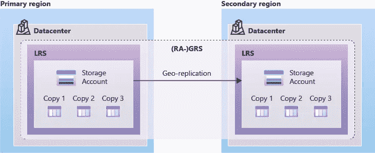
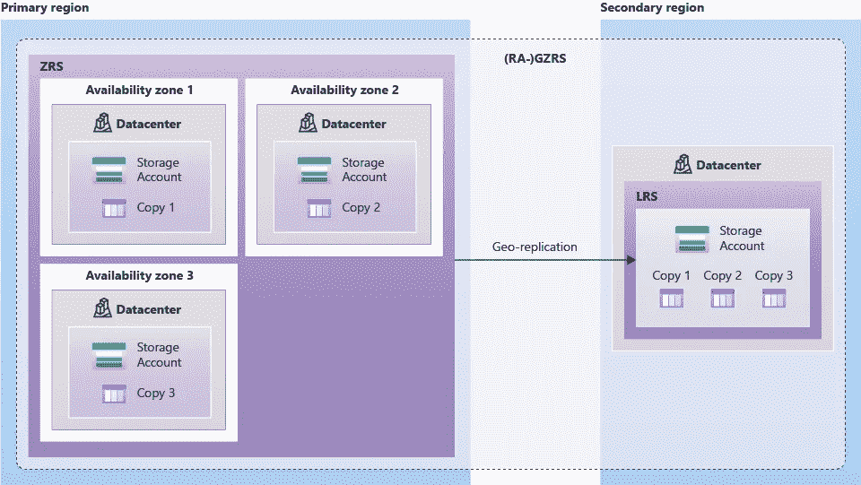
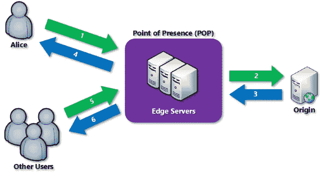
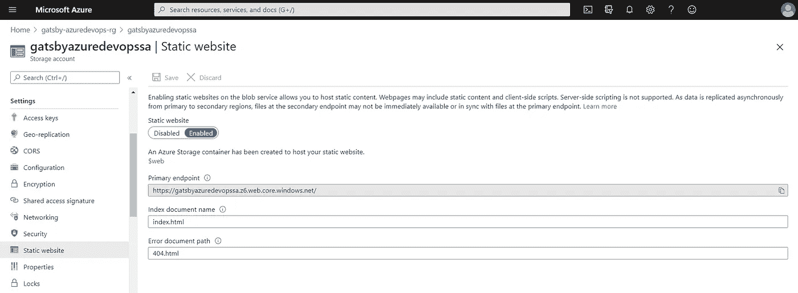

# Azure 中静态网站的唯一指南——第 2 部分使用 Azure Blob 存储托管您的站点

> 原文：<https://itnext.io/the-only-guide-you-need-for-a-static-website-in-azure-part-2-host-your-static-site-in-azure-9114b7069db2?source=collection_archive---------1----------------------->



如果你正在阅读这篇文章，很可能你想创建自己的静态网站，想了解更多关于静态站点生成器的信息，想知道如何使用 Azure 服务托管你的静态网站，或者想知道如何自动化你的 web 代码的完全集成和你的站点构建的部署。不管怎样，这一系列的博文都是为你准备的！

本文是系列文章的一部分，包括:

*   对于 Azure 中的静态网站，你需要的唯一指南是:第 1 部分:创建一个静态网站。在这篇文章中，我介绍了什么是静态网站，有什么可以选择，以及如何创建一个(本地)静态网站。
*   [Azure 静态网站的唯一指南——第 2 部分:使用 Azure Blob 存储托管你的站点](#)。在这篇文章中，我介绍了如何在 Azure Blob 存储中托管静态网站，有什么可供选择，以及一些关于内容交付网络(CDN)的基础知识。你现在在这里。
*   [Azure 静态网站的唯一指南——第 3 部分:使用 Azure DevOps 管道实现自动化](https://rolfschutten.medium.com/e53aa65c1fba?source=friends_link&sk=60a4f5bb7a2fd07907df311461f00409)。在本文中，我将介绍什么是 Azure DevOps 服务，以及如何将静态网站的构建和部署自动化到 Azure storage。

让我们开始吧。在本文中，我们将讨论第二部分:使用 Azure Blob 存储托管您的站点。

# 了解 Azure Blob 存储

Azure Blob Storage 是微软在 Azure 中的对象存储解决方案。Blob 存储用于存储 blob(二进制大型对象)，这是非结构化数据。这是不符合某些数据模型或定义的数据，如文本或二进制数据。Blob 存储由三种类型的资源组成:帐户、帐户中的容器和容器中的 blob(见下图)。



*图片由 Rolf Schutten 上传*[*Schutten . cloud*](https://www.schutten.cloud/)

默认情况下，存储帐户可以公开访问。但是，容器和 blob 对象不是。显然，您可以根据自己的需要定制访问级别。可以通过格式为[*https://your account account . blob . core . windows . net/your container/your blob*](https://youraccountaccount.blob.core.windows.net/yourcontainer/yourblob)的 URL 访问这些文件(考虑到您的访问级别和权限)。

如果你想了解更多关于 Azure Blob 存储的知识，微软有大量的[文档](https://docs.microsoft.com/en-us/azure/storage/blobs/)可用于这个对象存储解决方案。

## Azure 存储冗余

Azure 存储提供了许多冗余选择。下面是对这些选择的解释。你也可以在[微软文档](https://docs.microsoft.com/en-us/azure/storage/common/storage-redundancy)网站上找到所有这些信息。物体的成本和耐用性依次增加。这意味着物品的耐久性越高，成本就越高。要了解准确和最新的价格，请访问 [Azure Blob 存储定价](https://azure.microsoft.com/en-us/pricing/details/storage/blobs/)页面。

**本地冗余存储(LRS)**

本地冗余存储(LRS)在主区域的单个数据中心内将您的数据复制三次。在给定的一年内，LRS 提供至少 99.999999999% (11 个 9)的物体耐久性。下图显示了如何使用 LRS 在单个数据中心内复制数据:



*图片由微软上* [*微软文档*](https://docs.microsoft.com/en-us/azure/storage/common/storage-redundancy?toc=/azure/storage/blobs/toc.json)

**分区冗余存储(ZRS)**

区域冗余存储(ZRS)跨主区域中的三个 Azure 可用性区域同步复制您的 Azure 存储数据。每个可用性区域都是一个独立的物理位置，具有独立的电源、冷却和网络。ZRS 为 Azure 存储数据对象提供给定一年至少 99.9999999999% (12 个 9)的持久性。下图显示了如何使用 ZRS 在主区域中跨可用性区域复制数据:



*图片由微软在* [*微软文档*](https://docs.microsoft.com/en-us/azure/storage/common/storage-redundancy?toc=/azure/storage/blobs/toc.json)

**地理冗余存储(GRS)**

地理冗余存储(GRS)使用 LRS 在主区域的单个物理位置同步复制您的数据三次。然后，它将您的数据异步复制到远离主区域数百英里的辅助区域中的一个物理位置。GRS 为 Azure 存储数据对象提供给定一年至少 99.99999999999999% (16 个 9)的持久性。下图显示了如何使用 GRS 或 RA-GRS 复制您的数据:



*图片由微软上传* [*微软文档*](https://docs.microsoft.com/en-us/azure/storage/common/storage-redundancy?toc=/azure/storage/blobs/toc.json)

**地理区域冗余存储(GZRS)**

地理区域冗余存储(GZRS)将跨可用性区域的冗余提供的高可用性与地理复制提供的针对区域性中断的保护相结合。GZRS 存储帐户中的数据被复制到主区域中的三个 Azure 可用性区域，并且还被复制到辅助地理区域，以防止区域性灾难。Microsoft 建议将 GZRS 用于需要最大一致性、耐用性、可用性、卓越性能和灾难恢复弹性的应用程序。下图显示了如何使用 GZRS 或 RA-GZRS 复制您的数据:



*图片由微软上* [*微软文档*](https://docs.microsoft.com/en-us/azure/storage/common/storage-redundancy?toc=/azure/storage/blobs/toc.json)

**对二级区数据的读访问**

地理冗余存储(使用 GRS 或 GZRS)将您的数据复制到辅助区域中的另一个物理位置，以防止区域中断。但是，只有当客户或 Microsoft 启动从主区域到辅助区域的故障切换时，这些数据才可供读取。当您启用对辅助区域的读取权限时，您的数据在任何时候都可以被读取，包括在主区域不可用的情况下。对于辅助区域的读访问，启用读访问地理冗余存储(RA-GRS)或读访问地理区域冗余存储(RA-GZRS)。

## Azure 存储中的静态网站托管

静态内容(HTML、CSS、JavaScript 和图像文件)可以直接从名为 *"$web"* 的存储容器中提供，因为静态内容不需要 web 服务器。在 Azure 存储中托管内容支持使用无服务器架构，如 Azure 功能和其他平台即服务(PaaS)服务。静态网站托管是您必须在存储帐户上启用的功能，因为默认情况下它是禁用的。在*“自定义域名”*选项下，您可以非常轻松地将自己的域名添加到您的存储帐户中的静态网站。遗憾的是，Azure 存储帐户还没有导入您自己的 SSL 证书的选项。这意味着，如果我们想为我们的静态网站自定义域启用 HTTPS，我们必须使用 Azure 内容交付网络。

# 使用 Azure 内容交付网络

Azure 内容交付网络(CDN)是一个全球分布式服务器网络，可以高效地向高带宽用户交付 web 内容。此 web 内容可以托管在 Azure 或其他位置。以下是 CDN 工作原理的示意图:



*图片由微软上传* [*微软文档*](https://docs.microsoft.com/en-us/azure/cdn/cdn-overview)

Azure CDN 的关键特性之一是其 HTTPS 自定义域支持，这正是我们在本指南中使用它的原因。如果你想了解更多关于 Azure CDN 和它的其他功能，看看[微软文档](https://docs.microsoft.com/en-us/azure/cdn/)。

# 先决条件

要开始托管您的静态博客网站，请确保您已经满足以下先决条件。

## 静态网站构建

首先，您需要一个构建来托管。如果你还没有，按照这个博客系列的第一部分[创建你的静态网站。](https://rolfschutten.medium.com/da00ddc85f2d?source=friends_link&sk=481d8e810362ba54e5d47cf1c477677a)

## 安装 Visual Studio 代码

Visual Studio Code 是微软为 Windows、Linux 和 macOS 开发的源代码编辑器。它包括调试支持、内置 Git 检查、语法突出显示、智能代码完成、代码片段和代码重构。

尽管任何代码编辑器都可以，而且这是个人偏好，但我仍然在这个列表中提到 Visual Studio 代码。一个好的代码编辑器是每个博客所有者和(网络)开发者的绝对要求。帮自己一个忙，下载 Visual Studio 代码。它是免费的，而且在我看来是最好的。

要安装 Visual Studio 代码，请转到他们的[下载页面](https://code.visualstudio.com/download/)并根据您的操作系统下载。

## Azure 订阅

对于本指南，您需要一个 Azure 订阅，一个本地用户帐户[有权](https://docs.microsoft.com/en-us/azure/role-based-access-control/built-in-roles)创建和编辑 Azure 存储帐户，并将静态网站版本上传到该帐户。

## Azure CLI

在本指南中，您将为 Azure CLI 使用 Azure 云外壳。然而，如果你喜欢在本地工作站工作，你可以[在本地安装 Azure CLI](https://docs.microsoft.com/en-us/cli/azure/install-azure-cli)。

## AzCopy

在本指南中，您将使用 AzCopy 命令行实用程序将文件和目录上传到 Blob 存储帐户。前往[“AzCopy 入门”页面](https://docs.microsoft.com/en-us/azure/storage/common/storage-use-azcopy-v10)获取安装文件和如何安装 az copy 的指南。

# 创建一个存储帐户来提供静态内容

现在我们有了要部署的东西，我们需要一个部署它的位置。您将使用 [Azure CLI](https://docs.microsoft.com/en-us/cli/azure/what-is-azure-cli) 创建一个 [Azure 资源组](https://docs.microsoft.com/en-us/azure/azure-resource-manager/management/overview#resource-groups)和一个 [Azure 存储帐户](https://docs.microsoft.com/en-us/azure/storage/common/storage-account-overview)。

登录到 [Azure 门户](https://portal.azure.com/)后，使用链接或点击图标打开 [Azure 云外壳](https://shell.azure.com/)。


*图片由 Rolf Schutten 上传*[*Schutten . cloud*](https://www.schutten.cloud/)

如果你在本地使用 Azure CLI，你首先需要使用`az login`命令登录以使用任何 CLI 命令。

现在，使用以下命令创建资源组:

```
az group create \
    --name <Name> \
    --location <Region>
```

您可以根据需要更改参数。在我的例子中，我选择了西欧地区，并将我的资源组命名为“gatsby-azuredevops-rg”。

```
az group create \
    --name gatsby-azuredevops-rg \
    --location westeurope
```

现在，您可以将资源部署到该资源组。使用以下命令创建存储帐户:

```
az storage account create \
    --name <Name> \
    --resource-group <Group> \
    --location <Region> \
    --sku <SKU type>
```

在这里，您也可以根据自己的需要更改参数。在我的例子中，我选择西欧地区，我将使用[标准 LRS SKU](https://docs.microsoft.com/en-us/rest/api/storagerp/srp_sku_types) ，并将我的存储帐户命名为“gatsbyazuredevopssa”。

```
az storage account create \
    --name gatsbyazuredevopssa \
    --resource-group gatsby-azuredevops-rg \
    --location westeurope \
    --sku Standard_LRS
```

现在您有了一个存储帐户，您需要启用静态网站功能。您可以通过执行以下命令来实现这一点:

```
az storage blob service-properties update \
    --account-name <Name> \
    --static-website \
    --404-document <Error document> \
    --index-document <Index document>
```

同样，您将根据您的需要在这里更改参数。

```
az storage blob service-properties update \
    --account-name gatsbyazuredevopssa \
    --static-website \
    --404-document 404.html \
    --index-document index.html
```

您可以随时使用 Azure CLI 或门户更改或禁用这些设置。您也可以在这里找到端点链接。记下这个链接，你以后会需要的。



*图片由 Rolf Schutten 上传*[*Schutten . cloud*](https://www.schutten.cloud/)

# 创建内容交付网络端点

要创建 Azure CDN 端点并添加 HTTPS 支持的自定义域，首先必须创建 CDN 配置文件。在 Azure CLI 中使用以下命令创建它(或使用门户):

```
az cdn profile create \
    --name <Name> \
    --resource-group <Group> \
    --location <Region> \
    --sku <SKU type> 
```

和以前一样，您可以根据个人喜好更改参数。有关不同 SKU 类型的更多信息，请点击[此链接](https://docs.microsoft.com/en-us/azure/cdn/cdn-features)。对于本指南，您将选择标准的微软 SKU。

```
az cdn profile create \
    --name gatsby-azuredevops-cdnp \
    --resource-group gatsby-azuredevops-rg \
    --location westeurope \
    --sku Standard_Microsoft 
```

既然已经创建了 CDN 概要文件，我们现在可以创建一个 CDN 端点来通过 HTTP 和 HTTPS 提供内容。在 Azure CLI 中使用以下命令创建端点(或使用门户):

```
az cdn endpoint create \
    --name <Name> \
    --resource-group <Group> \
    --profile-name <Profile> \
    --origin <URL>
```

同样，您将根据您的需要在这里更改参数。在您的存储帐户中启用静态网站功能后记下的端点链接应该是您作为 URL 为 origin 参数输入的链接。

```
az cdn endpoint create \
    --name gatsby-azuredevops-cdne \
    --resource-group gatsby-azuredevops-rg \
    --profile-name gatsby-azuredevops-cdnp \
    --origin gatsbyazuredevopssa.z6.web.core.windows.net
```

恭喜你！您已成功将您的 azure 存储静态网站添加到 Azure 内容交付网络。

## 添加自定义域

若要将域映射到新创建的端点，您必须通过 DNS 提供商为指向该端点的自定义域创建 CNAME 记录。为此，请遵循 DNS 提供商的说明。创建 CNAME 记录后，在 Azure CLI 中运行以下命令，或者在门户中手动执行必要的步骤。

```
az cdn custom-domain create \
    --name <Name> \
    --resource-group <Group> \
    --endpoint-name <Endpoint> \
    --profile-name <Profile> \
    --hostname <URL>
```

根据需要更改参数。

```
az cdn custom-domain create \
    --name gatsby-azuredevops-cdnd \
    --resource-group gatsby-azuredevops-rg \
    --endpoint-name gatsby-azuredevops-cdne \
    --profile-name gatsby-azuredevops-cdnp \
    --hostname [www.schutten.cloud](http://www.schutten.cloud)
```

现在，您已经将自己的域添加到了端点。指定的自定义域现在指向您的静态网站，该网站位于您的存储帐户中。

您现在可以添加 SSL 证书了。您可以通过使用自己的证书或使用 CDN 管理的证书来实现这一点。要使用 CDN 管理的证书启用 https，您需要执行以下代码:

```
az cdn custom-domain enable-https \
--name <Name> \
--resource-group <Group> \
--endpoint-name <Endpoint> \
--profile-name <Profile>
```

根据需要更改参数。

```
az cdn custom-domain enable-https \
    --name gatsby-azuredevops-cdnd \
    --resource-group gatsby-azuredevops-rg \
    --endpoint-name gatsby-azuredevops-cdne \
    --profile-name gatsby-azuredevops-cdnp
```

如果你更愿意使用自己的 SSL 证书，你可以跟随微软的[这篇优秀教程。](https://docs.microsoft.com/en-us/azure/cdn/cdn-custom-ssl?tabs=option-2-enable-https-with-your-own-certificate)

# 将您的静态网站上传到 Azure 存储

最重要的是，我们现在将把我们的静态网站上传到存储帐户。为此，我们从 Windows 命令 Shell (cmd.exe)中使用 AzCopy。不用 Windows？在微软的【AzCopy 入门”页面上，查看您需要进行哪些调整。

首先，使用`cd`(更改目录)命令导航到静态网站的目录。这是 package.json 和 gatsby-config.js 文件所在的文件夹。然后运行以下命令:

```
azcopy copy '<local-directory-path>' 'https://<storage-account-name>.<blob or dfs>.core.windows.net/<container-name>' --recursive
```

同样，您必须为该命令提供您的个人首选项和适用于您的参数。我们只想上传*/公共*目录。毕竟，这是编译后的应用程序，也是我们在本系列的第一篇博客中运行的`gatsby build`命令的输出。该命令如下所示:

```
azcopy copy '\public\*' 'https://gatsbyazuredevopssa.blob.core.windows.net/web' --recursive
```

如果你更喜欢使用 Azure 门户，你也可以通过这种方式上传文件。上传完成后，您的静态网站应该在几分钟内在您的端点 URL 和自定义域上可见。

我们已经到了本系列第二篇文章的末尾。在本文中，您了解了什么是 Azure Blob 存储，什么是 Azure 内容交付网络，以及如何使用它们来托管您自己的静态内容。在本系列的下一篇文章中，我们将使用 Azure DevOps 自动化构建和部署过程。