# Azure 中静态网站的唯一指南——第 3 部分使用 Azure DevOps 管道实现自动化

> 原文：<https://itnext.io/the-only-guide-you-need-for-a-static-website-in-azure-part-3-automate-using-azure-devops-e53aa65c1fba?source=collection_archive---------0----------------------->

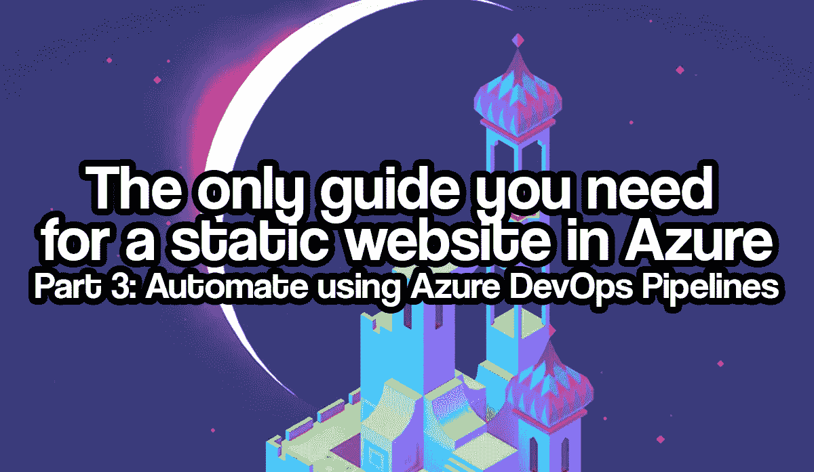

如果你正在阅读这篇文章，很可能你想创建自己的静态网站，想了解更多关于静态站点生成器的信息，想知道如何使用 Azure 服务托管你的静态网站，或者想知道如何自动化你的 web 代码的完全集成和你的站点构建的部署。不管怎样，这一系列的博文都是为你准备的！

本文是系列文章的一部分，包括:

*   对于 Azure 中的静态网站，你需要的唯一指南是:第 1 部分:创建一个静态网站。在这篇文章中，我介绍了什么是静态网站，有什么可以选择，以及如何创建一个(本地)静态网站。
*   [Azure 静态网站的唯一指南——第 2 部分:使用 Azure Blob 存储托管你的站点](https://rolfschutten.medium.com/9114b7069db2?source=friends_link&sk=ba10cc60043f0456c8fef0fd7fd3909a)。在这篇文章中，我介绍了如何在 Azure Blob 存储中托管静态网站，有什么可供选择，以及一些关于内容交付网络(CDN)的基础知识。
*   [Azure 静态网站的唯一指南——第 3 部分:使用 Azure DevOps 管道实现自动化](#)。在本文中，我将介绍什么是 Azure DevOps 服务，以及如何将静态网站的构建和部署自动化到 Azure storage。你现在在这里。

让我们开始吧。在本文中，我们将讨论第三部分，也是最后一部分:使用 Azure DevOps 服务将静态网站的构建和部署自动化到 Azure 存储。

# 什么是 Azure DevOps？

> “Azure DevOps 为支持团队提供开发人员服务，以规划工作、协作开发代码以及构建和部署应用程序。Azure DevOps 支持一种文化和一套流程，将开发人员、项目经理和贡献者聚集在一起，共同完成软件开发。它允许组织以比传统软件开发方法更快的速度创建和改进产品。”— [什么是 Azure DevOps？— Azure DevOps |微软文档](https://docs.microsoft.com/en-us/azure/devops/user-guide/what-is-azure-devops?view=azure-devops)

Azure DevOps 是微软的云服务，为每个人提供项目期间的最佳协作。例如，想想项目经理、开发人员、scrum 大师、产品负责人或其他项目利益相关者。Azure DevOps 提供了完整的包，包括版本控制、测试管理、自动化构建和发布管理。使用 Azure DevOps，您可以跟踪软件应用程序的完整生命周期。Azure 有许多功能，由不同的组件组成。让我们看看 Azure DevOps 提供了哪些组件。

## 蓝色木板

Azure Boards 使团队能够管理他们的软件项目。它支持 [Scrum](https://www.scrum.org/resources/what-is-scrum) 和[看板](https://www.atlassian.com/agile/kanban)，并提供可定制的仪表盘和集成报告。这些资源是完全可扩展的，可以随着您的业务发展而增长。有了 Azure Boards，你可以快速轻松地开始跟踪用户故事、待办事项、任务、功能以及与项目相关的 bug。可以基于工作项的类型和特定项目可用的过程来添加工作项。

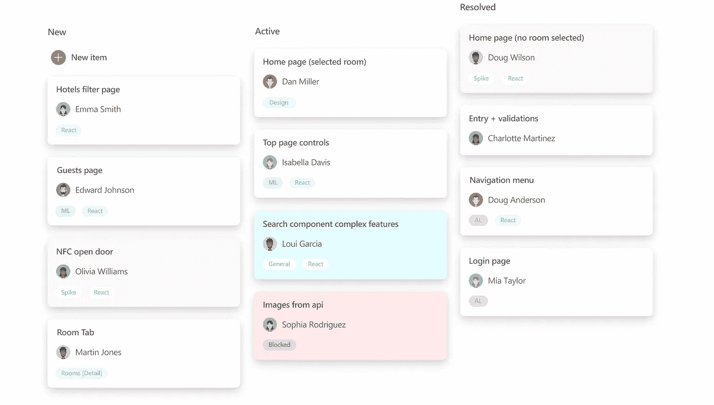

*图片由* [*微软*](https://www.microsoft.com/) *上*[*Azure devo PS-services |微软 Azure*](https://azure.microsoft.com/en-us/services/devops/)

如果你想了解更多关于 Azure Boards 的信息，请阅读[微软文档](https://docs.microsoft.com/en-us/azure/devops/boards/?view=azure-devops)中的 Azure Boards 文档。

## 蓝色仓库

Azure Repos 是 Git 的一个实现，用于管理代码。版本控制用于保存工作，并协调团队内部的代码变更。版本控制系统跟踪代码随时间的变化。当代码被编辑时，版本控制系统会给你的文件拍一个快照。版本控制系统永久存储该快照，以便以后需要时可以调用。


*图片由* [*微软*](https://www.microsoft.com/) *上*[*Azure devo PS-services |微软 Azure*](https://azure.microsoft.com/en-us/services/devops/)

如果你想了解更多关于 Azure Repos 的信息，请阅读[微软文档](https://docs.microsoft.com/)中的 [Azure Repos 文档](https://docs.microsoft.com/en-us/azure/devops/repos/?view=azure-devops)。

## 天蓝色管道

Azure Pipelines 提供了自动构建和测试代码项目并使它们可用的能力。Azure Pipelines 几乎支持任何编程语言和项目方法。它结合了持续集成(CI)和持续交付(CD ),以持续和一致地测试、构建和交付代码到任何目标。

要了解更多关于持续集成(CI)和持续交付(CD)的信息，请阅读微软文档上的 Azure DevOps 的[关键概念](https://docs.microsoft.com/en-us/azure/devops/pipelines/get-started/key-pipelines-concepts?view=azure-devops#continuous-delivery)。

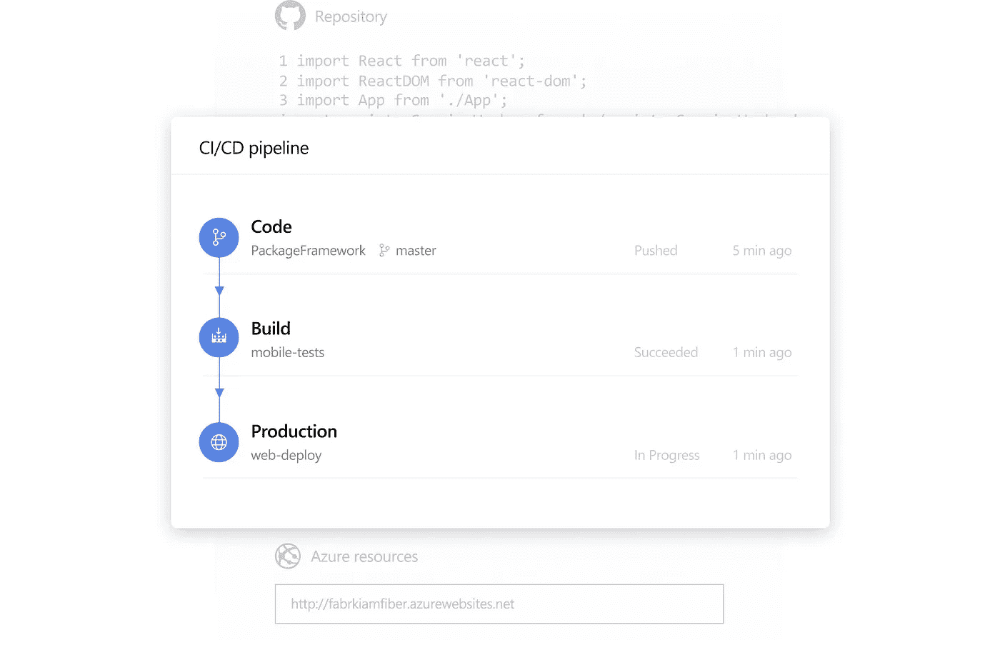

*图片由* [*微软*](https://www.microsoft.com/) *上*[*Azure devo PS-services |微软 Azure*](https://azure.microsoft.com/en-us/services/devops/)

如果你想了解更多关于 Azure Pipelines 的信息，请阅读[微软文档](https://docs.microsoft.com/)中的 [Azure Pipelines 文档](https://docs.microsoft.com/en-us/azure/devops/pipelines/?view=azure-devops)。

## Azure 测试计划

质量是软件系统的一个重要方面，手工测试和探索性测试仍然是最大化这一点的重要技术。在今天的软件开发过程中，团队中的每个人都拥有质量，包括开发人员、经理、产品负责人、用户体验倡导者等等。Azure DevOps 提供了全面而强大的工具，任何人都可以使用这些工具来提高开发过程中的质量和协作。它提供了预定的手动测试、用户验收测试、探索性测试和利益相关者反馈收集所需的所有功能。对于 CI / CD 工作流的自动化测试，必须使用 Azure 管道。

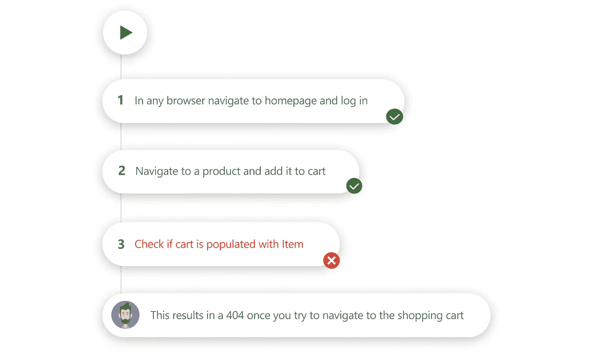

*图片由* [*微软*](https://www.microsoft.com/) *上*[*Azure devo PS-services |微软 Azure*](https://azure.microsoft.com/en-us/services/devops/)

如果你想了解更多关于 Azure 测试计划的信息，请阅读[微软文档](https://docs.microsoft.com/)中的 [Azure 测试计划文档](https://docs.microsoft.com/en-us/azure/devops/test/?view=azure-devops)。

## 天蓝色的艺术品

Azure 工件可以从公共和私有来源创建和共享 NPM、Maven、Python 和 NuGet 包提要。您还可以添加[通用包](https://docs.microsoft.com/en-us/azure/devops/artifacts/quickstarts/universal-packages?view=azure-devops)，这使用户能够存储除了上面提到的包之外的不同类型的包，但我们不会在这些博客系列中涉及这些。
使用 Azure 工件，你可以——只需点击一下——将完全集成的包管理添加到持续集成/持续交付(CI/CD)管道中。Azure Artifacts 引入了多个提要的概念，您可以使用这些提要来组织和管理对您的包的访问。

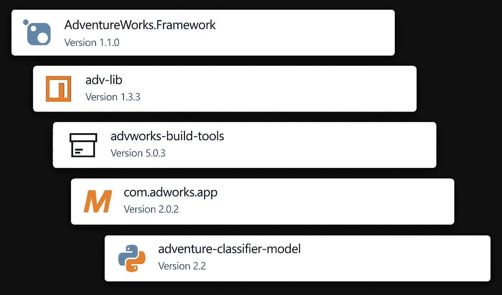

*图片由* [*微软*](https://www.microsoft.com/) *上*[*Azure devo PS-services |微软 Azure*](https://azure.microsoft.com/en-us/services/devops/)

如果你想了解更多关于 Azure 工件的信息，请阅读[微软文档](https://docs.microsoft.com/)中的 [Azure 工件文档](https://docs.microsoft.com/en-us/azure/devops/artifacts/?view=azure-devops)。

# 为什么使用 Azure DevOps 来部署我的静态网站？

我们已经在上面对不同 Azure DevOps 组件的描述中介绍了一些好处。然而，有一些好处需要特别提及，因为它们根本没有被提及，或者因为它们产生的优势可能会再次被提及。

首先，因为自动化节省了你的时间。那不需要进一步解释。其次，因为它提供了一致性。使用 Azure DevOps，您只需考虑您的管道并设置一次，之后所有部署都以相同、一致和自动化的方式进行。有了一致的部署方式，任何偏差都可以被快速检测并补救，这最终会导致代码质量和安全性等问题。第三，您可以建立代码开发的跟踪记录，并享受时光倒流和恢复以前快照的可能性。此外，并非不重要的是，这是一种非常容易获得和有趣的方式来发现、学习和体验 Azure DevOps 的强大功能。

最重要的是:前 5 名用户的 Azure DevOps 服务基本订阅完全免费。有关 Azure DevOps 服务的更多定价信息，您应该看看微软 Azure 的 [Azure DevOps 服务定价页面](https://azure.microsoft.com/en-us/pricing/details/devops/azure-devops-services/)。

既然我们已经熟悉了 Azure DevOps 服务中的可能性，那么是时候在实践中体验一下了。

# 先决条件

要开始托管您的静态博客网站，请确保您已经满足以下先决条件。

## 静态网站构建

首先，您需要一个构建来托管。如果你还没有，按照这个博客系列的第一部分[创建你的静态网站。](https://rolfschutten.medium.com/da00ddc85f2d?source=friends_link&sk=481d8e810362ba54e5d47cf1c477677a)

## 安装 Visual Studio 代码

Visual Studio Code 是微软为 Windows、Linux 和 macOS 开发的源代码编辑器。它包括调试支持、内置 Git 检查、语法突出显示、智能代码完成、代码片段和代码重构。

尽管任何代码编辑器都可以，而且这是个人偏好，但我仍然在这个列表中提到 Visual Studio 代码。一个好的代码编辑器是每个博客所有者和(网络)开发者的绝对要求。帮自己一个忙，下载 Visual Studio 代码。它是免费的，而且在我看来是最好的。

要安装 Visual Studio 代码，去他们的[下载页面](https://code.visualstudio.com/download/)，根据你的操作系统下载。

## 安装 Git

您将需要[下载](https://git-scm.com/book/en/v2/Getting-Started-Installing-Git)并安装 Git。您将使用 [Git](https://git-scm.com/about) 来跟踪和部署网站源代码中的文件变更，并协调(联合)开发。如果你想了解更多关于 Git 的知识，我推荐你观看这些视频。这将花费您大约 30 分钟的时间。

## Azure 订阅

对于本指南，您需要具有 Azure (Blob)存储帐户的 Azure 订阅，该帐户至少启用了静态网站选项。如果你还没有设置这个，请先阅读这个博客系列的[第二部分。此外，您将需要](https://rolfschutten.medium.com/9114b7069db2?source=friends_link&sk=ba10cc60043f0456c8fef0fd7fd3909a)[一个本地用户帐户，该帐户在此订阅中拥有权限](https://docs.microsoft.com/en-us/azure/role-based-access-control/built-in-roles)，以创建和编辑 Azure 存储帐户，并将静态网站构建上传到此帐户。

# 创建 Azure DevOps 项目

您现在将转到[https://dev.azure.com/](https://dev.azure.com/)，登录，同意使用 Azure DevOps，并通过提供项目名称来创建您的第一个项目。

首先，您必须创建一个包含文件的存储库。当点击左侧菜单上的 **Repos** 时，您会在标题*“从命令行推送现有存储库”*下看到一些代码。现在，打开您的终端，切换到在本快速入门的步骤 1 中创建您的站点的目录，并执行以下命令:`git init`、`git add .`，后面是前面提到的标题下的代码。可能会提示您使用 Azure 凭据登录。所有 Git 命令看起来都像这样:

```
git init
git add .
git remote add origin [https://gatsbyazuredevops@dev.azure.com/gatsbyazuredevops/GatsbyAzureDevops/_git/GatsbyAzureDevops](https://gatsbyazuredevops@dev.azure.com/gatsbyazuredevops/GatsbyAzureDevops/_git/GatsbyAzureDevops)
git push -u origin --all
```

如果您刷新 Repos 页面，您现在会看到 repo 中的所有文件。您还可以将现有的 Git repo 导入到您的项目中。如果你想这样做，你可以跟随微软的这篇优秀教程。现在，您已经准备好制作第一条管道了。

点击左侧菜单上的**管道**并点击**创建管道**。你现在被询问你的代码在哪里。您选择*“Azure Repos Git”*，因为您刚刚将我们的代码推送到 Azure Repos。在下一个屏幕上选择它。然后会询问您管道需要配置哪种代码。您将选择 *"Node.js"* ，然后开始查看您的管道 YAML。大概在第 20 行，你会把*“NPM run build”*换成*“yarn build”*。您还将向 YAML 的底部添加以下代码，以创建您希望您的构建产生的工件:

```
- task: PublishBuildArtifacts@1
  inputs:
    PathtoPublish: '$(System.DefaultWorkingDirectory)/public'
```

您的管道 YAML 应该如下所示:

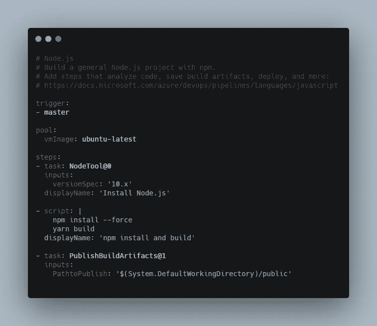

*图片由 Rolf Schutten 上传*[*Schutten . cloud*](https://www.schutten.cloud/)

拯救 YAML。出于教育目的，您将在下一个屏幕上选择*“直接提交到主分支机构”*。在这个快速入门中，我们不涉及任何分支策略、流程或策略。运行一次管道进行测试。所有复选标记都应该是绿色的。您现在已经认识到，一旦变更被推送到代码存储库，构建就会自动生成(作为一个工件)。

现在，您将确保生成的构建(工件)被部署到之前创建的 Azure 存储帐户。进入左侧菜单的**发布**，创建**新管道**。您将从一个*“空工单”*开始。请遵循以下步骤:

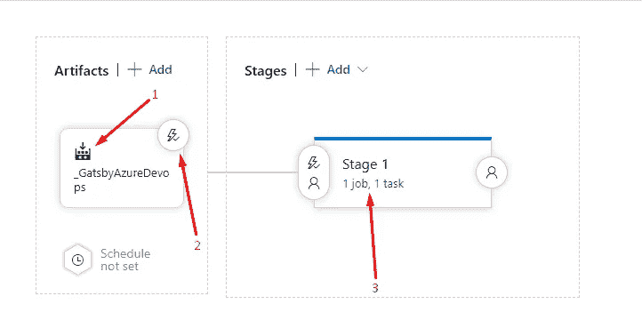

*图片由 Rolf Schutten 上传*[*Schutten . cloud*](https://www.schutten.cloud/)

1.  **添加一个工件**并选择源类型*“构建”*。对于*源*，你不应该有太多选择，因为你只创建了一个。点击**添加**。
2.  在神器上，点击**闪电图标**。启用*“连续展开触发”*。现在，您已经将管道配置为在每次有新构建可用时触发。
3.  在**阶段**部分，点击阶段 1 中的文本行*“1 个作业，0 个任务”*。点击**代理作业**中的 **+** 添加任务。您想要将您的构建复制到您的 Azure 存储帐户，因此您将选择 **Azure 文件复制**。填写类似下图的参数并**保存**(在屏幕上方)。

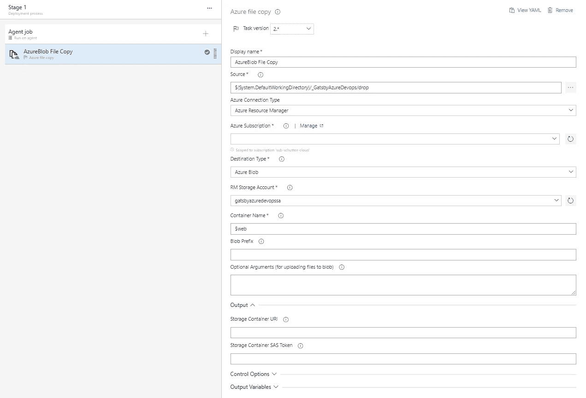

*图片由 Rolf Schutten 上传*[*Schutten . cloud*](https://www.schutten.cloud/)

在有多个代码贡献者的生产环境中，您会希望使用多阶段管道。我不会在这个博客系列中涉及这些，但是如果你想了解更多关于多级管道的知识，你应该阅读泰勒·欧玛利的这篇优秀的博客。

现在，您已经为持续集成和持续部署做好了一切准备。在接下来的步骤中，您将通过向存储库推送一些更改来测试您的管道。

# 推送、构建、部署和享受！

现在，您将使用`git push`对您的代码进行更改，并将其推送到存储库。从您在本快速入门的步骤 1 中创建的 gatsby 站点目录中打开您的 *"src\index.js"* 文件。改文*“你好世界！”*以你的喜好保存文件。之后，打开终端，转到本快速入门的步骤 1 中创建站点的目录，并执行以下命令:

```
git add .
git commit -m "First commit"
git push origin master
```

您现在可以通过返回到 [Azure DevOps](https://dev.azure.com/) 中的**管道**刀片来跟踪持续集成。您将会看到作业正在运行，并被触发*“刚刚”*。

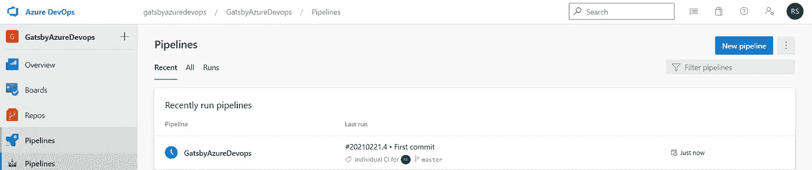

*图片由 Rolf Schutten 上传*[*Schutten . cloud*](https://www.schutten.cloud/)

您可以检索有关管道正在执行的任务的更多信息。如果一切顺利，你会看到所有的复选标记变成绿色。这意味着新推出的代码已经被自动集成，新的构建已经完成。

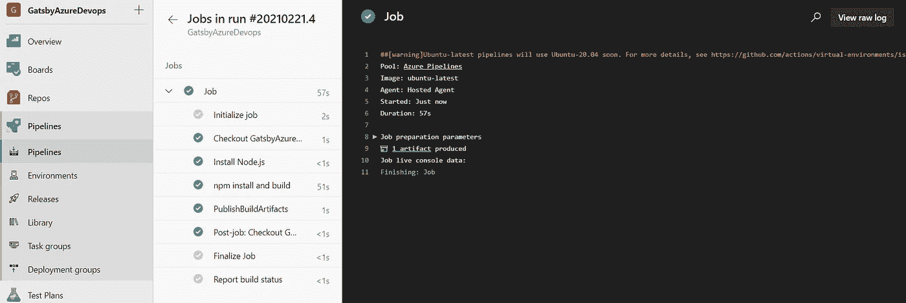

*图片由 Rolf Schutten 上传*[*Schutten . cloud*](https://www.schutten.cloud/)

正如您在本快速入门的步骤 3 中所配置的那样，新版本是一个部署触发器。您可以通过返回到 [Azure DevOps](https://dev.azure.com/) 中的**发布**刀片来跟踪部署。如果一切顺利，你只会看到绿色的勾号。这意味着该版本已成功部署到您的 Azure 存储帐户。

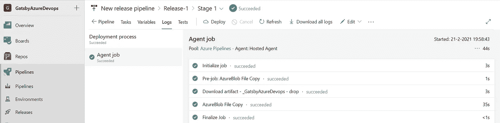

*图片由 Rolf Schutten 上传*[*Schutten . cloud*](https://www.schutten.cloud/)

你应该做的最后一件事是看看你刚刚部署的网站，看看它是否工作。你可以通过导航到你的 Azure 存储帐户的端点链接来做到这一点(我们在本博客系列的第二部分[中讨论过)。](https://rolfschutten.medium.com/9114b7069db2?source=friends_link&sk=ba10cc60043f0456c8fef0fd7fd3909a)

本指南到此结束。当然，许多东西可以添加到管道中。如果你对此感兴趣，看看[微软文档](https://docs.microsoft.com/)上的 [Azure DevOps 文档](https://docs.microsoft.com/en-us/azure/devops/)。

非常感谢您关注这个博客系列。我希望你从中学到了一些东西。如果您有任何问题或意见，或者在遵循这些指南时遇到问题，请不要犹豫，通过 [LinkedIn](https://www.linkedin.com/in/rolf-schutten/) 给我发消息。我很乐意帮助你。