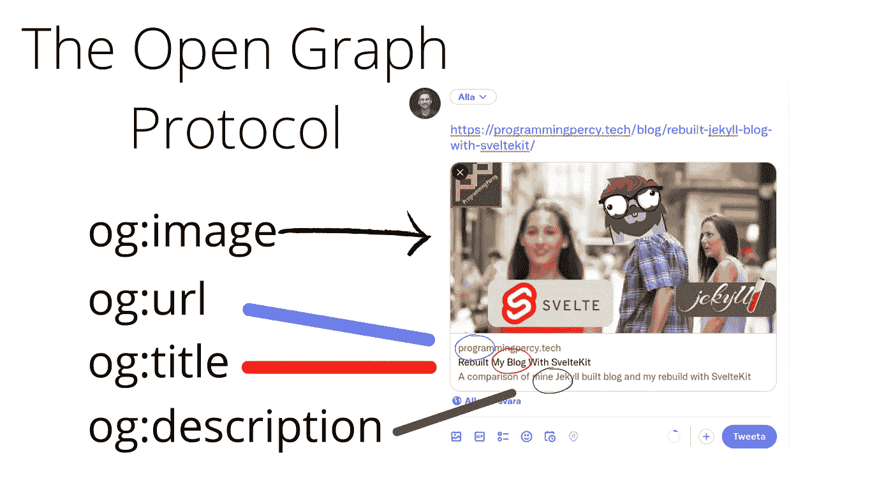
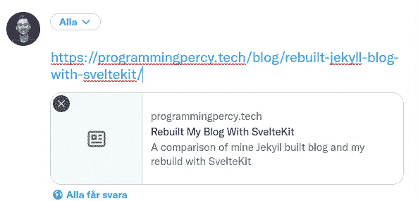
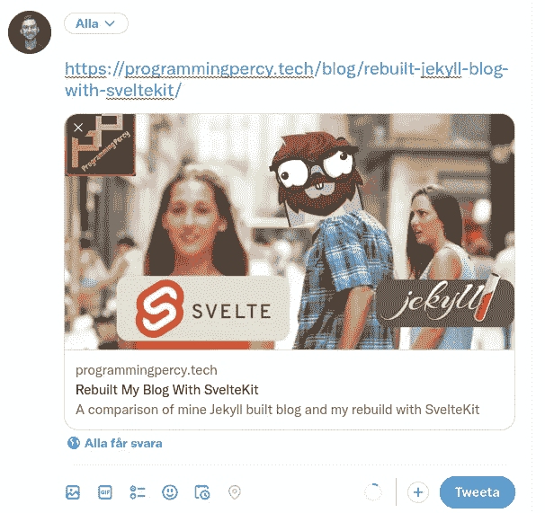
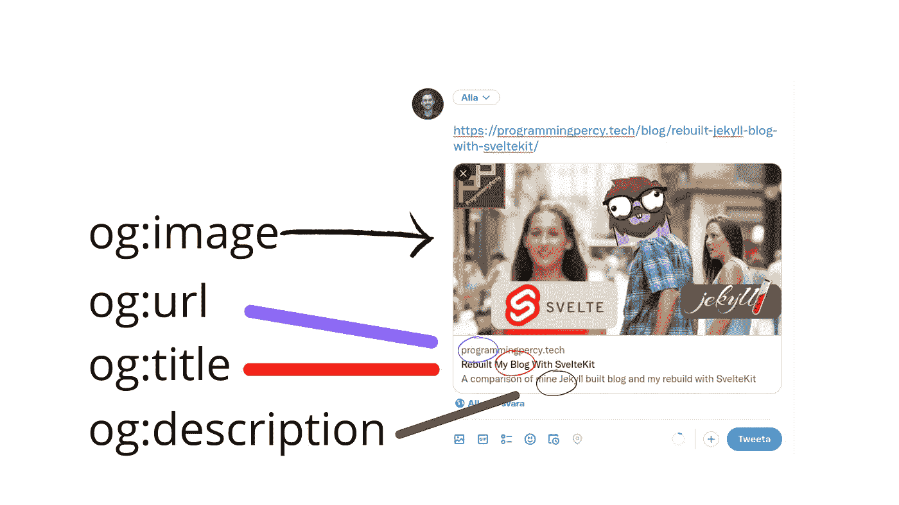
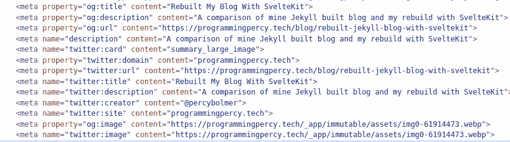

# 开放图协议——为什么以及如何在你的网站上使用它

> 原文：<https://itnext.io/the-open-graph-protocol-why-and-how-you-should-use-it-on-your-website-cd4a7a46676e?source=collection_archive---------1----------------------->

## 有没有想过当你复制一个链接时，Twitter、脸书和其他社交媒体是如何知道要显示什么图片和标题的？



展示了开放图协议中元标签的位置

我最近用 [SvelteKit](https://kit.svelte.dev/) 重建了我的整个网站，当我完成后，我打算在 Twitter 上分享我的网站。

想象一下我复制链接时的失望，推文预览看起来有点无聊，就像这样。



我的网站的预览显示没有图像。

我开始研究为什么，并了解了[开放图协议](https://ogp.me/)。

开放图形协议是一种在其他网站中表示您的网站上的数据的标准化方式。

把它想象成一种为你的网站制作名片的方式，甚至是一个页面。

如果你想看这篇文章的视频，你可以去 YouTube

应用协议后，我的推文反而看起来更有趣了。



应用开放图形元标签后我的网站的预览

该协议非常简单，有许多不同的标签，但开始只需要其中的几个。该协议依赖于添加到您的网页`<head>`的元标签，其他网站可以阅读和理解。

## 打开图形元标签以显示丰富的网站内容

OpenGraph meta 标签是一组 meta 标签，可以添加到 HTML 文档的`head`中，以提供关于页面内容的附加信息。社交媒体平台和其他网站可以使用这些信息在共享时提供页面的丰富预览，包括标题、描述、图像和其他详细信息。

要向 HTML 文档添加开放图形元标签，可以使用`meta`元素，并将`property`属性设置为您想要指定的开放图形属性的名称。例如，要指定页面的标题，可以使用以下 meta 标记:

```
<meta property="og:title" content="The title of your page" />
```

这个 meta 标签使用`og:title`属性来指定页面的标题，并使用`content`属性来提供属性值。您可以根据需要向 HTML 文档中添加任意数量的 Open Graph meta 标记，并且可以使用任何可用的 Open Graph 属性来指定有关页面的附加信息。

以下是一些最常用的开放图表属性列表:

*   `og:title`:页面的标题。这应该是一个简短的，描述性的标题，总结了网页的内容。
*   `og:description`:页面的简要描述。这应该是几个句子，提供更多关于页面内容的细节。
*   `og:image`:表示页面的图像的 URL。这应该是一个与页面内容相关的高质量图像。
*   `og:url`:页面的网址。这应该是页面的规范 URL，也是共享页面时应该使用的首选 URL。

为了理解所有标签的相关内容，我制作了一个简单的图像，显示了它们对应的位置。



显示元标签的位置

除了这些属性之外，还有许多其他打开的图表属性可用于指定有关页面的附加信息，如页面类型、页面作者、页面发布日期等。关于可用开放图形属性及其描述的完整列表，您可以参考[开放图形协议文档](https://ogp.me/)。

要了解开放图元标签在实践中是如何使用的，您可以检查任何使用开放图元标签的 web 页面的`head`。例如，如果您访问[用 SvelteKit 重建我的博客](https://programmingpercy.tech/blog/rebuilt-jekyll-blog-with-sveltekit/)并右键单击文本，然后选择`inspect`将弹出开发者工具包，它将向您显示网站的 HTML 代码。导航到网站的`head`，你可以看到我添加的所有标签。



为编程打开图形标记 percy.tech

请记住，您可以添加任意数量的 meta 标签，如果您有重复的标签，它会选择底部的标签。

## 不同的社交媒体有不同的标签

也许你已经注意到我的代码中有了`twitter:title`和更多与 Twitter 相关的标签？这是因为大多数社交媒体平台都有自己的标签。让我们以 Twitter 为例来回顾一下。

Twitter 有自己的 meta 标签集，可以添加到 HTML 文档的`head`中，以提供关于页面内容的附加信息。这些元标签类似于开放图元标签，但是它们使用`name`属性。

要将 Twitter meta 标签添加到 HTML 文档中，可以使用`meta`元素，并将`name`属性设置为您想要指定的 Twitter 属性的名称。例如，要指定页面的标题，可以使用以下 meta 标记:

```
<meta name="twitter:title" content="The title of your page" />
```

这个 meta 标签使用`twitter:title`属性来指定页面的标题，并使用`content`属性来提供属性值。

以下是一些最常用的 Twitter 属性列表:

*   `twitter:title`:页面的标题。这应该是一个简短的，描述性的标题，总结了网页的内容。
*   `twitter:description`:页面的简要描述。这应该是几个句子，提供更多关于页面内容的细节。
*   `twitter:image`:代表页面的图像的 URL。这应该是一个与页面内容相关的高质量图像。
*   `twitter:url`:页面的 URL。这应该是
*   `twitter:card`:设置图片显示选项，如 summary_large_image 填充整篇 tweet。

你可以在他们的开发者文档中看到更多关于如何处理 twitter 的信息。我建议在测试时使用他们的验证工具，看看一切是否正常。

twitter 标签与`og`标签相同，但以`twitter:`为前缀。

它很容易使用，访问[验证器](https://cards-dev.twitter.com/validator)，输入你的 URL，看看他们是否接受你的 meta 标签。

现在这涵盖了 Twitter 是如何做的，但脸书也是如此，他们有自己的[调试器](https://developers.facebook.com/tools/debug/)，你可以使用，如果需要，还有一些相关的[文档](https://developers.facebook.com/docs/sharing/webmasters#markup)。

## 结论

元标签很容易实现和使用，但是当人们分享你网站的链接时，它们会有很大的价值。

如果你还没有使用过 Open Graph，你应该马上实现它。

我建议您访问 Open Graph 网站，阅读有哪些选项，我们只展示了从一开始就提供最大价值的简单选项。

如果你的网站上有视频，可以添加视频预览等标签。

我希望你喜欢它，随时在我的任何社交媒体上联系我，让我知道你的想法，或者如果你需要任何帮助来实现标签。