# 复杂性的起源

> 原文：<https://itnext.io/the-origin-of-complexity-8ecb39130fc?source=collection_archive---------1----------------------->


写软件很难。

有太多的事情要处理，太多的移动部件和可能出错的事情，所以很容易迷路。这不仅仅是关于建立正确的*、*事情，而且*、*以及*、*关于建立正确的*、*事情。

作为对此的反应，关于如何最好地开发软件的技巧列表在过去几年里不断增长。有时候这些建议很有帮助，但是其他的却是矛盾的。

我们已经学会了不重复自己，避免可变状态，使用纯函数，使用接口，使用多态性，更喜欢组合，使用声明式风格，避免时间耦合，在小团队中工作，进行小的提交，避免长时间的分支，测试我们的代码，等等。

但是，如果我们能找到一个简单的原则，它很容易理解，并帮助我们对软件进行推理，这不是很好吗？

让我们重写列表，并添加 *why* 以获得提示:

*   *不要重复自己*——因为那样会增加协调性。
*   *把它变小*——因为那样会降低协调性。
*   *避免可变状态—* 因为它增加了协调性。
*   *使用纯函数—* 因为它们降低了协调性。
*   *使用接口*——因为它们降低了协调性。
*   使用多态性——因为它降低了协调性。
*   *偏爱构图——*因为减少了协调性*。*
*   *使用声明式风格—* 因为它减少了协调*。*
*   避免时间耦合，因为它引入了协调
*   在小团队中工作——因为这会降低协调性。
*   *犯小错误—* 因为这会降低协调性。
*   *避免长寿命的分支—* 因为它们增加协调性。
*   *测试你的代码—* 捕捉没有正确完成的协调！

如你所见，这都是关于*协调*！

现在你可能会想，协调有什么问题？

协调的问题是它给我们的系统增加了复杂性，使它们更难改变和工作。让我们看一个例子。

这里我们在一个简单的文本编辑器中插入了一个标题:

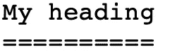

问题是如果我们改变航向，

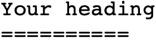

我们还需要通过添加更多=字符来更新下面的行。结果是我们引入了*协调*，它需要由人类来*处理。这在这里可能是一个小问题，因为缺少的等号很容易发现和修复，但情况并非总是如此。*

另一种说法是，我们未能通过*引入手动工作*而不是让计算机为我们做工作*来使*任务自动化。

解决方法是切换到更高级的文本编辑器，就像这样:


如果我们现在将文本更改为:


下划线会被编辑器自动更新，通过电脑*自动化*解决了我们的协调问题。

这种关联可以用类似“当标题改变时，确保下面相应的行具有相同数量的字符”来表达。这是一个人可以负责的事情，但也可以委托给一台电脑来完成*的自动化。*

注意，我们不能摆脱所有的手工工作。自动化需要代码，由人类编写！当然，这只是一个时间问题，直到这个任务也被计算机接管，但那是另一个故事了！

# 可变性

当我们从事软件工作时，我们不得不面对这样一个事实:我们周围的大多数事物都在不断变化。

这包括硬件、协议、数据格式、安全标准、操作系统、编程语言、库、框架、代码、工具、服务、方法、员工、组织以及我们自己！

我认为*可变性*是软件对抗复杂性最重要的特征。如果我们能找到一个基于简单原理的简单模型，那么我们就有了一些有用的东西，可以帮助我们创建更简单的系统。

这就是我们需要做的来实现*可变性:*

*   提高可用性
*   降低协调性

# 可用性

使事物*可用*可以通过使我们的系统和工具适应人们及其局限性和需求来实现。代码也不例外！

代码库或部分代码库的可用性水平与更改的难易程度直接相关。

下面是维基百科对可用性的描述:

> **可用性**是指工具或设备等人造物体的易用性和易学性。在[软件工程](https://en.wikipedia.org/wiki/Software_engineering)中，**可用性**是一个软件在量化的使用环境中，能够被指定的消费者使用来实现量化的目标的程度，具有有效性、效率和满意度。

在软件中实现可用性的主要方式有:

1.  让东西容易找到，重复使用和推理。
2.  使用能让你快速工作并给你快速反馈的工具和技术。
3.  组织人员，促进交流、学习和工艺。

可用性可以通过多种方式提高。这里有三个例子:

**例一:**给事物起个好名字。

**例 2:** 使用 [REPL](https://en.wikipedia.org/wiki/Read–eval–print_loop) 通过缩短反馈回路来提高生产率。

**例 3:** 交流时约定一种[无处不在的语言](https://martinfowler.com/bliki/UbiquitousLanguage.html)。

关于可用性有很多要说的，但它本身是一个巨大的研究领域，我们不会在这里深究。

# *协调*

我们已经说过，协调增加了复杂性，并给出了一些例子，但我们还没有研究是什么原因或在哪里出现的。

## 协调原因

有三个主要领域需要协调:

*   大小——当事物变大时
*   *顺序* —当顺序*和*有关系时
*   一致性—当一致性很重要时

## 协调原因——尺寸

当某个东西变大时，它不仅仅对可用性有负面影响；通过让事情变得更难理解和推理，这也增加了对*协调*的需求。

基本上有两种方法可以最小化尺寸:

*   把它分开——以减少协调
*   使它可组合——使它更小更容易使用

**把它分开**

例如，如果我们*将一个团队的人数增加一倍*，从三人增加到六人:

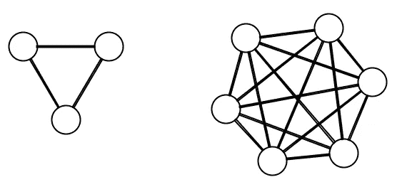

交流的方式从三种增加到十五种，增加了 5 倍！这种*协调*和*复杂性*的指数增长是软件*中最难解决的问题之一。这种不幸的行为是一些大型项目失败的原因。*

对抗复杂性的方法是将事情分解:

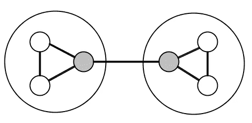

在这里，我们有两个三人小组，每个小组中有一个人负责与其他小组和自己的小组进行沟通。这将连接的数量从 15 个减少到了 7 个，协调性减少了 50%以上！

同样的原则也适用于代码和数据，这就是为什么小功能比大功能更好的原因，也是为什么由小的可重用组件组成的 [Polylith](https://polylith.gitbook.io/polylith) 系统比大的 [Monolith](https://en.wikipedia.org/wiki/Monolithic_application) 更好的原因。

**使其可组合**

另一个减小尺寸的主要技术是使事物可组合。

为了实现*可组合性*,我们必须在处理事物的方式中引入*一致性*:


[功能](https://en.wikipedia.org/wiki/Functional_programming)方式是以*数据*为素材，以*功能*为工具。[面向对象](https://en.wikipedia.org/wiki/Object-oriented_programming)方式是以*数据*或*接口*为素材，以*对象*为工具。

为了使其有用，我们需要减少*材料*的变体数量，并确保*工具*可以对其进行操作。只要满足了这一点，我们就可以允许自己拥有大量工具来降低复杂性。

在 Unix 中，材质由*行字符串*组成，工具由一组*命令*表示，这些命令可以像乐高一样组合在一起:

```
tr -cs A-Za-z **‘\n’** | 
tr A-Z a-z | 
sort | 
uniq -c | 
sort -rn | 
sed **${1}**q
```

这个例子摘自[道格拉斯·麦克洛伊](https://en.wikipedia.org/wiki/Douglas_McIlroy)在向[唐纳德·努斯](https://en.wikipedia.org/wiki/Donald_Knuth)提供反馈时写的一个解决方案。你可以在这里阅读更多关于背景[的内容，也可以找到一个](https://franklinchen.com/blog/2011/12/08/revisiting-knuth-and-mcilroys-word-count-programs/)[列表，里面有用不同语言编写的问题解决方案](https://rosettacode.org/wiki/Word_frequency#Clojure)。

## 协调原因——订单

复杂性的一个来源是当我们需要协调事情发生的顺序时。

有时候事情按照一定的顺序来是很重要的。代码也不例外。

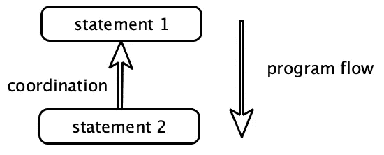

这里*语句 2* 必须等待*语句 1* 结束，这就引入了两个语句之间需要协调。结果是我们不能交换顺序或并行语句。

有时一件事必须在另一件事之前发生。在这些情况下，如果通过代码、计划工具或我们使用的任何工具明确地表达出来，将会很有帮助。但是如果协调的需要没有被清楚地表达出来，这是代码经常出现的情况，那么引入错误的风险就会增加。

解决方案是将*什么*和*如何分开。*如果我们能够表达*需要做什么*并将*如何做*委托给其他一些部分，比如函数、队列、规则引擎或者 [DSL](https://en.wikipedia.org/wiki/Domain-specific_language) 引擎，那么我们就可以更好地不去关心执行顺序。

让我们举例说明*订单*的重要性:

**例 1:** 我们在开始工作之前就计划好了工作。

**例 2** :在继续其他工作(时间耦合)之前，必须调用一个 *init* 函数。

**例 3:** 服务器必须安装操作系统、虚拟机、一些工具等，其他软件才能在上面运行。

**例 4:** 我们在执行任务之前，先学习、练习，达到工匠精神。

其中一些任务，比如设置服务器，可以自动化，这就是我们减少协调的方式。其他任务还不能完全自动化，至少现在还不能，比如计划、学习和练习。

## 协调原因——一致性

在我们的列表中，导致协调的最后一件事是当事情需要一致时。我们生活在一个不断变化的世界，事情很容易“失去同步”。另一个挑战是避免重复。

基本上有两种方法可以保持同步:

*   *只有一个*的东西
*   小步前进

**只有一个**

确保事物一致的一个有效方法是每样东西只有一个。作为编程语言一部分的指令和函数就是很好的例子。

每个“构建块”，就像一个 *if* 语句，只被定义*一次，*但是可以在代码中的多个地方使用:

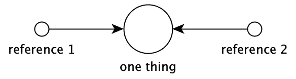

语言本身也只定义一次，但是可以从几个地方使用(在不同的机器上)。我们摆脱协调的方法是只需要在*一个地方做改动。*

如果我们有一些代码或数据被复制并在不止一个地方使用(例如两个不同的服务)，那么我们引入了*复制*，需要*协调*以保持同步并保持*一致。*

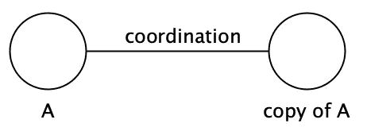

如果我们稍后需要更改其中一个服务，例如修复一个 bug，那么我们还需要记得更新另一个服务。认为*复制&粘贴*可以用来“解耦”服务的想法通常是一种错觉，因为它并没有消除*对协调*的需求。

虽然有时候，你真的想从头开始。一个例子是当 [MySql](https://www.mysql.com) 数据库被分叉成 [MariaDB](https://mariadb.org) 时。

通过将一个定义集中到一个地方来消除协调的另一个例子是使用*多态性:*

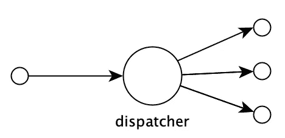

在面向对象中，调用对象上的方法时选择调用的方法是基于其类的类型。函数式语言有时支持更加灵活的调用调度方式，但是原理是一样的。

这个想法是将调度机制集中到一个地方，这样我们就不会因为分散在代码库中的重复的语句而结束。

**小步移动**

事情变得*不同步*的最常见的例子是当人、工具、代码、模型、硬件等等，不与他们的环境一起移动。

解决问题的方法是循序渐进。

我们想要小步前进的原因，比如在我们的 [VCS](https://en.wikipedia.org/wiki/Version_control) 系统中进行小的提交，或者通过短的[冲刺](https://www.scrum.org/resources/what-is-a-sprint-in-scrum)，是因为当“合并回来”时，我们需要做的协调量随着“差异”的大小呈指数增长:

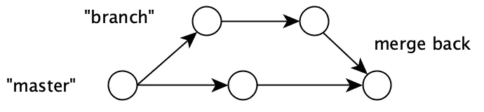

我们越频繁地将代码合并到 master 中，需要做的协调就越少。我们的冲刺越短，就越容易与变化的世界保持同步(“主”分支)。

## 出现协调时

我们提到，在开发软件时，许多事情都在不断变化。变化引入了对协调的需求，这也是构建软件如此困难的主要原因之一。

正如我们所看到的，各级都在进行协调:

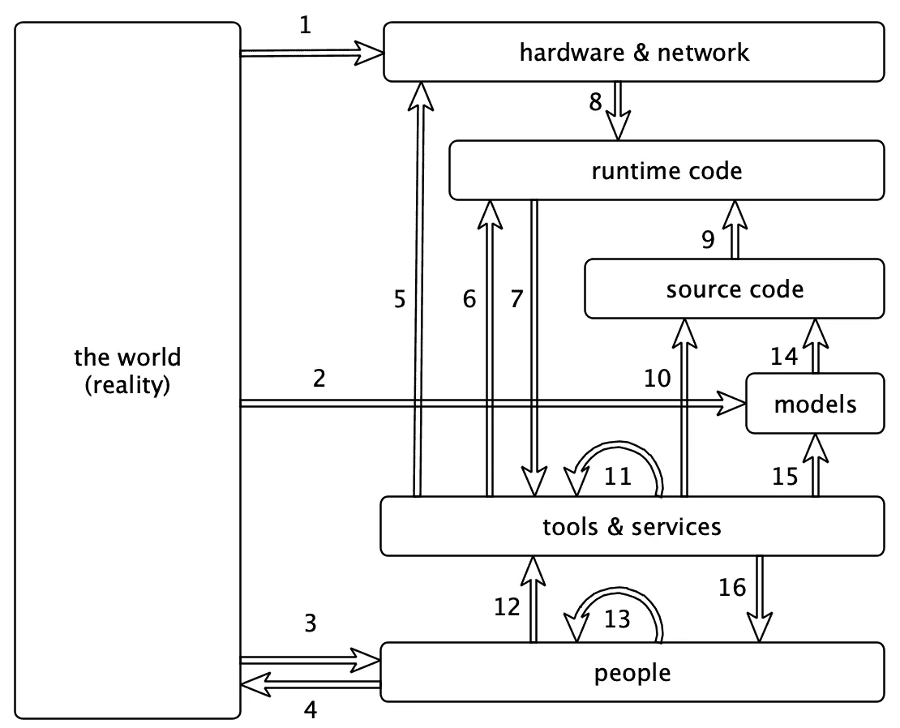

1.  *硬件&网络*受到*现实*的影响，以至于它们有时会坏掉，需要修理或更换。
2.  来自世界*的概念*变成了我们代码*中的*模型*。*
3.  人们受到这个世界以及他们生活和工作的环境的影响。
4.  *人*离开团队/项目，新人出现。
5.  *工具* *&服务*用于管理*硬件&网络。*有时*由使用*工具*的*人*手动*，有时*自动。*
6.  *工具*用于执行或调试*运行时代码。*
7.  *工具&服务*由*运行时代码*组成，以便它们可以被执行。
8.  需要硬件来执行*运行时代码。*
9.  *源代码*转换成*运行时代码。*
10.  *工具*用于处理*源代码。*
11.  *工具*被其他*工具&服务使用。*
12.  *人*创造*工具&服务*。
13.  *人们*与其他*人互动。*
14.  *模型*影响*源代码*的编写方式。
15.  *工具*用于创建*模型*。
16.  *工具*和*服务*由*人*用来执行任务:5)管理硬件&网络，6)执行或调试代码，10)处理源代码，15)创建模型，16)组织人员。

这里有大量的协调工作在进行。如果我们在一个地方做出改变，它通常会引起其他地方的连锁反应。

我们管理所有这些变化的方式是:

1.  提高可用性
2.  自动化和最小化协调

我们已经讨论了如何自动化协调，以及可用性影响可变性。但是我们还没有提到的是，我们有时可以选择*完全不改变*或者只进行*非破坏性改变。*

以下是一些例子:

**例 1:** 最初的 [Intel x86](https://en.wikipedia.org/wiki/X86) 指令在最初发布的几十年后，仍然受到支持。

**例 2:** 仍然支持 [Java 虚拟机](https://en.wikipedia.org/wiki/Java_virtual_machine)的原始字节码指令集。

**例 3:** 原来的 [HTTP](https://en.wikipedia.org/wiki/Hypertext_Transfer_Protocol) 协议规范仍然被支持，四十多年过去了。

解决方案是商定一个契约，使之成为一个标准，然后只做向后兼容的修改。就这么简单！

这些标准是全球共享的，但我们可以在一个组织或代码库中使用相同的想法，例如，当服务之间通信时，我们总是使用 [JSON](https://en.wikipedia.org/wiki/JSON) ，或者所有代码都应该在[之上运行。Net](https://en.wikipedia.org/wiki/.NET_Framework) 或 [JVM](https://en.wikipedia.org/wiki/Java_virtual_machine) 平台来保证一致性。

# 走出沥青坑

在我们继续之前，我们需要提到本·莫斯利和彼得·马克斯的杰作《走出沥青坑》。原因很简单。如果不把它包含在关于软件复杂性的博客文章中，那将是一种犯罪！

如果你还没有读过，我建议你读一读。这是值得花时间！

他们谈论了很多关于对抗复杂性的重要性以及复杂性产生的原因。

他们指出:

> 复杂性是成功开发大型软件系统的唯一主要困难。

他们继续说:

> 我们认为，在许多系统中，造成这种复杂性的主要原因是状态的处理

*状态*表示*易变状态，*尤其是*不协调易变状态。我同意这非常正确，尤其是在鼓励使用不协调可变状态的语言中。*

*可变状态*特别难处理的原因是，它引入了*对协调的需求。*有时缺乏这种协调的需要，例如*全局变量，*这就是为什么全局变量通常不被鼓励的原因。

幸运的是，有控制可变状态的方法，比如使用[事务](https://en.wikipedia.org/wiki/Transaction_processing)、[瞬态数据结构](https://clojure.org/reference/transients)、[软件事务内存(stm)](https://en.wikipedia.org/wiki/Software_transactional_memory) 、[原子](https://clojure.org/reference/atoms)等等。

可变状态可能潜入的常见情况是通过使用对象:

> 底线是所有形式的 OOP 都依赖于状态(包含在对象中),一般来说，所有行为都受状态的影响。结果，OOP 直接遭受了与上述状态相关的问题，因此我们认为它没有为避免复杂性提供足够的基础。

这也是为什么首选使用*不可变状态*和*纯函数*的原因，因为它们本身不会引入协调。

本文还讨论了由*控制*引起的复杂性，即事情发生的*顺序*。

他们的观察是:

> 事情发生的顺序是由编程语言语句的编写顺序控制的

这样做的问题是，它增加了语言没有明确表达的协调需求，结果是开发人员在阅读代码时需要在头脑中执行这种协调，这增加了在代码中引入错误的风险。

他们在第 8 页和第 9 页描述得很好:

> 困难在于，当控制是语言的一个隐含部分时(几乎总是如此)，那么每一段程序都必须在那个上下文中理解——即使程序员可能不希望对此说什么。当程序员被迫(通过使用具有隐式控制流的语言)指定控件时，他或她被迫指定系统应该如何工作的一个方面，而不仅仅是想要什么。实际上，他们被迫过分强调问题。

本文讨论了软件的许多其他方面，如身份、不同种类的编程范例、关系模型等等。我认为，如果更多的人理解这篇论文，这个行业中产生的许多复杂性就可以消除了！

# 属国

那么，当我们已经有了*依赖时，为什么还要使用*协调*这个词呢？*

主要原因是它们*的意思不同*。

这也是为什么我们不能说“依赖是不好的”，因为情况并不总是这样。如果我们依赖于一个永远不会彻底改变的东西，那就更不正确了。

例如，依赖虚拟机(例如 JVM)有助于我们消除编译后的字节码和硬件之间的协调需求。依赖 java.lang.String 帮助我们以一种安全的方式使用字符串，而不用担心它将来会改变！

经验法则是:

> 稳定你所依赖的东西

# 连接

所以如果我们不能用*依赖*来描述一个系统设计的有多好，也许我们可以用*耦合*？

耦合可以用 [connascence](https://connascence.io) 概念来描述，但是这里我们将使用[维基百科](https://en.wikipedia.org/wiki/Coupling_(computer_programming))的定义:

> 在[软件工程中](https://en.wikipedia.org/wiki/Software_engineering)、**耦合**是软件模块之间相互依赖的程度；对两个例程或模块连接紧密程度的一种度量；模块之间关系的强度。

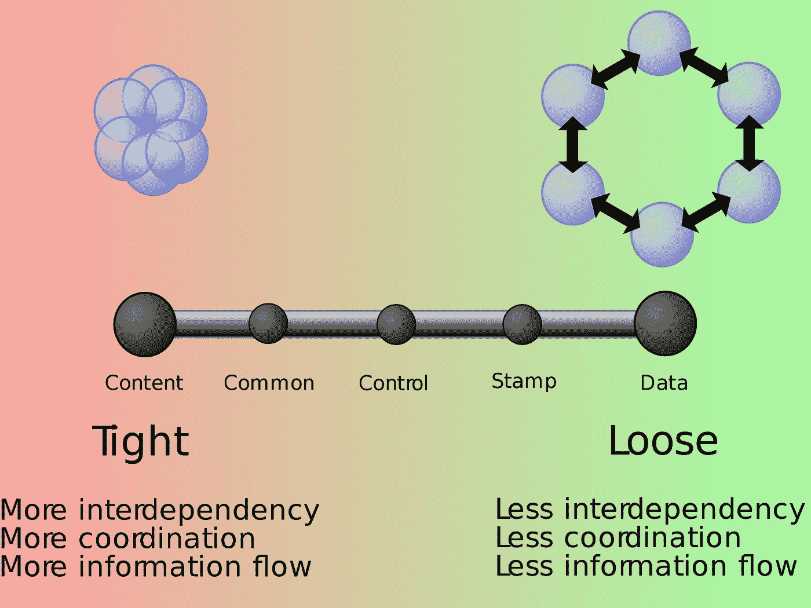

[https://en . Wikipedia . org/wiki/File:Coupling _ sketches _ cropped _ 1 . SVG](https://en.wikipedia.org/wiki/File:Coupling_sketches_cropped_1.svg)

该图度量了耦合*的三个方面:相互依赖、协调*和*信息流*。如果我们需要三个词来描述*耦合*，其中*协调*是其中之一，那么它很可能和*协调不是一个概念！*

这个概念没有被如此简明地定义的一个迹象是不同类型耦合的巨大列表:*内容耦合、公共耦合、外部耦合、控制耦合、戳耦合* ***、*** *数据耦合、子类耦合*和*时间耦合*。

导致复杂性的潜在机制没有清楚地表达出来，这使得松*或紧*耦合*的概念很难用作指导我们做出设计决策的工具。*

其结果是，人们经常试图在不降低协调需求的情况下“分离”事物，不幸的是，这通常只会增加更多的复杂性。更好的方法是关注*减少协调*和*增加可用性*作为对抗复杂性的一种方式。

# 权衡

有时你可能不得不在引入*协调*的*可用*解决方案和相反的解决方案之间做出选择。

让我们假设你需要选择在文本文件中引入副本，还是使用[模板引擎](https://en.wikipedia.org/wiki/Template_processor):

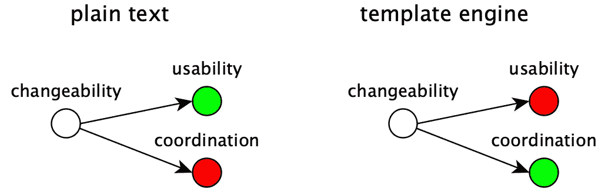

将内容存储为*纯文本*可以保持其可读性和可搜索性，但是每当复制的内容发生变化时，需要记住更新文件，这是额外的代价。

引入*模板引擎*将解决重复内容的*协调*，但也会增加复杂性，并可能降低可读性和搜索能力。

选择何种解决方案应基于重复数据更改的频率、忘记更新文件的风险以及与引入模板引擎的成本相比可能产生的影响有多大。

然而最常见的是，协调性*的降低*也会对*可用性*产生积极的影响

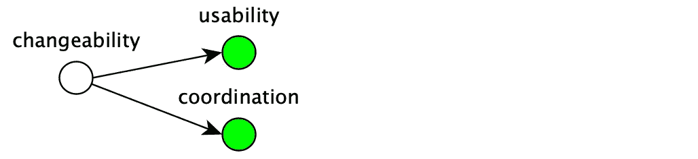

这包括减少*大小*，删除*重复*，将*什么*与*如何*分开，保持事情*一致*，等等。

# 摘要

这张图表总结了我们讨论过的内容:

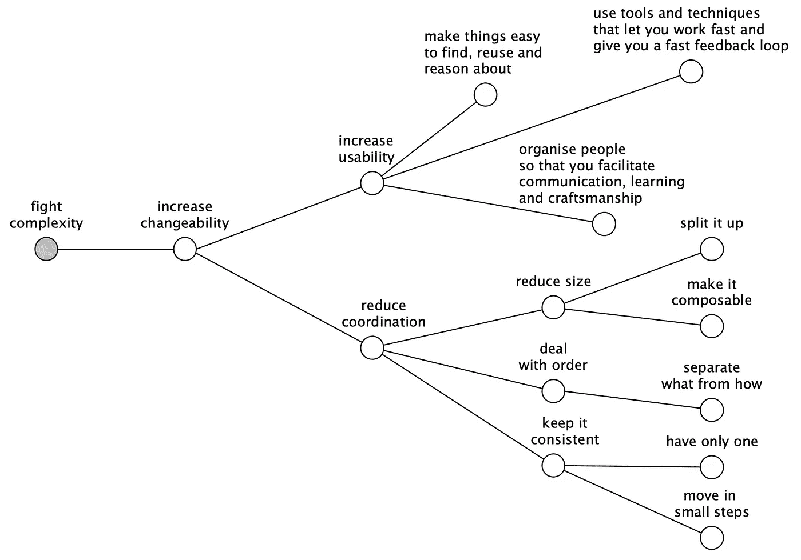

这个图表将帮助你发展正确的事情，而不是正确的事情。那部分你得自己搞清楚！

我们的目标是为您提供一个工具，引导您找到更简单、质量更高的解决方案，让您工作更快、玩得更开心、花得更少！

所以下次你需要做设计决策的时候，不要犹豫使用这个图表！

# 编程语言的选择

我们工具箱中最重要的工具是*编程语言。*人们常说，我们选择什么编程语言并不重要，因为无论选择什么语言，我们都可以解决任何问题，只要它足够快并且[图灵完成](https://en.wikipedia.org/wiki/Turing_completeness)。

这就像说足球队里的球员技术有多好并不重要一样错误。可能比较差，但是编程语言也需要“技巧”才能表现好！

有时候，语言的速度或编译的速度是最重要的技能，但大多数情况下，这只是关于它是否适合对抗复杂性。

当我们选择语言时，我们应该选择一种尽可能符合简单性的语言:

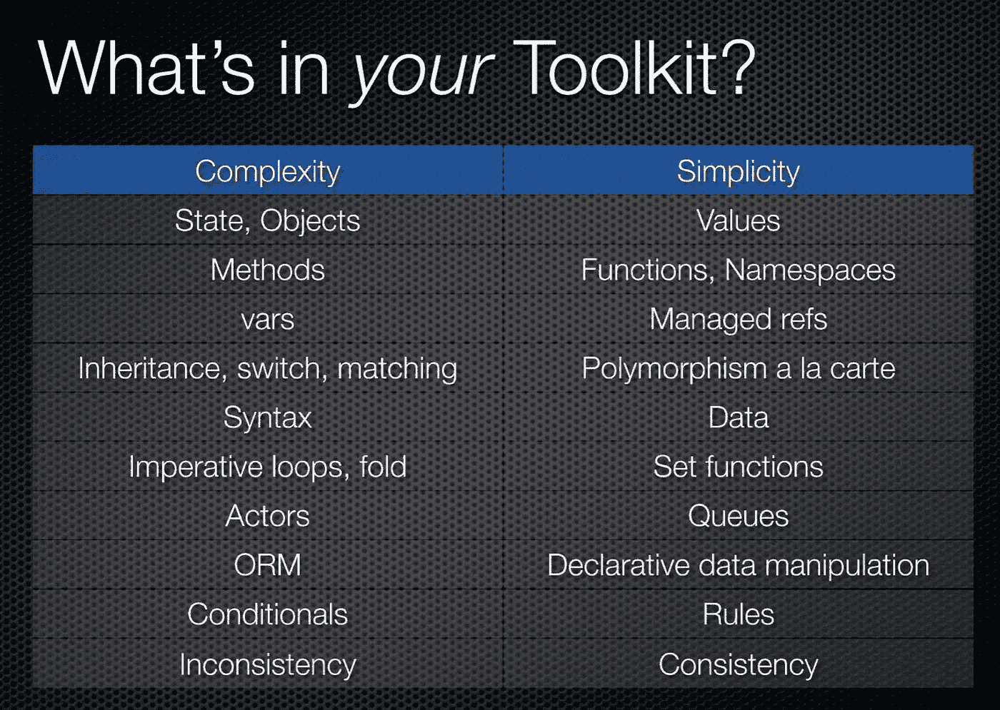

如果这个图表你看起来很熟悉，那是因为它摘自里奇·希基的精彩演讲。

不要忘记，编程语言的选择不仅仅是一个品味的问题，它是一个为工作选择最佳工具来对抗复杂性的机会。

如果你最喜欢的语言不符合那么多条件，那么看看你是否能找到符合的语言是个不错的主意！

让反对复杂性的战争开始吧。

编码快乐！