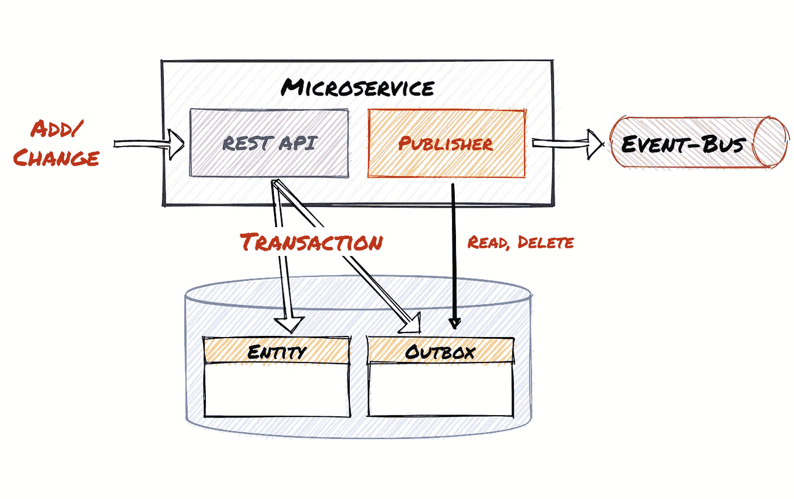
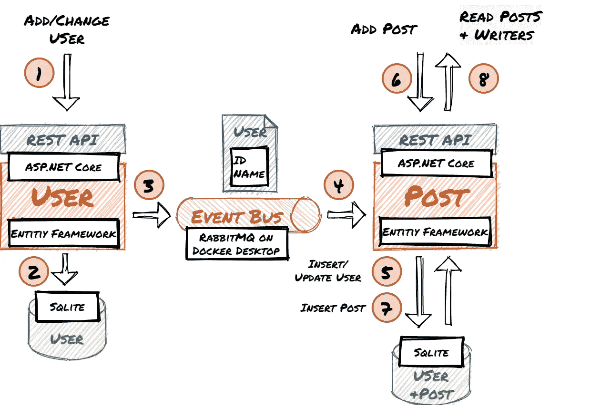
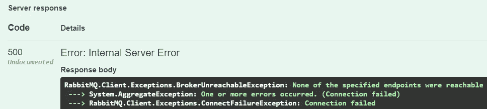
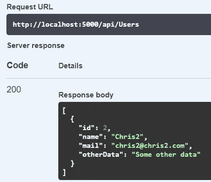
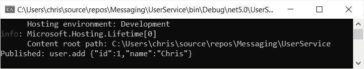
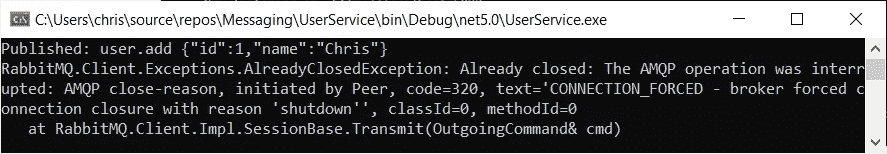
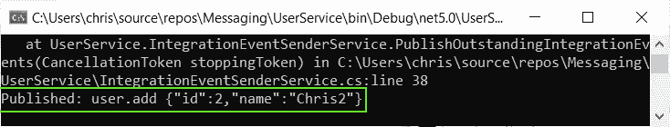
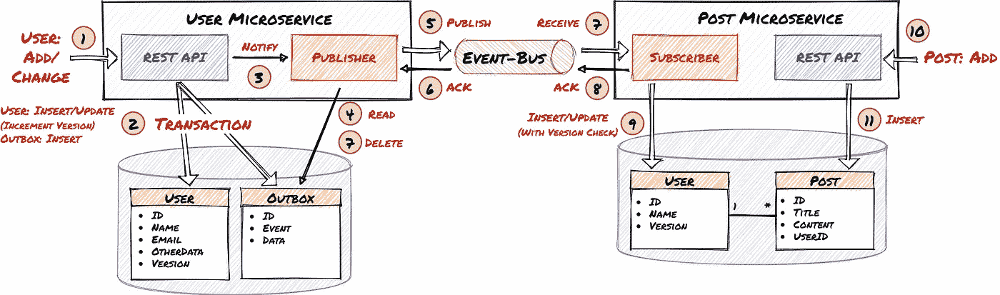

# 事件驱动的 ASP.NET 核心微服务架构中的发件箱模式

> 原文：<https://itnext.io/the-outbox-pattern-in-event-driven-asp-net-core-microservice-architectures-10b8d9923885?source=collection_archive---------0----------------------->

## 如何用 RabbitMQ、C#、实体框架和事务性发件箱模式构建弹性架构



第一步，您将创建**两个微服务**。每个微服务**都有自己的数据库**。他们使用**事件向 RabbitMQ 事件总线**发布变更。(如果你已经在我的[上一篇文章](/how-to-build-an-event-driven-asp-net-core-microservice-architecture-e0ef2976f33f?source=friends_link&sk=5f9f08a726f5e261a032a7bd5caa636a)中实现了，你可以跳过这一部分)。接下来，您将**看到消息是如何丢失的**，例如当消息总线关闭时。

在第二部分中，您将应用 [**事务发件箱模式**](https://microservices.io/patterns/data/transactional-outbox.html) 并查看它**如何防止丢失消息**。

最后一步，添加发布者和订阅者**确认**和**重复/无序消息处理**。

## 内容

1.  创建。网络核心微服务和交换消息
2.  实现事务发件箱模式
3.  (可选)测试实现
4.  添加发布者通知、确认和弹性消息处理
5.  最后的想法和展望

# 1.创建。网络核心微服务和交换消息

关于如何创建微服务和配置 RabbitMQ ，请参见我之前的文章。

*这将为您提供以下组件和工作流程:*



现在微服务和 RabbitMQ 容器“some-rabbit”都应该在运行。**使用用户服务的 REST API** 创建和修改用户**确保一切正常**。用户服务应该将事件发送到事件总线，由 Post 服务处理它们。并且用户数据库中的用户与帖子数据库中的用户同步。

## 邮件丢失

停止 RabbitMQ 容器:

```
C:\dev>docker stop some-rabbit
```

使用 Swagger UI 在用户服务中创建用户:

```
{
 "name": "Chris2",
 "mail": "chris2@chris2.com",
 "otherData": "Some other data"
}
```

无法访问 RabbitMQ 服务器:



用户在用户数据库中:



**事件丢失，因此用户不在 post 数据库中，微服务现在不一致。在本指南的下一步，你将看到如何解决这个问题。**

# 2.实现事务发件箱模式

在指南的这一部分中，您将向 UserService 项目添加事务性发件箱模式，以防止丢失消息。

> *如果你想了解事务发件箱模式的细节和概念，你可以在:*[*https://microservices . io/patterns/data/transactional-outbox . html*](https://microservices.io/patterns/data/transactional-outbox.html)获得更多信息

**创建 IntegrationEvent 实体:**

将其添加到用户服务上下文:

```
public DbSet<UserService.Entities.IntegrationEvent> IntegrationEventOutbox { get; set; }
```

**修改用户控制器**

PutUser 和 PostUser 中的代码启动一个事务，并更新/插入用户实体。在同一事务中，它将 IntegrationEvent 插入到数据库中，而不是直接发布事件:

**将发布者创建为 BackgroundService**

IntegrationEventSenderService 轮询数据库并将所有未完成的事件发送到 RabbitMQ:

> 持续轮询数据库并不好。您将在下一步中改进轮询。

将 IntegrationEventSenderService 作为 HostedService 添加到 Startup.cs:

*延伸阅读:* [*用 IHostedService 和 BackgroundService 类*](https://docs.microsoft.com/en-us/dotnet/architecture/microservices/multi-container-microservice-net-applications/background-tasks-with-ihostedservice) 实现微服务中的后台任务

# 3.(可选)测试实现

现在是测试一切是否按预期运行的好时机:

**删除 user.db** 以便创建数据库模式，包括发件箱表

删除 post.db ，这样两个数据库都是空的

启动 RabbitMQ 容器:

```
C:\dev>docker start some-rabbit
```

在 Visual Studio 中启动用户服务

**使用 Swagger UI 在用户服务中创建一个用户**:

```
{
 "name": "Chris",
 "mail": "chris@chris.com",
 "otherData": "Some other data"
}
```

事件的发送被记录到控制台:



**停止 RabbitMQ 容器**:

```
C:\dev>docker stop some-rabbit
```

**使用 Swagger UI 在用户服务中创建另一个用户**:

```
{
 "name": "Chris2",
 "mail": "chris2@chris2.com",
 "otherData": "Some other data"
}
```

IntegrationEventSender 无法发送消息，每 5 秒记录一次 RabbitMQ 异常:



**启动后期服务**(没有自动重启逻辑)

**启动 RabbitMQ 容器**:

```
C:\dev>docker stop some-rabbit
```

IntegrationEventSender 发送消息:



**祝贺您:您的发件箱实现工作正常！**

# 4.添加发布者通知、确认和弹性消息处理

插入或更新用户实体**通知发布者**，因此只有当有新条目时**才会从发件箱表中加载数据。用户实体的**版本字段**允许**处理消费者中的重复或无序消息**。 **RabbitMQ 发布者确认，持久消息和确认**处理发布者、订阅者或事件总线不工作的情况。**

*发件箱模式、发布者通知、确认和版本控制的详细工作流程:*



**修改用户实体**以包含版本字段:

> 您可以对生产 SQL 数据库使用 RowVersion。但是 SQLite 不支持。

**修改 IntegrationEventSender**

它使用 CancelationToken 在发件箱中有新条目时唤醒。参见第 47、49 和 65 行的注释，了解持久消息和发布者确认是如何实现的。

> 同步等待发布者确认是非常低效的。如何改进参见[官方 RabbitMQ 指南](https://www.rabbitmq.com/tutorials/tutorial-seven-dotnet.html)。

**确保您创建了持久队列:**

> 持久队列将在节点启动时恢复，包括其中发布为持久的消息。在恢复过程中，发布为瞬态的消息将被丢弃，即使它们存储在持久队列中。([https://www.rabbitmq.com/queues.html](https://www.rabbitmq.com/queues.html))

**修改用户控制器**

设置/增加 PostUser/PutUser 中的版本字段。

获取构造函数中的 IntegrationEventSender，并在提交事务后调用它。

**修改后期服务项目**中的 program.cs

*   第 78 行禁用自动确认
*   第 75 行发送确认
*   第 45 和 64 行检查重复的消息

> 使用程序。主要不是最优的。您可以将代码移动到后台服务。

**现在，您可以删除用户并发布数据库，然后测试您的实现，就像您在本指南的第三部分中所做的那样。**

# 5.最后的想法和展望

您将发件箱模式添加到了事件驱动架构中，并使其更具弹性。

您必须**调整代码以在生产环境中使用** : **清理代码**并**应用安全最佳实践。**申请。NET 核心设计模式、错误处理等。您还应该**优化发布者确认**并**在发布服务**中使用后台服务。

你可以**将发件箱逻辑移动到一个中心位置**比如 DbContext 或者**使用一个框架比如** [**MassTransit**](https://masstransit-project.com/) 。(这些框架、**传奇、**和**缩放/分片**可能是我下一篇文章的不错选择。)

参见我的其他文章，关于如何 [**将您的 ASP.NET 核心应用程序部署到 Kubernetes，使用 Angular 作为 UI**](https://levelup.gitconnected.com/kubernetes-angular-asp-net-core-microservice-architecture-c46fc66ede44) ，以及 [**添加 MySql 和 MongoDB 数据库**](/databases-in-a-kubernetes-angular-net-core-microservice-arch-a0c0ae23dca9) 。

如果你有任何问题、想法或建议，请联系我。