# 迈向企业级 AWS 基础设施的道路——架构脚手架

> 原文：<https://itnext.io/the-path-towards-enterprise-level-aws-infrastructure-architecture-scaffolding-d244d0c80364?source=collection_archive---------2----------------------->

> 正如曾经在*硅谷*电视连续剧中所解释的，云是“这个正在变得超级重要的小领域，在许多方面是计算的未来。”这将是准确的，除了事实上它并不那么小，未来就是现在。因此，让我们深入研究云计算领域，了解如何构建高可用性、安全和容错的云系统，如何利用 AWS 平台实现这一目标，其关键组件是什么，以及如何在 AWS 上部署应用程序。

***目录:***

1.  介绍
2.  云计算
3.  基础设施概述
4.  AWS 免费层票据
5.  AWS 理论

— 4.1 VPC

— 4.2 子网

— 4.3 网络地址转换网关

— 4.4 弹性 IP

— 4.5 AWS 区域

5.实践

6.摘要

# 介绍

本文是迷你系列的第一篇，将引导您完成创建企业级 AWS 基础架构的过程。在本系列的最后，我们将创建一个由 VPC 组成的基础架构，该基础架构在两个不同的可用性区域中有四个子网，其中部署了客户端应用程序、后端服务器和数据库。我们的架构将能够提供现代云系统所需的可扩展性和可用性。在此过程中，我们将解释亚马逊网络服务平台的基本概念和组件。在本文中，我们将讨论我们的架构框架，具体来说就是虚拟私有云(VPC)、子网、弹性 IP 地址、NAT 网关和路由表。整个系列包括:

*   第 1 部分-体系结构框架(VPC，子网，弹性 IP，NAT)
*   [第 2 部分-EC2 和数据库配置(EC2，AMI，Bastion Host，RDS)](/the-path-towards-enterprise-level-aws-infrastructure-part-2-ec2-ami-bastion-host-rds-3109c73dc913#437b-bdb048487397)
*   [第 3 部分-负载平衡和应用部署(弹性负载平衡器)](/the-path-towards-enterprise-level-aws-infrastructure-load-balancing-and-application-deployment-47c48e4c343d)

# 云计算

在过去的几年里，IT 行业经历了一场重大变革，在这场变革中，大多数全球企业都从传统的 IT 基础架构转向了云计算。背后的主要原因是云计算带来的灵活性和可扩展性，云计算被理解为提供计算服务，如服务器、存储、数据库、网络、分析服务等。通过互联网(*云*)。在这种模式下，组织只需为他们实际使用的云资源付费，不需要管理云资源背后的物理基础设施。市场上有许多云平台提供商，主要是亚马逊网络服务(AWS)、微软 Azure 和谷歌云。本文主要关注 AWS 上可用的服务，但是请记住，这里解释的大多数概念在其他平台上都有对应的概念。

# 基础设施概述

让我们从我们将在本系列中构建的内容开始。目标是创建一个真实的企业级 AWS 基础设施，它将能够托管一个用户管理系统，该系统由一个 React.js web 应用程序、Java Spring Boot 服务器和一个关系数据库组成。架构图如图 1 所示。

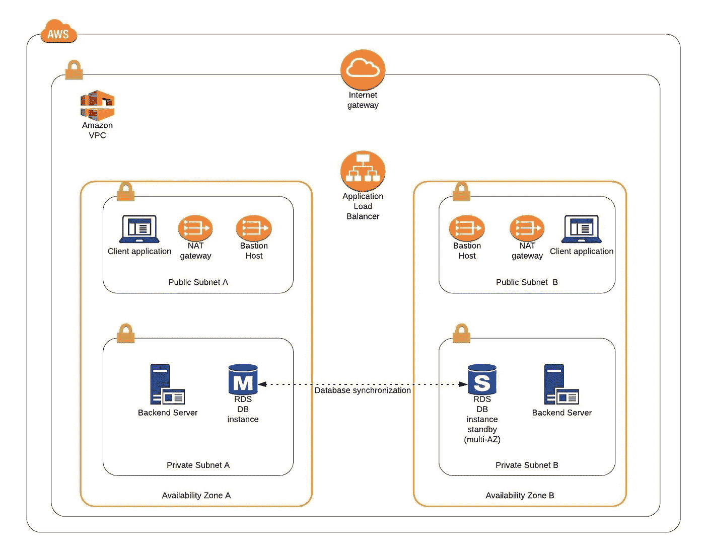

图 1

它包括一个 VPC，有四个子网(2 个公共子网和 2 个私有子网)，分布在两个不同的可用性区域。在公共子网中托管着一个客户端应用程序、一个 NAT 网关和一个堡垒主机(稍后会详细介绍)，而我们的私有子网包含后端服务器和数据库实例。该基础设施还包括互联网网关，以便从我们的 VPC 和负载平衡器访问互联网。将后端服务器和数据库放在私有子网中的原因是为了保护这些实例不直接暴露在互联网上，因为它们可能包含敏感数据。相反，它们将只有私有 IP 地址，位于 NAT 网关和面向公众的弹性负载平衡器之后。通过引入在两个不同的可用性区域中部署实例的冗余，以及使用提供系统的自动扩展和健康管理的自动扩展组，所呈现的基础设施提供了高级别的可扩展性和可用性。

图 2 展示了我们将在 AWS 上托管的用户管理 web 应用程序系统的视图。

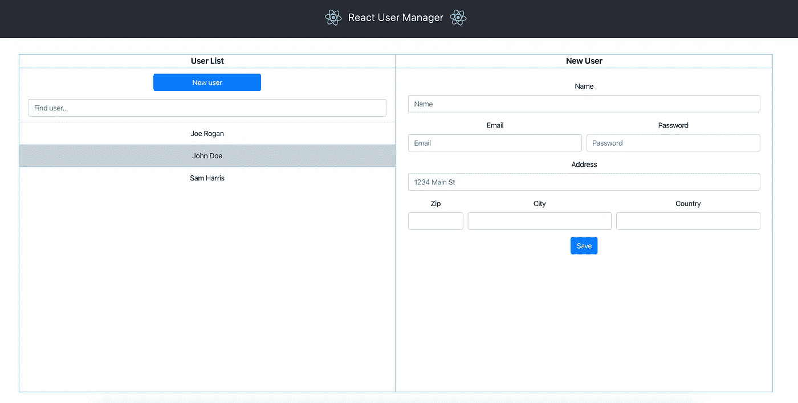

图 2

这些应用程序可以在 GitHub 上找到。

[客户端应用](https://github.com/mkapiczy/react-user-manager)

[服务器](https://github.com/mkapiczy/user-manager-service)

在本系列文章的这一部分中，我们将重点关注基础设施的搭建，即分配弹性 IP 地址、设置 VPC、创建子网、配置 NAT 网关和路由表。

# AWS 自由层注释

AWS 为其新用户提供了 12 个月的免费等级，使客户能够免费使用他们的服务，直至达到指定的限制。这些限制包括每月 750 小时的 t2.micro 大小的 EC2 实例、5GB 的亚马逊 S3 存储、每月 750 小时的亚马逊 RDS 等等。在 AWS 管理控制台中，Amazon 通常提供哪些资源选择属于免费层的指示，在本系列中，我们将坚持使用这些指示。如果您想确保不会超出空闲层限制，那么每当您完成 AWS 上的工作时，请记住停止 EC2 和 RDS 实例。您还可以设置一个计费提醒，当您超出指定的限额时，它会通知您。

# AWS 理论

1.  ***VPC***

*我们进入 AWS 基础设施广阔世界的第一步是了解亚马逊虚拟私有云(VPC)。VPC 允许开发人员创建一个虚拟网络，他们可以在其中启动资源，并将它们与其他 VPC 和外部世界进行逻辑隔离。在 VPC 中，您的资源拥有私有 IP 地址，可以通过这些地址相互通信。您可以控制对 VPC 内部所有这些资源的访问，并随意路由传出流量。*

*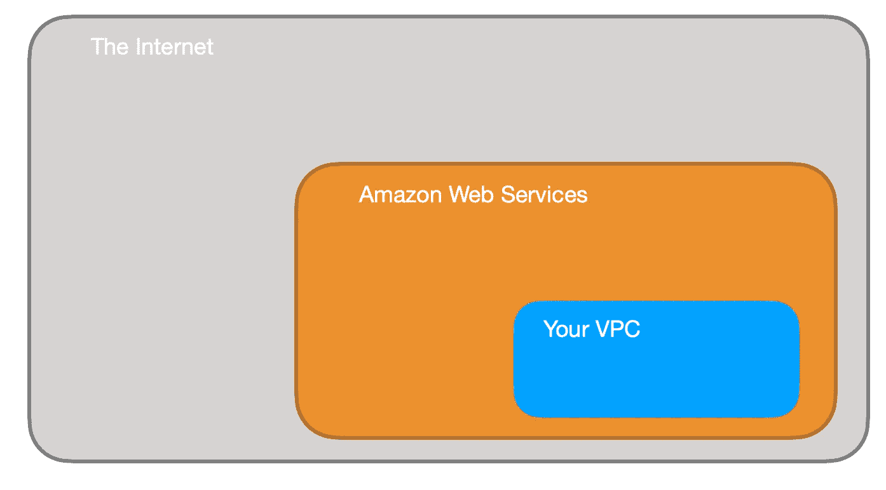*

*图 3*

*使用几个关键结构来配置对 VPC 的访问:*

*安全组—它们基本上像迷你防火墙一样工作，定义允许的传入和传出 IP 地址和端口。它们可以在实例级别附加，在多个实例之间共享，并提供允许其他安全组而不是 IP 进行访问的可能性。*

*路由表—路由表负责确定来自子网或网关的网络流量应该定向到哪里。有一个主路由表与您的 VPC 相关联，您可以为您的子网和网关定义自定义路由表。*

*网络访问控制列表(网络 ACL) —它充当传入和传出流量的 IP 过滤表，并可用作安全组之上的附加安全层。网络 ACL 的作用类似于安全组，但它们不是在实例级别应用规则，而是将规则应用于整个 VPC 或子网。*

***2*。子网****

*实例不能直接启动到 VPC 中。它们需要生活在子网内。子网是一个额外的隔离区域，拥有自己的 CIDR 块、路由表和网络访问控制列表。子网允许您在同一个 VPC 中创建不同的行为。例如，您可以创建一个可以访问公共互联网的公共子网和一个不能通过互联网访问并且必须通过 NAT(网络地址转换)网关才能访问外部世界的私有子网。*

*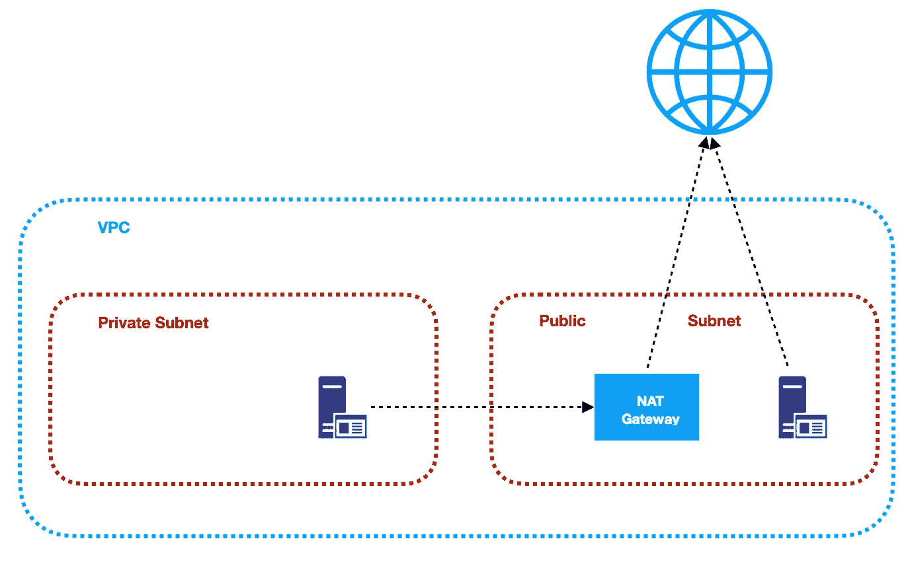*

*图 4*

****3。NAT(网络地址转换)网关****

*使用 NAT 网关是为了使位于私有子网中的实例能够连接到 Internet 或其他 AWS 服务，同时仍然阻止从 Internet 到这些实例的直接连接。例如，当您需要在私有子网中运行的 EC2 实例上安装或升级软件或操作系统时，NAT 可能会很有用。AWS 提供 NAT 网关管理的服务，只需要很少的管理工作。我们将在建立基础设施时使用它。*

****4。弹性 IP****

*AWS 提供了弹性 IP 地址的概念，用于促进动态云计算的管理。弹性 IP 地址是一个公共的静态 IP 地址，它与您的 AWS 帐户相关联，可以很容易地分配给您的 EC2 实例之一。其背后的想法是，地址与您的实例没有很强的关联，而是地址的弹性允许在系统出现任何故障的情况下，快速地将地址重新映射到您帐户中的另一个健康实例。*

****5。AWS 区域****

*   *邻近性—出于延迟或法规方面的原因，您通常希望您的应用程序部署在靠近您的操作区域。*
*   *成本——不同地区有不同的定价。*
*   *功能选择—并非所有地区都提供所有服务，尤其是新推出的功能。*
*   *几个可用区域—所有地区至少有 2 个 AZ，但有些地区有更多。根据您的需求，这可能是一个关键因素。*

*AWS 区域是 AWS 拥有数据中心的地理区域。区域被划分为可用性区域(AZ ),这些区域是彼此相对靠近的独立数据中心。可用性区域用于提供冗余和数据复制。在为您的基础架构选择 AWS 区域时，应考虑以下因素:*

# *实践*

1.  ****AWS 区域****

*让我们从选择要运营的 AWS 区域开始。在 AWS 管理控制台的右上角，您可以选择一个区域。此时，您选择哪个区域并不重要(如前所述，这可能对您的组织有影响)。但是，请务必注意，您将始终只查看在当前选定区域启动的资源。*

****2。弹性 IP****

*下一步是分配一个弹性 IP 地址。为此，进入 AWS 管理控制台，找到 VPC 服务。在左侧菜单栏中的虚拟私有云部分下，您应该会看到弹性 IPs 链接。在那里，你可以分配一个属于你自己的新地址，或者从亚马逊的可用地址池中分配。*

*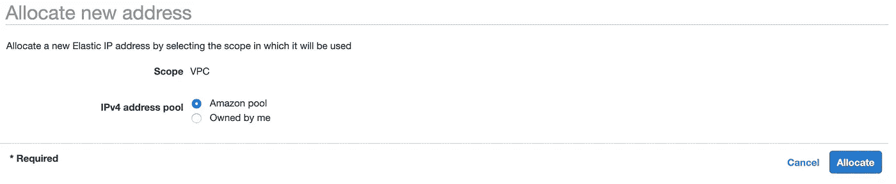*

*图 5*

****3。可用性区域 A 配置****

*接下来，让我们创建 VPC 和子网。目前，我们将只设置可用性区域 A，在创建 VPC 后，我们将致力于高可用性。因此，再次进入 VPC 服务仪表板，点击*启动 VPC 向导*按钮。你将被带到一个屏幕，在那里你可以选择你希望亚马逊为你设置哪种 VPC 配置。为了尽可能匹配我们的目标架构，我们将选择具有公共和私有子网的*VPC*。*

*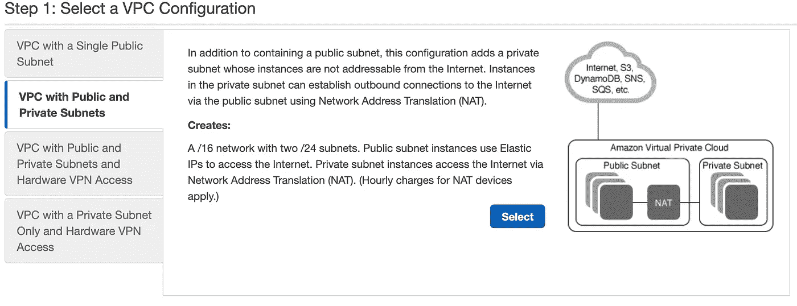*

*图 6*

*下一个屏幕允许您设置 VPC 配置详细信息，例如:*

*   *姓名，*
*   *CIDR 街区，*
*   *子网的详细信息:*

*—姓名，*

*— IP 地址范围，*

*—VPC·CIDR 系列的一个子集，*

*—可用性区域，*

*如架构图(图 1)所示，我们需要 2 个不同可用性区域中的 4 个子网。因此，让我们将 VPC CIDR 设置为 10.0.0.0/22，并使我们的子网如下所示:*

*   *公共子网 A:10 . 0 . 0 . 0/24(A 区)*
*   *专用子网 A:10 . 0 . 1 . 0/24(A 区)*
*   *公共子网 B:10 . 0 . 2 . 0/24(B 区)*
*   *专用子网 B:10 . 0 . 3 . 0/24(B 区)*

*如图 7 所示设置好一切。*

*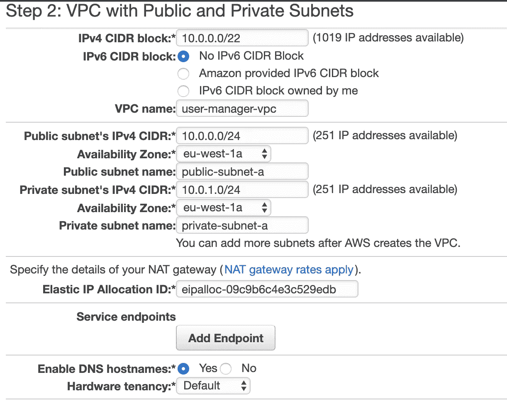*

*图 7*

*这里要注意的重要方面是为公共和私有子网选择相同的可用性区域，以及 Amazon 将自动为我们设置 NAT 网关的事实，我们只需为其指定之前分配的弹性 IP 地址。现在，点击*创建 VPC* 按钮，亚马逊将配置你的 VPC。*

****4。NAT 网关-AZ A****

*当 VPC 创建完成后，转到 NAT 网关部分，您应该看到 AWS 为您创建的网关。为了更容易识别，让我们将它的名称标签编辑为 *nat-a* 。*

*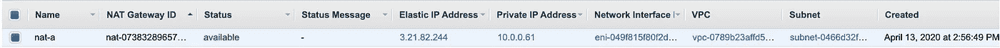*

*图 8*

****5。路由表-AZ A****

*亚马逊还为你的 VPC 配置了路由表。转到*路由表*部分，您应该有两个与您的 VPC 相关联的路由表。其中一个是您的 VPC 的主路由表，第二个当前与您的公共子网 a 相关联。我们将稍微修改一下该设置。*

*首先，选择主路由表，进入路由选项卡，点击*编辑路由*。目前有两个条目。第一个意思是*任何引用本地 VPC CIDR 的 IP 地址都应该本地解析*，我们不应该修改它。第二个指向 NAT 网关，但我们将更改它来配置 VPC 的 Internet 网关，以便让传出流量到达外部世界。*

*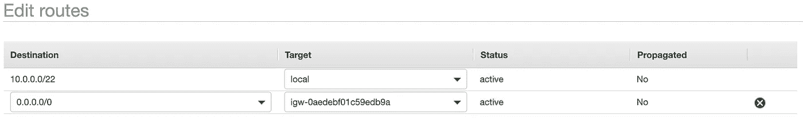*

*图 9*

*接下来，转到*子网关联*选项卡，将主路由表与 public-subnet-a 相关联。您还可以将其名称标签编辑为 *main-rt* 。然后，选择与您的 VPC 相关联的第二个路由表，编辑其路由，将每个传出的 Internet 请求路由到 nat-a 网关，如图 10 所示。将该路由表与 private-subnet-a 相关联，并将其名称标签编辑为 *private-a-rt* 。*

*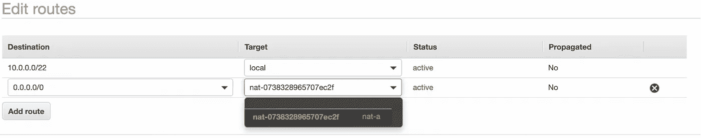*

*图 10*

****6。可用性区域 B 配置****

*干得好，可用性区域 A 已配置完毕。为了提供高可用性，我们还需要在第二个可用性区域中设置一切。第一步是创建子网。再次转到 AWS 管理控制台中的 VPC 仪表板，在左侧菜单栏中找到*子网*部分。现在，点击*创建子网*按钮，如图 11 和 12 所示进行配置。*

**公共子网 b**

*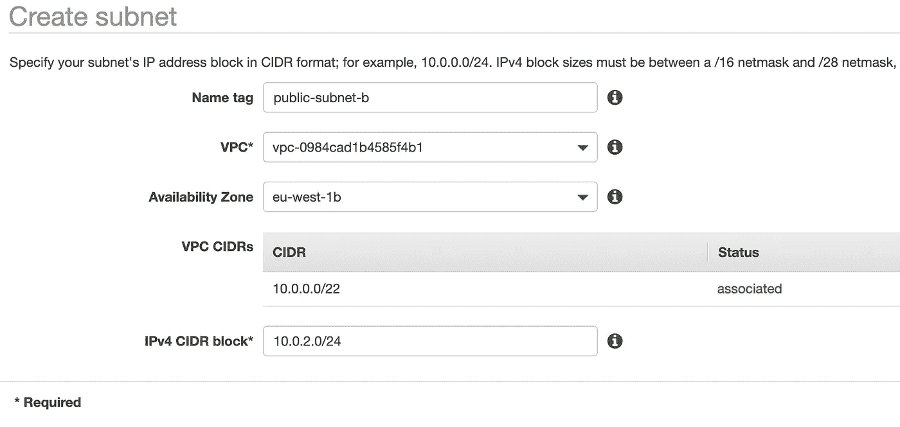*

*图 11*

**私有子网 b**

*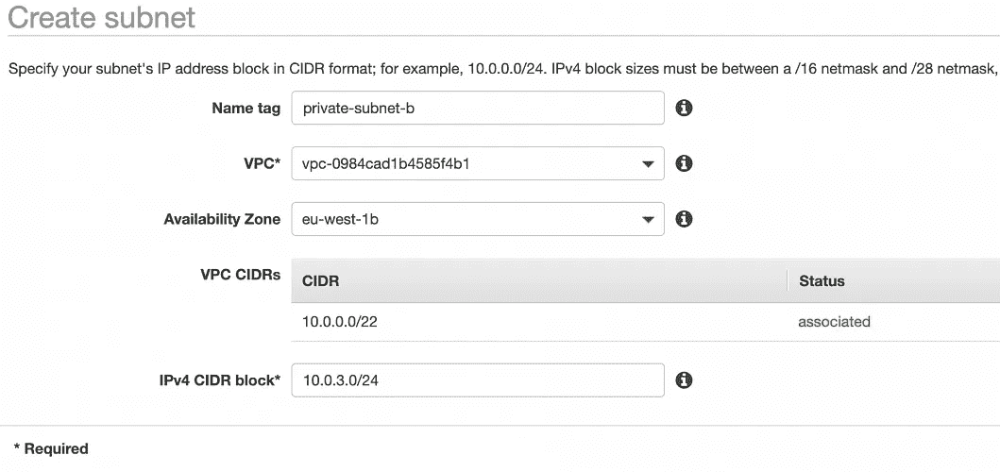*

*图 12*

****7。NAT 网关- AZ B****

*对于可用性区域 B，我们需要手动创建 NAT 网关。为此，在 VPC 仪表板的左侧菜单栏中找到 NAT 网关部分，并点击*创建 NAT 网关*。选择 *public-subnet-b* ，分配 EIP，添加一个 Name tag，值为 *nat-b* 。*

***8。路由表-AZ B***

*最后一步是为可用性区域 b 中的子网配置路由表。为此，请再次转到*路由表*部分。我们的 public-subnet-b 将与 public-subnet-a 具有相同的路由规则，因此让我们为 public-subnet-b 的 main-rt 表添加一个新的关联。然后，单击*创建路由表*按钮，将其命名为 *private-b-rt* ，选择我们的 VPC 并单击*创建*。接下来，选择新创建的表，将其与 private-subnet-b 相关联，并通过与 private-a-rt 表类似的方式*编辑其路由*。不同之处在于，不是将每一个外出请求定向到 nat-a 网关，而是将其路由到 nat-b(图 13)。*

*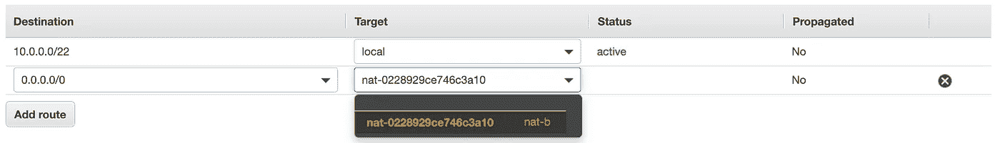*

*图 13*

*最后，您应该有三个与您的 VPC 相关联的路由表，如图 14 所示。*

*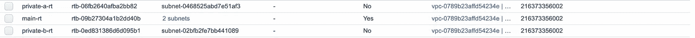*

*图 14*

# *摘要*

*就这样，我们 VPC 的脚手架准备好了。图 15 所示的图表展示了所创建的基础设施的视图。现在可以创建所需的 EC2 实例、堡垒主机和 RDS 数据库的配置了。我们将在[系列的下一部分](/the-path-towards-enterprise-level-aws-infrastructure-part-2-ec2-ami-bastion-host-rds-3109c73dc913)中完成。*

*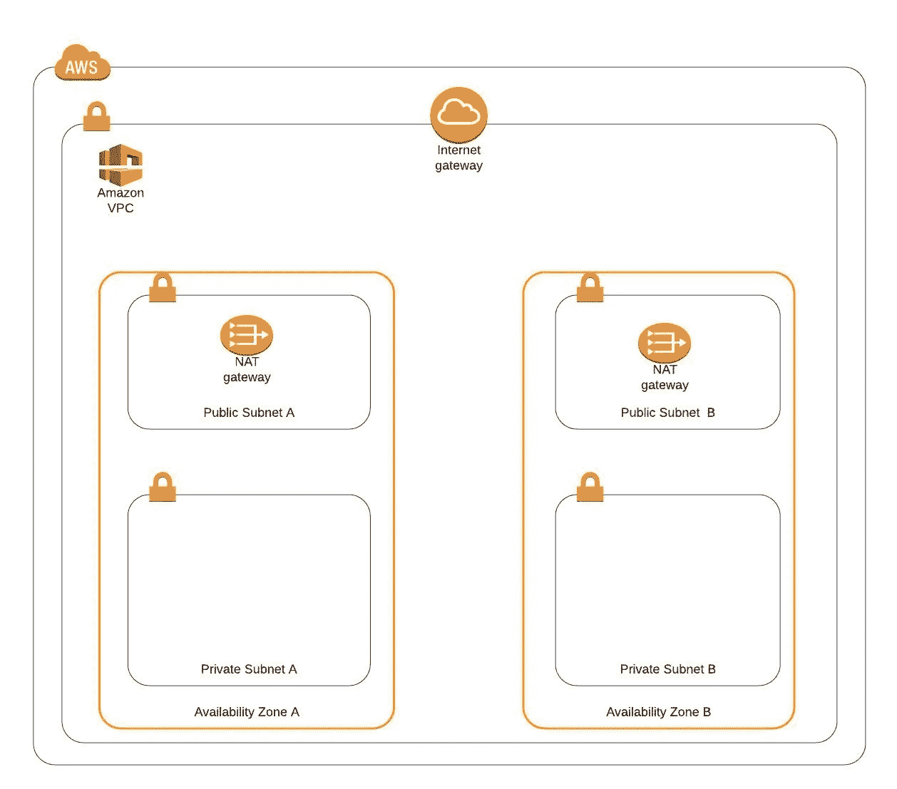*

*图 15*

# *来源:*

*[https://azure . Microsoft . com/en-us/overview/what-is-cloud-computing/](https://azure.microsoft.com/en-us/overview/what-is-cloud-computing/)
https://aws.amazon.com/what-is-aws/
[https://docs . AWS . Amazon . com/AWS sec 2/latest/user guide/elastic-IP-addresses-EIP . html](https://docs.aws.amazon.com/AWSEC2/latest/UserGuide/elastic-ip-addresses-eip.html)
[https://docs . AWS . Amazon . com/VPC/latest/user guide/VPC _ Route _ tables . html](https://docs.aws.amazon.com/vpc/latest/userguide/VPC_Route_Tables.html)
[https](https://docs.aws.amazon.com/vpc/latest/userguide/VPC_SecurityGroups.html#DefaultSecurityGroup)*

**原载于 2020 年 4 月 16 日*[*【https://grapeup.com】*](https://grapeup.com/blog/read/the-path-towards-enterprise-level-aws-infrastructure-architecture-scaffolding-77)*。**