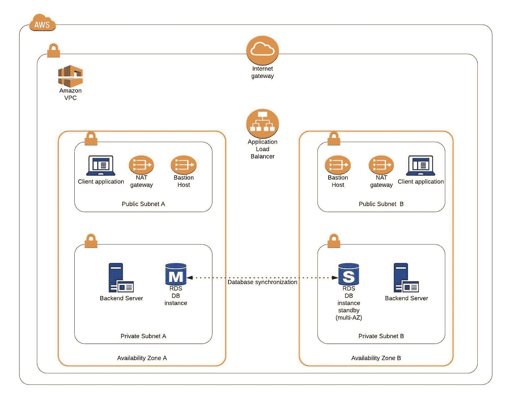
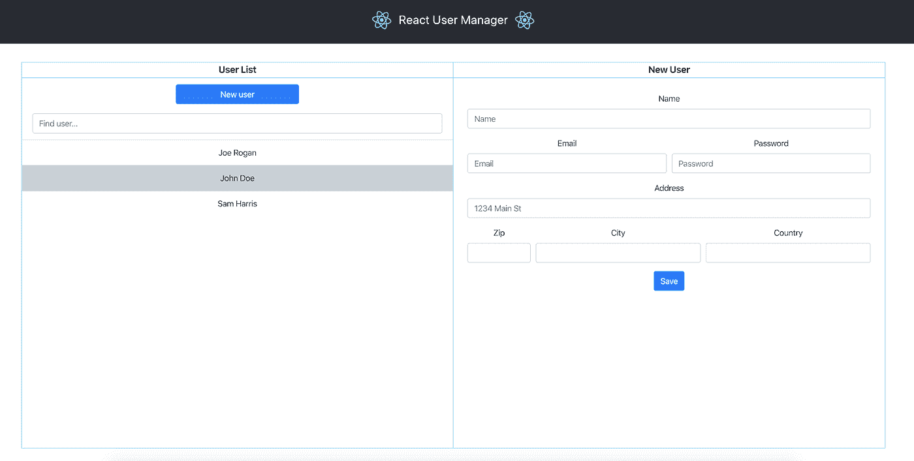
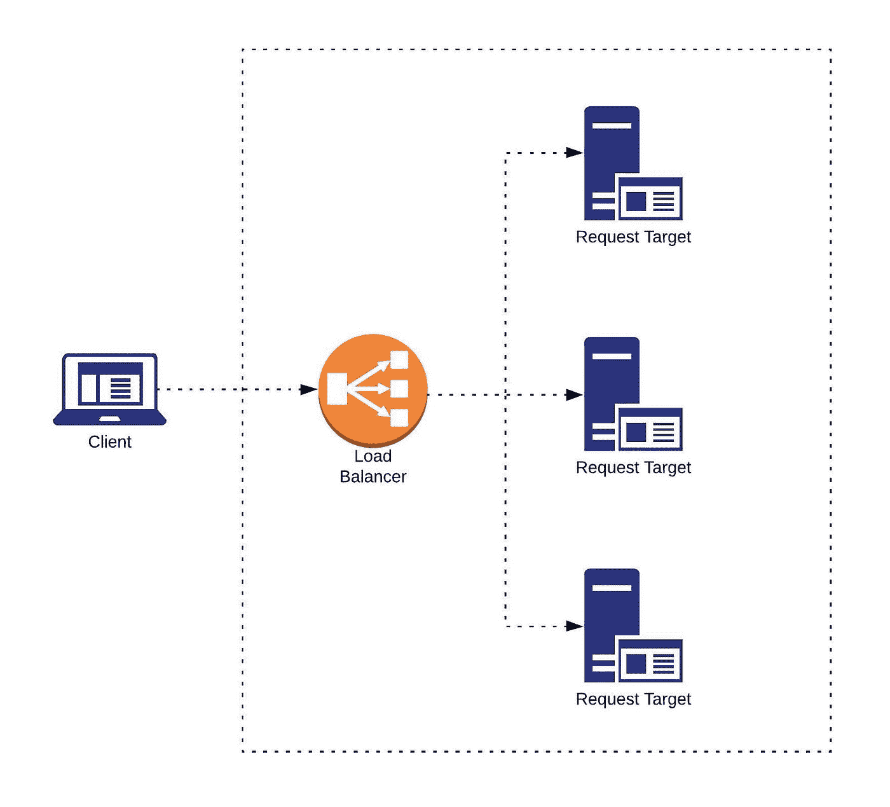
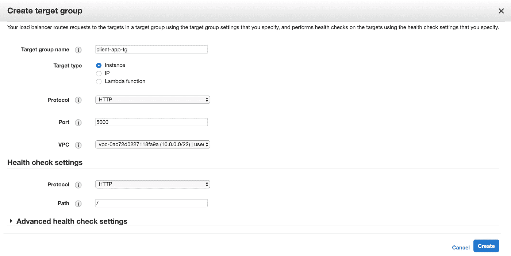
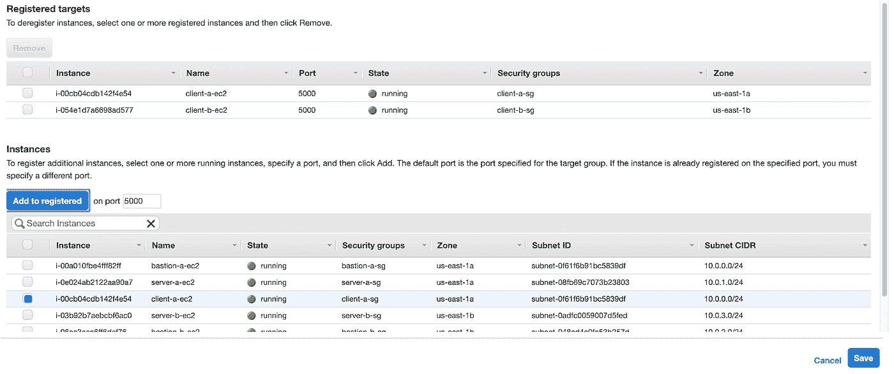
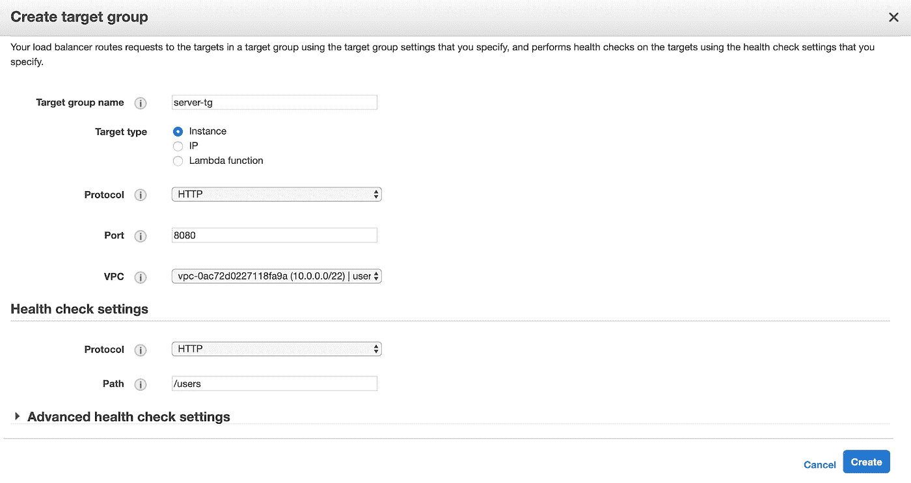
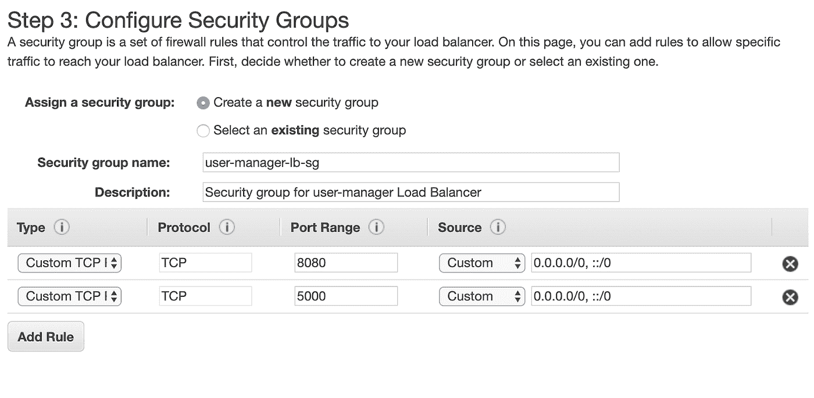
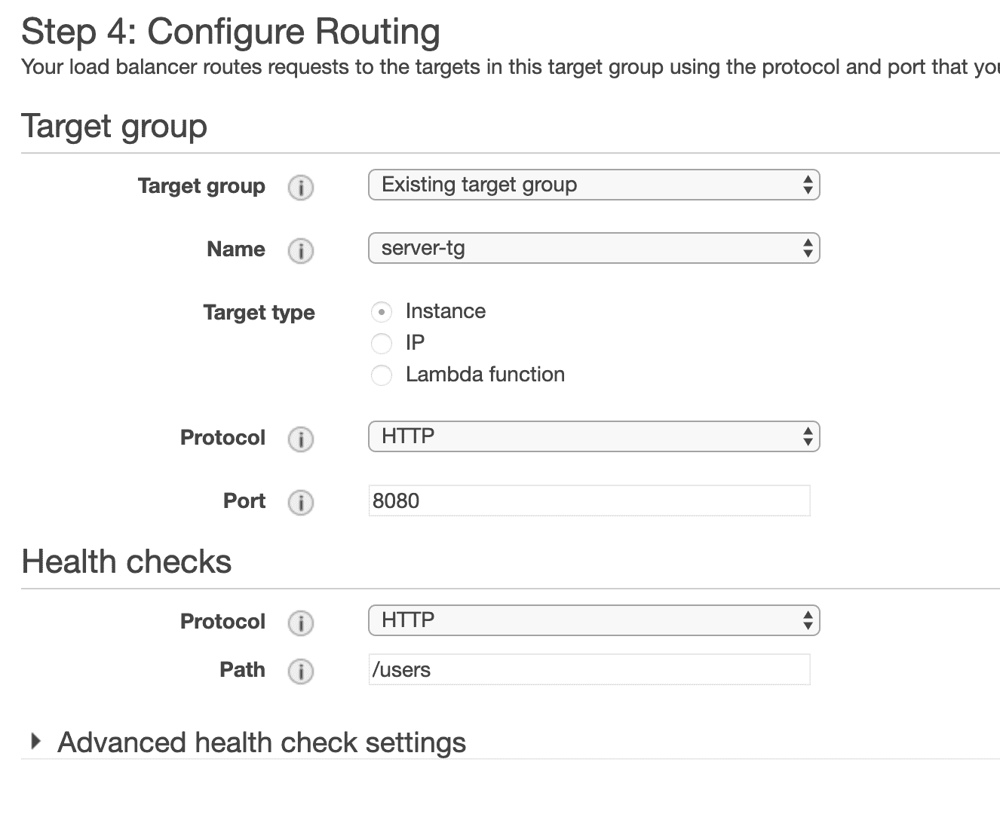

# 通向企业级 AWS 基础设施的道路—负载平衡和应用程序部署

> 原文：<https://itnext.io/the-path-towards-enterprise-level-aws-infrastructure-load-balancing-and-application-deployment-47c48e4c343d?source=collection_archive---------2----------------------->


> 让我们完成构建我们的 AWS 基础架构的过程，并了解我们的高可用性、安全性和容错云系统所需的 AWS 云的最后关键元素。

本文是这个小型系列的第三篇也是最后一篇，它将带您了解创建企业级 AWS 基础设施的过程，并解释 Amazon Web Services 平台的概念和组件。在前面的部分中，我们创建了 VPC、子网、NAT 网关，配置了网络路由，设置了所需的 EC2 实例、bastions 主机和 RDS 数据库。如果您错过了前面的任何部分，我们强烈建议您查看一下。

在本文中，我们将通过设置负载平衡器、目标组和在我们的平台上部署我们的应用程序来完成基础设施。

整个系列包括:

1.  [第 1 部分—架构搭建(VPC、子网、弹性 IP、NAT)](/the-path-towards-enterprise-level-aws-infrastructure-architecture-scaffolding-d244d0c80364)
2.  [第 2 部分— EC2 和数据库配置(EC2、AMI、Bastion 主机、RDS)](/the-path-towards-enterprise-level-aws-infrastructure-part-2-ec2-ami-bastion-host-rds-3109c73dc913)
3.  第 3 部分—负载平衡和应用程序部署(弹性负载平衡器)

***目录:***

1.  基础设施概述
2.  AWS 理论

2.1 弹性负载平衡器(ELB) +目标群体

3.实践

3.1 目标群体

3.2 负载平衡器

3.3 应用程序部署

4.摘要

# 基础设施概述

让我们提醒自己在这个系列中我们正在构建什么。目标是创建一个真实的企业级 AWS 基础设施，它将托管一个用户管理系统，该系统由一个 React.js web 应用程序、Java Spring Boot 服务器和一个关系数据库组成。在前几篇文章中，我们已经构建了架构的主要部分。因此，我们已经有了一个 VPC，它有四个子网(2 个公共子网和 2 个私有子网)，分布在两个不同的可用性区域。



图 1

在公共子网中，我们为客户端应用程序、NAT 网关和堡垒主机准备好了 EC2 实例。同时，我们的私有子网包含后端服务器和 RDS 数据库的 EC2 实例。唯一缺少的元素是负载平衡器。因此，在系列的这一部分，我们将设置它。最终，我们将拥有一个运行后端服务器和前端应用程序的现成平台。

下面您可以找到 AWS 上托管的用户管理 web 应用系统的视图。



图 2

这些应用程序可以在 github 上找到。

客户端应用:[https://github.com/mkapiczy/react-user-manager](https://github.com/mkapiczy/react-user-manager)

服务器:【https://github.com/mkapiczy/user-manager-service 

现在，让我们深入一些理论！

# AWS 理论

1.  ***【弹性负载平衡器(ELB)***

**负载平衡**是在所有请求目标(服务器、应用程序实例、数据库等)之间高效分配传入流量的过程。).一个**负载平衡器**被放置在您的基础设施的前面，并在能够处理这些请求的所有组件之间路由传入的客户端请求。这最大限度地减少了延迟，并确保没有目标过载，从而提高了系统的整体性能。



图 3

**弹性负载均衡器**自动将传入的请求分布在多个目标上，如 EC2 实例、容器、IP 地址和 lambda 函数，这些都在**目标组**中定义。目标组允许您定义一组处理相同类型流量的目标。每个 ELB 都有一组**监听器规则**，这些规则由请求条件和满足这些条件的请求应该被路由到的目标组组成。您可以为不同类型的请求创建不同的目标组，例如，一个目标组用于客户端应用程序请求，另一个用于后端服务器请求。

此外，目标组允许您动态添加或删除目标，并定义运行状况检查设置，负载平衡器随后使用这些设置来持续监视目标组中注册的目标的状态。如果任何目标关闭，负载平衡器会将流量重定向到正常运行的实例，当新的正常运行的实例启动时，负载平衡器会自动将其添加到流量分配中。通过这种方式，ELB 确保了容错，并且在**自动扩展组的帮助下，**提供了现代系统所需的可扩展性。

ELB 还通过与 CloudWatch 和 X-Ray AWS 服务以及中央证书管理的集成，促进了对您系统的操作监控。

ELB 有三种类型:

*   *应用负载均衡器* —运行在应用层，最适合 HTTP/HTTPS 请求的负载均衡。
*   *网络负载平衡器* —在传输层上运行，最适合需要高性能的 TCP、UDP 和 TLS 流量。
*   *经典负载平衡器* —它是 EC2-classic 网络中构建的应用程序的传统类型。

那么，ELB 提供什么样的好处呢？

*   高可用性，
*   容错能力，
*   可量测性
*   安全功能，
*   SSL/TLS 证书管理，
*   操作监控，

# 实践

1.  ***目标群体***

让我们通过设置所需的目标组来开始负载平衡器的配置。进入 EC2 服务仪表板，在左侧菜单栏中找到*负载平衡*子菜单。进入*目标组*部分，单击*创建目标* *组*，设置目标组名称，选择目标类型为实例，并将端口设置为 5000(这是我们的客户端应用程序将监听的端口)。将目标群体与我们的用户经理 vpc 联系起来。



图 4

创建后，转到目标选项卡，然后单击编辑。添加 *client-a* 和 *client-b* EC2s 作为目标实例并保存。



图 5

接下来，为我们的服务器实例创建另一个目标组，并添加 *server-a* 和 *server-b* EC2s 作为其目标。将健康检查路径更改为/users(我们的服务器不公开/ endpoint)。



图 6

***2。弹性负载平衡器***

最后，进入负载平衡器菜单，点击*创建负载平衡器，*并选择*应用负载平衡器*。在负载平衡器的配置表单中，添加两个 HTTP 侦听器，一个在端口 8080 上，另一个在端口 5000 上。选择用户-管理器-vpc，以及我们的两个公共子网。


图 7

配置负载平衡器的安全组，以便允许来自我们的应用程序将要运行的端口上的任何地方的传入流量。



图 8

在路由配置中，选择已有的 *server-tg* 目标组。我们将在创建 ELB 后添加 *client-tg* 目标群体。



图 9

创建负载平衡器后，转到*监听器*选项卡，选择 HTTP 端口 5000 监听器并编辑与其相关的更改操作，以将端口 5000 上的所有流量转发到*客户端-tg* 而不是*服务器-tg* 。也就是说，负载平衡器准备就绪，您应该能够在*描述*选项卡中看到它的 DNS 名称。最后一步是修改服务器和客户机安全组，以允许来自负载平衡器安全组的适当端口上的传入连接。

***3。应用部署***

为了方便我们应用程序的部署，我准备了部署脚本，可以自动将我们的应用程序部署到平台上。您可以在 *deploy.sh* 文件中项目的基本目录下的 GitHub 存储库中找到它们。我相信这些脚本是不言自明的，所以我们不会详细介绍它们。

您总共需要运行 4 次脚本执行:2 次用于服务器实例，2 次用于客户端应用程序实例。

***3.1 服务器部署***

脚本的示例性执行:

```
sh deploy.sh 3.235.167.88 10.0.3.121 ~/Documents/keys/user-manager-key.pem jdbc:mysql://user-manager-db.cfitmuokdhyi.us-east-1.rds.amazonaws.com/usermanagerdb password
```

脚本:

```
**#!/bin/bash -e** if [ -z "$1" ] || [ -z "$2" ] || [ -z "$3" ] || [ -z "$4" ] || [ -z "$5" ]; then
  printf "Usage $0 bastion_public_ip instance_private_ip private_key db_address db_password \n"
  exit 1
fi

bastion_address=$1
instance_address=$2
private_key=$3
db_address=$4
db_password=$5

export PROJECT_VERSION=$(mvn help:evaluate -Dexpression=project.version -q -DforceStdout)
printf "\nProject version: %s\n" "$PROJECT_VERSION"

mvn clean install -DskipTests=true

printf "\n"
printf "Adding key to keychain\n"
ssh-add -k "${private_key}"

printf "Creating working directory on Bastion Host\n"
ssh -A ec2-user@"${bastion_address}" "mkdir -p ~/workdir/usermanagerservice"

printf "Copying jar to Bastion Host\n"
scp ./target/usermanagerservice-"${PROJECT_VERSION}".jar ec2-user@"${bastion_address}":~/workdir/usermanagerservice/

printf "Creating working directory on private instance\n"
ssh -A ec2-user@"${bastion_address}" "ssh -o StrictHostKeyChecking=no -o UserKnownHostsFile=/dev/null ec2-user@${instance_address} 'mkdir -p ~/workdir/usermanagerservice'"

printf "Copying jar to private instance\n"
ssh -A ec2-user@"${bastion_address}" "scp -o StrictHostKeyChecking=no -o UserKnownHostsFile=/dev/null ~/workdir/usermanagerservice/usermanagerservice-""${PROJECT_VERSION}"".jar ec2-user@${instance_address}:~/workdir/usermanagerservice/"

printf "Stopping process running on port 8080 if exists\n"
ssh -A ec2-user@"${bastion_address}" "ssh -o StrictHostKeyChecking=no -o UserKnownHostsFile=/dev/null ec2-user@${instance_address} 'sudo fuser -k 8080/tcp'"

printf "Running the application\n"
ssh -A ec2-user@"${bastion_address}" "ssh -o StrictHostKeyChecking=no -o UserKnownHostsFile=/dev/null ec2-user@${instance_address} 'export SPRING_PROFILES_ACTIVE=dev && export SPRING_DATASOURCE_URL=${db_address} && export SPRING_DATASOURCE_PASSWORD=${db_password} && java -jar ~/workdir/usermanagerservice/usermanagerservice-${PROJECT_VERSION}.jar'"

printf "Exit"
```

***3.2 客户端应用部署***

脚本的示例性执行:

```
sh deploy.sh 3.84.51.190 10.0.0.241 ~/Documents/keys/user-manager-key.pem http://user-manager-lb-1600627179.us-east-1.elb.amazonaws.com:8080
```

脚本:

```
**#!/bin/bash -e** if [ -z "$1" ] || [ -z "$2" ] || [ -z "$3" ] || [ -z "$4" ]; then
  printf "Usage $0 bastion_address instance_address private_key server_url\n"
  exit 1
fi

bastion_address=$1
instance_address=$2
private_key=$3
server_url=$4

export REACT_APP_API_URL=${server_url}
npm run build

printf "\n"
printf "Adding key to keychain\n"
ssh-add -k "${private_key}"

printf "Creating working directory on Bastion Host\n"
ssh -A ec2-user@"${bastion_address}" "mkdir -p ~/workdir/usermanager"

printf "Copying project files to Bastion Host\n"
rsync -av -e ssh --exclude='node_modules' ./ ec2-user@"${bastion_address}":~/workdir/usermanager

printf "Creating working directory on private instance\n"
ssh -A ec2-user@"${bastion_address}" "ssh -o StrictHostKeyChecking=no -o UserKnownHostsFile=/dev/null ec2-user@${instance_address} 'mkdir -p ~/workdir/usermanager'"

printf "Copying project files to private instance\n"
ssh -A ec2-user@"${bastion_address}" "scp -o StrictHostKeyChecking=no -o UserKnownHostsFile=/dev/null -r ~/workdir/usermanager/ ec2-user@${instance_address}:~/workdir"

printf "Stopping process running on port 5000 if exists\n"
ssh -A ec2-user@"${bastion_address}" "ssh -o StrictHostKeyChecking=no -o UserKnownHostsFile=/dev/null ec2-user@${instance_address} 'sudo fuser -k 5000/tcp'"

printf "Running the application\n"
ssh -A ec2-user@"${bastion_address}" "ssh -o StrictHostKeyChecking=no -o UserKnownHostsFile=/dev/null ec2-user@${instance_address} 'cd ~/workdir/usermanager && npx serve -s -n build'"

printf "Exit"
```

# 摘要

向你致敬！在这个系列中，我们从头开始在 AWS 上创建了一个高度可用、安全和容错的云系统。我们的基础架构现已就绪，我们的应用程序也已启动并运行。此外，我们已经涵盖了大量的理论，尽管 AWS 当然不止这些，但我们希望本系列为您更深入地了解云计算和 Amazon Web Services 平台提供了坚实的基础。


图 10

**来源:**

[https://aws.amazon.com/elasticloadbalancing/](https://aws.amazon.com/elasticloadbalancing/)

[https://docs . AWS . Amazon . com/elastic load balancing/latest/application/load-balancer-target-groups . html](https://docs.aws.amazon.com/elasticloadbalancing/latest/application/load-balancer-target-groups.html)

[https://medium . com/containers-on-AWS/using-AWS-application-load-balancer-and-network-load-balancer-with-ec2-container-service-d 0 CB 0 B1 D5 AE 5](https://medium.com/containers-on-aws/using-aws-application-load-balancer-and-network-load-balancer-with-ec2-container-service-d0cb0b1d5ae5)

[https://app . plural sight . com/library/courses/AWS-developer-getting-started/目录](https://app.pluralsight.com/library/courses/aws-developer-getting-started/table-of-contents)

[https://app . plural sight . com/library/courses/AWS-developer-design-developing/目录](https://app.pluralsight.com/library/courses/aws-developer-designing-developing/table-of-contents)

*原载于 2020 年 5 月 27 日 https://grapeup.com**的* [*。*](https://grapeup.com/blog/read/the-path-towards-enterprise-level-aws-infrastructure-architecture-scaffolding-77)