# 通往企业级 AWS 基础设施的道路–EC2、AMI、Bastion Host、rds

> 原文：<https://itnext.io/the-path-towards-enterprise-level-aws-infrastructure-part-2-ec2-ami-bastion-host-rds-3109c73dc913?source=collection_archive---------9----------------------->


> *让我们继续我们的 AWS 云之旅，不断发现云计算世界的内在本质，同时在 AWS 平台上构建一个高度可用、安全和容错的云系统。*

本文是迷你系列的第二篇，该系列将带您完成创建企业级 AWS 基础设施的过程，并解释 Amazon Web Services 平台的概念和组件。在前一部分中，我们搭建了基础设施；具体来说，我们创建了 VPC、子网、NAT 网关，并配置了网络路由。如果您错过了，我们强烈建议您先阅读→ [第 1 部分——架构搭建(VPC、子网、弹性 IP、NAT)](/the-path-towards-enterprise-level-aws-infrastructure-architecture-scaffolding-d244d0c80364) 。

在本文中，我们将在前一部分所做工作的基础上进行构建，这一次我们将重点关注 EC2 实例的配置、AMI 映像的创建、Bastion 主机和 RDS 数据库的设置。

整个系列包括:

*   [第 1 部分—架构搭建(VPC、子网、弹性 IP、NAT)](/the-path-towards-enterprise-level-aws-infrastructure-architecture-scaffolding-d244d0c80364)
*   第 2 部分— EC2 和数据库配置(EC2、AMI、堡垒主机、RDS)
*   [第 3 部分—负载平衡和应用部署(弹性负载平衡器)](/the-path-towards-enterprise-level-aws-infrastructure-load-balancing-and-application-deployment-47c48e4c343d)

***目录:***

1.  基础设施概述
2.  AWS 理论

2.1 弹性云计算云(EC2)

2.2 亚马逊机器映像(AMI)

2.3 密钥对

2.4 IAM 角色

2.5 堡垒主机

2.6 亚马逊关系数据库服务(RDS、读取副本、多 AZ 部署)

3.实践

3.1 可用性区域 A

—堡垒主机

—后端服务器 EC2

—客户端应用程序 EC2

3.2 可用性区域 B

—堡垒主机

—后端服务器 EC2

—客户端应用程序 EC2

3.3 RDS

4.摘要

# 基础设施概述

下图展示了我们设计的基础设施..如果您想了解更多有关其背后的设计选择，请阅读[第 1 部分—架构搭建(VPC、子网、弹性 IP、NAT)](/the-path-towards-enterprise-level-aws-infrastructure-architecture-scaffolding-d244d0c80364) 。我们已经创建了 VPC、子网、NAT 网关并配置了网络路由。在本系列的这一部分中，我们将重点关注所需 EC2 实例的配置、AMI 映像的创建、Bastion 主机的设置以及 RDS 数据库。

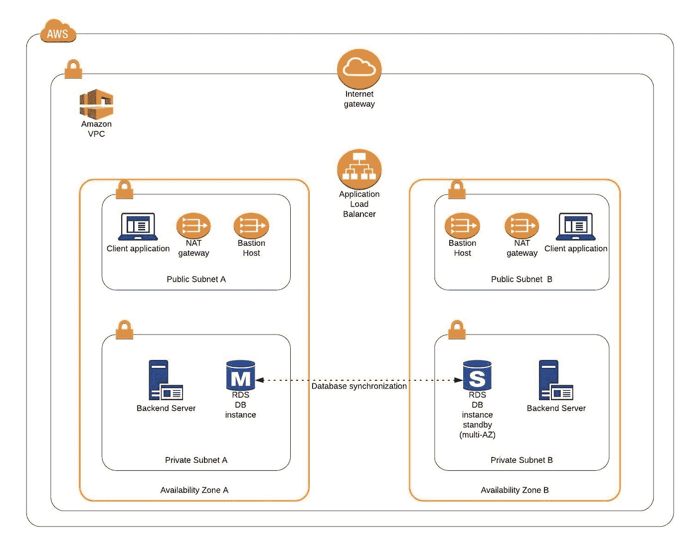

图 1

# AWS 理论

1.  ***弹性云计算云(EC2)***

弹性云计算云(EC2)是一项亚马逊服务，允许您在 AWS 上管理虚拟计算环境，即 EC2 实例。EC2 实例只是一个虚拟机，在选定的 AWS 区域和可用性区域中提供了一定数量的资源，如 CPU、内存、存储和网络容量。EC2 的灵活性意味着您可以根据自己的需要和要求轻松地增加或减少资源。您的实例的网络安全可以使用**安全组** 通过配置您的实例可以与之通信的协议、端口和 IP 地址来管理。

有五种基本类型的 EC2 实例，，您可以根据您的系统需求**来使用它们。**

*   通用目的，
*   计算优化，
*   内存优化，
*   加速计算，
*   存储优化，

在我们的基础设施中，我们将只使用通用实例，但是如果您想了解更多关于[实例类型的不同特性，请参见 AWS 文档](https://aws.amazon.com/ec2/instance-types/)。

所有 EC2 实例都附带有**实例存储卷**，用于存储实例停止或终止时删除的临时数据，还附带有**弹性块存储(EBS)**，这是一个独立于 EC2 实例本身工作的持久存储卷。

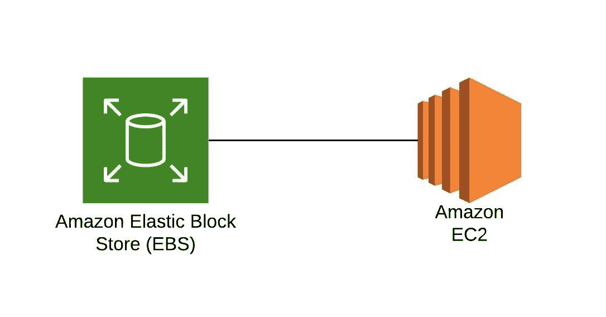

图 2

**②*。亚马逊机器图像(AMI)***

Amazon 利用软件配置的模板，称为**Amazon Machine Images(AMI)**，以便于创建定制的 EC2 实例。ami 是图像模板，包含用于启动 EC2 实例的软件，如操作系统、运行时环境和实际应用程序。这使我们能够预配置我们的 ami，并使用该映像动态启动新实例，而不是总是从头开始设置 VM 环境。Amazon 在 AWS Marketplace 上提供了一些现成的 ami，您可以对其进行扩展、定制和保存(我们很快就会这样做)。

***3。密钥对*和**

Amazon 使用公钥加密技术提供了一个安全的 EC2 登录机制。在实例引导期间，公钥放在 *~/中的一个条目中。ssh/authorized_keys* ，然后您可以使用私有密钥而不是密码通过 ssh 安全地访问您的实例。公钥和私钥被称为 ***密钥对*** 。

***4。IAM 角色***

**IAM** 表示身份和访问管理，它为您的系统定义了认证和授权规则。IAM 角色是 IAM 身份，由一组控制 AWS 服务访问的权限组成，可以附加到 AWS 资源，如用户、应用程序或服务。例如，如果您的应用程序需要访问特定的 AWS 服务，比如 S3 桶，那么它的 EC2 实例需要有一个分配了适当权限的角色。

***5。堡垒主机***

**Bastion Host** 是放置在公共子网中的特殊用途实例，用于允许访问位于私有子网中的实例，同时提供更高的安全级别。它充当用户和私有实例之间的桥梁，并且由于其暴露于潜在的攻击，它被配置为抵御任何渗透企图。私有实例只向堡垒主机公开它们的 SSH 端口，不允许任何直接连接。此外，bastion 主机可以配置为记录任何提供额外安全审计的活动。

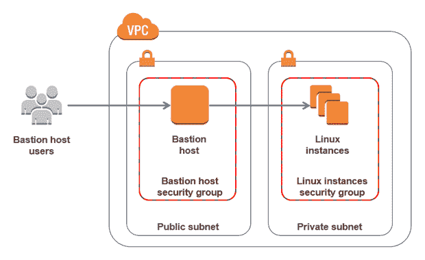

图 3

***6。亚马逊关系数据库服务***

*6.1 RDS*

RDS 是亚马逊的一项服务，用于管理云中的关系数据库。截至目前(23.04.2020)，它支持六个数据库引擎，具体包括 Amazon Aurora、PostgreSQL、MySQL、MariaDB、Oracle 数据库和 SQL Server。它易于配置和扩展，并通过使用**读取副本**和**多 AZ 部署**功能提供高可用性和可靠性。

*6.2 读取副本*

**RDS 读取副本**是异步的只读实例，是主数据库实例的副本。它们可以用于处理不需要任何数据更改的查询，从而减轻主节点的工作负载。

*6.3 多 AZ 部署*

**AWS 多 AZ 部署**是一个选项，允许 RDS 在不同的 AZ 中创建辅助备用实例，并与主节点的数据同步复制。主实例和备用实例都运行在它们自己物理上独立的基础设施上，只有主实例可以直接访问。备用副本在任何主服务器出现故障的情况下用作故障转移，而不改变 DB 的端点。

这减少了系统的停机时间，并使执行版本升级或创建备份快照变得更加容易，因为它们可以在备用实例上完成。多 AZ 通常只在主实例上使用。但是，也可以使用多 AZ 部署来创建读取副本，这将产生一个具有弹性的灾难恢复基础架构。

# 实践

我们有两个希望在 AWS 基础设施上运行的应用程序。一个是 Java 11 Spring Boot 应用程序，因此托管它的 EC2 需要安装 Java 11。第二个是 React.js 前端应用程序，它需要一个具有 Node.js 环境的虚拟机。因此，作为第一步，我们将设置一个堡垒主机，这将允许我们 ssh 我们的实例。然后，我们将在第一个可用性区域中手动启动和配置这两个 EC2 实例。稍后，我们将基于这些实例创建 ami，并使用它们在第二个可用性区域中创建 ec2。

1.  ***可用性区域 A***

*1.1 堡垒主机*

堡垒主机只不过是一个特殊用途的 EC2 实例。因此，为了创建一个堡垒主机，进入 AWS 管理控制台并搜索 EC2 服务。然后点击*启动实例*按钮，您将看到一个 EC2 启动向导。第一步是为您的实例选择一个 AMI 映像。您可以过滤 ami 并根据您的偏好选择一个。在本文中，我们将使用 **Amazon Linux 2 AMI (HVM)，SSD 卷类型**镜像。

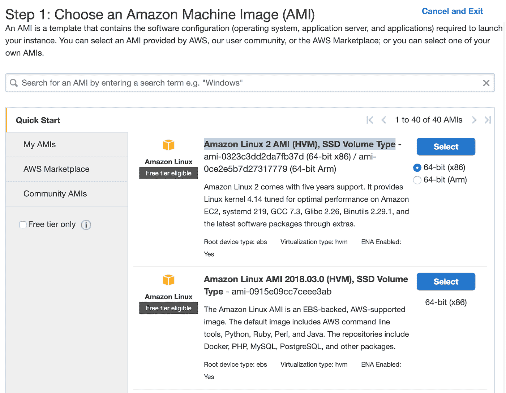

图 4

在下一个屏幕上，我们需要为图像选择一个实例类型。在这里，我坚持使用 AWS 自由层程序，所以我将使用通用的 t2.micro 类型。点击*下一步:配置实例详情*。在这里，我们可以定义实例的数量、网络设置、IAM 配置等。现在，让我们从 1 个实例开始，稍后我们将研究基础设施的可伸缩性。在网络部分，选择您以前创建的 VPC 和公共子网 a，并启用公共 IP 自动分配。我们不需要指定任何 IAM 角色，因为我们不会使用任何 AWS 服务。

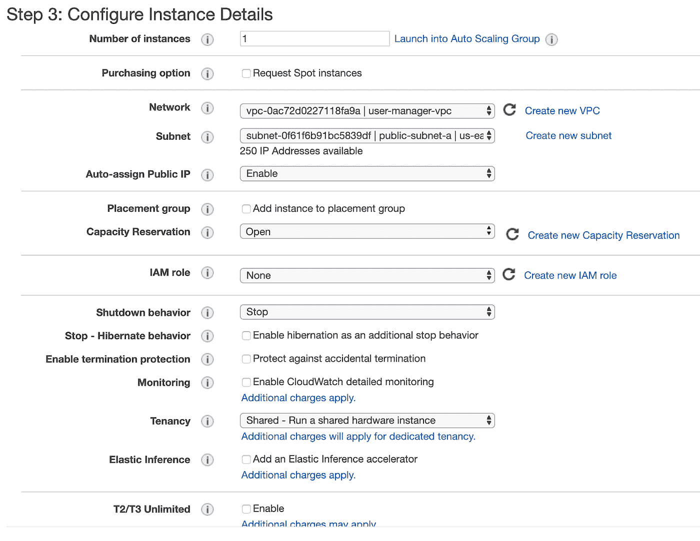

图 5

点击下一个的*。在这里，您可以看到向导自动为您的实例配置了 8GB EBS 存储，这对我们来说已经足够了。再次点击*下一步*。现在，我们可以添加标签来提高实例的可识别性。让我们添加一个姓名标签 *bastion-a-ec2* 。在下一个屏幕上，我们可以为我们的实例配置一个安全组。创建一个新的安全组，命名为 *bastion-sg* 。*

您可以看到已经有一个预定义的规则公开了来自 0.0.0.0/0(任何地方)的 SSH 会话的实例。您应该在这里将其更改为只允许来自您的 IP 地址的连接。这里需要注意的重要一点是，在生产环境中，您永远不会向全世界公开您的实例，相反，您会将允许连接到您的实例的员工的 IP 地址列入白名单。

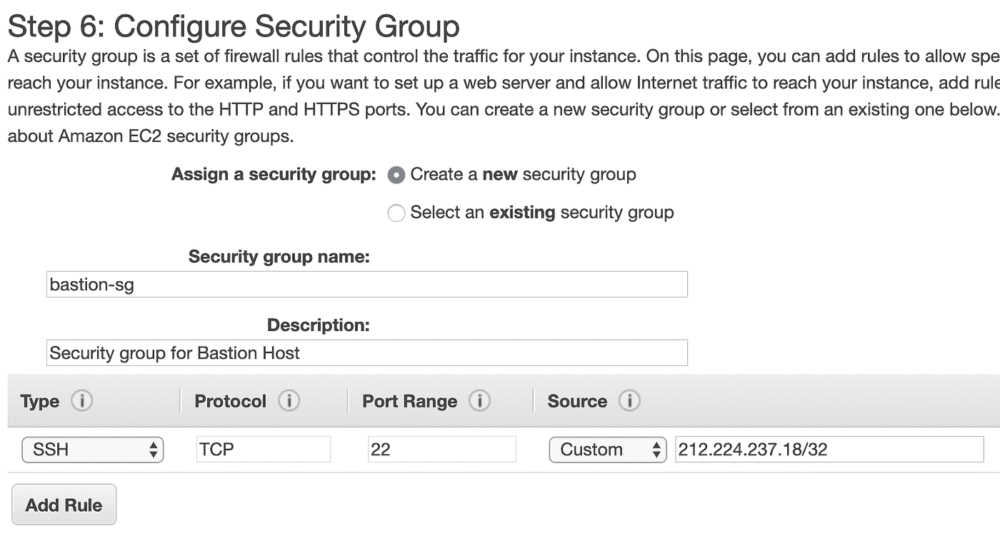

图 6

在下一步中，您可以检查您的 EC2 配置并启动它。最后一个动作是创建密钥对。这很重要，因为我们需要这个密钥对来 ssh 到我们的实例。将密钥对命名为 *user-manager-key-pair* ，下载私钥并将其本地存储在您的机器上。就是这样，Amazon 需要一些时间，但最终您的 EC2 实例将会启动。

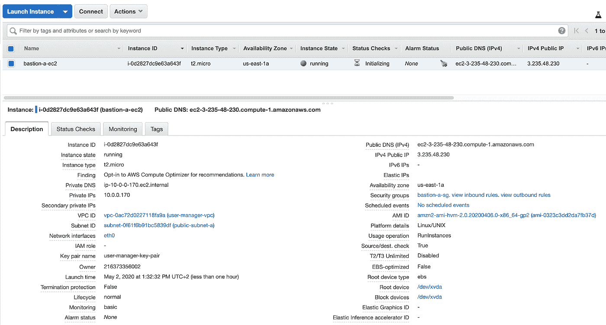

图 7

在实例描述部分，您可以找到您的实例的公共 IP 地址。我们可以用它来 ssh 到 EC2。这就是我们需要先前生成的并且希望是本地保存的私钥(*。pem 文件)。就这样，我们的实例现在已经准备好了。然而，在生产中，进一步加强 Bastion 主机的安全性是一个好主意。如果你想了解更多，我们推荐这篇文章[https://medium . com/Kao dim-engineering/hardening-ssh-using-AWS-bastion-and-MFA-45d 491288872](https://medium.com/kaodim-engineering/hardening-ssh-using-aws-bastion-and-mfa-45d491288872)。

*1.2 后端服务器 EC2*

现在，让我们为后端服务器创建一个实例。再次点击 *Launch instance* ，选择与之前相同的 AMI 镜像，将其放在您的 user-manager-vpc，private-subnet-a 中，这次不要启用公共 IP 自动分配。像以前一样完成接下来的步骤，添加一个 *server-a-ec2* 名称标签。在安全组配置中，创建一个新的安全组，并修改其设置，只允许来自 *bastion-sg* 的 SSH 传入通信。

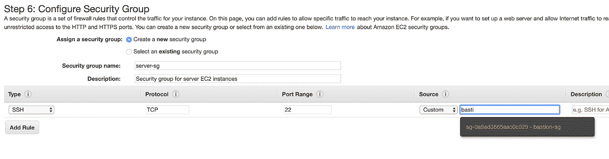

图 8

启动实例。您可以创建一个新的密钥对，或者使用之前创建的密钥对(为了简单起见，我建议对所有实例使用相同的密钥对)。最后，您应该已经启动并运行了第二个实例。

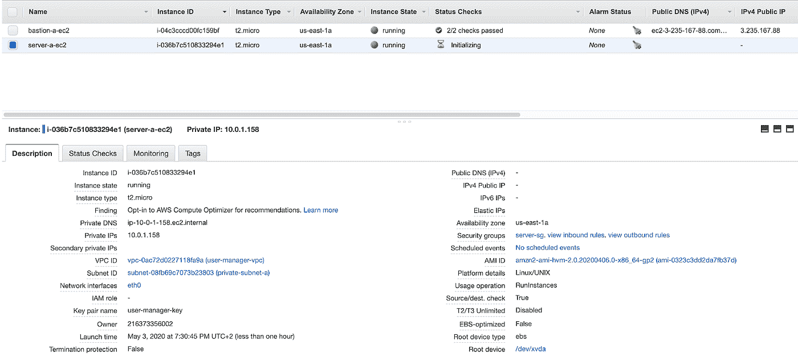

图 9

您可以看到 *server-a-ec2* 没有任何公共 IP 地址。但是，我们可以通过堡垒主机访问它。首先，我们需要将我们的密钥添加到一个 keychain 中，然后我们可以对我们的 bastion 主机实例进行 ssh，向 ssh 命令添加*—*标志。该标志启用代理转发，这将允许您 ssh 到您的私有实例，而无需再次显式指定私有密钥。这是一种推荐的方法，它可以让您避免将私钥存储在 bastion 主机实例上，这可能会导致安全漏洞。

```
ssh-add -k <PEM_file_name>ssh -A -i path-to-your-pem-file ec2-user@bastion-a-ec2-instance-public-ip
```

然后，在您的 bastion 主机中执行以下命令:

```
*ssh ec2-user@server-a-ec2-instance-private-ip*
```

现在，您应该在您的 server-a-ec2 私有实例中。让我们通过执行这些命令在机器上安装所需的软件

```
*sudo yum update -y &&**sudo amazon-linux-extras enable corretto8 &&**sudo yum clean metadata &&**sudo yum install java-11-amazon-corretto &&**java — version*
```

因此，您应该在您的 *server-a-ec2* 实例上安装 java 11。您可以通过执行两次*退出*命令返回到本地命令提示符。

*阿米*

后端服务器的 ec2 实例已经为部署做好了准备。在第二个可用性区域中，我们可以遵循完全相同的步骤。然而，有一种更简单的方法。我们可以基于我们预先配置的实例创建一个 AMI 映像，并在以后用于在可用性区域 b 中创建相应的实例。为此，再次进入 *Instances* 菜单，选择您的实例，单击*Actions*->*Image*->*Create Image*。您的 AMI 映像将被创建，您将能够在*映像/AMI*部分找到它。


图 10

*1.3 客户端应用 EC2*

可用性区域 A 中我们需要的最后一个 EC2 实例将托管客户端应用程序。那么，让我们再来一遍 EC2 的创建过程。启动实例，选择与之前相同的基本 AMI，选择您的 VPC，将实例放在*public-subnet-a*中，并启用公共 IP 分配。然后，添加一个 *client-a-ec2* 名称标签，并创建一个新的安全组 *client-sg* ，允许来自 *bastion-sg* 安全组的 SSH 传入连接。就这样，发射。


图 11

现在，通过 bastion 主机 SSH 到实例，并安装所需的软件。

```
*ssh -A -i path-to-your-pem-file ec2-user@bastion-a-ec2-instance-public-ip*
```

然后，在您的 bastion 主机中执行以下命令:

```
ssh ec2-user@client-a-ec2-instance-private-ip
```

在 *client-a-ec2* 命令提示符下，执行

```
*sudo yum update &&**curl -sL* [*https://rpm.nodesource.com/setup_12.x*](https://rpm.nodesource.com/setup_12.x) *| sudo bash — &&**sudo yum install -y nodejs &&**node -v &&**npm -v*
```

退出 EC2 命令提示符，并基于它创建一个新的 AMI 映像。

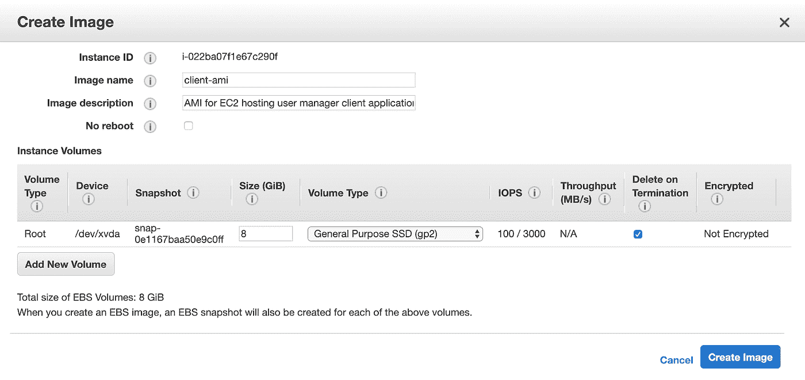

图 12

**2。可用性区域 B**

*2.1 堡垒主机*

按照与可用性区域 a 相同的步骤创建第二个 bastion 主机实例，但这一次将其放在 public-subnet-b 中，添加名称标签 bastion-b-ec2，并为其分配之前创建的 *bastion-sg* 安全组。

*2.2 后端服务器 EC2*

对于后端服务器 EC2，再次转到*启动实例*菜单，这次不是使用 Amazon 的 AMI 开关，而是转到 *My AMI 的*选项卡，并选择之前创建的 *server-ami* 映像。将实例放在 private-subnet-b 中，添加名称标签 *server-b-ec2* ，并为其分配 *server-sg* 安全组。

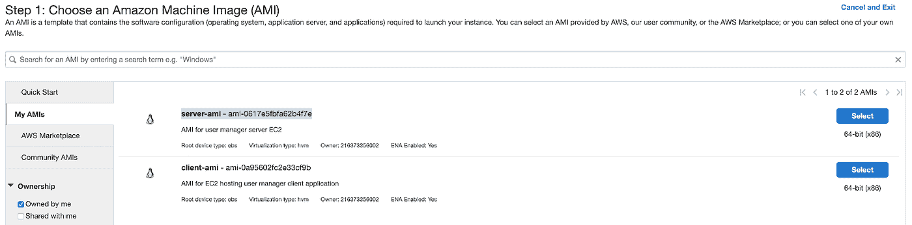

图 13

*2.3 客户端应用 EC2*

就像后端服务器实例一样，使用您的定制 AMI 映像*启动 *client-b-ec2* 。*这次选择 *client-ami* 镜像，将 EC2 放在 *public-subnet-b* 中，启用自动 IP 分配，选择 *client-sg* 安全组。

***3。RDS***

我们已经准备好了所有的 EC2 实例。我们将在本文中讨论的最后一部分是 RDS 的配置。为此，进入 AWS 管理控制台中的 RDS 服务，并单击*创建数据库*。在数据库配置窗口中，遵循标准配置路径。选择 MySQL 数据库引擎，然后选择自由层模板。将您的数据库名称设置为 *user-manager-db* ，指定主用户名和密码，选择您的 user-manager-vpc，可用性区域 a，并使数据库不可公开访问。还创建一个新的*用户管理器-db-sg* 安全组。

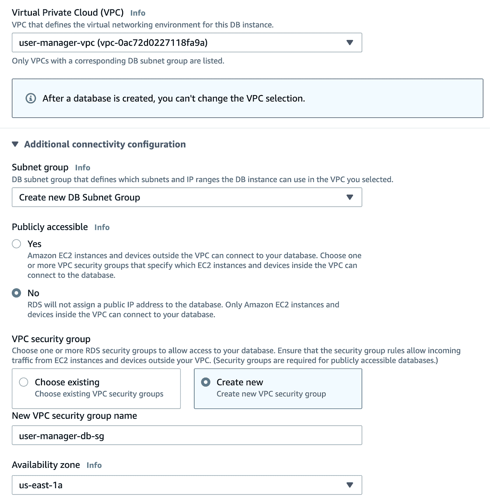

图 14

在*附加配置*部分，指定初始数据库名称，最后创建一个数据库。

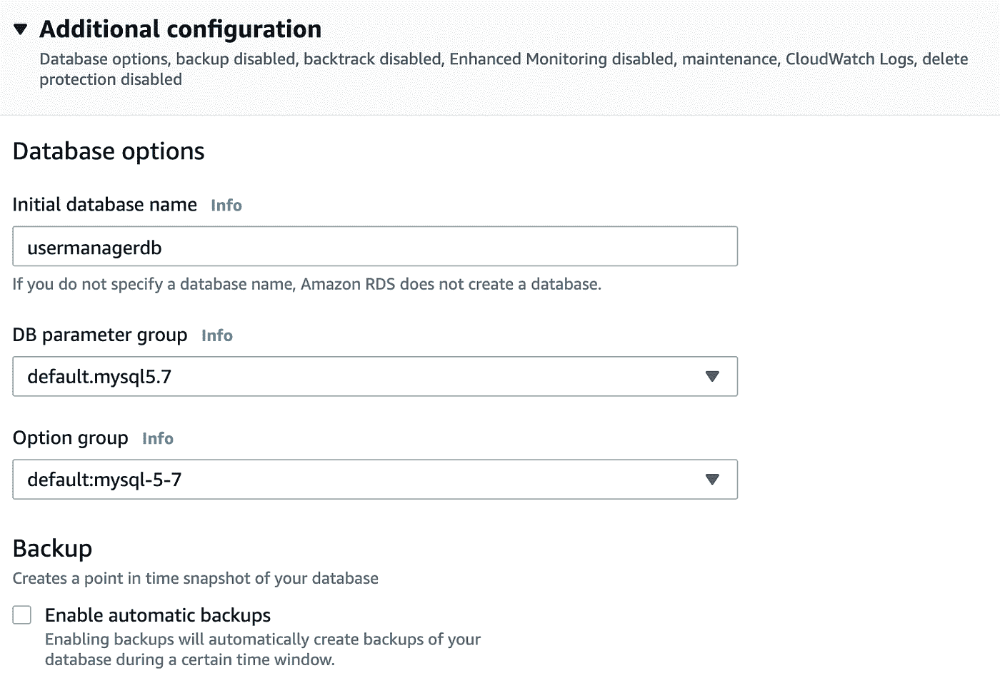

图 15

在 AWS 完成创建过程之后，您将能够获得数据库端点，稍后我们将使用它从我们的应用程序连接到数据库。现在，为了提供数据库的高可用性，在创建的数据库屏幕上单击*修改*按钮，并启用多 AZ 部署。请记住，多 AZ 部署不包括在免费层计划中，因此如果您想避免任何费用，请跳过这一点。

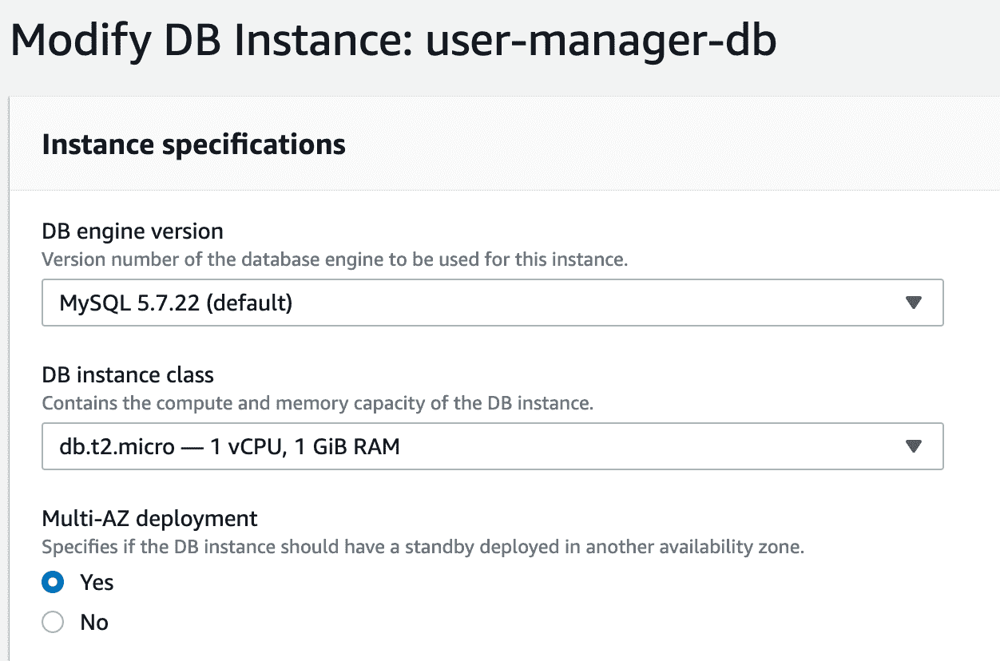

图 16

作为最后一步，我们需要向 *user-manager-db-sg* 添加一个规则，以允许来自端口 3306 上的 *server-sg* 的传入连接，从而允许我们的服务器和数据库之间的通信。

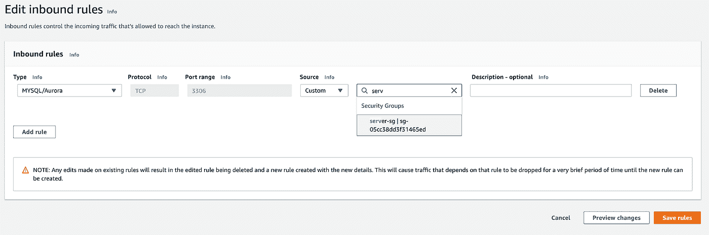

图 17

# 摘要

恭喜您，我们的基础架构几乎可以部署了。正如您在我们的最终图表中看到的，唯一缺少的是负载平衡器。在本系列的下一部分中，我们将解决这个问题，并部署我们的应用程序，使其在 AWS 基础设施上运行一个全功能的系统！

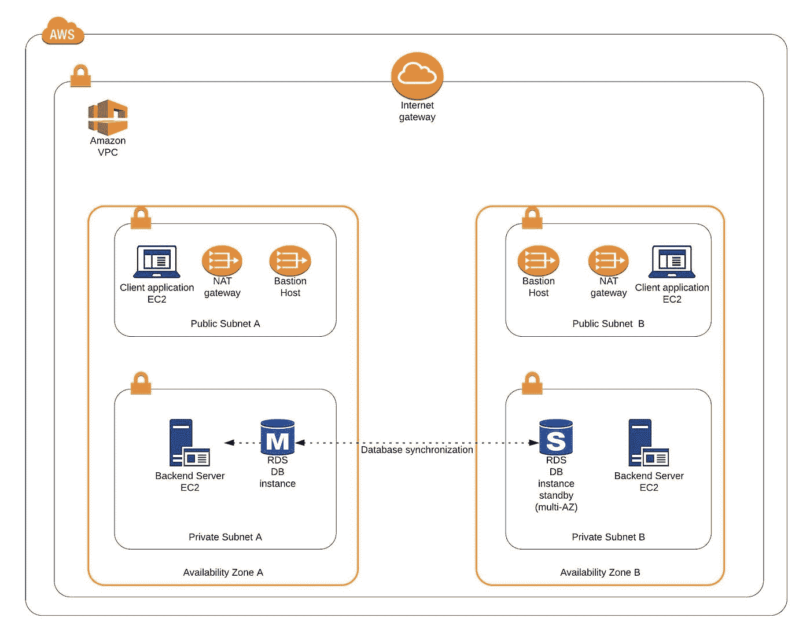

图 18

**来源:**

[https://cloud academy . com/blog/AWS-bastion-host-NAT-instances-VPC-peering-security/](https://cloudacademy.com/blog/aws-bastion-host-nat-instances-vpc-peering-security/)

[https://AWS . Amazon . com/quick start/architecture/Linux-bastion/](https://aws.amazon.com/quickstart/architecture/linux-bastion/)

[https://AWS . Amazon . com/blogs/security/securely-connect-to-Linux-instances-running-in-a-private-Amazon-VPC/](https://aws.amazon.com/blogs/security/securely-connect-to-linux-instances-running-in-a-private-amazon-vpc/)

[https://app . plural sight . com/library/courses/AWS-developer-getting-started/目录](https://app.pluralsight.com/library/courses/aws-developer-getting-started/table-of-contents)

[https://app . plural sight . com/library/courses/AWS-developer-design-developing/目录](https://app.pluralsight.com/library/courses/aws-developer-designing-developing/table-of-contents)

[https://app . plural sight . com/library/courses/AWS-networking-deep-dive-VPC/目录](https://app.pluralsight.com/library/courses/aws-networking-deep-dive-vpc/table-of-contents)

【https://www.techradar.com/news/what-is-amazon-rds 

[https://medium . com/Kao dim-engineering/hardening-ssh-using-AWS-bastion-and-MFA-45d 491288872](https://medium.com/kaodim-engineering/hardening-ssh-using-aws-bastion-and-mfa-45d491288872)

[https://cloud academy . com/blog/AWS-bastion-host-NAT-instances-VPC-peering-security/](https://cloudacademy.com/blog/aws-bastion-host-nat-instances-vpc-peering-security/)

[https://docs . AWS . Amazon . com/IAM/latest/user guide/id _ roles . html](https://docs.aws.amazon.com/IAM/latest/UserGuide/id_roles.html)

[https://docs . AWS . Amazon . com/AWS ec2/latest/user guide/ec2-key-pairs . html](https://docs.aws.amazon.com/AWSEC2/latest/UserGuide/ec2-key-pairs.html)

[https://aws.amazon.com/ec2/instance-types/](https://aws.amazon.com/ec2/instance-types/)

*原载于 2020 年 5 月 12 日*[*https://grapeup.com*](https://grapeup.com/blog/read/the-path-towards-enterprise-level-aws-infrastructure-architecture-scaffolding-77)*。*