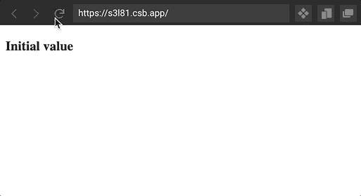
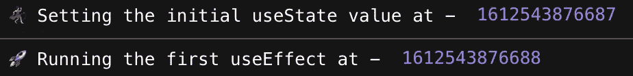
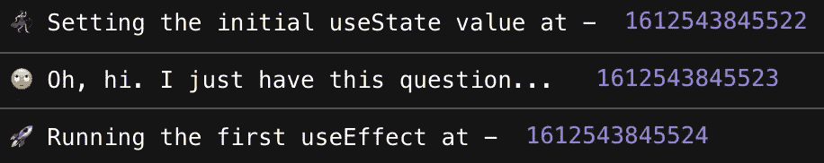
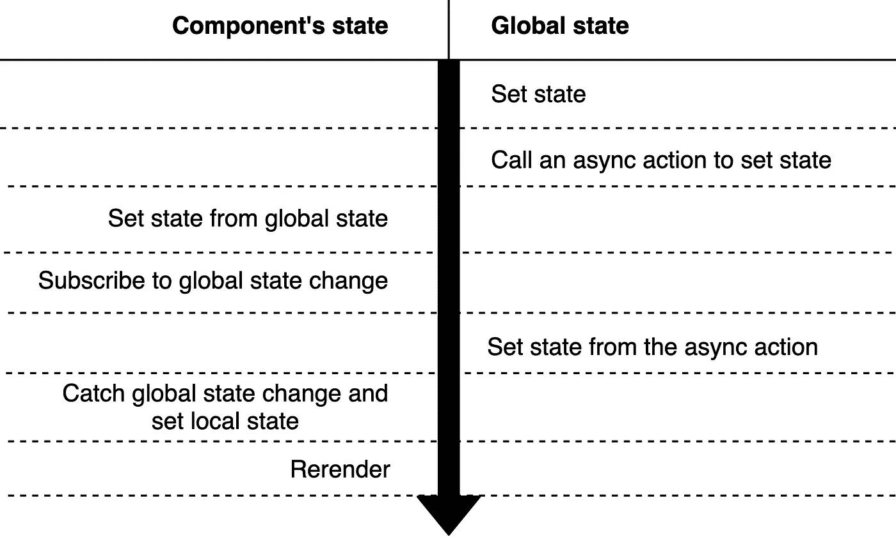
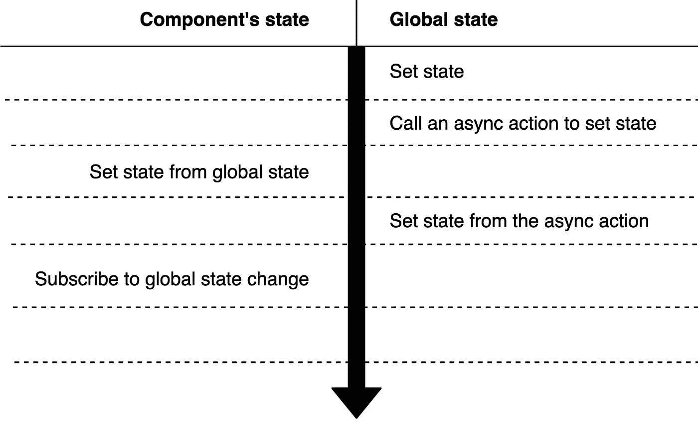
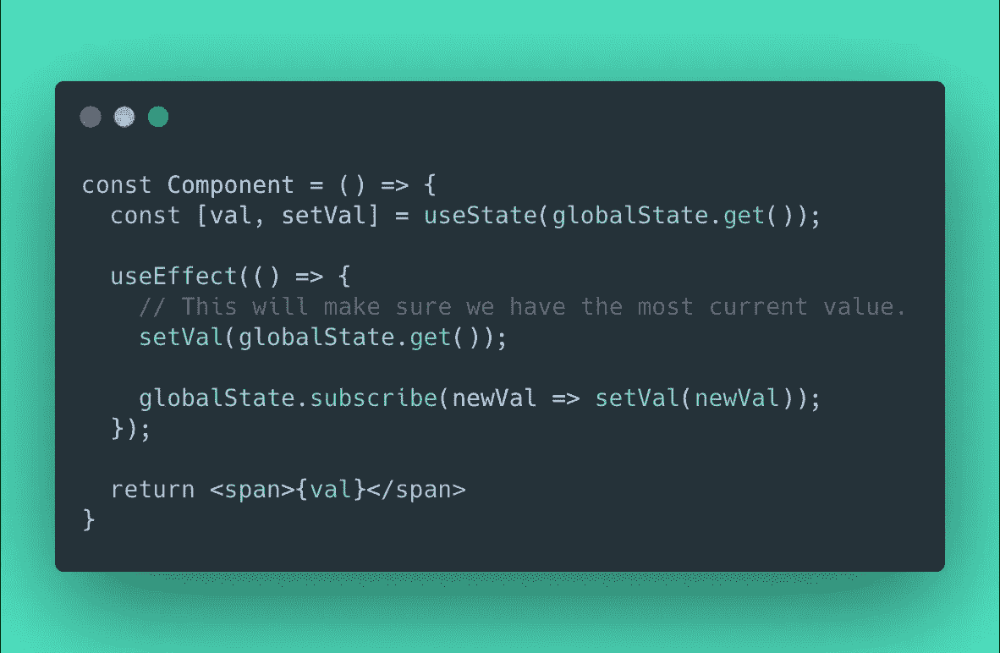

# React 的 useState 和 useEffect 之间可能的延迟陷阱

> 原文：<https://itnext.io/the-possible-delay-pitfall-between-reacts-usestate-and-useeffect-383ef1e053d9?source=collection_archive---------1----------------------->

*免责声明:我没有深入了解到底是什么导致了这个问题，我只是想向您介绍我最近遇到的情况，希望这能帮助到一些人。*

# 虫子

我用路由器创建了一个简单的 react 应用程序，并实现了一个最小的可观察对象(取自[这里是](https://blog.betomorrow.com/replacing-redux-with-observables-and-react-hooks-acdbbaf5ba80))来设置和监听值的变化(用作应用程序的全局状态)。

应用程序启动后，我立即调用了一个异步函数来改变全局状态(仅仅是`setTimeout(() => { globalState.set(...) })`)。

我让 React 组件跟踪全局状态的变化，并将其存储在组件的状态中。我用当前的全局状态(也就是 T1)初始化了本地状态。

因此..我期望一旦我改变了全局状态，我将在组件的状态中看到最新的值(`Secondary value`)。

结果是不一致的，我不能依赖它。

这让我抓狂。
我知道“次要值”应该出现，因为这是全局状态的最新值。

为什么组件没有捕捉到这种变化？

# 原因

经过一整天的研究和根本原因的缩小，我发现当一个组件的`useState`和`useEffect`相继运行时-

相应地，控制台日志来自 useState 和 useEffect。

在某些情况下，异步操作可能介于两者之间。

每个人都讨厌这些。

我期待事情会这样发展:

但我得到了这个:

没有雷兰德！

# 解决方案

在我的例子中，我所要做的就是在我们订阅之前确保我们有最新的值。

下面是该行为的完整演示(查看控制台日志，并刷新预览页面)。

刷新试玩感受我的痛苦~😫

# 结论

这就是我解决这个问题的方法。
您可能没有导致这种情况的确切结构，但是现在您知道您需要检查另外一个地方。😄