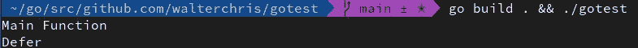
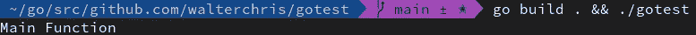

# Golang 关键字“推迟”的力量

> 原文：<https://itnext.io/the-power-of-golang-keyword-defer-b31bdecf10b6?source=collection_archive---------4----------------------->


照片由[卡里姆·曼吉拉](https://unsplash.com/@karim_manjra?utm_source=unsplash&utm_medium=referral&utm_content=creditCopyText)在 [Unsplash](https://unsplash.com/s/photos/procrastination?utm_source=unsplash&utm_medium=referral&utm_content=creditCopyText) 上拍摄

Golang 是我现在最喜欢的编程语言之一。它像 C 一样简单，但像 JavaScript 一样强大，像 Python 一样可组合。在过去的三年里，Golang 取代 Python 和 Bash 成为我最喜欢的“我需要拼凑一个脚本”语言——我经常用它构建小型到企业级的应用程序。

我的大学教授一直教导我，一个功能应该只负责一项任务。使用 C 作为我的第二个“日常”编程语言，我经常遇到再次退出函数时不能释放句柄的问题。所以一个常见的函数是:

```
func letsDoSomething() {
    handle := openHandle() // Do something with the handle
    data := read(handle) // Do something with the data
    ... // We are done - close handle again
    closeHandle(handle)
}
```

老实说，你多久会忘记关上把手一次？假设您有一个包含多个 return 语句的函数，您需要在每个 return 语句之前多次释放句柄。

# 推迟救援

现在 Golang 有一个关键词叫`defer`。`defer`推迟一个函数的执行，直到周围的函数退出。所以在我们的例子中，我们可以写:

```
func letsDoSomething() {
    handle := openHandle() // Let's close the handle once we exit the function
    defer closeHandle(handle) // Do something with the handle
    data := read(handle) // Do something with the data
    ...
}
```

现在——什么改变了？就代码行而言？没什么。但是我们将执行`closeHandle`推迟到稍后函数退出时。让我们看一个更复杂的例子:

```
func letsDoSomething() error {
    handle := openHandle() // Do something with the handle
    data := read(handle) switch data {
    case "one":
        closeHandle(handle)
        return fmt.Errorf("an error occured")
    case "two":
        ...
    default:
        closeHandle(handle)
        return fmt.Errorf("data can not be used") closeHandle(handle)
    return nil
}
```

现在我们来看一下这里的代码。我们从之前打开的句柄中读取数据。根据数据，我们要么返回一个错误，要么返回零。然而，我们需要在退出函数之前关闭句柄。在这个简单的例子中，我们需要调用`closeHandle`三次。让我们与使用`defer`的版本进行比较。

```
func letsDoSomething() error {
    handle := openHandle() defer closeHandle(handle) // Do something with the handle
    data := read(handle) switch data {
    case "one":
        return fmt.Errorf("an error occured")
    case "two":
        ...
    default:
        return fmt.Errorf("data can not be used") return nil
}
```

不是调用`closeHandle`三次，我们只调用`defer closeHandle(handle)`一次，Golang 会在我们退出函数后负责调用`closeHandle`。很方便吧？

# 好得难以置信——一些陷阱

`defer`很有用，但也很棘手。有些陷阱你需要小心。

**os。Exit()** 我们来看下面的例子:

```
package mainimport (
 "fmt"
)func main() { defer func() {
        fmt.Println("Defer")
    }() fmt.Println("Main Function")
}
```

当运行这个简单的例子时，我们确实看到了我们所期望的



上面代码的输出

现在让我们添加一行:

```
package mainimport (
 "fmt"
 "os"
)func main() { defer func() {
        fmt.Println("Defer")
    }() fmt.Println("Main Function") os.Exit(1)}
```

现在输出变成了:



带有操作系统的代码的输出。出口(1)

这是意料之外的。貌似我们调用`os.Exit(1)`的时候`defer`不会被执行。当我们查看 https://pkg.go.dev/os#Exit[的文件时，上面写着](https://pkg.go.dev/os#Exit)

> 程序立即终止；延迟功能不会运行。

好吧——有道理。但是还有什么呢？


史蒂夫·乔布斯

对`os.Exit`成立的适用于每个立即返回的函数。最常见的功能是:

*   日志。致命/日志。Fatalf

`defer`非常有用，在处理文件、句柄或任何使用后需要手动清理的东西时，可以让你省去一些头痛。它消除了代码重复，使您的代码更加易读和简洁。在使用它的时候，你需要注意一些小陷阱。