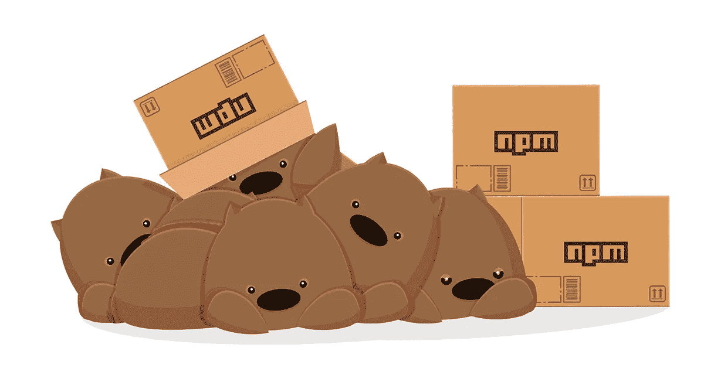
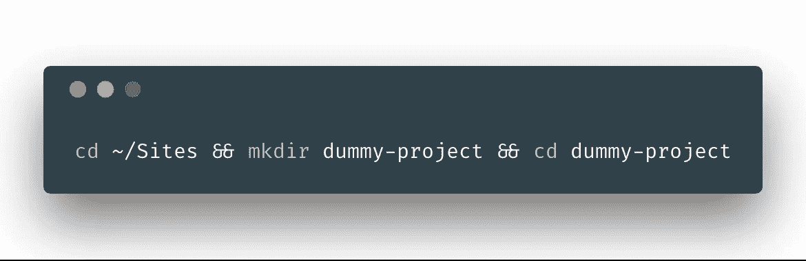
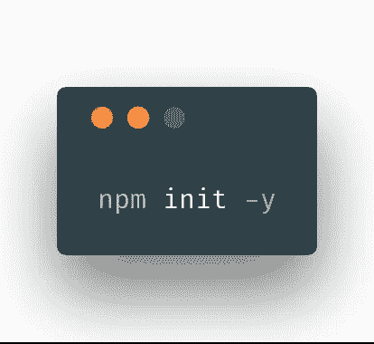
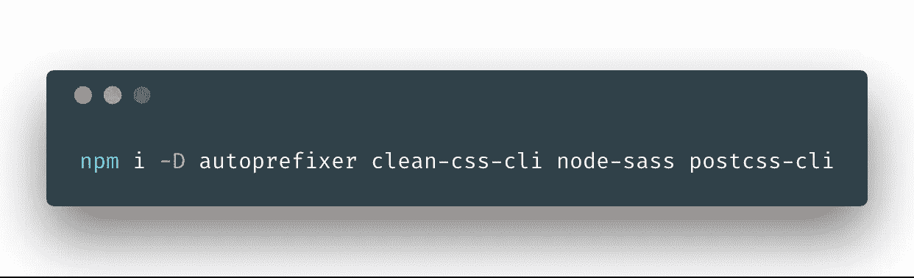
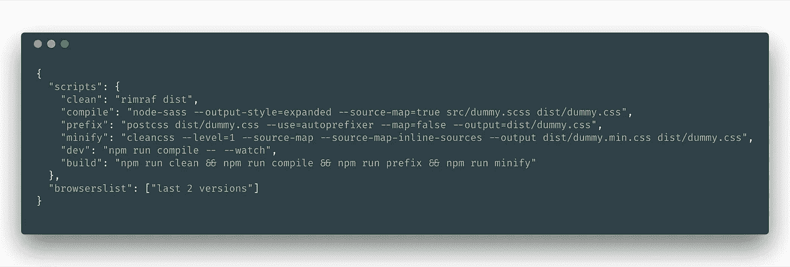

# 编写简单的开发任务——NPM 脚本的力量

> 原文：<https://itnext.io/the-power-of-npm-scripts-57aaad9f038d?source=collection_archive---------6----------------------->



来自国家预防机制网站的官方图片…

> 如果你所需要的只是一些可以使用“npm 脚本”完成的简单任务，那么忘掉诸如“咕噜咕噜/大口大口”之类的任务运行程序或诸如“网络包裹/包裹”之类的打包程序吧。

让我们想象一下，你正在做一个项目，在它准备投入生产之前，需要完成几个简单的任务。

任务列表:

*   将 Sass 编译为 CSS
*   生成源映射文件
*   处理浏览器的供应商前缀
*   缩小 CSS

这些任务可以用 n [pm 脚本](https://docs.npmjs.com/files/package.json#scripts)的力量来创建，而不是用任务运行器或捆绑器。它更干净，更简单，依赖更少，没有第三方插件/包装…而是直接使用**包的 CLI** 。

我们的任务列表甚至不需要一个单独的`js`任务，所以在这种情况下使用 Bundler 将是一个糟糕的选择。

# 让我告诉你，这有多简单！

是时候创建一个项目了，我们称之为“虚拟项目”,然后使用上面提到的`npm scripts`编写所有这些任务。

使用*终端*创建我们的第一个**“虚拟项目”**，并将目录更改为…

```
cd ~/Sites && mkdir dummy-project && cd dummy-project
```



创建目录并将我们放入其中…

现在让我们快速创建一个`package.json`文件…

```
npm init -y
```



生成没有任何问题的文件…

这个文件现在已经生成，我们可以继续了。现在是时候安装我们提到的任务所需的任何`devDependencies`了。

在这种情况下，这些将是:

1.  [自动修复程序](https://github.com/postcss/autoprefixer)
2.  [CleanCSS CLI](https://github.com/jakubpawlowicz/clean-css-cli)
3.  [诺迪斯](https://github.com/sass/node-sass)
4.  [PostCSS CLI](https://github.com/postcss/postcss-cli)

要安装所有这些程序，我们需要运行以下命令:

```
npm i -D autoprefixer clean-css-cli node-sass postcss-cli
```



使用 npm 安装依赖于开发人员的设备—软件包管理器…

显然，既然我们也想为生产编译，我们也必须有一个任务来清理我们的生产目录…我们可以使用`rimraf`来完成这个任务。

现在让我们建立一个项目结构…

*   我们将有一个`src`发展目录
*   在我们的`src`目录中，我们将创建一个名为`dummy.scss`的文件，其中将包含带有 Scss 语法的 Sass 代码
*   我们将有一个`dist`目录用于生产，它将自动生成

是时候写那些脚本任务了…在你最喜欢的代码编辑器中打开`package.json`文件，找到`"scripts"`对象并从其中删除`"test"`属性…

> *注意，您可以随意命名脚本命令。这只是我更喜欢的惯例…

当我们在`package.json`文件的`"scripts"`对象中时，我们现在可以开始编写命令了。

## 清理“dist”目录

```
"clean": "rimraf dist",
```

## 从“src”到“dist”编译 Sass 到 CSS

```
"compile": "node-sass --output-style=expanded --source-map=true src/dummy.scss dist/dummy.css",
```

## 使用 Autoprefixer 处理浏览器的供应商前缀

```
"prefix": "postcss dist/dummy.css --use=autoprefixer --map=false --output=dist/dummy.css",
```

> 在我们的“package.json”文件中，我们需要为 **Autoprefixer** 添加一个内容，那就是定义我们关心的浏览器。如本帖所言，我们将支持每个浏览器的“最后两个版本”。我们可以将以下内容放在`"scripts"`的括号之后。

```
"browserslist": ["last 2 versions"],
```

## 使用 CleanCSS 处理缩小

```
"minify": "cleancss --level=1 --source-map --source-map-inline-sources --output dist/dummy.min.css dist/dummy.css",
```

正如您所看到的，我在最后一个脚本命令中留下了悬挂的逗号。如果我们完成了，在运行任何`npm`命令时，都会导致一个错误。

然而，我们还没有完成，因为我们想让我们的生活更容易，为此，我们必须再写两个命令。一个我们可以用于**开发**，另一个用于**生产**，这样我们甚至不需要记住我们任务的所有名字，而只需要记住这两个。

通常的做法是将这两个命名为`dev`和`build`……当然，你可以随意命名。

## 发展指挥部

```
"dev": "npm run compile -- --watch",
```

> 您可能会觉得在这个命令中看到额外的`--`很奇怪。如果我们使用`yarn`就不会这样了，但是在`npm`中，我们确实需要写那些，如果我们把一些参数传递给我们写的`npm script`…

## 生产指挥

```
"build": "npm run clean && npm run compile && npm run prefix && npm run minify"
```

# 我们正式结束了！

我们的`package.json`文件现在应该包含下面的上下文，不包括我们用初始的`npm`命令生成的样板文件…

*另外，不要拿走那份样板文件……*



现在我们可以使用我们刚刚为`dummy-project`编写的那些`npm`脚本中的任何一个，并实现我们最初需要的。在我们的空文件中写一些 Sass 来测试它…

1.  `npm run dev` —从开发开始，它会观察变化并相应地重新编译
2.  `npm run build` —为生产做好准备。它将`clean`到`dist`目录，`compile`到 CSS 的 Sass，通过`autoprefixer`运行它来添加任何需要的厂商前缀，最后通过`minify`运行它来创建一个附加的缩小文件。

# 直到下次

如果你喜欢这个并且学到了新的东西，请分享一些爱。
为此，点击拍手图标👏或者拿着它等待更多的掌声！👏👏👏

非常感谢。你是最棒的！