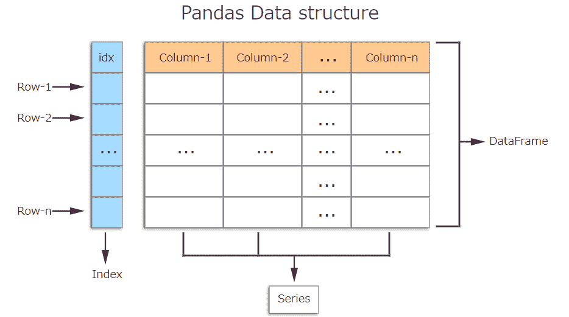
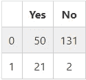
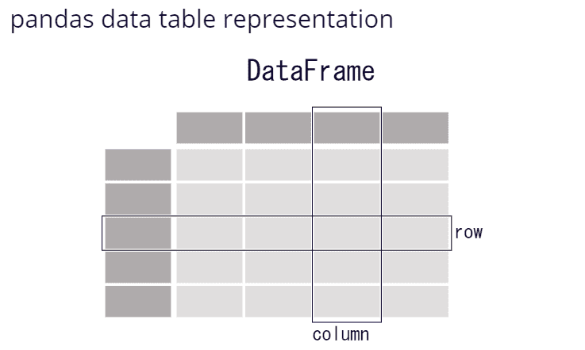
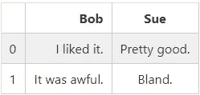
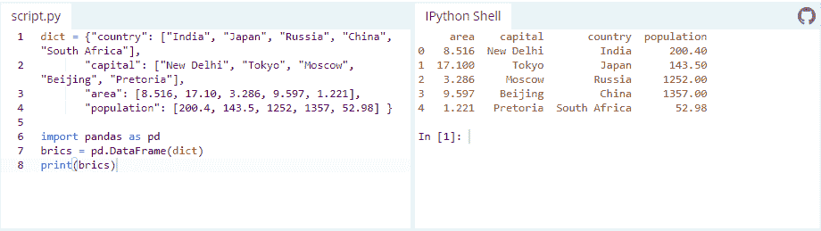
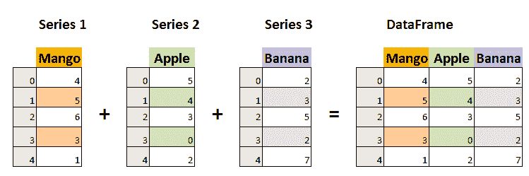
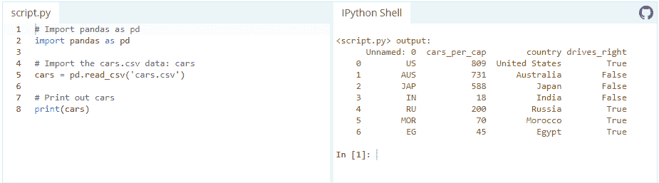

# 熊猫的力量:蟒蛇

> 原文：<https://itnext.io/the-power-of-pandas-python-253c11b40b88?source=collection_archive---------3----------------------->


# 熊猫基础知识

Pandas 是一个 Python 包，它提供了快速、灵活、富于表现力的数据结构，旨在使处理“关系”或“标签”数据变得既简单又直观。它旨在成为用 Python 进行实际的、真实世界的数据分析的基础高级构建块。此外，它还有一个更广泛的目标，那就是成为任何语言中最强大、最灵活的开源数据分析/操作工具。它已经在朝着这个目标前进。

Pandas 是由 Wes McKinney 开发的高级数据操作工具。它建立在 Numpy 包之上，其关键数据结构称为 DataFrame。数据帧允许您存储和操作观察行和变量列中的表格数据。


pandas 非常适合于许多不同类型的数据:
具有异构类型列的表格数据，如 SQL 表或 Excel 电子表格
有序和无序(不一定是固定频率)的时间序列数据。
带有行和列标签的任意矩阵数据(同类或异类)
任何其他形式的观察/统计数据集。这些数据实际上根本不需要标记就可以放入 pandas 数据结构中

下面是熊猫擅长的几件事:
轻松处理浮点和非浮点数据中的缺失数据(表示为 NaN)
大小可变性:可以从数据帧和更高维对象中插入和删除列
自动和显式数据对齐:对象可以显式地与一组标签对齐，或者用户可以简单地忽略标签，让系列、数据帧等。在计算中自动对齐数据
强大、灵活的 group by 功能可对数据集执行拆分-应用-组合操作，用于聚合和转换数据
轻松将其他 Python 和 NumPy 数据结构中粗糙、不同索引的数据转换为 DataFrame 对象
智能的基于标签的切片、花式索引、 大型数据集的子集化
直观的合并和连接数据集
数据集的灵活调整和旋转
轴的分层标记(每个刻度可能有多个标记)
强大的 IO 工具，用于从平面文件(CSV 和定界)、Excel 文件、数据库加载数据，以及保存/加载超快速 HDF5 格式的数据
特定于时间序列的功能:日期范围生成和频率转换、移动窗口统计、日期移动和滞后。



要加载 pandas 包并开始使用它，请导入该包。

```
In [1]: import pandas as pd
```

# ■创建数据

pandas 的两个主要数据结构，Series(一维)和 DataFrame(二维)。数据帧中的每一列都是一个系列。

 **数据帧是一个表格。它包含一个单独条目的数组，每个条目都有一个特定的值。每个条目对应一行(或记录)和一列。
例如，考虑以下简单的数据帧:**

```
In [2]: pd.DataFrame({'Yes': [50, 21], 'No': [131, 2]})
```

**Out [2]:**

********

**数据帧条目不限于整数。例如，这里有一个数据帧，它的值是字符串:**

```
In [3]: pd.DataFrame({'Bob': ['I liked it.', 'It was awful.'], 'Sue': ['Pretty good.', 'Bland.']})
```

**Out [3]:**

****

**有几种方法可以创建数据帧。一种方法是使用字典。例如:**

****

****Series**
相比之下，Series 是数据值的序列。如果数据帧是一个表格，那么系列就是一个列表。事实上，你只需要一个列表就可以创建一个:**

****

```
In [4]: pd.Series([1, 2, 3, 4, 5])Out [4]: 
0    1
1    2
2    3
3    4
4    5
dtype: int64
```

# **■读取数据文件**

**创建数据帧的另一种方法是使用 Pandas 导入 csv 文件。数据可以以多种不同的形式和格式存储。到目前为止，其中最基本的是不起眼的 CSV 文件。现在，csv cars.csv 已存储，可以使用 pd.read_csv 导入:**

****

**或者我们可以使用 *head()* 命令检查结果数据帧的内容，该命令获取前五行:**

```
In [5]: pd.head()
```

# **■其他有用的技巧**

****获取当前工作目录****

```
In [6]: import os
In [7]: os.getcwd()
```

****检查数据中有多少行和多少列**
(o/p - >行数、列数)**

```
In [8]: pd.shape
Out [8]: (2200, 15)
```

****重命名列****

```
In [9]: pd_new = pd.rename(colums = {'Amount.Requested': 'Amount.Requested_NEW'})  
In [10]: pd_new.head()
```

****在 csv 或 excel 中写入数据帧****

```
df.to_csv("filename.csv", index = False)
df.to_excel("filename.xlsx", index = False)
```

**有两种方法可以处理我们不希望索引存储在 csv 文件中的情况。**

1.  **将数据帧保存到 csv 文件时，可以使用 *index=False* 。**

```
df.to_csv("file_name.csv", index=False)
```

**2 .或者你可以用一个索引来保存你的数据帧，在读取的时候你只需要删除包含你之前的索引的未命名的 0 列。**

```
df.to_csv("file_name.csv")
df_new = pd.read_csv("file_name.csv").drop(['unnamed 0'],axis=1)
```

**这是熊猫的小抄。[https://pandas.pydata.org/Pandas_Cheat_Sheet.pdf](https://pandas.pydata.org/Pandas_Cheat_Sheet.pdf)T21**

**享受熊猫的力量，我希望你会觉得有帮助。感谢您花时间阅读这篇文章。下一个话题再见。**

****

***原载于 2020 年 9 月 25 日 https://qiita.com**[*。*](https://qiita.com/alokrawat050/items/f807d193d1e677f6916f)***