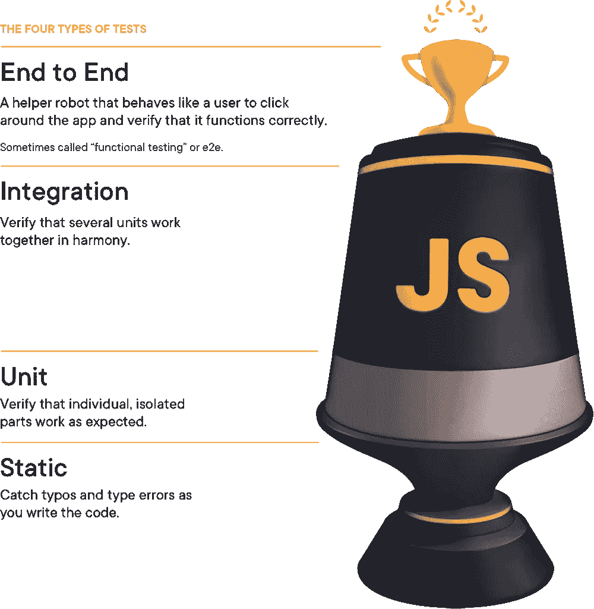

# 前端的实用测试策略

> 原文：<https://itnext.io/the-practical-testing-strategy-of-frontend-dd3c93027739?source=collection_archive---------2----------------------->


每个人都知道编写测试非常重要，因为从长远来看，它可以加速开发。在任何应用程序中，你都会面临一个突破性的变化。没有测试，你唯一能做的就是害怕。

最近，因为前端测试工具已经成熟，你也可以在前端编写合适的测试。然而，我遇到许多人放弃在前端编写测试，因为它只是耗费时间。

因此，本文总结了我的总体测试策略，并解释了每个测试的细节。

# 4 层测试

首先，我的策略受到 Kent C.Dodds 的[测试奖杯](https://testingjavascript.com/)的强烈影响，我从中学到了很多，并安排了我的项目。

正如测试奖杯介绍，有如下 4 层前端测试。



ref:[https://kentcdodds . com/blog/the-testing-trophy-and-testing-classifications](https://kentcdodds.com/blog/the-testing-trophy-and-testing-classifications)

一般来说，你挑的越高，成本就越高。这意味着仅仅编写 E2E 测试是不实际的。因此，您必须将一些测试角色委派给适当的测试层。

然而，许多软件工程师刚刚开始编写测试。它导致了你的测试彼此相似的情况。例如，即使单元测试对按钮文本进行测试，E2E 和集成测试也会测试按钮文本。

在这种情况下，很自然地会认为编写测试很耗时，因为您编写了很多类似的测试，而且这不会增加可靠性。

这就是为什么测试策略对于前端来说超级重要。具体来说，你必须明确每一层的测试角色。如果你明确了每一层应该测试什么，你甚至可以在前端编写更有效的测试。

# 测试策略

正如我上面所说的，测试策略意味着明确在每一层测试中应该测试什么。这里，我使用一个电子商务应用程序作为例子。

## E2E

*   应该测试什么？？

它测试通常依赖于多个页面的关键用户场景。例如，用户应该添加一件 t 恤到购物车并购买它。这一层不关心您的应用程序是如何实现的。

*   哪些是不应该测试的？？

有两件事。第一个是你不应该测试外表。例如，您不应该检查产品列表页面中的表头文本，因为在单元测试中编写可视化测试更有效。

此外，您不应该测试不重要的逻辑分支。比如不要写`without a stock, T-Shirt should not be added to a shopping cart`这样的测试。

我知道你想说什么。上面的场景仍然很关键，不是吗？在这里，`critical`确实是取决于一个团队和阶段的应用。如果应用程序还不成熟，需要更快的速度，我会在集成测试中测试这个逻辑分支。但这应该在你的团队中讨论。

## 综合

*   应该测试什么？？

它测试容器组件的用户场景。因为容器组件是依赖注入层，有很多逻辑，这是一个很好的集成测试点。

与 E2E 测试不同，集成测试应该覆盖逻辑分支。这里的逻辑分支主要指来自 API 请求结果和状态管理(比如 redux 和 vuex)。

让我们考虑付款方式。我肯定会用 API 请求的成功和失败模式来编写测试。所以 API 应该在集成测试中被嘲笑。此外，我会编写类似于`should not submit payment with validation errors`的测试。对于这种测试，您应该提前模拟验证错误状态。

请阅读[表示和容器组件模式](https://medium.com/@dan_abramov/smart-and-dumb-components-7ca2f9a7c7d0)并在你不知道的情况下使用它。

*   哪些是不应该测试的？？

集成测试不应该覆盖表象的东西。所以它不应该测试视觉上的东西，因为容器组件对外观没有责任。

如果你在不同文件中分离钩子逻辑，我建议不要在钩子中测试逻辑。例如，如果你有如下的钩子，你不应该测试`someConditionA false`模式，因为它应该包含在钩子单元测试中。

```
// hooks.tsconst useForm = () => {
  const handleSubmit = useCallback((product) => {
    if(someConditionA){
      dispatch(callAPI({}))
    }
  })
}
```

## 单位

*   应该测试什么？？

它测试每个模块。因为模块类型实际上取决于应用程序，所以我分享我的基本单元测试。

1.  表象成分
    有 2 种测试。首先，用通过的道具出场。它包括固定文本测试。所以它可能看起来像`should show product table`。其次，I 测试回调应该设置在适当的地方。所以它看起来像`should fire handleChange when submit button is clicked`。
    在这一层应该嘲讽所有的道具，但是子组件不应该被嘲讽。
2.  钩子
    钩子表示容器组件中使用的实际逻辑块。如果用 Vue，和 composition API 差不多。所以请把这一节当做 composition API 来读。
    测试逻辑。如果你有`if`条件，你应该在钩子层测试。如果您将`useEffect`与 React 一起使用，您应该测试回调何时被触发以及发生了什么。
3.  Redux logics(如果有)
    我用 reducer，selector，thunk 写一个测试。
4.  其他实用逻辑

## 静态

这一层应该用 TypeScript 和 ESLint 实现自动化。所以您应该做的只是检查 CI 中的类型错误和 lint 错误。如果你想签入提交，你可以引入像 husky 这样的工具。

本文介绍了前端的实用测试策略。为了解释，我首先解释了测试的种类。之后，它明确了每一个类别中应该测试什么样的东西。

# 参考

*   了解测试任何 JavaScript 应用程序的智能、高效的方法。
*   [表象和容器组件](https://medium.com/@dan_abramov/smart-and-dumb-components-7ca2f9a7c7d0)