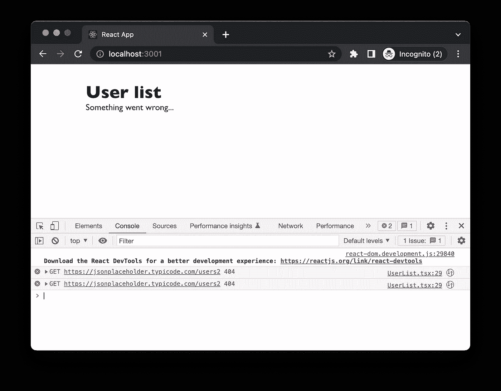

# 反应式网络编程实用指南

> 原文：<https://itnext.io/the-pragmatic-guide-to-react-network-programming-c6f9de9962ed?source=collection_archive---------2----------------------->


[Robynne Hu](https://unsplash.com/es/@robynnexy?utm_source=medium&utm_medium=referral) 在 [Unsplash](https://unsplash.com?utm_source=medium&utm_medium=referral) 上拍摄的照片

在本文中，我想分享一些实用的技巧来编写更好的涉及网络请求的 React 应用程序，比如每个 React 应用程序。我将从我们作为开发人员在处理网络请求时所面临的挑战开始，并尝试将这些挑战从 React 构建视图中分离出来，将这个怪物封装到一个笼子(一个钩子)中，最后使用`react-query`进行简化。

最后，您应该能够构建一个相当健壮和有组织的组件，并支持更容易测试和维护的功能。

我们将要构建的应用程序是一个简单的用户列表。正如您所想象的，实现它很简单:用一个`useEffect`钩子从 remote 获取数据，并在获取后呈现列表。


用于演示的用户列表应用程序

# 使用简易获取 API

让我们将这个简单的应用程序分解成几个步骤，这样我就可以很容易地揭示 React 中网络编程的所有“阴暗面”。

# 快乐之路

在 React 中从服务器端获取远程数据并不是非常困难。使用带有资源的正确 URL 的`fetch`,将数据转换成 JSON，就可以开始了。

```
const [users, setUsers] = useState<User[]>([])

useEffect(() => {
  const fetchUsers = () => {
    fetch('https://jsonplaceholder.typicode.com/users')
      .then((response) => response.json())
      .then((data) => setUsers(data));
  }
  fetchUsers();
}, []);
```

但这只是整个故事的一小部分。通常，您将需要较慢请求的加载状态，以改善用户体验。

# 装载指示器

稍微改变一下，还是可以的。在网络请求开始时，您可以将加载指示器设置为`true`，并在返回数据后将其重置。您可以使用该标志来呈现一个微调器，让用户知道正在发生的事情。

```
const [users, setUsers] = useState<User[]>([])
const [loading, setLoading] = useState<boolean>(false);

useEffect(() => {
  const fetchUsers = () => {
    setLoading(true);
    fetch('https://jsonplaceholder.typicode.com/users')
      .then((response) => response.json())
      .then((data) => {
        setLoading(false);
        setUsers(data)
      });
  }
  fetchUsers();
}, []);
if(loading) {
  return <Spinner />
}
```

当你有数据的时候，你可以做常规的渲染。

# 事情并不总是像预期的那样进行。

在现实世界中，事情会出错(或者至少不是你期望的那样)。网络问题、认证失败、会话过期、有效载荷中的数据不正确、地震、洪水以及谁知道呢。

您最不希望看到的就是一个错误毁掉整个应用程序。这就是为什么你需要错误处理，当它发生时，你需要让用户知道(或者重试几次)

```
const [loading, setLoading] = useState<boolean>(false);
const [error, setError] = useState<string>('');

useEffect(() => {
  const fetchUsers = () => {
    setLoading(true);
    fetch('https://jsonplaceholder.typicode.com/users2')
      .then((response) => {
        if (response.status >= 200 && response.status <= 299) {
          return response.json();
        } else {
          setLoading(false);
          throw Error(response.statusText);
        }
      })
      .then((data) => {
        setLoading(false);
        setUsers(data)
      })
      .catch((e) => {
        setLoading(false);
        setError(e);
      });
  }
  fetchUsers();
}, []);

if(error) {
  return <ErrorMessage />
}
```

还是那句话，一点点改变，就能达到预期。这里唯一的问题是，默认情况下，`fetch`不会将`4xx`或`5xx`视为错误，所以我们需要检查状态并有条件地抛出。



出错时抛出一个错误

你当然可以使用其他像`axios`这样的库来减轻一点痛苦。

```
useEffect(() => {
  const fetchUsers = () => {
    setLoading(true);

    axios.get('https://jsonplaceholder.typicode.com/users')
      .then((response: AxiosResponse<User[]>) => {
        setLoading(false);
        setUsers(response.data)
      }).catch((e) => {
        setLoading(false);
        setError(e);
    })
  }
  fetchUsers();
}, []);
```

当前代码运行良好。但是当我读这些代码的时候，我觉得它们很分散我的注意力。这里正在进行许多事情，我们在其他网络请求中也需要这些类似的代码。在现实世界的应用程序中，这仍然是一个非常简化的生产代码版本。

例如，我们遗漏了一些非常标准的东西:

*   当临时错误发生时重试(比如不稳定的网络，我们至少应该重试几次)
*   定期轮询某些检查请求(如运行状况检查或状态检查请求)。
*   取消不需要的请求，或者再次启动相同的请求。

# 让我们再试一次。

实现重试很容易出错，因为还有很多状态需要处理。例如，我们可以添加一个实例状态`retryCount`，并在重新发送网络请求之前每秒增加一次。我们通常会逐渐增加重试时间跨度，以确保远程恢复。

```
const retryCount = useRef<number>(0);

useEffect(() => {
    //... fetchUsers
  const intervalId = setInterval(() => {
    if(error === null) {
      fetchUsers();
      clearInterval(intervalId);
    } else if (retryCount.current < 3) {
      retryCount.current = retryCount.current + 1;
      fetchUsers();
    } else {
      clearInterval(intervalId);
    }
  }, 1000);

  return () => {
    clearInterval(intervalId);
  }
}, [error]);
```

为了调整间隔时间跨度，我们将不得不引入更多的状态，这可能会使代码更加难以阅读。一般的事实是，文件越长，错误就越容易潜入。( ***注:上面的代码其实是有 bug 的，所以不要在你的制作中使用*** )

我假设您已经意识到了当前实现的“丑陋”。那么，我们如何解决这个难以维护的问题呢？一种方法是将整个`useEffect`块提取到一个单独的钩子中，并在那里做所有疯狂的事情。

# 一些清理和重构

# 将效果代码提取到一个钩子中

通过简单地将状态和`useEffect`部分的代码复制到一个单独的函数`useFetchUsers`中，我们就有了管理所有网络相关逻辑的新钩子:

```
const useFetchUsers = () => {
  const [users, setUsers] = useState<User[] | undefined>([])
  const [loading, setLoading] = useState<boolean>(false);
  const [error, setError] = useState<string | null>(null);

  const retryCount = useRef<number>(0);

  useEffect(() => {
    const fetchUsers = () => {
        //...
    }
    const intervalId = setInterval(() => {
        //...
    }, 1000);

    return () => {
      clearInterval(intervalId);
    }
  }, [error]);

  return {
    users,
    loading,
    error
  }
}
```

我们甚至可以在`fetchUsers`中拆分这里的逻辑。它目前做两件事:发送网络请求和设置本地状态。我们可以定义一个只关注网络的函数，包括设置 HTTP 头、网络超时和认证等。

```
const fetchUsers = async (): Promise<User[] | undefined> => {
  try {
    const response = await axios.get('https://jsonplaceholder.typicode.com/users');
    return (response.data as User[]);
  } catch (e) {
    new Error('fetch users data error')
  }
}
```

我们原始组件中的代码可以简化为:

```
export const UserList = () => {
  const {loading, error, users} = useFetchUsers();

  if(loading) {
    return <Spinner />
  }

  if(error) {
    return <ErrorMessage />
  }

  return (<div>
    {//...}
  </div>)
}
```

现在看起来好多了。钩子提供数据和不同的状态，而视图负责呈现数据(具有不同的用户界面状态)。

本质上，我们有三个部分负责应用程序的三个不同方面:

1.  呈现数据的列表视图(快乐路径)，以及`loading`和`error`状态
2.  一个钩子，它安排应用程序的所有状态，并在必要时重试逻辑
3.  一个处理网络相关工作的 fetch 函数:设置 HTTP 头，定义超时等。

通过这种关注点的分离，仍然有改进的空间。尤其是网络状态管理。

# 更进一步

我想在这个阶段，您已经意识到与网络相关的代码有多复杂(再说一遍，这只是故事的一部分)。幸运的是，我们有来自`tanstack`的`react-query`，可以更容易地简化整个过程。

```
yarn add @tanstack/react-query --save
```

要使用`react-query`，您需要将您的应用程序包装到一个`Provider`中，这样所有的子节点都可以访问查询客户端。`react-query`提供了许多有用的钩子，可以大大简化逻辑。

在我们的`useFetchUsers`钩子中，带有`react-query`的代码如下:

```
import { useQuery } from "@tanstack/react-query";

const useFetchUsers = () => {
  const {
    isLoading: loading,
    error,
    data: users,
  } = useQuery(["fetchUsers"], fetchUsers, { retry: 3 });

  return {
    users,
    loading,
    error,
  };
};
```

就是这样。所有的状态现在都由`react-query`自己管理，还有重试逻辑、缓存、数据过时时自动重新获取等等。

这两个代码片段的直观比较

因此，您使用三个参数调用`useQuery` hook:查询键的作用类似于查询的 id，因此您可以在其他地方引用它(例如，取消它，或者如果它是一个变异，则评估缓存)。第二个参数是返回承诺或错误的函数。和一个可选的 options 对象，您可以定义出错时想要重试的次数、每次重试之间的延迟以及许多其他事情。

注意这里用`react-query`，你可以替换`fetchUsers`函数，它用一个不起眼的`fetch`调用发出底层网络请求。

使用`react-query`还有很多其他好处，我从主页上摘录几个。

[](https://tanstack.com/query/v4/docs/overview) [## 概览|转移查询文档

### React Query 经常被描述为 React 缺少的数据获取库，但是用更专业的术语来说，它使得……

tanstack.com](https://tanstack.com/query/v4/docs/overview) 

`react-query`的特性我就不多讨论了。相反，我更想强调关注点的分离。正如您所看到的，我们如何将内容提取到不同的位置，这使得切换非常简单。如果您在编写 React 代码或进行重构时总是考虑到这一点，将会有所帮助。

# 摘要

与网络打交道并不容易。必须考虑许多事情:协议、报头、缓存、超时、出错时重试以及管理不同的状态。`react-query`可以让开发人员的生活轻松一点。最重要的是，您仍然需要将这些挑战与视图和底层网络客户端(或者是`fetch`或者是`axios`客户端)隔离开来。

**如果你喜欢阅读，请** [**报名参加我的邮件列表**](https://icodeit.com.au/#subscribe) **。我每周通过** [**博客**](https://juntao-qiu.medium.com/)**[**书籍**](https://leanpub.com/u/juntao) **和** [**视频**](https://www.youtube.com/@icodeit.juntao) **分享干净代码和重构技术。****