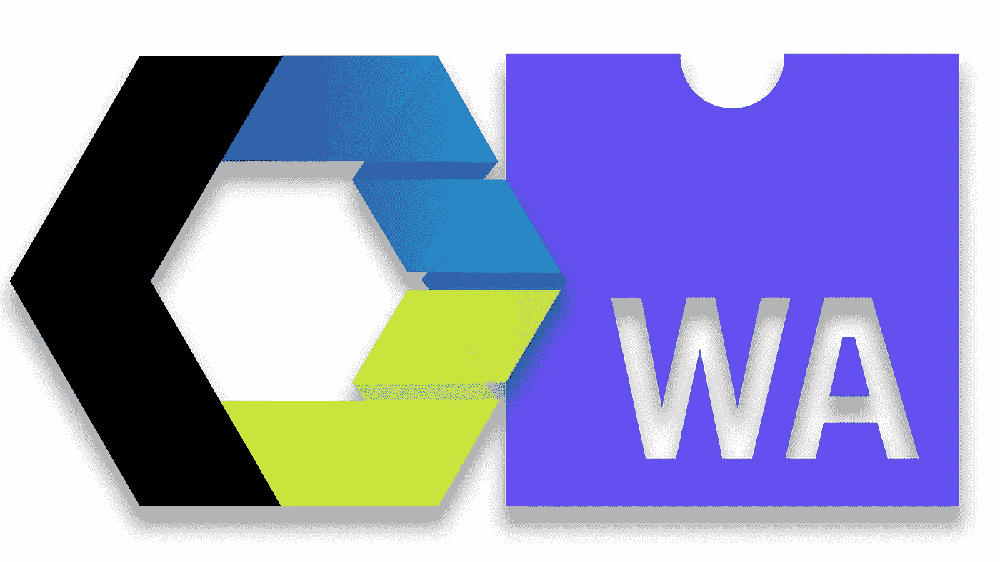

# WebComponents 和 WebAssembly 的承诺

> 原文：<https://itnext.io/the-promise-of-webcomponents-webassembly-ad26af56fcf1?source=collection_archive---------4----------------------->



WebComponents 和 WebAssembly

> [点击这里在 LinkedIn 上分享这篇文章](/the-promise-of-webcomponents-webassembly-ad26af56fcf1?utm_source=medium_sharelink&utm_medium=social&utm_campaign=buffer)

# 变化的迹象

尽管我们中的许多人会同意将 **Javascript 疲劳**称为一种真正的疾病，但 web 平台似乎是唯一一个在全球范围内成功管理系统设计的复杂性、灵活性和稳定性之间的挑战的环境。在撰写本文时，节点包管理器(npm)为开发人员社区提供了 650，000 个可重用 javascript 代码的构建块。这些块有各种大小和形状，如小函数、库或完全成熟的框架。虽然这种数字生态系统带来了挑战，但开发人员正在习惯于与这样一种具有可塑性和非常丰富的物质一起工作。但是如果这个规模只是冰山一角呢…

我总是对 web 平台的每一个新标准为开发者提供的未来感到兴奋，但是我相信对 **WebComponents** 和 **WebAssembly** 的整体分析尤其能够揭示出总的趋势，这将在不久的将来使 web 成为一个非常不同的地方。本文的目的是推测这种未来，并想象当这两种技术的**承诺**实现时，web 开发人员的生活将会发生怎样的变化。

简而言之，这两个标准都具有足够的革命性，都值得拥有一本像样的书。**无框架 web 组件**具有重塑和简化应用程序设计的潜力，就像 npm 包帮助许多开发人员解决日常问题一样，从普通的日期转换到复杂的机器学习计算。**language less web assembly**作为编译目标提供了新的表达水平和速度，这在浏览器或任何其他 web 堆栈上都是前所未有的。尽管目前这些想法是新鲜的，仍然缺乏采纳，但它们都将推动彼此的进步。

# web 组件重要性

大约 4 年前，许多 Javascript 框架，比如 Angular 和 React，在构造 UI 代码时选择使用组件作为主要单元。这种模式有助于理解日益复杂的单页面应用程序。大约在那个时候，W3C 开始致力于一个叫做 [WebComponents](https://www.w3.org/standards/techs/components#w3c_all) 的新标准。随着聚合物和模板等库在 2017 年的兴起，我们开始看到这项技术的一些真正力量。突然之间，开发人员能够将他们的时间投入到框架无关的方式中，为他们的应用程序构建可重用的 UI 部件。无论你现在用什么，是 Angular，React 还是 Vue——每个人都可以适应这种模式。它一步一步地通过现有项目的许多层消除摩擦。Ionic 等公司已经能够通过为网站制作类似于原生 iOS 和 Android 控件的高质量元素库来获利。你可以在下面的视频中找到他们的故事:

目前，WebComponents.org T2 T3 提供了大约 1000 种不同的 ui 构建模块，可以在世界各地的项目中集成和重用。这个数字注定会增长，并扩展到许多高质量的控件、UI 元素或成熟的应用程序，这些应用程序可以轻松地与宿主应用程序进行互操作。HTML 和 CSS 在孤立的 web 组件中成为 UX 设计的通用语言，这将使 web 平台和应用程序与本地操作系统解决方案相比更具竞争力。但是，尽管 WebComponent 模式很好地解决了我们在项目中面临的架构问题，但与本地应用程序相比，web 平台到目前为止仍然缺乏基本性能问题的答案。这就是 WebAssembly 要走的路…就像一条大的路…非常大的路…

# Wasm

如果明天您将在开发人员工具窗口中单步执行代码，当出现如下所示的代码时，请不要惊慌:

```
(module
  (func (param $lhs i32) (param $rhs i32) (result i32)
    get_local $lhs
    get_local $rhs
    i32.add))
```

你可能碰到过这样的库，它决定优化它的代码，使其工作得更快，体积更小。这个库被编译成 WebAssembly(简称为 **wasm** ),并作为常规静态 javascript 文件提供给浏览器。即使 wasm 编译成二进制格式，当使用[转换工具](http://webassembly.org/getting-started/advanced-tools/)时，我们仍然可以使它对人类可读。如果上面的代码对你来说完全陌生——去 MDN 网站查看更多信息[“理解 Webassembly 文本格式”](https://developer.mozilla.org/en-US/docs/WebAssembly/Understanding_the_text_format)。还要查看 g [ithub WebAssembly 库](https://github.com/WebAssembly/design/blob/master/BinaryEncoding.md)以了解更多关于 wasm 的二进制编码。如果这还不够，看看杰伊·菲尔普斯的视频:

到目前为止，当谈到浏览器的语言选择时，Javascript 是唯一的障碍。像 Java 这样的其他语言也尝试过，但是在单独的 VM 中运行时，却没有成功。尽管 Javascript 是一种优秀的、富于表现力的、非常动态的语言，但它在性能、静态类型和大小方面也有不足之处。[Webassembly.org](http://webassembly.org/)向 Wasm 提供了这个定义:

> WebAssembly(缩写为 *Wasm* )是一种基于堆栈的虚拟机的二进制指令格式。Wasm 被设计为 C/C++/Rust 等高级语言编译的可移植目标，支持客户端和服务器应用程序在 web 上的部署。

这意味着像 C#、TurboScript、Elm 等语言将提供 wasm 作为编译目标。这是斯科特·汉瑟曼的一篇名为[的好文章。NET 和 WebAssembly 是前端的未来，他说 WebAssembly 将会继续存在。而。NET 绝对不是前端的唯一未来，对于那些喜欢用 C#、VB 甚至 F#编写全栈应用程序的人来说，它是一个很好的选择…](https://www.hanselman.com/blog/NETAndWebAssemblyIsThisTheFutureOfTheFrontend.aspx)

# “巴别塔”正在倒塌

不管你喜不喜欢，这个新标准将会引起网络语言的爆炸。这并不是说 Javascript 将被淘汰，这只是意味着在不久的将来我们将有更多的选择。从事通用库和框架工作的开发人员将从中受益，因为他们能够将更多的特性打包到相同大小的包中。这种模块的用户将受益，因为他们的基础设施将变得轻量级，并有望优化运行速度。

浏览器世界对新语言的需求已经存在了一段时间。在过去的三年里，我们看到了 Javascript 超集的爆炸式增长，比如 [Typescript](http://www.typescriptlang.org/) 、 [Reason M](https://reasonml.github.io/) L 或者 [Elm](http://elm-lang.org/) 。这些语言都承诺改善 Javascript 代码的可伸缩性、开发者体验和稳定性。前端和后端社区都非常积极地接受 WebAssembly，从而将这些目标提升到更高的水平，这并不奇怪。

# 但是革命在哪里？

虽然这真的很令人兴奋，但在网络上使用任何语言的自由并没有真正使 WebAssembly 成为该平台的杀手级功能。以接近本地速度执行代码将会改变我们网站的外观。历史上第一次，浏览器将能够在性能上与本地操作系统竞争。WebAssembly 将实现一致的多线程模型。如果你认为 webworkers 是一种进步，那就等着用运行在 threadripping 处理器上的客户机或者其他人类未来的奇迹发明弄脏你的手吧。

随着基本客户端性能限制的消除，Pandoras 的盒子打开了——游戏、光线跟踪和物理引擎、3D CAD 应用程序、严肃的模拟库将最终能够进入浏览器空间。这也有可能复兴虚拟现实和增强现实在网络上的应用。这里是[史诗禅宗花园演示](https://s3.amazonaws.com/mozilla-games/ZenGarden/EpicZenGarden.html)的链接，你可以从中获得灵感。别忘了，这是真正的游戏般的互动体验，而不是预先渲染的电影播放。查看 Luke Wagner 撰写的这篇 [IEEE Spectrum 文章](https://spectrum.ieee.org/computing/software/webassembly-will-finally-let-you-run-highperformance-applications-in-your-browser)，了解 wasm 即将推出的高性能应用的更多详情。如果这还不够——这有望以类似的方式影响 IOT 世界，如果不是更严重的话。Node 8 LTS 及其 V8 引擎和微软的 ChakraCore 也已经支持 wasm。更多信息请看来自[本恩·史密斯](https://twitter.com/binjimint?lang=en)的视频:

当然，仍然存在挑战，WebAssembly 中缺少许多实用的东西，如垃圾收集或异常处理。你可以在这里找到[后 MVP 特性列表](http://webassembly.org/docs/future-features/)。此外，如果你感兴趣的话，你可以查看这篇博客文章，了解来自新堆栈的关于这项技术的精彩[摘要。也有人担心通过 WebAssembly 运行的专有二进制代码会使其他人的代码难以阅读。但是 1.0 版本已经发布，并且所有主要的浏览器供应商都同意这个规范，这一事实表明，我们在未来几年将享受到的所有乐趣现在已经没有回头路了。](https://thenewstack.io/ready-web-assembly-revolution/)

# 这一切给我们留下了什么…

那么，WebComponents 与 WebAssembly 有什么关系，它们将如何进一步推动应用呢？这两个标准都为前端堆栈提供了一个模块化的抽象层。想象一下，将在 VR 中的 WebGL 上呈现 CAD 内容的 WebComponents 与 wasm 中针对多线程模拟进行优化的 WebComponents 以及旨在通过 WebComponents 创建独特 UI 控件的 WebComponents 结合起来……通过 web components……周而复始。

这种运行 wasm 代码的快速互联 web 组件的模块化系统将在不久的将来驱动 web 开发的未来。管理这些组件之间的信息流仍将是一个挑战，但有了像 [Redux](https://redux.js.org/) 和 [Apollo GraphQL](https://www.apollographql.com/) 这样的库，我们正在寻找解决方案。将这一点与用静态类型语言编写前端代码的可能性结合起来，web 平台将突然变得非常活跃。在这种情况下，650，000 个 npm 包看起来确实是一个非常不起眼的开始。

总的来说，单单这些新标准就可能会让 javascript 变得乏味，但这是件好事。我们做得越快，就越早享受到这些标准带来的新的可能性。同时，webpack 现在用 [wasm-loader](https://github.com/ballercat/wasm-loader) 支持 WebAssembly，只需几个右边的[poly fill](https://github.com/webcomponents/webcomponentsjs)我们就可以让 WebComponents 在我们的网站上工作。所以，让我们享受和创新未来。