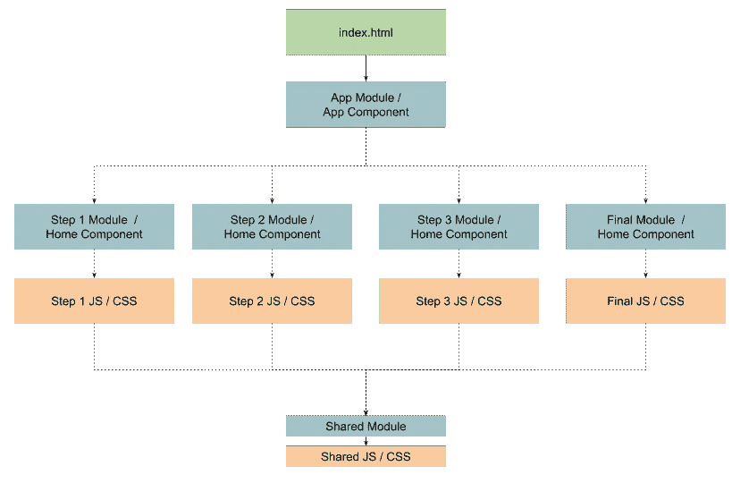
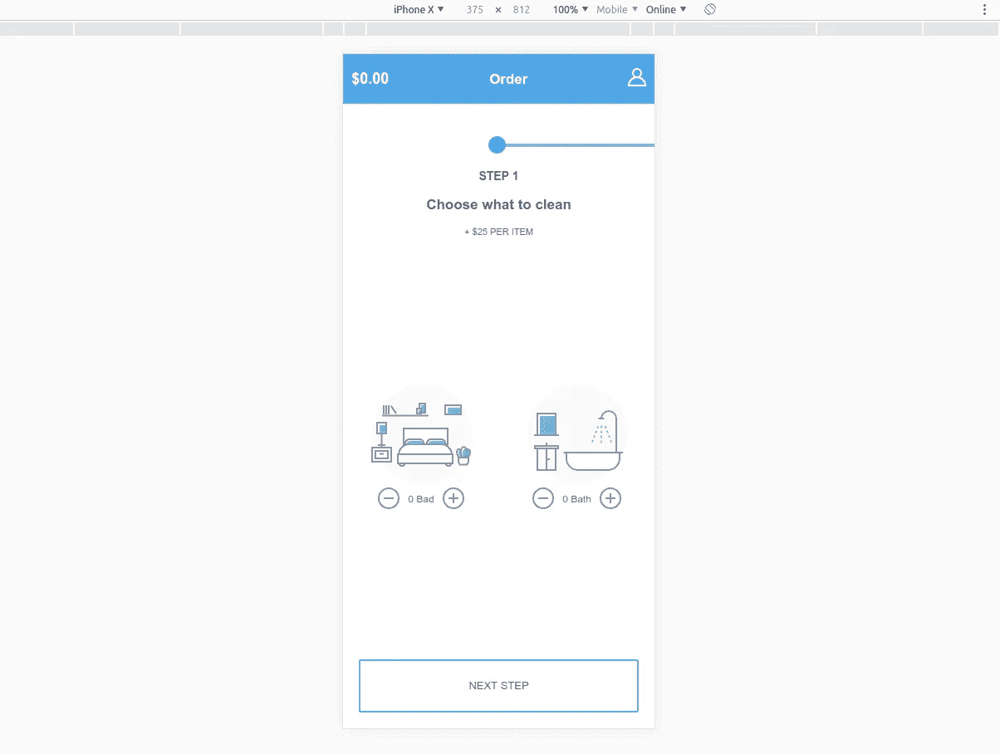
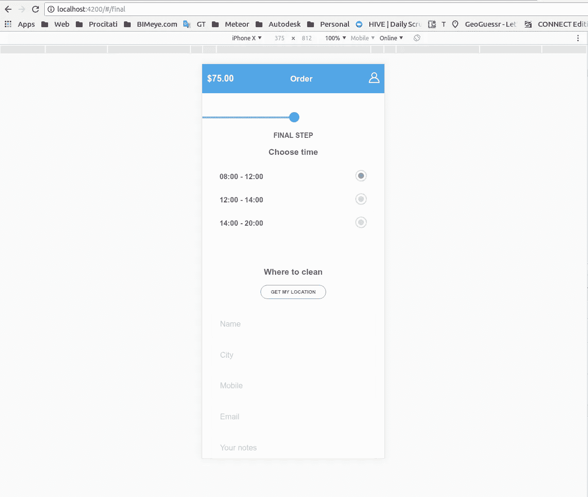
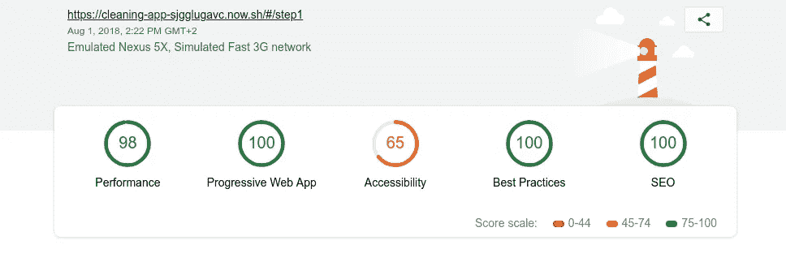

# 使用 Angular 6+的渐进式 Web 应用程序的 PRPL 模式

> 原文：<https://itnext.io/the-prpl-pattern-for-progressive-web-applications-using-angular-6-f7237b7dc2a7?source=collection_archive---------4----------------------->


[www.savingcontent.com](http://www.savingcontent.com)

PRPL 模式是一种用于构建现代渐进式 web 应用程序的新技术。

**它的意思是服务于一个客户端(CSS，JS 和其他静态资产)只有什么将被客户端在当前请求的页面上使用。在此基础上，资源将被缓存。**

*   它提高了应用程序的启动速度
*   不要在不必要的编译未使用的 JS 上花费时间
*   更快地与应用程序进行初始交互
*   减少服务器和客户端之间的字节交换

PRPL 代表:

*   **推送**初始 URL 路由的关键资源
*   **渲染**初始路线
*   **预缓存**剩余路线
*   **延迟加载**并按需创建剩余路线

*更多详情:*

*   [*https://developers . Google . com/web/fundamentals/performance/prpl-pattern/*](https://developers.google.com/web/fundamentals/performance/prpl-pattern/)
*   [*https://developers . Google . com/web/progressive-we b-apps/check list*](https://developers.google.com/web/progressive-web-apps/checklist)

# 有角的

由于 [Angular framework](https://angular.io) 包含了所有必要的部分，我们将构建一个使用该模式的简单应用程序。

我们将使用的角度特征有:

*   服务人员
*   惰性装载
*   使用 angular-cli 构建和捆绑

# 应用

我们将建立一个仅移动清洁应用程序(订单清洁服务)。我们借用的素描来自:[www.sketchappsources.com](https://www.sketchappsources.com/free-source/1955-cleaning-app-order-flow-sketch-freebie-resource.html)

草图已经由 [Max Khomenko](https://www.behance.net/maxkhomenko) 完成

我们将使用 [Figma](https://www.figma.com) 加载 Sketch 并导出必要的资产:[https://www . fig ma . com/file/vdyf 2 hyyzftpfmb 7 fxzgpc 0v/Cleaning-App](https://www.figma.com/file/VdyF2hYyzFtpFmb7fXzGPc0v/Cleaning-App)

## 图书馆和技术

出于尺寸和性能的考虑，我们不会使用任何 UI 库或任何第三方组件。

*   我们将把 [normalize.css](https://necolas.github.io/normalize.css/8.0.0/normalize.css) 的内容复制到我们的 main style.css 中
*   我们将使用 Flex 作为元素定位的方法。

我不会在本教程中详细讨论如何编写 HTML、CSS 和 TypeScript，所有这些都可以在本文末尾的 GitHub 链接中找到。

## 结构

应用程序结构将如下图所示:



## 拔靴带

使用(*创建一个新的 Angular 应用程序在此之前，我们需要安装*[*@ Angular/CLI*](http://twitter.com/angular/cli)*@ 6 . 0 . 8 版本，因为在最新版本 6.1.1 中*[*@ Angular/pwa*](http://twitter.com/angular/pwa)*模块*):

```
ng new **cleaning-app** --routing -p capp --skip-git && cd cleaning-app
```

然后，我们将使用(*将 PWA 工具添加到我们的应用程序中。至于 angular-cli，我们将安装该模块的 0.6.8 版本，因为在最新版本中有一个 bug* 。):

```
ng add [@angular/pwa](http://twitter.com/angular/pwa)@0.6.8 --project **cleaning-app**
```

在添加这个库的过程中，我们将在我们的存储库中获得几个文件。我们需要改变其中的一些。

我们生成了一个图标，并替换了 src/assets/icons 中的默认图标。
我们在 src/manifest.json 中做了一些改动(name、short_name 和 theme_color 与我们的 app 匹配)。最后看起来是这样的:

```
{
  **"name"**: **"Cleaning Service"**,
  **"short_name"**: **"CA"**,
  **"theme_color"**: **"#48b3e2"**,
  **"background_color"**: **"#fafafa"**,
  **"display"**: **"standalone"**,
  **"scope"**: **"/"**,
  **"start_url"**: **"index.html"**,
  **"icons"**: [...]
}
```

## 模块

然后，我们将在应用程序中添加五个模块:

```
ng generate module Step1 --routing
ng generate module Step2 --routing
ng generate module Step3 --routing
ng generate module Final --routing
ng generate module Shared
```

## 按指定路线发送

我们将延迟加载所有模块:

```
**import** { NgModule } **from '@angular/core'**;
**import** { Routes, RouterModule } **from '@angular/router'**;

**const** routes: Routes = [
  {
    **path**: **''**,
    **pathMatch**: **'full'**,
    **redirectTo**: **'step1'** },
  {
    **path**: **'step1'**,
    **loadChildren**: **'src/app/step1/step1.module#Step1Module'** },
  {
    **path**: **'step2'**,
    **loadChildren**: **'src/app/step2/step2.module#Step2Module'** },
  {
    **path**: **'step3'**,
    **loadChildren**: **'src/app/step3/step3.module#Step3Module'** },
  {
    **path**: **'final'**,
    **loadChildren**: **'src/app/final/final.module#FinalModule'** }
];

@NgModule({
  **imports**: [RouterModule.*forRoot*(routes, { **useHash**: **true** })],
  **exports**: [RouterModule]
})
**export class** AppRoutingModule { }
```

## 状态

我们可以从应用程序草图中确定一种可能的状态。我们的应用程序只有一个流，因此我们将只使用一个服务和一个模型。

我们需要一个服务来保持应用程序的状态(选定的选项)。这将通过提供服务来实现。

```
ng generate service shared/services/Offer
```

我们还将创建报价模型

```
ng generate class shared/services/Offer --type model
```

具备所有必要的属性。

```
**export class** Offer {
  **total** = 0;
  **beds** = 0;
  **baths** = 0;
  **windows**: **boolean**;
  **ironing**: **boolean**;
  **fridge**: **boolean**;
  **oven**: **boolean**;
  **when**: Date;
  **time**: **string**;
  **location**: **string**;
  **name**: **string**;
  **city**: **string**;
  **mobile**: **string**;
  **email**: **string**;
  **notes**: **string**;
  **waitingAtHome**: **boolean**;
  **keysAndSecurity**: **boolean**;
  **keyUnderDoormat**: **boolean**;
}
```

重要的是，我们可以在流程结束后转储完整状态。

在 [offer.service.ts](https://github.com/vladotesanovic/cleaning-app/blob/master/src/app/shared/services/offer.service.ts) 中，我们为 offer 属性创建了所有必要的 set 和 unset 方法。

## 共享的

顾名思义，共享模块将包含共享组件

正如我们在应用程序草图中指出的，我们将有四个共享组件:标题、输入、按钮和步骤组件。我们将在共享模块中创建它们:

```
ng generate component shared/components/Header -c 'OnPush' --module shared/shared.module.ts --exportng generate component shared/components/Input -c 'OnPush' --module shared/shared.module.ts --exportng generate component shared/components/Button -c 'OnPush' --module shared/shared.module.ts --exportng generate component shared/components/Step -c 'OnPush' --module shared/shared.module.ts --export
```

用 OnPush 标记组件意味着这个组件是一个哑组件，只有在输入发生变化时才会触发变化检测。

## 第一步

我们需要为每一步准备一个初始组件，我们称之为 Home。

```
ng generate component step1/components/Home --module step1/step1.module.ts
```

我们可以在 app sketch 上注意到，我们有一个重复的组件(减少和增加按钮)，因此我们将在步骤 1 模块中创建它。

```
ng generate component step1/components/controls --module step1/step1.module.ts -c 'OnPush'
```

所有不在下面的组件都应该是哑组件，并标上 OnPush。

我们第一步的最终设计如下:



## 第二步

同样，我们正在为此模块创建一个 home 组件。

```
ng generate component step2/components/Home --module step2/step2.module.ts
```

在添加了提供服务所需的所有方法和带有 CSS 的 HTML 之后，我们的组件看起来像这样:


## 第三步

对于第 2 步，我们为这个模块创建一个 home 组件。

```
ng generate component step3/components/Home --module step3/step3.module.ts
```

在放置了所有必要的样式后，它现在看起来像这样:


## 最后一步

同样，从以上所有我们正在创建一个家庭组件。

```
ng generate component final/components/Home --module final/final.module.ts
```

我们在此页面上标识了选项组件，我们将使用以下内容创建它:

```
ng generate component final/components/option --module final/final.module.ts -c 'OnPush'
```

在样式化和导入了所有必要的组件之后，它看起来像是:



## 压缩

因为 angular-cli 不能开箱即用地对 JS 和 CSS 文件进行 gzip 压缩，所以我们将使用 gulp 脚本来实现这一点，我们将在 ng build 命令之后触发该脚本。

## 脱机的

应用程序在脱机模式下工作，但是没有为此编写业务逻辑(例如，在本地存储中聚合订单)。

## Lighthouse 的性能和测试

我们的目标是在第一秒为我们的客户提供 html，我们已经实现了，正如你在 Lighthouse 页面上看到的。



你可能已经注意到了，我们在可访问性方面有一些问题(标题的颜色和缩放选项)，但这是由于应用程序的设计，我现在不想改变这一点。

## 存储库和演示

演示 app 用 **now.sh 部署(而且要用手机打开)**:[https://cleaning-app-sjgglugavc . now . sh](https://cleaning-app-sjgglugavc.now.sh)

所有源代码都可以在 GitHub 上找到:【https://github.com/vladotesanovic/cleaning-app 

## 结束语

如果有人有兴趣完成(赞助)和商业化这个应用程序，请让我知道。也许我们可以从中创造一些好的东西。:)