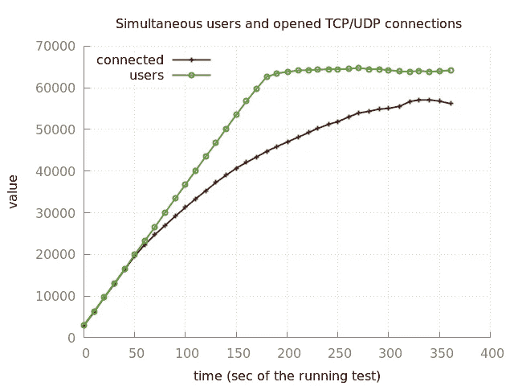

# PHP WebSockets 的现实

> 原文：<https://itnext.io/the-reality-of-php-websockets-4c680bc2bc60?source=collection_archive---------0----------------------->

## 一旦进入循环，就永远不要离开循环

照片由[卡尔文·汉森](https://unsplash.com/@calvinhanson?utm_source=medium&utm_medium=referral)在 [Unsplash](https://unsplash.com?utm_source=medium&utm_medium=referral) 拍摄

我不得不违背自己意愿实现的一件事是一个 Websocket 服务器…用 PHP 实现。你没听错。

当语言和运行时本身的本质是单线程的，或者你可以说是“阻塞”的时候，我总是强烈反对 PHP 被用于不适合的事情，比如保持套接字连接。

但是，即使我不想这样做，并研究了 Go 和 Rust 的实现，我发现 PHP 上的 WebSocket 并没有那么糟糕，但是有一些警告。

# Websockets 和 PHP 的异步特性

不久前，一些人发现 PHP 可以通过使用[生成器](https://www.php.net/manual/en/language.generators.overview.php)来处理某种并发性。

简而言之，生成器是可以迭代“未知”并在收到值时返回值的函数，只需暂停函数执行并等待下一个值。[这就像纤维不太友好的表亲](https://betterprogramming.pub/a-look-at-the-new-php-8-1-fibers-feature-979489399918)。

生成器是并发性的关键，并发性是一些编程语言中使用的技术，如 Javascript。您可以在一个值中注册的多个“可调用项”上生成一个循环，该循环总是返回堆栈中可调用项的结果:

几乎异步函数的简单方法。

那只是冰山一角。这个例子很简单，如果你运行，它将返回“bar foo”[。有一本有趣的](https://www.tehplayground.com/FFBbBKxE4quTCeR4)[小书，讲述了生成器](https://sof3.github.io/await-generator/master/intro.html)以及它们如何使代码异步。

对于那些想要性能的人，这些库可以“绕过”生成器性能损失，直接使用控制事件本身的库，如`libuv`、`libevent`和`libev`。ReactPHP 将要求用户设置一个“驱动程序”，而 Amphp 将按照这个顺序自动使用它们。

## 插座作为发电机电源

事实是，PHP 拥有了与 WebSockets 一起*工作*所需的一切。PHP 中的`[stream_socket_server](https://www.php.net/manual/es/function.stream-socket-server.php)`函数允许创建一个套接字，该套接字返回任何进入的连接，因为它像一个生成器一样工作，同时将`[stream_set_blocking](https://www.php.net/manual/es/function.stream-set-blocking.php)`设置为非阻塞。

再加上目前使用最多的异步库 ReactPHP 或 Amp，您就可以拥有一个在等待下一个连接时不会阻塞整个应用程序的连接处理程序。一言以蔽之，因为细节本身就值得写一整篇文章。

# 走向网络插座

现在我们已经有了在 PHP 上进行异步调用的非常“笨拙”但稳定的方法——至少在今年年底 PHP 8.1 中出现[纤程之前——下一步是连接到套接字服务器，然后将传入的 HTTP 请求连接升级到 WebSockets 连接，保持它们在内存中开放。](https://betterprogramming.pub/a-look-at-the-new-php-8-1-fibers-feature-979489399918)

幸运的是，已经有一些图书馆考虑到了这一点，并提供了他们自己的 WebSocket 服务器。从使用最多的来说，有[棘轮](https://github.com/ratchetphp/Ratchet)在幕后使用 ReactPHP，而 [Amp 有自己成熟的 WebSocket 服务器](https://github.com/amphp/websocket-server)。

在选择了毒药之后，您将主要专注于做一些与客户端连接的事情，以及使用一个持久的 PHP 实例在服务器上来回传递消息。

## Swoole 和 Roadrunner 网络插座

Swoole 和 Roadrunner 的问题是，它们是一种不同的野兽，每一种都有自己的方式让 PHP 更快。

Roadrunner 更容易理解，因为它可以被视为 NGINX 或 Apache 的完全替代品。它是一个 web 服务器二进制文件，它将自己连接到 PHP 并对其进行负载平衡，而不会在每次服务请求时关闭 PHP 运行时，而是保持运行时的活力。PHP 本身不受影响，不需要添加外部依赖和扩展。**这是一个非常干净的实现**，很快[就应该有友好的支持来接收 WebSockets 连接并将它们传递给 PHP](https://github.com/spiral/roadrunner/issues/513) 。它甚至支持 gRPC、metrics 和 *braindead-easy 配置*。

另一方面，Swoole 本身是一个扩展，你必须*将*加载到 PHP 中。这个扩展允许**在 PHP** 内部运行 Web 服务器。你可以考虑在你的代码中使用 NGINX，但是有更细粒度的控制。

问题是你需要通过 PECL 编译和安装 Swoole 扩展，这不是每个人都热衷于做的事情，特别是在 Windows 中考虑到你需要使用 WSL2 来实际使用它。Swoole 的优势是通过替换数据库驱动程序、HTTP 客户端和 Redis 来实现异步工作，从而重用其自己的并发堆栈，如果您大量使用这些部分，有时会产生更好的性能。

# Websocket 现在已经成为可能

现在，您可以在 PHP 服务器中使用和部署 WebSocket 服务器。考虑一下，如果你使用基于 ReactPHP 或 Amp 的纯 PHP 实现，就意味着要进入它们的事件循环，并遵守它们在异步上下文中的工作方式。

纯 PHP 制作的 Websocket 服务器性能还不错。在 [BeyondCode 的家伙们使用棘轮](https://beyondco.de/docs/laravel-websockets)，并在一个 Laravel 应用程序上与他们的服务器分享这个性能指标。

> 这是另一个在 2GB 数字 Ocean droplet 上用 2 个 CPU 运行的基准测试。在这个服务器设置上，**并发**连接的最大数量接近 60，000。

当然，使用 PHP 产生的性能会低于任何编译语言，如 C++、Rust，甚至 Go，如果我们考虑一下著名的例子[100 万个连接](https://github.com/eranyanay/1m-go-websockets)只使用 600MB 的内存。在用 c 语言编写的 WebSockets 库的帮助下，我们还可以让 Node.js 处理一百万个连接。

这里的优势是代码重用。如果你已经用 PHP 编写了应用程序的一部分，用相同的代码库运行 WebSocket 意味着更快的开发，因为你不需要翻译任何东西。

好吧，如果你的服务器开始处理成千上万的连接用户，你可能会开始寻找更大的解决方案，如 [Pusher](https://pusher.com/) 、 [PubNub](https://www.pubnub.com/) 、 [Stream](https://getstream.io/) 、 [PieSocket](https://www.piesocket.com/) 、 [AWS API Gateway](https://aws.amazon.com/api-gateway/) 、 [Firebase 实时数据库](https://firebase.google.com/products/realtime-database)，以及其他用于健壮流的系统。

有希望的是，一旦 Fibers 登陆 PHP 并且异步库更新了他们的代码库，PHP 上的 WebSockets 可能会变得更快，并且有希望被更广泛地用于像 [Laravel Livewire](https://laravel-livewire.com/) 这样的实验，以变得更好。